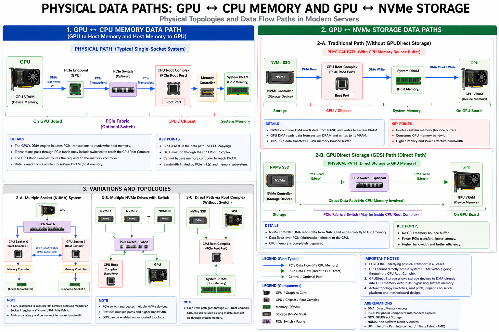

# 硬件架构与互连技术

## 1. 概述

在谈论大模型训练或推理的性能之前，我们首先需要理解算力是怎么"长"出来的——它不是一个单独的芯片，而是一整套自下而上叠起来的硬件体系。本章沿着**芯片 → 总线 → 链路 → 直通 → 系统**的拓扑层次，逐层讲清楚：

- **计算芯片**：GPU、TPU、CPU AMX 这些加速器内部是怎么组织计算单元的，片上的 SRAM 和 HBM 又是如何决定访存效率的。
- **节点内互连**：从通用的 PCIe（Gen3 到 Gen6）及其拓扑层次（Root Complex、Switch、Bridge），到专为 GPU 设计的 NVLink / NVSwitch。
- **跨设备直通**：GPUDirect 家族（P2P / RDMA / Storage）如何让数据绕过 CPU，在 GPU 之间、GPU 与网卡或存储之间直接搬运。
- **系统级融合**：NVLink-C2C、GB300 NVL72 等异构融合架构，以及多 PCIe domain 与 NUMA 的映射关系。

读完这一章，你应该能对一台 AI 服务器"从芯片到机架"的关键瓶颈有直观判断，为后续的性能调优打下硬件基础。

---

## 2. 计算芯片架构

AI 加速器大致沿两条路线发展。一条是以 **NVIDIA GPU** 为代表的通用路线，用 SIMT 加 Tensor Core 的组合，同时兼顾图形、HPC 和深度学习；另一条是以 **Google TPU、各家 NPU** 为代表的专用路线，通过脉动阵列或专用矩阵引擎，把每瓦 TOPS 做得更高，但牺牲了灵活性。

### 2.1 NVIDIA GPU 架构

NVIDIA GPU 目前占据了 AI 训练算力的绝大部分市场。从 Volta（V100）到 Hopper（H100/H200），再到最新的 Blackwell（B200/GB300），每一代基本都围绕三件事做文章：

- **Tensor Core 支持的精度**在不断下探——FP32 → TF32 → FP8 → FP4，单位算力翻倍的同时对量化精度的要求越来越高。
- **HBM 的容量和带宽**决定了一张卡能装下多大的模型，也决定了访存会不会成为瓶颈。
- **NVLink 的代际**决定了多卡互联的带宽上限，直接影响张量并行、流水并行能推多远。

这三条线合起来，基本就决定了大模型的训练吞吐和推理成本。

- **[深入理解 GPU 架构](nvidia/understand_gpu_architecture/README.md)**：包含 GPU 与 CPU 的特性对比、内存层次模型（全局内存、共享内存等），以及 Tesla V100、RTX 5000 等具体硬件实例的分析。
- **[GPGPU vs NPU：大模型推理训练对比](nvidia/GPGPU_vs_NPU_大模型推理训练对比.md)**：探讨在大语言模型时代，不同架构芯片在训练与推理场景下的优劣势与选型指南。

### 2.2 Google TPU 架构

TPU 是 Google 为深度学习量身打造的另一条路径。它的核心思想是用**脉动阵列（Systolic Array）**把矩阵乘法做到极致，以换取在特定负载下远高于通用 GPU 的能效比。

- **[TPU 101：深度学习专用加速器架构解析](tpu/tpu%20101.md)**：探索 TPU 的设计哲学、核心计算单元原理及其与 GPU 的差异。

### 2.3 CPU 矩阵加速：AMX

CPU 侧的矩阵加速同样值得关注。Intel 从 Sapphire Rapids 起引入 **AMX (Advanced Matrix Extensions)**，对标 GPU Tensor Core，在小 batch 推理和实时场景下有延迟优势。

- **[CPU AMX vs GPU Tensor Core](performance/03_amx_vs_tensorcore.md)**：Intel AMX 与 NVIDIA Tensor Core 的硬件规格对比、适用场景分析与混合计算 Pipeline 设计。

---

## 3. 节点内互连：PCIe 与 NVLink

当模型参数量迈过千亿、万亿级别，单颗芯片的算力和显存早就不够用了，真正卡住系统的往往不是计算，而是 **"内存墙"和"IO 墙"**——数据搬不过来、搬不够快。

互连技术栈大致可以分成两个层面：通用总线 PCIe（以及围绕它的拓扑诊断体系），和专为 GPU 设计的 NVLink / NVSwitch。

### 3.1 PCIe 总线体系

PCIe 是通用互连标准——CPU 和 GPU、GPU 和网卡、GPU 和 NVMe 之间的异构通信基本都走它。理解 PCIe 需要从**协议基础**上升至**拓扑层次**，再掌握**运维诊断**手段。

**协议与基础**：

- **[PCIe 总线技术大全](pcie/01_pcie_comprehensive_guide.md)**：从物理层到协议层全面解析 PCIe 总线架构及带宽演进。
- **[Linux PCIe P2PDMA 技术介绍](pcie/02_p2pdma_technology.md)**：从 PCIe 硬件机制、Linux 内核实现到 GPUDirect Storage (GDS) 场景实践，全面解析设备直连 DMA 技术。
- **[GPU BAR1 内存映射](pcie/05_bar1_memory_mapping.md)**：BAR1 窗口大小对 Unified Memory 性能的影响、ReBAR 状态检查、BAR1 vs FB 对比。

**拓扑层次与可视化**：

- **[PCIe 拓扑层次](pcie/06_pcie_topology_hierarchy.md)**：Root Complex → Bridge/Switch → Device 四层模型，从 sysfs 识别各层，本环境 24 domain 完整拓扑。
- **[PCIe 拓扑可视化](pcie/03_pcie_topology_visualization.md)**：通过 sysfs 和 `nvidia-smi` 交叉验证 GPU 在 PCIe 树中的位置与链路状态。
- **[PCIe Switch 识别与验证](pcie/07_pcie_switch_vs_bridge.md)**：从 sysfs 区分 Switch vs Bridge 的方法，多端口检测、ACS 验证，本环境确认无 Switch。

**运维与诊断**：

- **[PCIe AER 错误监控](pcie/04_pcie_aer_monitoring.md)**：sysfs AER 计数器解读、nvidia-smi Replay 监控、链路健康诊断流程与排查指南。

### 3.2 NVLink 互连

NVLink 是 NVIDIA 专门为 GPU 间通信设计的私有链路，第 5 代单卡聚合带宽已达 1.8 TB/s，在带宽、延迟和拓扑灵活性上都明显领先 PCIe。简单说：跨设备类型的通信走 PCIe，GPU 之间要高带宽低延迟就走 NVLink。

- **[NVLink 技术入门](nvlink/nvlink_intro.md)**：介绍 NVIDIA 为突破 PCIe 带宽瓶颈而设计的专有高速 GPU 互连方案。含消费级 GPU 不支持 NVLink 的说明。

### 3.3 拓扑与 NUMA 亲和性

互连拓扑的最终落脚点是性能：GPU 插在哪个 PCIe 槽、属于哪个 NUMA node，直接影响 H2D/D2H 带宽和跨 socket 延迟。

- **[单卡 GPU 拓扑与 NUMA 深入分析](performance/02_single_gpu_topology_analysis.md)**：单 GPU 场景下 `nvidia-smi topo -m` 输出解读、NUMA 亲和性验证与跨 socket 延迟分析（含 taskset 实测数据）。
- **[多 PCIe Domain 与 NUMA 映射](performance/04_pcie_domain_numa.md)**：Sapphire Rapids 多 domain 架构、BDF 编码的 NUMA 推断、跨 socket PCIe 访问的性能评估。

---

## 4. 跨设备直通：GPUDirect 家族

GPUDirect 解决的是一个很具体的问题：数据从一个设备到另一个设备，为什么非得在 CPU 内存里"中转一下"？这个中转（Bounce Buffer）既浪费带宽又引入延迟。GPUDirect 家族通过让设备之间直接 DMA，把 CPU 从数据路径上拿掉，针对三种典型场景各有对应技术：

- **P2P**：同一节点内 GPU 之间直接通信。
- **RDMA**：跨节点场景下，网卡直接把数据写进远端 GPU 的显存。
- **Storage（GDS）**：NVMe 上的数据直接加载进 GPU 显存，绕过主机内存。

- **[NVIDIA GPUDirect P2P 技术详解](gpudirect/02_gpudirect_p2p.md)**：探讨节点内多 GPU 之间如何通过 PCIe 或 NVLink 实现高速对等通信。
- **[NVIDIA GPUDirect RDMA 与 Storage 技术详解](gpudirect/01_gpudirect_technology.md)**：深入解析如何通过 RDMA 实现跨节点的网卡到 GPU 直接通信，以及通过 GDS 实现存储到 GPU 的直接数据加载。
- **[GPU Direct Storage 基础](gpudirect/03_gds_basics.md)**：GDS 架构原理、cuFile API 基础、环境检查与性能对比。基于 GDS 1.13.1 + 3 块 NVMe 环境。

---

## 5. 系统级融合与性能评估

从这一节开始，视角会从单颗芯片、单条链路，拉升到整台服务器乃至整个机架。

### 5.1 AI Superchip 与机架级架构

Blackwell 代际实际上重新定义了"一台 AI 机器"的边界：

- 节点规模从过去常见的 8-GPU HGX，被扩展到 72-GPU 的 NVL72 机架单域；
- 封装内的 NVLink-C2C 则让 CPU 和 GPU 共享一致性内存，原本跨 PCIe 的开销被压缩到芯片内部。

这意味着模型训练的并行策略、显存规划、通信拓扑，都需要以"机架"而不是"单机"作为新的最小部署单位来重新考虑。

- **[NVLink-C2C 详解](superchips/nvlink_c2c.md)**：解析打破内存墙的关键——基于 `Chip-to-Chip` 的异构融合互连技术。
- **[NVIDIA GB300 NVL72 架构解析](superchips/nvidia_gb300.md)**：探讨基于下一代 Blackwell 架构的机架级（Rack-Scale）计算系统设计。

### 5.2 性能参考指标

一个常被低估的事实是：系统里不同层级的访问延迟，跨越了 5–6 个数量级。

- 寄存器和 L1 Cache 大约在 **1 ns** 级别；
- HBM 显存访问在 **~100 ns**；
- 跨节点 RDMA 是 **微秒级（~2 μs）**；
- NVMe 存储则要到 **~100 μs**。

也就是说，数据落在哪一层，性能差距动辄上万倍。这个量级差是容量规划、KV Cache 分层存储、集合通信调度等决策的核心依据——**"别让热数据跑到慢介质上去"**，基本是所有优化的出发点。

- **[AI 基础设施延迟金字塔](performance/ai_latency_pyramid.md)**：提供从寄存器访问、内存读写到跨节点网络通信的各级延迟参考基准数据。

---

## 6. 可视化参考图（Visual Reference）

前面几节涉及到的拓扑概念比较抽象，这里用一组统一风格的示意图把它们整合起来，形成一张可以随时翻阅的"硬件拓扑地图"，涵盖：

- PCIe 拓扑以及 Root Complex 的层级关系；
- GPUDirect 场景下，数据走传统路径（经 CPU 内存中转）和走 GDS 路径（存储直达 GPU）的差别；
- NUMA 亲和性对 GPU 访存性能的影响；
- `nvidia-smi topo -m` 输出的 GPU↔GPU 对等关系六级分类：X / PIX / PXB / PHB / NODE / SYS。

### 6.1 GPU ↔ CPU 数据路径示意

下图描绘了单机场景下 GPU 访问主机（CPU）内存时所经过的完整物理路径，涵盖 GPU DMA 引擎、PCIe Endpoint、PCIe Switch（可选）、CPU Root Complex、Memory Controller 直至 System DRAM 的逐级流转过程。

### 6.2 GPU 物理数据路径全景图

下图为整合注释版的 GPU 物理数据路径全景图，覆盖以下四个维度：

1. **GPU ↔ CPU 内存**：单插槽系统下经由 PCIe → Root Complex → Memory Controller → DRAM 的标准通路。
2. **GPU ↔ NVMe 存储**：对比 _Traditional Path_（经 CPU 内存的 Bounce Buffer 路径）与 _GPUDirect Storage (GDS) Path_（存储直达 GPU VRAM）的差异。
3. **拓扑变体**：多插槽 NUMA、多 NVMe + Switch、Root Complex 直连等常见变体。
4. **Peer 拓扑分级**：依据 `nvidia-smi topo -m` 的输出对 X / PIX / PXB / PHB / NODE / SYS 六类 GPU↔GPU 对等路径进行从优到劣的排序，并标注 GPUDirect P2P 的支持状态。

[查看完整 SVG 图（gpu_physical_data_paths.svg）](assets/gpu_physical_data_paths.svg)

> 说明：该 SVG 为矢量图，建议在浏览器中打开以获得最佳分辨率；GPUDirect P2P ⊆ PCIe P2PDMA 能力，NVLink（NV#）属于独立的非 PCIe 通路，不在本图范围内。
