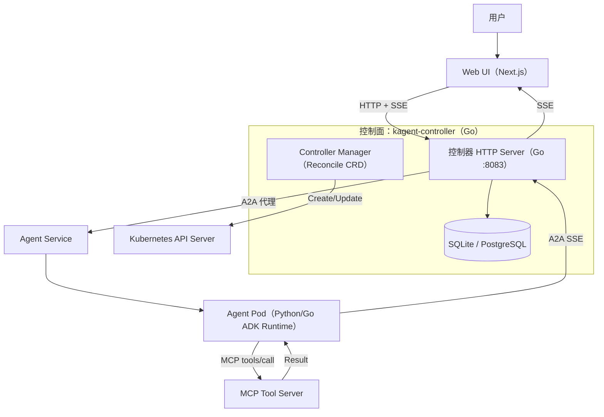
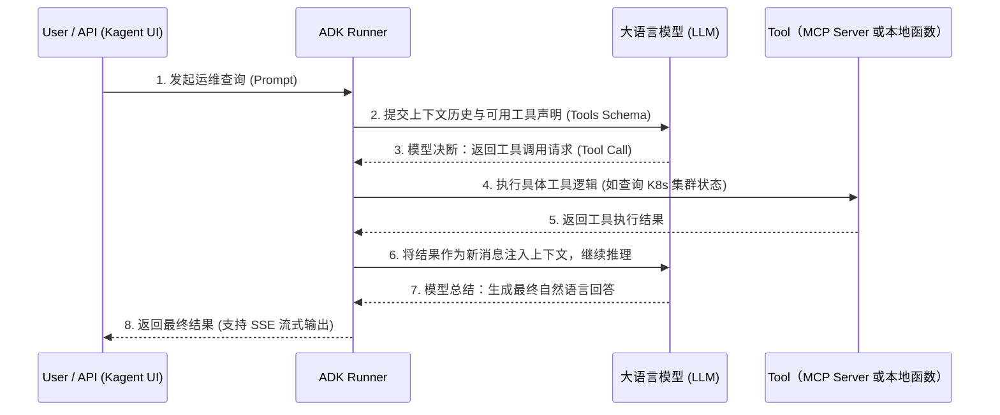
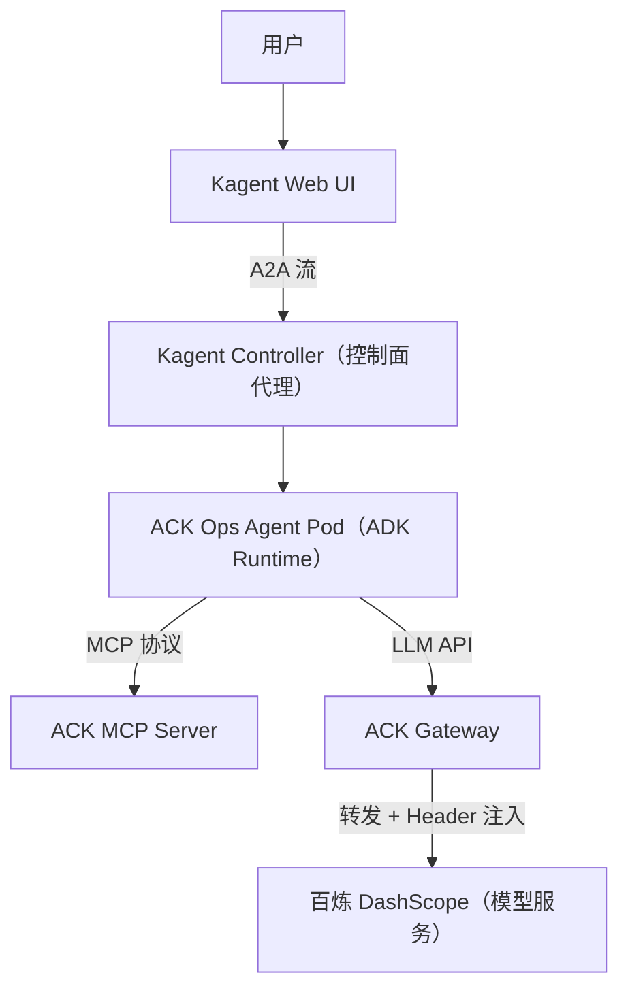

# 深度解析 Kagent：以构建 Kubernetes 运维智能体为例

## 摘要

`Kagent` 是一个面向 Kubernetes 原生环境的 AI 智能体（Agent）运行与治理框架。它不仅提供了一种基于 `CRD` 声明式定义 Agent 的方式，还通过控制器、API Server 和内置 UI 提供了一整套“基础设施即代码（IaC）”的智能体管理体验[1]。

本文旨在**深度解析 Kagent 的核心架构与工作机制**。为了让理论更具实操性，本文将以“构建阿里云 ACK 运维智能体”为实战案例，详细展示 Kagent 如何编排大模型（通过 ACK Gateway）与运维工具（ACK MCP Server），并解析 `Google ADK`、`Kagent` 与业务智能体在这套体系下的能力边界与协同分工[2]。

---

## 1. Kagent 核心理念与架构深度解析

`Kagent` 的设计核心是“控制面集中代理 + 运行时分布执行”。它通过 Kubernetes 的控制回路统一治理配置，再在数据面由独立的 Pod 执行具体的推理循环[1]。

### 1.1 架构总览与控制面代理

Kagent 的架构深度整合了 Kubernetes 原生的控制器模式，将复杂的智能体编排转化为标准的资源对账过程，主要包含以下核心组件：

1. **配置感知与翻译**：控制面的 `kagent-controller` 监听自定义资源（如 `Agent`），并将其翻译为底层的 `Deployment`、`Service` 与 `Secret` 等原生资源，将繁琐的运行时配置序列化为 `config.json` 挂载到 Agent Pod 中。
2. **集中代理与治理**：控制面内嵌了一个 HTTP Server（监听 `8083`），作为外部 UI 或 API 请求的入口。它负责将 A2A（Agent-to-Agent）的 JSON-RPC 请求代理转发到对应的 Agent Service，同时处理认证、授权机制，并缓存高频查询的数据至内置数据库。
3. **运行时分布执行**：每个智能体作为一个独立的 Pod（运行基于 Python 或 Go 的 `ADK Runtime`）存在。它们按需启动 A2A Server，接收推理请求，通过 MCP 协议与外部工具交互，并将最终结果或流式事件（SSE）回传给控制面。

下表按“运行位置”和“职责”进一步细化了 Kagent 的主要组件：

| 组件                          | 运行位置                              | 主要职责                                                                                    |
| ----------------------------- | ------------------------------------- | ------------------------------------------------------------------------------------------- |
| 控制器（Controller Manager）  | `kagent-controller` Pod（Go）         | 监听 `CRD`，将 `Agent` 等资源翻译为 `Deployment`/`Service`/`Secret`，维护状态与数据库缓存   |
| HTTP Server                   | `kagent-controller` Pod（Go）         | UI 后端 REST API、`A2A` 代理转发、`MCP` 代理转发、认证/授权中间件、可观测性埋点             |
| 数据库层（SQLite/PostgreSQL） | `kagent-controller` Pod 或外部        | 存储会话、对话、工具发现结果等高频查询数据，降低对 `Kubernetes API` 的压力                  |
| Agent Runtime                 | 每个 `Agent` 独立 Pod（Python 或 Go） | 启动 `A2A` Server，管理 `Google ADK` Runner 生命周期，执行 LLM 循环与工具调用，流式输出事件 |
| MCP Tool Servers              | 独立 Pod（可内置或外部）              | 按 `MCP` 协议暴露工具发现与调用能力，可被多个 Agent 复用                                    |
| Web UI                        | `kagent-ui` Pod（Next.js）            | Agent/模型/工具管理、聊天与流式渲染、`HITL` 审批交互                                        |

为了直观理解 UI、控制器与运行时之间的交互，以下是 Kagent 系统的整体控制流与数据流：



### 1.2 核心 CRD 资源模型

Kagent 的一切能力均建立在明确的资源模型之上。通过以下核心 CRD，它实现了智能体、模型凭证与工具逻辑的解耦：

- **`Agent`（主资源）**：定义一个可运行的智能体规格，包括系统提示词（System Prompt）、依赖的模型配置引用、绑定的工具列表以及运行时的技术栈选择（Python/Go）。
- **`ModelConfig`**：将大模型端点与鉴权凭证从 Agent 规格中抽离。这使得凭证可以在底层由 `Secret` 安全管理并独立轮换，而不必每次修改 Agent 的业务逻辑。
- **`RemoteMCPServer`**：定义遵循 MCP（Model Context Protocol）协议的工具服务端点（即 MCP 客户端在 Kagent 中的配置抽象）。控制器通过它发现并注册工具，随后供 Agent 选择并调用。

### 1.3 关键执行流程 (A2A 消息流)

Kagent 的消息流转路径决定了请求从用户界面到智能体运行时的全链路交互方式。完整的执行流程涵盖了从 HTTP 请求接收、JSON-RPC 代理转发到 SSE 流式响应的闭环：

1. Web UI 发起请求，通过 HTTP POST 携带 `Accept: text/event-stream` 请求控制器的代理 API。
2. 控制器 HTTP Server 将 A2A JSON-RPC 代理转发到具体的 Agent Service。
3. Agent Runtime 中的执行器（Executor）接收请求，基于 `Google ADK` 启动 LLM 循环（传入 Prompt、对话历史和可用工具清单）。
4. 若需调用外部工具，Runtime 会主动发起 MCP 工具调用（`MCP tools/call`），获取结果后继续向 LLM 询问。
5. 整个过程的中间态与最终结果，通过 SSE（Server-Sent Events）事件流实时回传至控制器，再由控制器转发给 UI 渲染。

---

## 2. Google ADK：智能体的执行引擎

在深入探讨 Kagent 的协同机制之前，有必要单独了解其底层的智能体执行引擎——Google ADK（Agent Development Kit）。它是连接大语言模型（LLM）与实际业务逻辑的桥梁，为 Kagent 提供了强大的运行时语义支持。

### 2.1 ADK 的核心定位

Google ADK 是一个专注于构建 AI 智能体的开发套件，它屏蔽了底层不同大语言模型 API 的差异，抽象出了一套标准化的智能体运行语义。在 Kagent 架构中，控制面负责宏观的“编排与治理”，而数据面中每一个独立 Agent Pod 的内部，正是由 Google ADK 负责真正的“思考与执行”。

为了直观地理解 ADK 在 Kagent 内部如何驱动大模型和外部工具完成一轮完整的业务对话，可以参考以下时序图：



### 2.2 赋能 Kagent 的关键特性

Google ADK 提供的以下核心能力，是 Kagent 能够顺畅运行业务智能体的基础：

- **标准化的 Runner 执行器**：ADK 提供了一套原生支持多轮对话与工具调用的推理循环。它能够自动管理上下文，在模型决定调用工具时暂停推理，并在获取工具结果后自动将其注回提示词中继续推理。
- **原生的工具调用 (Tool Calling) 与 MCP 桥接**：ADK 具备灵活的工具绑定机制。Kagent 利用这一机制，将通过 MCP（Model Context Protocol）协议动态发现的工具，转化为 ADK 可识别的函数格式，使得模型能够无缝地操作外部集群环境。
- **HITL (Human-in-the-loop) 机制**：通过其独有的 `ToolConfirmation` 机制，ADK 支持在执行高风险工具前主动挂起当前会话。这一机制被 Kagent 完美继承，在 UI 上呈现为“人工授权审批”卡点，为高危运维场景提供了安全保障。
- **A2A 协议暴露**：ADK 原生支持将智能体的推理能力封装并暴露为 A2A 服务。Kagent 利用这一特性，配合控制器的代理转发，轻松实现了智能体之间的网络互联与协作。

### 2.3 ADK 极简代码示例

为了更好地感受 ADK 如何抽象繁杂的逻辑，以下是一个典型的基于 Python 构建的基础运维智能体示例。Kagent 正是在这些核心逻辑的基础上，增加了 Kubernetes 原生的声明式打包（Agent CRD）与网络治理能力：

```python
# 注意：kagent_adk 是 Kagent 框架对 Google ADK 的包装库，并非 Google ADK 的原生导入
from kagent_adk import Agent, tool
from kagent_adk.models import OpenAIChatModel

# 1. 定义一个用于集群查询的工具（在 Kagent 中这部分通常由 MCP Server 替代）
@tool(description="查询指定 namespace 下的 Pod 状态")
def get_pod_status(namespace: str) -> str:
    # 模拟真实运维命令，如：kubectl get pods -n <namespace>
    return f"Namespace {namespace} 中的 Pod 均运行正常 (Running)。"

# 2. 绑定模型并创建 Agent
model = OpenAIChatModel(model_name="qwen-plus")
ops_agent = Agent(
    name="k8s-ops-agent",
    model=model,
    tools=[get_pod_status],
    system_prompt="你是一个 Kubernetes 运维助手，请调用工具帮助用户排查问题。"
)

# 3. 运行推理循环（ADK Runner 自动管理大模型和工具的协同流转）
response = ops_agent.run("default 命名空间的 Pod 状态如何？")
print(response.content)
# 输出：我已经查询了 default 命名空间，所有 Pod 均运行正常。
```

---

## 3. Kagent：Kubernetes 原生智能体框架

Kagent 是一个专为 Kubernetes 环境设计的开源 AI 智能体框架，旨在将大模型能力与云原生基础设施深度融合。它通过声明式的 CRD 抽象了智能体资源，让开发者能够以“基础设施即代码（IaC）”的方式在生产环境中治理 AI Agent 工作负载[1]。

### 3.1 架构理念回顾

Kagent 遵循“控制面集中代理 + 运行时分布执行”的设计，有效实现了治理能力与执行逻辑的解耦（详见第 1 章）。控制面通过 `kagent-controller` 统一管理资源翻译（即 CRD → 原生资源的自动转换）与网络代理，而数据面的独立 Pod 则专注于大模型推理与工具调用。这种基于 Kubernetes 的云原生架构，使得 AI 资产的管理与传统微服务应用一样标准和可靠，在此基础上，Kagent 构建了如下的声明式资源模型。

### 3.2 声明式资源模型

为了实现对 AI 资产的标准管理，Kagent 定义了三个核心的自定义资源抽象，将配置与运行时逻辑分离：

- **`Agent`**：代表一个可运行的智能体，绑定了系统提示词、模型引用、工具列表以及运行时环境。
- **`ModelConfig`**：将大模型提供商的配置与凭证从 Agent 中解耦，支持跨多个 Agent 复用，便于统一的权限管理与密钥轮换。
- **`RemoteMCPServer`**：定义可连接的 MCP 工具服务端点，控制器解析时会自动完成工具发现并写入缓存，供运行时调用。

### 3.3 框架协同边界

理解 `Google ADK`、`Kagent` 与具体业务智能体三者的边界，是自建业务 Agent 的关键前提。这三者通过各自的分工，形成了一个完整的能力闭环[1, 2, 3]。

**表 1：Google ADK、Kagent 与业务智能体的三层分工模型**：

| 层级           | 解决的核心问题                                                          | 提供的具体机制或实现落点                                                                                                   |
| -------------- | ----------------------------------------------------------------------- | -------------------------------------------------------------------------------------------------------------------------- |
| **Google ADK** | Agent 底层执行语义：多轮推理、工具调用、会话/上下文、HITL、A2A 暴露     | 提供 ADK Runner 执行引擎、`ToolConfirmation` 人工确认流、以及 A2A 协议执行器暴露服务[3, 4]                                 |
| **Kagent**     | Kubernetes 原生治理与工程化：CRD 翻译、A2A/MCP 代理、UI/API、持久化缓存 | 通过控制器维护 `Agent`/`ModelConfig` 生命周期；通过 HTTP Server 处理代理转发；下发 `Secret` 配置启动独立 Pod 承载运行时[1] |
| **业务智能体** | 业务方法论与策略组合：领域提示词、工具选择策略、安全红线、运行依赖接入  | `systemMessage` 沉淀运维经验、`toolNames` 划定能力边界、依赖 Gateway 路由与注入策略收敛安全访问[2]                         |

---

## 4. 实战落地：基于 Kagent 构建 ACK 运维智能体

理论结合实际，我们以阿里云容器服务 Kubernetes 版（ACK）为例，演示如何使用 Kagent 框架编排大模型和本地集群运维工具。该方案的目标是打造一个能自主执行“查询现状 → 诊断故障 → 分析指标”闭环的运维助手[2]。

### 4.1 方案架构设计

在该实战架构中，Kagent 充当核心大脑，ACK MCP Server 作为执行手，ACK Gateway 作为大模型网关：



> [!NOTE]
> 本架构将模型调用收敛到内部网关，将工具权限受控暴露，确保了企业级的安全性设计（参考：[1, 5]）。

### 4.2 部署依赖与工具接入 (MCP Server)

首先确保集群中已安装 `Kagent`、`ACK Gateway`，并获取了外部模型服务（如百炼）的 `API Key`[2]。
接着，我们需要把 ACK 的只读运维能力通过 MCP 暴露出来，并在 Kagent 内声明该工具服务器：

```yaml
# 声明 ACK MCP Server，供 Kagent 发现工具并注入到 Agent 运行时
apiVersion: kagent.dev/v1alpha2
kind: RemoteMCPServer
metadata:
  name: ack-mcp-tool-server
  namespace: kagent
spec:
  description: Official ACK tool server
  protocol: SSE
  sseReadTimeout: 5m0s
  terminateOnClose: true
  timeout: 30s
  url: http://ack-mcp-server.kube-system:8000/sse
```

### 4.3 模型接入与安全治理 (ACK Gateway)

为了避免在多个 Agent 中分散配置模型密钥，我们通过 ACK Gateway 将外部模型调用路由到百炼，并在网关层统一注入鉴权 Header。

1. **部署路由与鉴权策略**：创建 `Gateway` 及 `HTTPRoute` 拦截 `/v1` 请求，并通过 `HTTPRouteFilter` 读取存储在 `Secret` 中的 `API Key` 注入到请求中。
2. **Kagent ModelConfig 声明**：配置 Agent 使用该网关作为其内部模型端点。

```yaml
# Kagent ModelConfig：让后续的 Agent 均通过网关访问大模型
apiVersion: kagent.dev/v1alpha2
kind: ModelConfig
metadata:
  name: my-provider-config
  namespace: kagent
spec:
  model: qwen-plus
  openAI:
    # 指向 ACK Gateway 的集群内地址
    # 注意：若使用环境变量 $GATEWAY_HOST，需提前在 Kagent 控制器或 Agent Pod 环境中定义并替换为实际网关地址；
    # 生产环境中推荐直接使用稳定的 Service 名称，如 http://ack-gateway.kube-system:8080/v1
    baseUrl: http://$GATEWAY_HOST:8080/v1
  provider: OpenAI
```

### 4.4 声明式智能体创建 (Agent CRD)

最后一步是使用 `Agent` CRD 把业务运维经验（提示词）与依赖资源（ModelConfig、MCP Tools）绑定。这里必须将安全红线（修改集群状态必须人工授权）作为明确的指令。

```yaml
# 创建面向 ACK 的运维智能体
apiVersion: kagent.dev/v1alpha2
kind: Agent
metadata:
  name: my-ack-ops-agent
  namespace: kagent
spec:
  type: Declarative
  description: 这个智能体可以和 ACK MCP Tools 进行交互，以获取集群的信息并操作集群。
  declarative:
    deployment:
      env:
        - name: OPENAI_API_KEY
          value: placeholder # 实际鉴权已由网关注入
      replicas: 1
    modelConfig: my-provider-config
    stream: true
    systemMessage: |-
      # 角色
      你是一个专业的 ACK 智能助手。你的任务是准确理解用户关于集群的请求，并选择最合适的工具来执行查询、诊断或分析。

      # 核心指令
      1. 在执行任何操作前，必须先确认用户要操作的 cluster_id。
      2. 工具选择按优先级：复杂诊断用 diagnose_resource；指标查询用 query_prometheus；审计用 query_audit_log；其他资源查询默认用 ack_kubectl。
      3. 任何可能修改集群状态的操作必须先征得用户明确授权。
    tools:
      - type: McpServer
        mcpServer:
          apiGroup: kagent.dev
          kind: RemoteMCPServer
          name: ack-mcp-tool-server
          # 若省略 toolNames 字段，Agent 将自动发现并使用该 MCP Server 提供的所有工具
          toolNames:
            - list_clusters
            - ack_kubectl
            - query_prometheus
            - diagnose_resource
            - query_audit_log
            # ... 其他关联工具
```

---

### 4.5 运维场景能力验证

通过 `kubectl port-forward svc/kagent-ui 8080:8080` 暴露 UI 后，即可与上述创建的 Agent 进行交互[2]。

在这个架构下，Kagent 的 Agent Runtime 将会智能调用工具处理典型场景：

- **资源现状查询**：通过 `ack_kubectl` 获取统一的 Kubernetes 资源信息。
- **复杂故障诊断**：当 Pod 异常或网络不通时，自主调用 `diagnose_resource` 发起深度诊断。
- **指标与容量分析**：调用 `query_prometheus` 获取 CPU/内存/延迟趋势。
- **操作安全审批**：如果触发危险操作，Google ADK 的 `ToolConfirmation` 机制将挂起执行流程，Kagent 会将这一状态投递至 UI，等待人类干预（HITL 机制）[2, 4]。

---

## 5. 生产落地与扩展建议

在企业级生产环境中复用该模式时，建议遵循以下治理原则[1, 2, 6]：

1. **分层治理原则**：
   - **工具侧控制**：在 MCP Server 端点处控制只读/写权限，切勿完全依赖 Agent 提示词作为安全防线。
   - **模型端剥离**：坚持将模型调用通过网关（如 Gateway API 或专用 API Gateway）代理，实现密钥轮换、并发限流与全局审计。
2. **提示词即资产（Prompt as Code）**：将 Agent CRD 加入 GitOps 流程，把“故障排查思路”、“工具调用优先级”写入 `systemMessage`，作为团队排障经验的固化。
3. **A2A 生态扩展**：Kagent 原生支持 A2A 协议暴露。构建好的运维智能体可以被 A2A Host CLI、ChatOps（如 Discord/Slack 机器人）甚至其他高层规划智能体远程调用，形成智能体网络[5, 6]。
4. **探索内置生态**：除了自定义 MCP，建议研究 Kagent 仓库在 `helm/agents/` 下提供的预置 Chart（如 `istio`、`argo-rollouts`、`observability`），加速针对特定云原生栈的 Agent 落地[1]。
5. **系统级二次开发**：在对 Kagent 本身做二次开发时，应按“定义 → 翻译 → 运行时适配 → UI 支持”的链路推进：
   - 新增 `CRD` 字段（如 Agent 配置）：先改 `go/api/v1alpha2` 类型与生成逻辑，再改 `go/core/internal/controller/` 翻译器。
   - 新增工具或工具服务器类型：扩展 `RemoteMCPServer` /发现逻辑与 `ui/` 展示。
   - 新增运行时能力：扩展 `kagent-adk`（`python/packages/kagent-adk/`）中的 Executor 或 SessionService。

---

## 参考文献

[1] Kagent. Introducing kagent. (2025). <https://www.kagent.dev/docs/kagent/introduction/what-is-kagent>
[2] 阿里云. 使用 kagent 和 ACK Gateway 结合 ACK MCP Server 快速构建一个 Kubernetes 运维智能体. (2025). <https://help.aliyun.com/zh/ack/ack-managed-and-ack-dedicated/use-cases/building-a-kubernetes-operations-agent-quickly-with-kagent>
[3] Google. Google ADK. <https://google.github.io/adk-docs>
[4] Google. Announcing ADK for Java 1.0.0: Building the future of AI agents in Java. (2026-03-30). <https://developers.googleblog.com/en/announcing-adk-for-java-100-building-the-future-of-ai-agents-in-java>
[5] Kagent. A2A Agents. (2025). <https://kagent.dev/docs/kagent/examples/a2a-agents>
[6] Lin Sun. Celebrating 100 Days of kagent. (2025-08-19). <https://www.cncf.io/blog/2025/08/19/celebrating-100-days-of-kagent>

---
