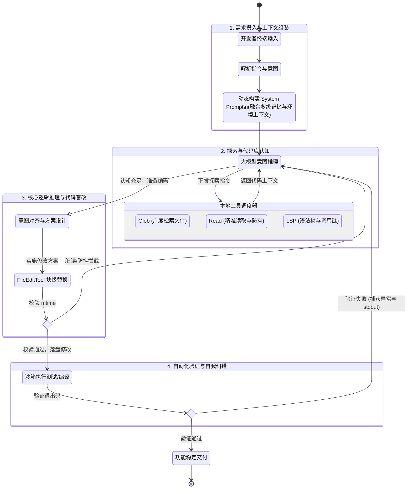

# Claude Code 源码解析：基于 ReAct 循环与精准上下文捕获的智能体执行流程详解

智能体（`Agent`）在处理代码级的新功能开发或重构需求时，其底层执行链路并非简单的单次问答交互，而是构建了一套基于大语言模型（`LLM`）与本地工具链深度协同的自动化闭环工作流。它通过带防抖缓存的游标读取与多层级记忆注入，实现了极高精度的上下文捕获，同时依靠安全的沙箱拦截机制，有效杜绝了对大型项目产生破坏性修改的风险。

## 目录 (TOC)

- [1. 整体执行流程概述](#1-整体执行流程概述)
- [2. 需求摄入与上下文组装](#2-需求摄入与上下文组装)
  - [2.1 终端指令与意图解析](#21-终端指令与意图解析)
  - [2.2 动态系统提示词构建与记忆检索](#22-动态系统提示词构建与记忆检索)
- [3. 探索与代码库认知（Agent 核心循环）](#3-探索与代码库认知agent-核心循环)
  - [3.1 语义检索与拓扑发现](#31-语义检索与拓扑发现)
  - [3.2 代码内容精准提取与防抖机制](#32-代码内容精准提取与防抖机制)
  - [3.3 语言服务器（LSP）与深度 AST 结构感知](#33-语言服务器lsp与深度-ast-结构感知)
- [4. 核心逻辑推理与代码篡改](#4-核心逻辑推理与代码篡改)
  - [4.1 意图对齐与实施方案](#41-意图对齐与实施方案)
  - [4.2 块级别的精准文件替换](#42-块级别的精准文件替换)
- [5. 自动化验证与自我纠错](#5-自动化验证与自我纠错)
  - [5.1 沙箱环境指令执行与输出捕获](#51-沙箱环境指令执行与输出捕获)
  - [5.2 错误捕获与闭环重试](#52-错误捕获与闭环重试)
- [6. 总结](#6-总结)

---

## 1. 整体执行流程概述

整个新功能开发链路从宏观上可以抽象为四个递进的核心阶段，这些阶段相互交织，共同支撑起了大模型从理解意图到交付可靠代码的完整生命周期：

1. **需求摄入与上下文组装**：系统前端拦截并解析终端指令，动态融合多层级的项目记忆、环境信息与基础规则，为模型构建具备强约束和全量上下文的系统提示词（`System Prompt`）。
2. **探索与代码库认知**：大模型在持续流式循环（`Agent Loop`）中自主调度检索、读取以及语言服务器（`LSP`）等工具，从广度匹配到深度提取，建立对本地文件系统和语法树（`AST`）的全局认知。
3. **核心逻辑推理与代码篡改**：基于前置探索获取的架构约束，模型完成意图对齐与方案设计，并利用文件编辑工具（`FileEditTool`）以块替换的方式实施精准、安全的本地代码篡改。
4. **自动化验证与自我纠错**：代码落盘后，系统主动唤起沙箱执行测试或编译命令，通过捕获标准输出与异常堆栈，自主闭环分析并修复错误，直至功能稳定交付。

为了更直观地展现这套架构的运转机制，以下是基于核心代码执行链路绘制的系统状态流转图：



上述四个阶段环环相扣，共同保障了智能体在复杂工程架构下执行代码变更的准确性与健壮性。

## 2. 需求摄入与上下文组装

在接收到开发者的自然语言需求后，系统并不会直接将其抛给大模型，而是需要经过一套复杂的上下文清洗与组装工程。这一阶段决定了智能体能否准确理解当前项目的架构约束、依赖关系以及历史状态，是确保生成代码符合项目规范的基石。

### 2.1 终端指令与意图解析

系统的入口层会首先捕获用户的终端输入，并将其封装为标准化的内部消息对象。在传递给核心查询引擎之前，系统会解析是否存在内置的斜杠命令（如 `/plan` 或 `/compact`），以决定当前会话是直接进入代码编写模式，还是需要先进行长远的任务规划。这一步骤有效过滤了无效输入，提升了系统的响应效率。

```typescript
// src/utils/processUserInput/processSlashCommand.tsx
  // Check if it's a real command before processing
  if (!hasCommand(commandName, context.options.commands)) {
    // Check if this looks like a command name vs a file path or other input
    // Also check if it's an actual file path that exists
    let isFilePath = false;
    try {
      await getFsImplementation().stat(`/${commandName}`);
      isFilePath = true;
    } catch {
      // Not a file path — treat as command name
    }
    if (looksLikeCommand(commandName) && !isFilePath) {
      logEvent('tengu_input_slash_invalid', {
        input: commandName as AnalyticsMetadata_I_VERIFIED_THIS_IS_NOT_CODE_OR_FILEPATHS
      });
      const unknownMessage = `Unknown skill: ${commandName}`;
      return {
        messages: [createSyntheticUserCaveatMessage(), ...attachmentMessages, createUserMessage({
          content: prepareUserContent({
            inputString: unknownMessage,
            precedingInputBlocks
          })
        }),
        // gh-32591: preserve args so the user can copy/resubmit without
        // retyping. System warning is UI-only (filtered before API).
        ...(parsedArgs ? [createSystemMessage(`Args from unknown skill: ${parsedArgs}`, 'warning')] : [])],
        shouldQuery: false,
        resultText: unknownMessage
      };
    }
```

若非系统命令，系统会将其视为常规提示词进行封装。

```typescript
// src/utils/processUserInput/processTextPrompt.ts
const userPromptText =
  typeof input === "string"
    ? input
    : input.find((block) => block.type === "text")?.text || "";
startInteractionSpan(userPromptText);
```

### 2.2 动态系统提示词构建与记忆检索

为了让模型准确理解当前工程的上下文，系统会在每次请求前动态组装系统提示词（System Prompt）。在代码层面，这一过程由 `getSystemPrompt` 和 `buildEffectiveSystemPrompt` 两个核心函数交织完成，并深度集成了一套多层级的记忆检索系统。

- **多层级记忆加载机制**：源码中 `claudemd.ts` 揭示了系统的记忆加载顺序和加载范围（优先级从低到高，越靠后的规则优先级越高）：

```typescript
// src/utils/claudemd.ts
/**
 * Files are loaded in the following order:
 *
 * 1. Managed memory (eg. /etc/claude-code/CLAUDE.md) - Global instructions for all users
 * 2. User memory (~/.claude/CLAUDE.md) - Private global instructions for all projects
 * 3. Project memory (CLAUDE.md, .claude/CLAUDE.md, and .claude/rules/*.md in project roots) - Instructions checked into the codebase
 * 4. Local memory (CLAUDE.local.md in project roots) - Private project-specific instructions
 *
 * Files are loaded in reverse order of priority, i.e. the latest files are highest priority
 * with the model paying more attention to them.
 *
 * File discovery:
 * - User memory is loaded from the user's home directory
 * - Project and Local files are discovered by traversing from the current directory up to root
 * - Files closer to the current directory have higher priority (loaded later)
 * - CLAUDE.md, .claude/CLAUDE.md, and all .md files in .claude/rules/ are checked in each directory for Project memory
 */
```

- **环境信息注入**：除了文件记忆，系统提示词还会自动拼装当前操作系统架构（`uname -sr`）、Shell 类型（兼容 Windows 的 Unix 语法提醒）、工作目录（`CWD`）以及可用工具集的元数据说明。
- **提示词组装管道**：`buildEffectiveSystemPrompt` 函数负责最终的组装。如果当前是子智能体（如 Coordinator 模式或 Proactive 模式），它会将子智能体特有的 `Agent Instructions` 追加到基础系统提示词的末尾。最终生成一个强约束的、包含完整项目规则与当前环境快照的 System Prompt，作为大模型推理的绝对基准。

```typescript
// src/utils/systemPrompt.ts
/**
 * Builds the effective system prompt array based on priority:
 * 0. Override system prompt (if set, e.g., via loop mode - REPLACES all other prompts)
 * 1. Coordinator system prompt (if coordinator mode is active)
 * 2. Agent system prompt (if mainThreadAgentDefinition is set)
 *    - In proactive mode: agent prompt is APPENDED to default (agent adds domain
 *      instructions on top of the autonomous agent prompt, like teammates do)
 *    - Otherwise: agent prompt REPLACES default
 * 3. Custom system prompt (if specified via --system-prompt)
 * 4. Default system prompt (the standard Claude Code prompt)
 *
 * Plus appendSystemPrompt is always added at the end if specified (except when override is set).
 */
```

---

## 3. 探索与代码库认知（Agent 核心循环）

当用户提出一个代码变更需求时，大模型本身并不具备当前工作目录的全局视图。为了准确理解业务逻辑并定位需要修改的宿主文件，智能体必须在本地文件系统中进行一系列的“侦察”操作。

**LLM 调度机制说明：**
在这个阶段，大模型的调用并不是一次性的，而是深度嵌套在一个**持续流式循环（Agent Loop）**中：

1. **意图推理（LLM 调用）**：模型分析用户需求与当前上下文，决定下发 `GlobTool` 或 `GrepTool` 指令。
2. **本地执行（非 LLM）**：本地调度器并发执行工具，获取文件列表或代码片段。
3. **结果回传与再推理（多次 LLM 调用）**：工具执行结果被封装为 `tool_result` 回传给模型。模型根据结果可能继续调用 `FileReadTool` 阅读具体文件，或调用 `LSPTool` 查询调用链。**每执行完一次本地工具，都会自动触发新一轮的大模型请求**，直到模型认为掌握了充足的上下文信息，准备进入代码编写阶段。

整个代码库认知流程可以分为由广入深的三个阶段，这也是系统在其内置智能体（如 `ExploreAgent` 和 `PlanMode`）的系统提示词中强制规定的工作流。

正如源码 [prompt.ts](src/tools/EnterPlanModeTool/prompt.ts) 中所定义的标准探索流程：

```typescript
// 摘自 src/tools/EnterPlanModeTool/prompt.ts 的系统提示词
const WHAT_HAPPENS_SECTION = `## What Happens in Plan Mode

In plan mode, you'll:
1. Thoroughly explore the codebase using Glob, Grep, and Read tools
2. Understand existing patterns and architecture
3. Design an implementation approach
4. Present your plan to the user for approval
5. Use AskUserQuestion if you need to clarify approaches
6. Exit plan mode with ExitPlanMode when ready to implement
`;
```

基于上述系统级指令，智能体的探索行为被严格规范为以下三个技术步骤：

1. **广度检索**：首先利用 `GlobTool` 或 `GrepTool` 在当前工作目录（CWD）下进行模式匹配与关键词搜索，快速圈定可能与需求相关的候选文件范围。
2. **深度提取**：锁定目标文件后，通过 `FileReadTool` 精准读取文件的具体内容。为避免 Token 溢出，系统采用了严格的游标分页与防抖缓存机制。
3. **结构感知**：对于复杂的依赖关系，系统不仅读取源码文本，还会唤起 `LSPTool` 对接语言服务器，通过获取 AST 和函数调用链（Call Hierarchy）来构建 IDE 级别的深度理解。

### 3.1 语义检索与拓扑发现

智能体通常会率先调用大范围检索工具进行文件模式匹配和关键词搜索。这些操作在 `StreamingToolExecutor` 调度器中均被标记为 `isConcurrencySafe: true`，允许并发执行以榨取 I/O 极限，大幅缩短了探索阶段的耗时。

```typescript
// src/services/tools/StreamingToolExecutor.ts
  /**
   * Check if a tool can execute based on current concurrency state
   */
  private canExecuteTool(isConcurrencySafe: boolean): boolean {
    const executingTools = this.tools.filter(t => t.status === 'executing')
    return (
      executingTools.length === 0 ||
      (isConcurrencySafe && executingTools.every(t => t.isConcurrencySafe))
    )
  }
```

- **`GlobTool`（文件模式匹配）**：通过传入 `pattern` 和 `path`，智能体可以快速锁定特定命名空间的文件。源码中 `GlobTool.ts` 会强制限制返回结果数量（默认 `maxResults = 100`），如果超出则返回 `truncated: true` 的标志，以此防止海量文件列表撑爆模型的 Token 窗口。同时，返回的文件路径会被统一处理为相对路径，进一步压缩上下文开销。

  ```typescript
  // src/tools/GlobTool/GlobTool.ts
  const limit = globLimits?.maxResults ?? 100;
  const { files, truncated } = await glob(
    input.pattern,
    GlobTool.getPath(input),
    { limit, offset: 0 },
    abortController.signal,
    appState.toolPermissionContext,
  );
  // Relativize paths under cwd to save tokens (same as GrepTool)
  const filenames = files.map(toRelativePath);
  ```

- **`GrepTool`（文件内容检索）**：当需要定位具体函数或变量的声明时，智能体会使用 `GrepTool`。源码中 `GrepTool.ts` 深度集成了正则搜索能力（支持 `-A/-B/-C` 上下文行数、`-i` 忽略大小写等）。为了防止读取到无意义的构建产物或历史文件，工具在底层自动注入了 `--glob !.git` 等排除版本控制目录的指令，并强制设置 `--max-columns 500` 来拦截混淆压缩后的超长代码行。

  ```typescript
  // src/tools/GrepTool/GrepTool.ts
  const args = ["--hidden"];

  // Exclude VCS directories to avoid noise from version control metadata
  for (const dir of VCS_DIRECTORIES_TO_EXCLUDE) {
    args.push("--glob", `!${dir}`);
  }

  // Limit line length to prevent base64/minified content from cluttering output
  args.push("--max-columns", "500");
  ```

### 3.2 代码内容精准提取与防抖机制

在锁定了目标文件路径后，模型会进一步下发 `FileReadTool` 指令。为了防止单个大文件直接撑爆 Token 限制，读取工具内部实现了一套极其精密的游标机制和缓存策略。这极大提升了长文本阅读的效率。

- **基于行号的分页读取**：`FileReadTool.ts` 接收 `offset`（起始行）和 `limit`（读取行数）参数，底层通过 `readFileInRange` 方法实现精准的区间截取。

- **文件读取去重缓存（Dedup）**：这是源码中一个非常关键的优化。`FileReadTool` 内部维护了 `readFileState`。每次读取时，系统会校验文件的 `mtime`（最后修改时间）和读取区间。如果模型重复请求了未被修改的同一段代码，工具会直接返回 `file_unchanged` 存根（Stub），极大节省了 `cache_creation` 的 Token 消耗。

  ```typescript
  // src/tools/FileReadTool/FileReadTool.ts
  // Dedup: if we've already read this exact range and the file hasn't
  // changed on disk, return a stub instead of re-sending the full content.
  // The earlier Read tool_result is still in context — two full copies
  // waste cache_creation tokens on every subsequent turn. BQ proxy shows
  // ~18% of Read calls are same-file collisions (up to 2.64% of fleet
  // cache_creation). Only applies to text/notebook reads — images/PDFs
  // aren't cached in readFileState so won't match here.
  //
  // Ant soak: 1,734 dedup hits in 2h, no Read error regression.
  // Killswitch pattern: GB can disable if the stub message confuses
  // the model externally.
  // 3P default: killswitch off = dedup enabled. Client-side only — no
  // server support needed, safe for Bedrock/Vertex/Foundry.
  const dedupKillswitch = getFeatureValue_CACHED_MAY_BE_STALE(
    "tengu_read_dedup_killswitch",
    false,
  );
  const existingState = dedupKillswitch
    ? undefined
    : readFileState.get(fullFilePath);
  // Only dedup entries that came from a prior Read (offset is always set
  // by Read). Edit/Write store offset=undefined — their readFileState
  // entry reflects post-edit mtime, so deduping against it would wrongly
  // point the model at the pre-edit Read content.
  if (
    existingState &&
    !existingState.isPartialView &&
    existingState.offset !== undefined
  ) {
    const rangeMatch =
      existingState.offset === offset && existingState.limit === limit;
    if (rangeMatch) {
      try {
        const mtimeMs = await getFileModificationTimeAsync(fullFilePath);
        if (mtimeMs === existingState.timestamp) {
          const analyticsExt = getFileExtensionForAnalytics(fullFilePath);
          logEvent("tengu_file_read_dedup", {
            ...(analyticsExt !== undefined && { ext: analyticsExt }),
          });
          return {
            data: {
              type: "file_unchanged" as const,
              file: { filePath: file_path },
            },
          };
        }
      } catch {
        // stat failed — fall through to full read
      }
    }
  }
  ```

- **上下文拼装与格式化回传**：提取到的代码并不会直接裸传给大模型。在 `FileReadTool` 的 `mapToolResultToToolResultBlockParam` 钩子中，系统会强制调用 `addLineNumbers` 方法，为每一行代码打上如 `cat -n` 风格的绝对行号（从 1 开始）。随后，这段带有行号的文本会被封装进标准 API 的 `tool_result` 块中。这种格式化极大地降低了大模型在后续生成 `FileEditTool` 替换方案时的行号计算误差。

  ```typescript
  // src/tools/FileReadTool/FileReadTool.ts
  /** Format file content with line numbers. */
  function formatFileLines(file: {
    content: string;
    startLine: number;
  }): string {
    return addLineNumbers(file);
  }
  ```

### 3.3 语言服务器（LSP）与深度 AST 结构感知

除了传统的正则表达式匹配和文件读取，Claude Code 在代码认知阶段还引入了更为强大的语法树感知能力。这主要依赖于源码中的 `LSPTool` 和 `powershell/bash` AST 解析模块。这使得大模型能够跳出纯文本，从语法和语义层面理解代码。

- **LSP 协议对接**：`LSPTool.ts` 实现了一个完整的 Language Server Protocol 客户端。当大模型需要了解某个函数的全貌时，它可以调用 `LSPTool` 的 `goToDefinition` 或 `findReferences`。
- **调用链（Call Hierarchy）推演**：为了让模型理解复杂的依赖关系，`LSPTool` 专门封装了 `incomingCalls` 和 `outgoingCalls` 动作。源码显示，这是一个两步组合操作：首先向语言服务器发送 `textDocument/prepareCallHierarchy` 获取游标对应的 AST 节点，然后继续发送 `callHierarchy/incomingCalls` 请求，最终将完整的函数调用链作为结构化的 JSON 文本返回给模型。这使得模型具备了等同于 IDE 级别的静态分析能力。

  ```typescript
  // src/tools/LSPTool/LSPTool.ts
      // For incomingCalls and outgoingCalls, we need a two-step process:
      // 1. First get CallHierarchyItem(s) from prepareCallHierarchy
      // 2. Then request the actual calls using that item
      if (
        input.operation === 'incomingCalls' ||
        input.operation === 'outgoingCalls'
      ) {
        const callItems = result as CallHierarchyItem[]
        if (!callItems || callItems.length === 0) {
          const output: Output = {
            operation: input.operation,
            result: 'No call hierarchy item found at this position',
            filePath: input.filePath,
            resultCount: 0,
            fileCount: 0,
          }
          return { data: output }
        }

        // Use the first call hierarchy item to request calls
        const callMethod =
          input.operation === 'incomingCalls'
            ? 'callHierarchy/incomingCalls'
            : 'callHierarchy/outgoingCalls'

        result = await manager.sendRequest(absolutePath, callMethod, {
          item: callItems[0],
        })
  ```

- **安全拦截级的 AST 解析**：不仅用于代码认知，在 `BashTool` 和 `PowerShellTool` 中，系统也内嵌了 `tree-sitter` 等解析器。所有的终端执行命令在落盘前都会被转化为 AST，以提取 `quoteContext` 和 `dangerousPatterns`，防止大模型在生成的脚本中无意间混入破坏性指令。

  ```typescript
  // src/utils/bash/treeSitterAnalysis.ts
  /**
   * Perform complete tree-sitter analysis of a command.
   * Extracts all security-relevant data from the AST in one pass.
   * This data must be extracted before tree.delete() is called.
   */
  export function analyzeCommand(
    rootNode: unknown,
    command: string,
  ): TreeSitterAnalysis {
    return {
      quoteContext: extractQuoteContext(rootNode, command),
      compoundStructure: extractCompoundStructure(rootNode, command),
      hasActualOperatorNodes: hasActualOperatorNodes(rootNode),
      dangerousPatterns: extractDangerousPatterns(rootNode),
    };
  }
  ```

---

## 4. 核心逻辑推理与代码篡改

在充分掌握了宿主代码的现状后，智能体进入实质性的开发阶段。此阶段的挑战在于，系统需要将大模型生成的逻辑片段，无缝、无损且符合语法树规范地合并到原有的本地文件中，同时避免对未涉及的业务代码造成破坏。

### 4.1 意图对齐与实施方案

模型会在内部生成一套隐式的执行计划。它会优先分析原文件的代码风格（如缩进规则、变量命名偏好），然后基于检索到的上下文，推理出需要插入新功能的确切行号或锚点。在这个过程中，系统依靠异步流式输出，使得开发者可以实时在终端看到模型正在“思考”的中间态日志，从而提供极佳的交互体验。

### 4.2 块级别的精准文件替换

代码的实际修改由 `FileEditTool` 承担。该工具采用了严格的“搜索-替换”（Search/Replace）协议。模型必须精确提供需要被替换的旧代码块（`old_string`）以及包含新功能逻辑的新代码块（`new_string`）。这种方式相比于全量覆写，极大降低了破坏无关代码的风险。

工具在本地文件系统中进行修改前，会执行极度严格的防御性校验，特别是处理多处匹配以及防并发脏读（TOCTOU）：

```typescript
// src/tools/FileEditTool/FileEditTool.ts
const matches = file.split(actualOldString).length - 1;

// Check if we have multiple matches but replace_all is false
if (matches > 1 && !replace_all) {
  return {
    result: false,
    behavior: "ask",
    message: `Found ${matches} matches of the string to replace, but replace_all is false. To replace all occurrences, set replace_all to true. To replace only one occurrence, please provide more context to uniquely identify the instance.\nString: ${old_string}`,
    meta: {
      isFilePathAbsolute: String(isAbsolute(file_path)),
      actualOldString,
    },
    errorCode: 9,
  };
}
```

此外，在落盘前，工具还会校验文件的最后修改时间，确保大模型在“阅读代码”和“修改代码”之间，用户没有手动更改过文件内容：

```typescript
// src/tools/FileEditTool/FileEditTool.ts
const lastWriteTime = getFileModificationTime(absoluteFilePath);
const lastRead = readFileState.get(absoluteFilePath);
if (!lastRead || lastWriteTime > lastRead.timestamp) {
  // Timestamp indicates modification, but on Windows timestamps can change
  // without content changes (cloud sync, antivirus, etc.). For full reads,
  // compare content as a fallback to avoid false positives.
  const isFullRead =
    lastRead && lastRead.offset === undefined && lastRead.limit === undefined;
  const contentUnchanged =
    isFullRead && originalFileContents === lastRead.content;
  if (!contentUnchanged) {
    throw new Error(FILE_UNEXPECTEDLY_MODIFIED_ERROR);
  }
}
```

## 5. 自动化验证与自我纠错

生产级别的代码助手绝不能仅仅停留在“把代码写出来”的层面。为了保证新功能不会引发崩溃或破坏原有逻辑，智能体会主动唤起终端沙箱执行验证，并根据报错信息进行闭环修复。

### 5.1 沙箱环境指令执行与输出捕获

在文件修改落盘后，模型会调用 `BashTool` 在后台生成一个子进程执行如 `npm run lint` 或 `npm run test` 等验证命令。源码显示，执行命令不仅会被沙箱接管，且其 `stdout` 和 `stderr` 会被合并捕获。系统甚至针对静默命令和退出码有专门的语义解析器。通过这种方式，智能体能够全面掌控子进程的执行状态：

```typescript
// src/tools/BashTool/BashTool.tsx
if (interpretationResult.isError && !isInterrupt) {
  // stderr is merged into stdout (merged fd); outputWithSbFailures
  // already has the full output. Pass '' for stdout to avoid
  // duplication in getErrorParts() and processBashCommand.
  throw new ShellError(
    "",
    outputWithSbFailures,
    result.code,
    result.interrupted,
  );
}
```

### 5.2 错误捕获与闭环重试

如果编译失败或测试未通过（退出码非 0 且被判定为 `isError`），主事件循环并不会终止。上述代码中的 `ShellError` 会被抛出并由调度器捕获。这一机制确保了智能体在面对意外情况时具备强大的自我恢复能力。

系统会将截断后的终端标准输出（可能包含了长达数百行的报错堆栈）作为 `tool_result`，并将 `is_error: true` 标记位一同发还给大模型。大模型读取到这个报错信息后，会自动分析错误根因，重新发起一轮 `FileEditTool` 修复代码，并再次运行测试。这个“代码修改 -> 终端验证 -> 错误分析”的循环将持续进行，直到终端返回成功的退出码，最终才会向用户输出任务完成的总结报告。

---

## 6. 总结

纵观整个智能体新功能开发链路，从最初的意图捕获到最终的代码落盘与验证，系统通过多阶段的流式协同，实现了一个高自治的闭环开发环境。这套架构有效降低了模型在陌生代码库中的幻觉率，并依靠沙箱与防抖机制保障了企业级项目的修改安全性。相比于 OpenCode 等早期开源方案过度依赖全量上下文切片和单次生成，该系统通过精准的块级替换与沙箱重试机制，展现了更高水准的容错性与工程化成熟度，充分代表了 `AI` 驱动的现代软件工程实践标准。
