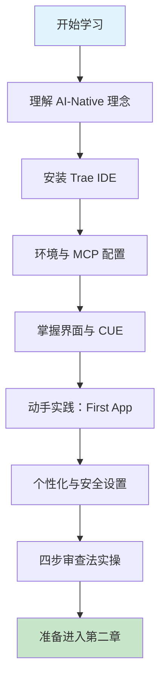

# 第一章 Trae 简介与环境配置

## 1. 学习目标

本章是整个 Trae 课程的入口。我们从 AI Native IDE 的设计哲学切入，剖析 SOLO 模式、CUE 上下文引擎、Skills 系统、沙箱机制等核心架构特征，再落到本机环境的安装、MCP 运行时配置、模型选型与个性化设置，最后通过一个番茄钟应用完成端到端实战，并以"四步审查法"建立 AI 输出的验收闭环。完成本章学习后，大家将能够：理解 AI-Native 与传统 IDE/AI 插件的本质差异及其对开发流程的影响；独立完成 Trae IDE、Node.js、Python (uv) 与 MCP Server 的端到端环境配置；熟练使用 Chat、Builder、CUE 三大交互入口与 `/plan`、`/spec` 等关键指令；通过 SOLO 模式从零交付一个可运行的 Web 应用；以"正确性 / 安全性 / 性能 / 可维护性"四维标准审查 AI 生成代码。

### 1.1 学习路径图



### 1.2 预期学习成果

完成本章后，开发环境将具备：最新版 Trae IDE（支持 SOLO 模式与 MCP）、Node.js v18+ 与 Python (uv) 双运行时、至少一个已配置可用的云端模型（Claude 3.5 Sonnet / GPT-4o / DeepSeek V3 任一）以及一个端到端跑通的实战项目（番茄钟）。能力侧将形成：用 `/plan` 把模糊需求拆解为可执行步骤的能力、用 `#file`/`#folder` 主动注入上下文的习惯、以及用四步审查法识别 AI 生成代码常见缺陷的判断力。

---

## 2. 前置技能检查

本章面向具备基础编程经验的开发者。在正式进入 Trae 学习前，请确认已掌握以下技能；任一项缺失都会显著影响后续章节的实操体验。

### 2.1 必备前置技能

| 维度             | 必备能力                                                           | 自检方法                                          |
| :--------------- | :----------------------------------------------------------------- | :------------------------------------------------ |
| **操作系统**     | 熟悉所用平台 (macOS/Windows/Linux) 的终端、文件权限、PATH 环境变量 | 能从命令行打开任意目录、修改环境变量              |
| **Git 基础**     | 理解 clone / commit / branch / merge / push / pull                 | 能独立完成一次 feature 分支提交                   |
| **包管理**       | 至少使用过 npm / pip / brew 中的一种                               | 能用 `npm install` 或 `pip install` 安装依赖      |
| **HTTP 与 JSON** | 理解请求方法、状态码、JSON 结构                                    | 能读懂 `curl` 输出                                |
| **任一编程语言** | 至少能写并运行一个脚本程序                                         | 用 Python/JavaScript/Java/Go 任一写出 Hello World |

### 2.2 软技能要求

AI Native IDE 的高效使用本质上是"用自然语言精准表达工程意图"的能力。这要求你具备：把模糊需求拆解为有边界的子任务的能力、判断 AI 输出是否符合预期的代码阅读能力，以及在 AI 输出错误时给出修正提示而不是"再试一次"的工程素养。课程设计假设你已具备相当于本科计算机课程或一年工作经验的代码阅读能力。

> **如果以上任一项不熟悉**：建议先补齐基础 (推荐 [Git 官方教程](https://git-scm.com/book) 与 [MDN Web 基础](https://developer.mozilla.org/zh-CN/docs/Learn))，再进入第三节的理论部分。

---

## 3. 理论基础与设计原理

理解 Trae 的最佳方式是把它放进 IDE 演进的历史坐标系中：从 IntelliJ/VSCode 这样的"传统 IDE + AI 插件"，到 Cursor/Windsurf 这样的"AI 增强型 IDE"，再到 Trae 这样的"AI Native IDE"。三者在架构定位、上下文组织、自动化深度上存在质的差异。

### 3.1 AI Native 的三层架构

Trae 的交互逻辑围绕 AI 展开，编辑器、终端、文件浏览器与 AI 助手深度融合。AI 能够感知整个项目的上下文 (Context)，而不仅仅是当前打开的文件。这一架构可拆解为三层：

- **感知层 (Perception)**：通过 CUE 引擎实时监控文件变更、终端输出、Git 状态、依赖图谱与跨文件引用关系，构造出超越"当前文件"的工程级上下文。
- **决策层 (Planning)**：Agent 基于感知信息分解任务，决定下一步行动 (搜索代码、读取文件、运行测试、调用 MCP 工具)，输出可执行计划。
- **执行层 (Action)**：AI 直接操作编辑器与终端，写文件、跑命令、装依赖，完成后将变更呈现到 Changes 视图等待人类审查，而不是仅仅给出建议文本。

### 3.2 Trae vs 传统 IDE vs AI 增强型 IDE 对比

| 维度           | 传统 IDE + Copilot    | AI 增强型 IDE (Cursor 等) | AI Native IDE (Trae)          |
| :------------- | :-------------------- | :------------------------ | :---------------------------- |
| **AI 角色**    | 行级补全 / 函数级建议 | 多文件编辑、重构          | 自主 Agent，端到端任务执行    |
| **上下文范围** | 当前文件 + 邻近文件   | 当前文件 + 用户 `@` 引用  | 全工程自动感知 (CUE)          |
| **任务粒度**   | 一行 / 一个函数       | 一个文件 / 一个 PR        | 一整个 feature / 一整个项目   |
| **执行能力**   | 仅生成代码            | 改文件 + 部分命令         | 改文件 + 跑命令 + 调试 + 修复 |
| **失败恢复**   | 用户手动重试          | 用户重写 Prompt           | Agent 读日志、自我修正        |
| **典型指令**   | Tab 接受              | `Cmd+K` 编辑选区          | `/plan` 规划、`/spec` 落规范  |
| **角色定位**   | 副驾驶 (Copilot)      | 协作编辑器                | 自主工程师 (Autopilot)        |

这张对比表揭示了一个关键趋势：AI 在 IDE 中的角色正从"被动响应单点请求"演进到"主动承担工程任务"。开发者的工作重心也随之从"逐行写代码"转向"定义需求 + 审查产出"。

### 3.3 SOLO 模式：从 Copilot 到 Autopilot

SOLO 模式是 Trae 区别于其他 AI IDE 的核心特性。进入 SOLO 模式后，Agent 会自主完成"规划—执行—修正"的完整闭环：

- **自主规划**：分析需求并生成详细执行计划，关键指令 `/plan` 让 AI 先输出计划再确认执行，`/spec` 生成详细的技术规格说明书。
- **多任务并行**：支持同时处理多个不冲突的任务，例如一边写后端 API 一边调试前端样式。
- **工具调用**：Agent 可自主使用终端、文件操作、浏览器、MCP 工具等，无需人工介入每一步。
- **自我修正**：遇到报错时自动分析日志、定位文件、修改代码并重跑，形成感知—决策—执行的闭环。

### 3.4 CUE 上下文理解引擎

CUE (Context Understanding Engine) 是 Trae 的"大脑"，它在后台持续构造一份工程级上下文索引。与"用户手动 `@file` 引用"的工作方式相比，CUE 自动加载相关代码、精准跳转引用、实时增量更新，显著降低了"提示词中需要塞多少上下文"的认知负担。在大型项目中，CUE 能识别同名函数的不同定义、跨文件依赖关系、以及最近修改过的"热点文件"，这是单纯的向量检索 RAG 难以达到的精度。

### 3.5 模型生态与选型策略

Trae 内置主流云端模型并支持自定义接入。模型选型直接影响响应质量与成本：

| 模型                         | 优势                           | 适用场景             | 大致成本   |
| :--------------------------- | :----------------------------- | :------------------- | :--------- |
| **Claude 3.5 Sonnet**        | 编码能力顶级，长上下文推理稳定 | 日常编码、复杂重构   | 中         |
| **GPT-4o**                   | 综合能力强，多模态支持         | 架构设计、跨语言迁移 | 中高       |
| **DeepSeek V3**              | 中文理解佳、性价比极高         | 中文文档、注释生成   | 低         |
| **GLM-4 / MiniMax / Doubao** | 国产模型，国内网络稳定         | 国内团队首选         | 低         |
| **本地 Ollama**              | 完全离线、零数据外发           | 高敏感场景           | 仅本地算力 |

> 以下数据基于 Trae 官方文档与各模型公开 benchmark；具体效果会随版本更新而变化，请以实际测试为准。

### 3.6 Skills 系统与沙箱机制

Skills 允许用户为 Trae 扩展新能力，本质上是一组 Prompt + 规则 + 工具调用的封装，分为项目级 (随项目仓库分发)、全局级 (跨项目通用)、以及自定义 Skills (用户自己写规则)。Skills 解决了"提示词复用"与"团队规范固化"两个痛点，例如把"代码评审清单"做成 Skill 后，团队所有成员都能用同一标准让 AI 审查代码。

为防止 Agent 误执行高风险命令 (如 `rm -rf`、`git push --force`)，Trae 引入沙箱机制：默认在受限环境中执行命令、高风险命令需用户点击确认、用户白名单内的命令可自动执行。这套机制让"让 AI 跑命令"从一个有风险的设计选择，变成一个工程上可接受的默认行为。

---

## 4. 安装与环境配置

完成理论铺垫后，本节进入实操：从下载安装到运行时配置，把环境调整到能跑 SOLO 模式的最佳状态。

### 4.1 系统要求

> 📋 **数据来源**：Trae 官方文档 (2025 年最新)

- **macOS**：12 (Monterey) 及以上版本，Apple Silicon 与 Intel 双架构均原生支持。
- **Windows**：10 (1809+) 或 11，建议启用 WSL2 以获得更接近 Linux 的开发体验。
- **Linux**：Ubuntu 18.04+ / Debian 10+ / Fedora 32+ 及主流衍生版。
- **硬件**：建议 16 GB+ 内存、SSD 硬盘；4K 显示器或多屏环境会显著提升 Builder 与编辑器并排使用的效率。

### 4.2 下载与安装

请根据所在地理位置选择版本：**国际版** [trae.ai](https://trae.ai)、**国内版** [trae.com.cn](https://www.trae.com.cn) (针对国内网络优化、内置模型与默认免费额度略有不同)。

| 平台        | 安装包                     | 安装方式                 | 关键注意                                  |
| :---------- | :------------------------- | :----------------------- | :---------------------------------------- |
| **macOS**   | `.dmg`                     | 拖入 Applications        | 首次启动需在「系统设置 → 隐私与安全」放行 |
| **Windows** | `.exe`                     | 运行向导                 | 勾选 "Add to PATH" 以便命令行启动         |
| **Linux**   | `.deb` / `.rpm` / AppImage | 包管理器或 chmod +x 执行 | AppImage 需提前安装 FUSE                  |

### 4.3 关键环境配置

#### 4.3.1 账号与同步

启动 Trae 后建议立即登录账号。账号系统不仅同步 Settings、快捷键、模型偏好，更是使用云端模型的前提。Settings Sync 跨设备生效，团队场景下可统一约定 Settings 仓库以实现"团队统一配置"。

#### 4.3.2 MCP 运行时（推荐）

为发挥 Trae 的最大潜力 (调用 GitHub、PostgreSQL、Slack 等 MCP 工具)，需要本机存在两套运行时：

```bash
# 1) Node.js v18+ — 大部分 MCP Server 用 Node 编写
node -v   # 期望 v18 及以上
# 推荐使用 nvm 管理多版本：
curl -o- https://raw.githubusercontent.com/nvm-sh/nvm/master/install.sh | bash
nvm install 20 && nvm use 20

# 2) Python + uv — 部分 MCP Server (如 fetch、time) 走 Python SDK
# macOS/Linux
curl -LsSf https://astral.sh/uv/install.sh | sh
# Windows (PowerShell)
powershell -c "irm https://astral.sh/uv/install.ps1 | iex"

uv --version   # 验证安装
```

#### 4.3.3 验证清单

完成上述步骤后，逐项核对：Trae IDE 启动后右下角显示已登录账号、AI Chat 输入"你好"得到响应、`node -v` 输出 v18+、`uv --version` 正常输出、Settings → MCP 中至少有一个绿色状态的 Server。任一项失败请回到该步骤排查。

---

## 5. 界面概览与首个实战

### 5.1 界面布局

Trae 的界面在保持类 VS Code 习惯的同时进行了 AI 化改造：右侧 AI 侧边栏整合了 **Chat** (快速问答 / 代码解释) 与 **Builder** (复杂任务，即 SOLO 模式入口)；底部终端集成了 AI 命令生成与执行；左侧资源管理器新增了 **Changes** 视图，专门用于审查 AI 产生的代码变更，支持逐文件 Accept / Reject 与一键回滚。

### 5.2 常用快捷键

| 功能               | macOS             | Windows            | 说明                         |
| :----------------- | :---------------- | :----------------- | :--------------------------- |
| **唤起 AI Chat**   | `Cmd + L`         | `Ctrl + L`         | 最常用的快捷键               |
| **唤起 Builder**   | `Cmd + Shift + L` | `Ctrl + Shift + L` | 切换到 Builder 模式          |
| **快速指令 (CUE)** | `Cmd + I`         | `Ctrl + I`         | 在编辑器内直接让 AI 修改代码 |
| **接受建议**       | `Tab`             | `Tab`              | 接受 Ghost Text 补全         |
| **部分接受**       | `Cmd + →`         | `Ctrl + →`         | 逐词接受建议                 |

### 5.3 动手实战：番茄钟应用

理论学习后，通过构建一个 **番茄钟 (Pomodoro Timer)** 网页应用，亲身体验 SOLO 模式的端到端流程。

#### 5.3.1 准备工作

打开 Trae，`File → New Window` 创建新窗口；`Open Folder` 选择一个空文件夹命名为 `pomodoro-timer` 并打开。空目录是 Builder 进行项目级规划的最佳起点。

#### 5.3.2 启动 Builder 并下达指令

按 `Cmd/Ctrl + Shift + L` 唤起 Builder，使用 `/plan` 让 AI 先规划再执行：

```text
/plan 我想做一个简单的番茄钟网页应用。
需求：
1. 使用原生 HTML/CSS/JavaScript，无需框架。
2. 界面美观现代，倒计时数字使用大字号居中显示。
3. 支持「开始 / 暂停 / 重置」三个按钮。
4. 默认时间 25 分钟，结束时弹出浏览器通知。
```

`/plan` 会让 AI 先输出"做什么 / 为什么 / 怎么做"的计划，确认后再执行。这种"先看计划再动手"的方式比直接"写一个番茄钟"更可控，也是 SOLO 模式的推荐用法。

#### 5.3.3 观察规划与执行

Builder 会先回复一个详细的开发计划，列出文件结构 (`index.html` / `style.css` / `script.js`) 和关键步骤；点击 `Approve` / `Run` 后，Builder 自动创建文件、写入 HTML 结构、CSS 样式、JS 逻辑；遇到语法错误或依赖问题时，会在终端运行命令尝试自动修复。

#### 5.3.4 预览与多轮迭代

完成后 Builder 通常会提供预览链接，或在 `index.html` 上右键 `Open with Live Server` (需安装插件)；也可点击右上角内置预览图标。若觉得效果不理想，继续在 Builder 中追加自然语言指令即可：

> "把倒计时数字的字体调大一点，并且在倒计时结束时弹出浏览器通知。"

观察 Builder 如何精准定位到 CSS 与 JS 文件进行修改——这正是 CUE 引擎自动定位上下文的体现。

#### 5.3.5 体验总结

整个过程没有手动写一行代码，开发者扮演了 **产品经理** (提需求) 与 **测试工程师** (验收结果) 的角色。这就是 AI Native 开发的工作范式：人类负责"定义问题"，AI 负责"产出代码"，人类再负责"审查与决策"。但请注意——AI 产出不等于交付，下一节的四步审查法是必须的最后一道闸门。

### 5.4 三种交互模式决策树（三选一）

> **全书锚点**：本节是后续 Ch2-Ch16 所有「模式选择」决策的**唯一**锚点。每章 §5 主框架实战会一行字提醒读者回到此处查表，不再重复定义。

Trae 提供三种交互模式：**Builder + `/plan`**、**Chat**、**CUE 内联编辑**。选错模式是新手最大的效率杀手——Builder 处理一个空格修正会绕远路；CUE 处理跨文件 API 改动会改丢上下文。下面是决策树。

#### 5.4.1 选型表

| 需求形态                                                   | 推荐模式              | 理由                                           | 典型场景                                                 |
| :--------------------------------------------------------- | :-------------------- | :--------------------------------------------- | :------------------------------------------------------- |
| **明确大范围** — 需求已写清，涉及多文件、有契约 / 接口约束 | **Builder + `/plan`** | `/plan` 强制 AI 先输出修改清单，避免边做边漂移 | 新增一个完整 REST 路由（model + service + route + test） |
| **探索性问题** — 需求不清楚，先弄懂概念或方案              | **Chat**              | 不写文件、回退成本零，适合反复换问法           | 「Vitest 与 Jest 在 fake timers 上的差异？」             |
| **单文件局部修改** — 改名、in-place 重构、单块代码替换     | **CUE 内联编辑**      | 触发快、保留上下文窗口、diff 直观              | 把一个函数从 for 改成 reduce                             |

#### 5.4.2 三个反模式（用错模式的代价）

| 错配                        | 现象                                                      | 应改为            |
| :-------------------------- | :-------------------------------------------------------- | :---------------- |
| 用 **Builder** 改一行错字   | `/plan` 会输出 5 步修改清单，浪费 30 秒                   | CUE 内联编辑      |
| 用 **Chat** 跨 6 个文件重构 | AI 给的代码片段无法定位到具体行，需手工粘贴、容易遗漏文件 | Builder + `/plan` |
| 用 **CUE** 改跨文件 API     | 只能看到当前文件，调用方改不到，编译会红                  | Builder + `/plan` |

> **铁律**：选模式之前先问自己——「这个需求的输出**最多触及几个文件**？」 1 个 → CUE；3+ 或不确定 → Builder + `/plan`；0 个（只是问问题）→ Chat。修正提示词与放弃决策见 [第二章 §4.9 修正提示词语法](第二章-基础交互模式.md) 与 §4.10 何时重新开始。

---

### 5.5 Vibe Coding 循环实录：MCP 环境配置漂移修正

> **修正语法**：本节「修正提示词」按 [第二章 §4.9 修正提示词语法](第二章-基础交互模式.md) 标准模板填写；3 轮未收敛触发 §4.10（何时重新开始）。模式选择查 §5.4。

| 轮次 | AI 输出摘要                                              | 发现的缺陷                                      | 修正提示词（按 §4.9 模板）                                                                                                                                                                                                | 验证信号                                                 |
| :--- | :------------------------------------------------------- | :---------------------------------------------- | :------------------------------------------------------------------------------------------------------------------------------------------------------------------------------------------------------------------------ | :------------------------------------------------------- |
| R1   | 给出 `npm install -g @modelcontextprotocol/server-fetch` | 全局安装无法版本锁定，CI / 同事环境难以重现     | 保留 fetch server 选型不变，修复安装方式：改为 `npx -y @modelcontextprotocol/server-fetch`。原因：全局安装无法纳入 lockfile。不要改变 server 名称。验证：`npx -y @modelcontextprotocol/server-fetch --version` 输出版本号 | 命令输出版本号，无 `npm install -g` 残留                 |
| R2   | 改用 npx 后把 `API_KEY=xxx` 写入 `~/.zshrc`              | 密钥进入 shell history、跨项目泄漏、无法 rotate | 保留 npx 调用方式，修复密钥配置：改为项目根 `.env` + `.gitignore` 排除，不要再修改 `~/.zshrc`。验证：`grep -E '^\.env$' .gitignore` 命中 1 行                                                                             | `.gitignore` 含 `.env`；`history \| grep API_KEY` 0 命中 |
| R3   | 生成的 `mcp.json` 缺 `"enabled": true`                   | Trae UI 中 MCP server 显示红灯、不可用          | 保留 mcp.json 中 server 名称与 command 字段，修复缺失的 enabled 标记：在每个 server 对象顶层补 `"enabled": true`。验证：Trae UI MCP 面板显示绿灯                                                                          | UI 绿灯；`jq '.mcpServers[].enabled' mcp.json` 全 true   |

> **收敛信号**：MCP fetch server 在 Trae Chat 中能被 `@fetch` 调用且返回正文。如 3 轮未达成，按 §4.10 信号 1（不收敛）触发——把 mcp.json 拆为最小可运行版本（只留 fetch 一个 server）重新走流程。

---

## 6. 进阶配置与最佳实践

### 6.1 隐私模式 (Privacy Mode)

对企业用户或代码安全敏感的开发者，可在 `Settings → Privacy Mode` 中开启隐私模式。开启后代码片段不会被用于模型训练，仅用于当前会话的上下文推理。注意：隐私模式不等于"不发送任何数据"，云端模型仍需接收必要的上下文才能工作；真正零数据外发的方案是切换到本地 Ollama 模型。

### 6.2 模型选择策略

在 Chat 输入框右下角可切换模型。推荐根据任务类型选用不同模型：

- **日常编码 / 重构**：Claude 3.5 Sonnet，平衡速度与质量。
- **复杂架构设计 / 跨语言迁移**：GPT-4o，长上下文推理与抽象能力突出。
- **中文文档 / 注释 / Code Review**：DeepSeek V3，中文表达自然且成本低。
- **高敏感代码 / 离线开发**：本地 Ollama (qwen2.5-coder / deepseek-coder-v2)，零数据外发。

实战经验：把"日常默认模型"设为 Claude/DeepSeek，把"高难任务模型"设为 GPT-4o，遇到 Bug 难定位时切换到 GPT-4o 重试，往往能突破瓶颈。

### 6.3 Skills 配置

在 AI 侧边栏的 "Skills" 标签页中，查看已启用技能、点击 "+" 添加自定义技能 (如 "Vue3 最佳实践"、"团队 Git Commit 规范")。Skills 本质上是一组 Prompt 与规则的集合，指导 AI 按特定规范工作。团队场景下，把 Skills 提交到代码仓库的 `.qoder/skills/` 或同等目录，可以让所有成员共享同一份"团队约定"。

### 6.4 常见问题速查

- **SOLO 模式卡住**：检查网络；点击 Stop 终止；用 `/plan` 把大任务拆小。
- **终端命令失败**：检查是否被沙箱拦截；确认 `git` / `npm` / `python` 等 CLI 已装。
- **私有 LLM 接入**：Settings 选择 "OpenAI Compatible"，填写 Base URL (如 `http://localhost:11434/v1`) 与 API Key。
- **MCP Server 红灯**：查看 Server 日志，常见为 Node/Python 版本不符或环境变量缺失。

---

## 7. AI 生成代码的审查验证

享受 AI 编程效率的同时，必须掌握一项关键技能：**审查 AI 生成的代码**。AI 会犯错、会使用过时的 API、会引入安全漏洞、也会产生逻辑错误。下面是每个 AI 生成环节之后应执行的检查闭环。

### 7.1 四步审查法

| 步骤         | 检查项         | 关键问题                                                       |
| :----------- | :------------- | :------------------------------------------------------------- |
| **正确性**   | 代码能否运行？ | 有无语法错误？导入路径是否正确？函数签名是否匹配？             |
| **安全性**   | 有无安全隐患？ | 是否有硬编码密钥？输入是否做了校验？有无 SQL 注入 / XSS 风险？ |
| **性能**     | 是否高效？     | 有无不必要的循环或重复计算？内存使用是否合理？                 |
| **可维护性** | 能否长期维护？ | 命名是否清晰？结构是否合理？有无适当的错误处理？               |

### 7.2 实战：审查番茄钟应用的 AI 生成代码

回顾前面构建的番茄钟应用，AI 生成的代码中至少有以下几个点值得检查：

```typescript
// ❌ AI 可能生成的代码（有潜在问题）
function startTimer() {
  setInterval(() => {
    // 未清理的定时器！每次点击「开始」都会创建新计时器，导致计时加速
    setTime((t) => t - 1);
  }, 1000);
}

// ✅ 审查后改进的代码
useEffect(() => {
  if (!isRunning) return;
  const id = setInterval(() => {
    setTime((t) => {
      if (t <= 1) {
        clearInterval(id);
        return 0;
      }
      return t - 1;
    });
  }, 1000);
  return () => clearInterval(id); // 清理定时器，防止内存泄漏
}, [isRunning]);
```

**关键教训**：AI 生成的 `setInterval` 往往不会做清理。这类资源生命周期问题需要审查者主动识别并修正。

### 7.3 AI 容易出错的高频场景

- **版本特定 API**：模型知识截止日期有限，可能使用已废弃的 API 或方法签名 (例如 React 17 的 `ReactDOM.render` vs React 18 的 `createRoot`)。
- **状态管理**：复杂状态流转下，AI 容易遗漏边界条件 (空值、加载中、错误态)。
- **异步逻辑**：Promise / async-await 的竞态条件、未捕获的 rejection、错误的 await 位置。
- **安全性**：用户输入校验、认证授权逻辑、敏感数据日志泄漏。
- **性能**：大列表渲染未做虚拟化、无意义的重计算、N+1 查询。

> **记住**：AI 是加速器，但 **你是驾驶员**。每一行 AI 生成的代码，最终都需要你来负责。

### 7.4 扫到问题后用什么提示词改？

四步审查只回答「哪里有问题」；下一步「怎么改」必须按统一语法把意图写回 AI，避免越改越乱。

| 检查项命中                | 命中后修正提示词模板（按 [Ch2 §4.9](第二章-基础交互模式.md)）                                                                                                                            |
| :------------------------ | :--------------------------------------------------------------------------------------------------------------------------------------------------------------------------------------- |
| 正确性（运行/签名/路径）  | 保留函数签名与导入路径，修复 [具体语法/类型错误]，原因：[报错摘要]。不要改公开 API。验证：`tsc --noEmit` / `python -m py_compile` 通过。                                                 |
| 安全性（密钥/校验/注入）  | 保留业务调用点，密钥迁 `process.env` / `os.environ`；输入加 `zod` / `pydantic` schema 校验。不要动算法。验证：`grep -rE "secret\|password" src/` 返 0；非法输入返 422。                  |
| 性能（清理/重计算）       | 保留 effect/handler 主体，补 `return () => clearInterval(id) / removeEventListener(...)` 资源清理。不要动依赖数组语义。验证：unmount 后 console 无残留日志；DevTools Memory 无泄漏曲线。 |
| 可维护性（命名/错误处理） | 保留功能等价，补 `try/except` + 结构化错误响应 `{code, message}`；命名按 §3 规范。不要动接口契约。验证：异常路径有日志且不暴露栈。                                                       |

> 3 轮未收敛触发 [§4.10 何时该重启](第二章-基础交互模式.md) 的「换模式 / 缩范围 / 拆步骤」；模式选择查 [§5.4 三模式决策树](第一章-Trae简介与环境配置.md)。

---

## 8. 实践练习

完成本章理论与实战后，通过以下三档练习巩固技能。建议在新窗口中独立完成，遇到困难再回到对应小节复习。

### 8.1 基础题：环境验证

1. 在终端依次运行 `node -v`、`uv --version`、`git --version`，截图保存输出。
2. 在 Trae Chat 中发送 `请用一句话解释 SOLO 模式与 Chat 模式的区别`，对比 AI 回答与本章 §3.3 的描述差异。
3. 在 Settings 中切换至少两种不同模型，分别问相同问题"用 Python 写一个判断质数的函数"，对比代码风格差异并写下你的观察。

### 8.2 进阶题：番茄钟应用增强

在 §5.3 完成的番茄钟基础上，使用 Builder 追加以下需求并审查 AI 输出：

1. 添加"短休息 5 分钟 / 长休息 15 分钟"两种模式切换。
2. 持久化用户配置到 `localStorage`，刷新页面不丢失。
3. 倒计时结束时除浏览器通知外，再播放一段提示音 (任选公开音源)。

完成后用四步审查法逐项检查：定时器是否被正确清理？`localStorage` 写入是否有异常处理？通知权限请求是否优雅降级？

### 8.3 开放题：自定义 Skill 设计

为你最常用的技术栈 (如 React / Spring Boot / Django 等) 设计一个 Skill：

1. 用文字描述这个 Skill 应该让 AI 遵守的 5 条规则 (例如"组件必须用 TypeScript"、"避免在 JSX 中写复杂表达式")。
2. 把这些规则写成一个 Markdown 文件并通过 Skills 加载到 Trae。
3. 在一个新项目中验证：未启用 Skill 时 vs 启用 Skill 后，AI 生成的代码风格差异。

> 把这次的观察写成一篇 200 字的短报告，作为后续章节自定义提示词工程的素材。

---

## 9. 小结

本章系统介绍了 Trae 作为 AI Native IDE 的核心优势：以三层架构 (感知—决策—执行) 实现自主 Agent、以 SOLO 模式完成端到端任务闭环、以 CUE 引擎自动构造工程级上下文、以 Skills 系统沉淀团队规范、以沙箱机制约束高风险命令。环境配置部分覆盖了 Trae IDE、Node.js、Python (uv) 与 MCP 的端到端搭建。实战部分以番茄钟应用让大家亲身感受"自然语言编程"的高效，但同时强调四步审查法是不可省略的最后一道闸门——高效的前提是可控。第二章将进一步深入 Chat、Builder、CUE 三大入口的高级用法，以及自然语言编程的指令理论框架。

---

## 10. 延伸阅读

以下资源覆盖 Trae 平台与协议生态、AI 工程实践、工具链与安全审查三条主线，对应本章 §3-§7 的关键知识点。

### 10.1 Trae 平台与协议生态

- **Trae 官方文档**：[https://docs.trae.ai](https://docs.trae.ai) — 最权威的功能文档与版本变更记录，是 Skills 与 MCP 配置的第一手依据。
- **MCP (Model Context Protocol) 规范**：[https://modelcontextprotocol.io](https://modelcontextprotocol.io) — Anthropic 主导的开放协议，是理解 Trae MCP 工具生态的基础。

### 10.2 AI 工程实践与设计模式

- **Anthropic · Building Effective Agents**：[https://www.anthropic.com/research/building-effective-agents](https://www.anthropic.com/research/building-effective-agents) — Agent 设计模式 (Workflow vs Agent) 的经典综述，对应 §3.1 三层架构。
- **GitHub Copilot vs Cursor vs Trae 实测对比**：参考 a16z、ThoughtWorks Tech Radar 等独立评测，关注上下文准确率与多文件编辑能力。

### 10.3 工具链与安全审查

- **uv 包管理器文档**：[https://docs.astral.sh/uv/](https://docs.astral.sh/uv/) — 比 pip / poetry 快 10–100× 的 Rust 实现，MCP Python SDK 推荐工具链。
- **OWASP AI Security & Privacy Guide**：[https://owasp.org/www-project-ai-security-and-privacy-guide/](https://owasp.org/www-project-ai-security-and-privacy-guide/) — 审查 AI 生成代码安全性时的权威参考，与第二部分 §6/§8 直接呼应。
