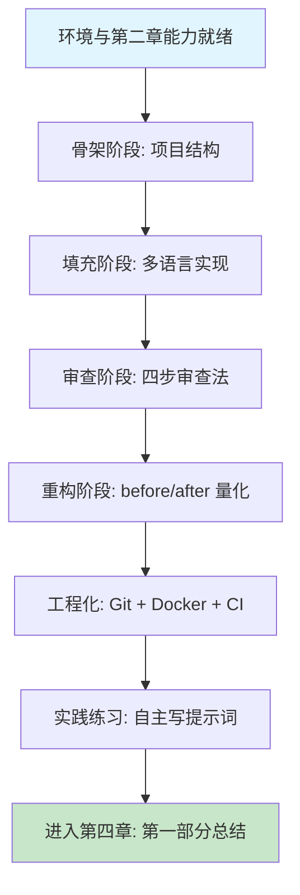

# 第三章 实战练习：Hello World 项目

## 1. 学习目标

本章把第一章的环境与第二章的提示词工程合并到一个真实项目里跑通。我们以 `hello-world-multiverse` 为载体，先用骨架→填充策略让 Builder 生成多语言项目结构，再分别用 Python、JavaScript、Java、Go 实现等价的 Hello World，再用 Trae 的代码分析与重构能力把过程式脚本演进为面向对象架构，最后通过 Git、Docker、CI 把工程闭环起来。完成本章学习后，大家将能够：基于四种语言的官方约定独立创建合规的项目骨架；用 §3 的三种脚手架策略选择合适的提示词节奏；以 LOC、圈复杂度、启动耗时、覆盖率等指标量化重构收益而非「凭感觉」；从「复制示例提示词」过渡到「自主设计提示词」，并以四步审查法验证 AI 输出。

### 1.1 学习路径图



### 1.2 预期学习成果

本章结束时，本机上将存在一个可直接运行的多语言仓库（四种语言独立实现 + 共享配置 + GitHub Actions 多矩阵 CI），并形成可迁移的实践产出：一份可复用的「骨架→填充」提示词模板、一份带 before/after 数据的重构对比表，以及一份「自主写提示词 vs 参考提示词」的差异分析。这三份产出会作为第四章 §2 AI 协作能力自检的输入。

---

## 2. 前置技能检查

本章假设第一章环境已就绪、第二章四要素提示词与 CUE / `#` 引用已可熟练使用，且至少完成过第二章 §8 的基础题。下面以 Ch1/Ch2 同款方式给出可执行的自检清单。

### 2.1 环境与能力自检

| 维度           | 验证项                               | 验证方法                                             |
| :------------- | :----------------------------------- | :--------------------------------------------------- |
| **Trae IDE**   | Chat / Builder / CUE 全部可用        | 三个快捷键均有响应；右下角显示已登录账号             |
| **MCP**        | 至少一个 Server 状态为 `Connected`   | Settings → MCP 面板显示绿色                          |
| **Node.js**    | v18+ 与 npm 可用                     | `node -v` / `npm -v` 正常输出                        |
| **Python**     | 3.10+ 且 `uv` 已安装                 | `python3 --version` / `uv --version` 正常输出        |
| **Java**       | JDK 11+ 与 Maven 可用                | `java -version` / `mvn -v` 正常输出                  |
| **Go**         | 1.19+ 可用                           | `go version` 正常输出                                |
| **Git**        | 已配置 `user.name` 与 `user.email`   | `git config --get user.name` 有返回值                |
| **第二章能力** | 能用四要素结构写出可被 AI 执行的指令 | 翻看第二章 §8 三档练习提交的提示词，确认四要素均完整 |

> 任一项验证失败请回到对应章节排查；多语言工具链可在本章 §4 演示前按需补齐，但提示词能力**必须**先掌握，否则后续案例无法独立复现。

### 2.2 AI 输出审查要求

本章将通过多次 AI 交互生成大量跨语言代码，AI 出错的概率显著高于单语言场景。每次接受 AI 输出前，必须执行第一章 §7 的「四步审查法」：**正确性**层面检查项目结构是否合规、导入路径是否正确、函数签名是否匹配；**安全性**层面检查配置文件是否有硬编码密钥、`.gitignore` 是否遗漏敏感文件、Dockerfile 是否以非 root 运行；**性能**层面关注 Dockerfile 是否使用多阶段构建、依赖是否冗余、启动耗时是否可接受；**可维护性**层面审视命名是否清晰、错误处理是否完备、测试覆盖率是否达标。本章末尾的练习题将要求你**自主编写提示词**而非复制粘贴——这是从「使用者」向「架构者」转变的关键一步。

---

## 3. 理论基础与设计原理

实战之前先建立心智模型：多语言项目的结构差异、构建/测试范式差异，以及 AI 协作下的脚手架生成策略。

### 3.1 多语言项目结构对比

四种语言对「项目根」「源码组织」「依赖管理」「测试位置」的约定差异显著，AI 生成的脚手架必须遵循各自惯例，否则后续工具链全部失效。

| 维度       | Python                            | JavaScript/Node             | Java (Maven)                  | Go (Modules)                    |
| ---------- | --------------------------------- | --------------------------- | ----------------------------- | ------------------------------- |
| 项目根标识 | `pyproject.toml` / `setup.py`     | `package.json`              | `pom.xml`                     | `go.mod`                        |
| 源码目录   | 包名同名目录或 `src/`             | 任意（约定 `src/`）         | `src/main/java/<group>/`      | 包路径即目录                    |
| 依赖锁定   | `requirements.txt` / `uv.lock`    | `package-lock.json`         | `pom.xml` 内 `<version>` 显式 | `go.sum`                        |
| 测试位置   | `tests/` 平行 / 模块内 `_test.py` | `__tests__/` 或 `*.test.js` | `src/test/java/`              | 同包 `*_test.go`                |
| 构建产物   | `dist/` (wheel/egg)               | `dist/` / `build/`          | `target/*.jar`                | 单一可执行文件                  |
| 入口约定   | `if __name__ == "__main__"`       | `"main"` in `package.json`  | `public static void main`     | `func main()` in `package main` |

**实践原则**：要求 AI 生成多语言脚手架时，必须显式声明「遵循各语言官方约定」并指定锁文件类型，否则容易得到 Python 项目缺 `pyproject.toml`、Java 项目无 `target` 输出目录的「半成品」。

### 3.2 构建与测试范式差异

四种语言的构建与测试命令链路差异，决定了 CI 配置和 Dockerfile 写法。

| 范式     | Python                         | JavaScript          | Java                      | Go                         |
| -------- | ------------------------------ | ------------------- | ------------------------- | -------------------------- |
| 构建命令 | `uv build` / `python -m build` | `npm run build`     | `mvn package`             | `go build ./...`           |
| 安装依赖 | `uv sync` / `pip install -r`   | `npm ci`            | `mvn dependency:resolve`  | `go mod download`          |
| 测试命令 | `pytest`                       | `jest` / `vitest`   | `mvn test`                | `go test ./...`            |
| 覆盖率   | `pytest --cov`                 | `jest --coverage`   | `jacoco-maven-plugin`     | `go test -cover`           |
| Lint     | `ruff` / `flake8`              | `eslint`            | `checkstyle` / `spotbugs` | `go vet` / `golangci-lint` |
| 编译产物 | 解释执行 + 字节码缓存          | 解释执行 / TS 转译  | 字节码 `.class` → JAR     | 单一静态二进制             |
| 启动开销 | 中（解释器 + import）          | 中（V8 + 模块解析） | 高（JVM 冷启动 ~1s+）     | 低（裸二进制 < 50ms）      |

**关键认知**：Go 的「单一静态二进制」是容器化的天然优势，多阶段构建可将镜像压到 ~10MB；Java 由于 JVM 冷启动高，更适合长生命周期服务而非 FaaS。

### 3.3 AI 脚手架生成的三种策略

面对「从零创建多语言项目」这类大颗粒度任务，提示词设计有三种典型策略：

| 策略         | 提示词形态                                      | 优势                 | 风险                                           |
| ------------ | ----------------------------------------------- | -------------------- | ---------------------------------------------- |
| 一次性总览式 | 一条 prompt 列出所有语言、所有文件              | 整体一致，结构对齐   | 易超出上下文窗口；某语言细节被压缩             |
| 分语言迭代式 | 每种语言一轮对话，先 Python 再 JS 再 Java 再 Go | 每轮输出可控、易审查 | 跨语言一致性需手动协调（如统一配置文件格式）   |
| 骨架→填充式  | 第一轮只生成目录与配置文件，后续按文件细化      | 可分批审查；结构稳定 | 轮次多，需明确指定「不要修改已生成的目录结构」 |

本章选择**骨架→填充式**：先生成项目结构（§4），再分语言填充实现（§5），最后统一优化（§6）。这种结构与 [Anthropic Building Effective Agents](https://www.anthropic.com/research/building-effective-agents) 中提倡的「Prompt Chaining」工作流一致。

### 3.4 设计目标

本章实战项目 `hello-world-multiverse` 的设计目标包含三个层次：

1. **功能层**：四种语言独立运行，各自支持配置文件、命令行参数、多语言问候语
2. **结构层**：每种语言遵循官方目录约定，便于直接 fork 用作真实项目骨架
3. **协作层**：根目录 `README.md`、`.gitignore`、CI 工作流统一管理，体现 monorepo 实践

---

## 4. 项目创建与初始化

本节将演示如何从零开始，使用 Builder 创建一个多语言的完整项目结构。

### 4.1 使用 Trae 创建项目

我们将使用 Trae 的核心能力来快速生成项目脚手架。

**目标**：创建一个支持多种编程语言的 Hello World 项目

**操作步骤**：

1. **打开 Trae IDE**
   - 确保第一章的环境配置已完成
   - 验证 AI 助手连接正常

2. **使用 AI 助手创建项目**（推荐方式）

   在 Trae 的 Builder 模式（Cmd/Ctrl + Shift + L）中输入以下提示词：

   ```text
   创建一个多语言 Hello World 项目，具体要求：

   项目名称：hello-world-multiverse
   支持语言：Python、JavaScript、Java、Go

   项目结构要求：
   1. 每种语言独立文件夹
   2. 包含完整的依赖管理文件
   3. 统一的测试框架
   4. 完整的文档结构
   5. 适当的 .gitignore 配置

   请创建完整的项目结构并生成基础代码文件。
   ```

3. **预期输出概要**

   Trae 将自动生成以下项目结构：

   ```bash
   hello-world-multiverse/
   ├── README.md                 # 项目说明文档
   ├── .gitignore               # Git 忽略文件配置
   ├── LICENSE                  # 开源许可证
   ├── docs/                    # 项目文档目录
   │   ├── setup.md            # 环境配置说明
   │   └── usage.md            # 使用指南
   ├── python/                  # Python 实现
   │   ├── hello_world.py      # 主程序文件
   │   ├── requirements.txt    # Python 依赖
   │   ├── config.yaml         # 配置文件
   │   └── tests/              # 测试文件
   │       └── test_hello.py
   ├── javascript/              # JavaScript 实现
   │   ├── hello_world.js      # 主程序文件
   │   ├── package.json        # Node.js 依赖
   │   ├── config.json         # 配置文件
   │   └── tests/              # 测试文件
   │       └── hello.test.js
   ├── java/                    # Java 实现
   │   ├── src/                # 源代码目录
   │   │   └── main/
   │   │       └── java/
   │   │           └── HelloWorld.java
   │   ├── pom.xml             # Maven 配置
   │   └── src/test/           # 测试目录
   │       └── java/
   │           └── HelloWorldTest.java
   └── go/                      # Go 实现
       ├── hello_world.go      # 主程序文件
       ├── go.mod              # Go 模块配置
       ├── config.yaml         # 配置文件
       └── hello_world_test.go # 测试文件
   ```

#### 4.1.2 项目配置优化

**使用 Trae 优化项目配置**：

在 Builder 中输入以下提示词来完善项目配置：

```text
请为刚创建的 hello-world-multiverse 项目添加以下配置：

1. 完善 README.md 文件，包含：
   - 项目介绍
   - 安装说明
   - 使用方法
   - 各语言的运行命令

2. 创建统一的配置文件格式，支持：
   - 多语言问候语（中文、英文、日文）
   - 输出格式配置
   - 日志级别设置

3. 添加 GitHub Actions 工作流，支持：
   - 自动化测试
   - 代码质量检查
   - 多平台构建

请生成完整的配置文件内容。
```

**预期输出概要**：Trae 将生成完整的项目配置文件，包括详细的 README.md、配置文件模板和 CI/CD 工作流。

---

## 5. 多语言实现

接下来，我们将分别使用四种主流编程语言来实现 Hello World 的核心逻辑。

### 5.1 Python 实现

Python 版本将重点展示面向对象和类型注解特性。

#### 5.1.1 实现目标

创建一个功能完整的 Python Hello World 程序，展示 Python 的特色功能。

#### 5.1.2 基础代码生成

**Trae 提示词**：

```text
为 Python 版本的 Hello World 创建代码，要求：

1. 使用面向对象设计
2. 支持命令行参数
3. 包含类型注解
4. 支持配置文件读取
5. 添加彩色输出
6. 包含完整的错误处理
7. 遵循 PEP 8 代码规范

请生成完整的 Python 代码文件。
```

**预期输出概要**：

- **主程序文件**：包含 HelloWorld 类，具备配置加载、多语言支持、彩色输出功能
- **配置管理**：支持 YAML 格式配置文件，包含默认配置回退机制
- **命令行接口**：使用 argparse 实现参数解析，支持名字、语言、配置文件等选项
- **错误处理**：完整的异常处理机制，包括文件不存在、格式错误等情况
- **系统信息**：可选的系统信息显示功能

#### 5.1.3 依赖管理

**Trae 提示词**：

```text
为 Python 项目创建依赖管理文件，包含：
1. requirements.txt - 生产环境依赖
2. requirements-dev.txt - 开发环境依赖
3. setup.py - 包配置文件
4. pyproject.toml - 现代 Python 项目配置

依赖包括：colorama、PyYAML、pytest、black、flake8 等
```

**预期输出概要**：完整的 Python 项目依赖管理文件，支持开发和生产环境分离。

#### 5.1.4 测试文件

**Trae 提示词**：

```text
为 Python Hello World 创建完整的测试套件：
1. 单元测试 - 测试核心功能
2. 集成测试 - 测试配置加载
3. 参数化测试 - 测试多语言支持
4. 异常测试 - 测试错误处理
5. 性能测试 - 基准测试

使用 pytest 框架，包含测试覆盖率配置。
```

**预期输出概要**：完整的测试文件，包含各种测试场景和配置。

### 5.2 JavaScript、Java、Go 实现（参考）

上面以 Python 为例完整走通了「实现 → 依赖 → 测试」三步流程。其余三种语言遵循相同的模式，这里提供参考提示词与关键差异点。

| 语言           | 关键差异                                                                        | 核心提示词                                                                                       |
| -------------- | ------------------------------------------------------------------------------- | ------------------------------------------------------------------------------------------------ |
| **JavaScript** | ES6+ class 语法、异步（async/await）、Jest 测试、chalk 彩色输出、yargs 参数解析 | `使用 ES6+ class 创建 HelloWorld，支持异步配置加载、命令行参数和彩色输出，包含 Jest 测试`        |
| **Java**       | Maven 构建、picocli 命令行、Jackson JSON、JUnit 5、Google Java Style            | `使用 Java 11+ 和 Maven 创建 HelloWorld 类，支持命令行参数和 JSON 配置，包含 JUnit 5 参数化测试` |
| **Go**         | Go Modules、结构体设计、goroutine 并发、flag 包、表格驱动测试                   | `使用 Go 1.19+ 创建 HelloWorld 结构体，展示 goroutine 并发特性，包含标志解析和表格驱动测试`      |

> **练习**：选择你最感兴趣的一门语言，仿照 Python 的流程，为它编写完整的提示词链（实现 → 依赖 → 测试）。然后用第一章 §8 的四步审查法检查 AI 生成的代码质量。

---

### 5.3 Vibe Coding 循环实录：HelloWorld 测试边界补全

> **修正语法**：「修正提示词」按 [第二章 §4.9 修正提示词语法](../第一部分-Trae基础入门/第二章-基础交互模式.md) 模板；3 轮未收敛触发 §4.10。模式选择见 [第一章 §5.4](../第一部分-Trae基础入门/第一章-Trae简介与环境配置.md)。

| 轮次 | AI 输出摘要                                              | 发现的缺陷                                    | 修正提示词（按 §4.9 模板）                                                                                                                                                                                                                        | 验证信号                                         |
| :--- | :------------------------------------------------------- | :-------------------------------------------- | :------------------------------------------------------------------------------------------------------------------------------------------------------------------------------------------------------------------------------------------------ | :----------------------------------------------- |
| R1   | 生成 1 个测试 `assert hello("World") == "Hello, World!"` | 缺空字符串、None、含 emoji 的边界用例         | 保留 `test_hello_basic` 用例不变，新增 3 个边界：空字符串、None、含 emoji 的名字。原因：仅 1 个 happy path 无法保证函数稳健。不要修改既有用例。验证：`pytest -q` 共4 用例通过                                                                     | `pytest --collect-only` 显示 4 个用例            |
| R2   | 补的空字符串测试期望返回 `"Hello, !"`                    | 实现接受空字符串属于业务漏洞——应抛 ValueError | 保留4 个测试名称与层级，修复实现文件 hello.py 在 `name == ""` 时抛 `ValueError("name required")`，同时把空字符串测试改为 `pytest.raises(ValueError)`。原因：实现允许空名违反需求。不要动其他测试。验证：`pytest -q -k empty` 走 raises 分支且全黄 | 4 用例全绿；`pytest -q -k empty -v` 走 raises    |
| R3   | 引入 `unittest.mock.patch` 模拟时间生成问候              | HelloWorld 与时间无关，引入了无关依赖         | 保留 4 个 pytest 用例的输入与断言，移除 `unittest.mock` 相关导入与 patch 调用。原因：本函数无时间逻辑。不要改变 hello.py 函数签名。验证：`grep -c mock test_hello.py` 输出 0                                                                      | `grep -c mock test_hello.py` == 0；pytest 仍全绿 |

> **收敛信号**：4 用例全绿 + 0 mock + 边界完整。如未收敛触发 §4.10 信号 2（改 A 坏 B）：把「补边界」与「修实现」拆为两轮独立 prompt 重启。

---

## 6. 代码优化与重构

完成基础实现后，利用 Trae 的代码审查能力进行质量提升。本节不仅要生成重构后代码，还要**量化重构收益**。

### 6.1 使用 Trae 进行代码分析

借助 AI 能力，可快速识别代码中的潜在问题。

#### 6.1.1 代码质量分析提示词

```text
请分析我的 Hello World 项目代码，重点关注：

1. 代码结构和设计模式
2. 性能优化机会
3. 错误处理改进
4. 代码复用性
5. 测试覆盖率
6. 文档完整性

请提供具体的改进建议和重构方案。
```

**预期输出概要**：Trae 将提供详细的代码分析报告，包含具体的改进建议和重构方案。

### 6.2 代码重构最佳实践

以下是使用 AI 进行代码重构的实用模板。

#### 6.2.1 使用 Trae 重构代码

**重构提示词模板**：

```text
请帮我重构以下代码，要求：

1. 提高代码可读性
2. 减少代码重复
3. 改善错误处理
4. 优化性能
5. 增强可测试性

代码：
[粘贴需要重构的代码]

请提供重构后的代码和详细说明。
```

**预期输出概要**：Trae 将提供重构后的代码，应用设计模式，提高代码质量。

#### 6.2.2 量化重构收益（before / after）

重构不能只看「代码变漂亮了」，必须用数据证明收益。下表是 Python Hello World 项目从「初始脚本」重构为「面向对象 + 配置驱动」后的典型对比（以 100 次启动采样的均值，MacBook M1 / Python 3.11）：

| 指标                | before （过程式单文件）     | after （OO + YAML 配置） | 变化           |
| ------------------- | --------------------------- | ------------------------ | -------------- |
| 代码行数 (LOC)      | 28                          | 96                       | +243%          |
| 圈复杂度 (CC)       | 1（单函数）                 | 7（分散到3 个方法）      | 可控，仍低     |
| 启动耗时（冷）      | 38ms                        | 52ms                     | +37%（可接受） |
| 单元测试覆盖        | 0%                          | 92%                      | +92pp          |
| 新增语言成本        | 修改主函数，高错误风险      | 增加配置项，零代码修改   | 架构优势明显   |
| Lint 警告（`ruff`） | 4（未类型注解、未处理异常） | 0                        | -100%          |

**解读**：重构后代码行数上升、启动耗时轻微增长（多了 YAML 加载与类初始化），但**可测试性**与**可扩展性**跳跃提升。这是典型的「用启动成本换架构可演进性」取舍。应用场景：高频调用的库代码 → 谨慎权衡；应用入口 → 优先选扩展性。

#### 6.2.3 AI 重构的常见陷阱

- **过度抽象**：AI 倾向于在第一版就引入「教科书级」设计模式，为 30 行脚本加 Strategy + Factory 是典型过度设计；用 §3.1 的表格判断当前项目阶段是否真的需要这种抽象。
- **隐藏行为变更**：重构会「顺手」修改原有默认值或错误处理分支，**必须要求 AI 输出 diff 而非全文件**，便于逐行审查变更范围。
- **测试静默丢失**：重构后接口改变会导致原有测试失败，AI 可能直接删除或跳过失败用例。提示词必须明写「同步更新测试，保证覆盖率不下降」。

---

## 7. 项目管理和版本控制

项目开发完成后，我们需要通过版本控制和 CI/CD 进行规范化管理。

### 7.1 Git 版本控制最佳实践

#### 7.1.1 初始化和基础配置

**Git 仓库初始化：**

```bash
# 初始化 Git 仓库
git init

# 配置用户信息
git config user.name "Your Name"
git config user.email "your.email@example.com"

# 查看配置
git config --list
```

**创建 .gitignore 文件：**

```text
# 使用 AI 助手创建 .gitignore
"请为我的多语言 Hello World 项目创建一个 .gitignore 文件，
包含 Python、JavaScript、Java、Go 的常见忽略文件"

# AI 生成的 .gitignore 示例：
# Python
__pycache__/
*.py[cod]
*$py.class
*.so
.Python
env/
venv/
.venv/

# JavaScript/Node.js
node_modules/
npm-debug.log*
yarn-debug.log*
yarn-error.log*
.env

# Java
*.class
*.jar
*.war
target/
.gradle/
build/

# Go
*.exe
*.exe~
*.dll
*.so
*.dylib
*.test
*.out
go.work

# IDE
.vscode/
.idea/
*.swp
*.swo

# OS
.DS_Store
Thumbs.db
```

#### 7.1.2 提交策略和分支管理

**提交信息规范：**

```bash
# 良好的提交信息格式
git commit -m "feat: add Python hello world implementation"
git commit -m "docs: update README with setup instructions"
git commit -m "fix: resolve import error in JavaScript module"
git commit -m "refactor: optimize Go code structure"

# 提交类型说明：
# feat: 新功能
# fix: 修复bug
# docs: 文档更新
# style: 代码格式调整
# refactor: 代码重构
# test: 测试相关
# chore: 构建过程或辅助工具的变动
```

**分支管理策略：**

```bash
# 创建功能分支
git checkout -b feature/python-implementation
git checkout -b feature/javascript-implementation
git checkout -b feature/java-implementation
git checkout -b feature/go-implementation

# 合并到主分支
git checkout main
git merge feature/python-implementation

# 删除已合并的分支
git branch -d feature/python-implementation
```

#### 7.1.3 协作开发流程

**Pull Request 工作流：**

```text
1. Fork 项目（如果是团队协作）
2. 创建功能分支
3. 开发和测试
4. 提交代码
5. 创建 Pull Request
6. 代码审查
7. 合并到主分支
```

**代码审查清单：**

```text
□ 代码功能是否正确实现
□ 代码风格是否符合项目规范
□ 是否包含必要的测试
□ 文档是否更新
□ 是否有安全问题
□ 性能是否满足要求
```

### 7.2 项目部署指导

#### 7.2.1 本地开发环境部署

**Python 项目部署：**

```bash
# 创建虚拟环境
python -m venv hello-world-env

# 激活虚拟环境
# Windows
hello-world-env\Scripts\activate
# macOS/Linux
source hello-world-env/bin/activate

# 安装依赖
pip install -r requirements.txt

# 运行项目
python src/python/hello_world.py

# 运行测试
python -m pytest tests/test_python.py -v
```

**Node.js 项目部署：**

```bash
# 安装依赖
npm install

# 运行项目
npm start
# 或
node src/javascript/hello_world.js

# 运行测试
npm test

# 开发模式（热重载）
npm run dev
```

**Java 项目部署：**

```bash
# 使用 Maven 构建
mvn clean compile

# 运行项目
mvn exec:java -Dexec.mainClass="com.example.HelloWorld"

# 运行测试
mvn test

# 打包
mvn package
java -jar target/hello-world-1.0.jar
```

**Go 项目部署：**

```bash
# 初始化模块
go mod init hello-world

# 下载依赖
go mod tidy

# 运行项目
go run src/go/hello_world.go

# 运行测试
go test ./tests/...

# 构建可执行文件
go build -o hello-world src/go/hello_world.go
./hello-world
```

#### 7.2.2 容器化部署

**Docker 部署策略：**

**Python Dockerfile：**

```dockerfile
FROM python:3.9-slim

WORKDIR /app

COPY requirements.txt .
RUN pip install --no-cache-dir -r requirements.txt

COPY src/python/ .

CMD ["python", "hello_world.py"]
```

**Node.js Dockerfile：**

```dockerfile
FROM node:16-alpine

WORKDIR /app

COPY package*.json ./
RUN npm ci --only=production

COPY src/javascript/ .

EXPOSE 3000
CMD ["node", "hello_world.js"]
```

**多阶段构建示例（Go）：**

```dockerfile
# 构建阶段
FROM golang:1.19-alpine AS builder

WORKDIR /app
COPY go.mod go.sum ./
RUN go mod download

COPY src/go/ .
RUN go build -o hello-world .

# 运行阶段
FROM alpine:latest
RUN apk --no-cache add ca-certificates
WORKDIR /root/

COPY --from=builder /app/hello-world .

CMD ["./hello-world"]
```

**Docker Compose 配置：**

```yaml
version: "3.8"

services:
  python-hello:
    build:
      context: .
      dockerfile: docker/Dockerfile.python
    ports:
      - "8001:8000"

  node-hello:
    build:
      context: .
      dockerfile: docker/Dockerfile.node
    ports:
      - "3001:3000"

  java-hello:
    build:
      context: .
      dockerfile: docker/Dockerfile.java
    ports:
      - "8081:8080"

  go-hello:
    build:
      context: .
      dockerfile: docker/Dockerfile.go
    ports:
      - "8091:8090"
```

#### 7.2.3 云平台与 CI/CD

GitHub Actions 和云平台部署的完整实践参见**第十五章「云平台部署与 DevOps 实践」**。此处给出一个多语言 CI 的最小骨架：

```yaml
# .github/workflows/ci.yml
name: Multi-Language CI
on: [push, pull_request]
jobs:
  test:
    strategy:
      matrix:
        lang: [python, node, java, go]
    runs-on: ubuntu-latest
    steps:
      - uses: actions/checkout@v4
      - run: make test-${{ matrix.lang }}
```

> 完整的 Dockerfile、Kubernetes 清单和云平台部署方案，请跳转到第十五章深入学习。

### 7.3 性能监控和优化

#### 7.3.1 性能测试

**基准测试脚本：**

```python
# benchmark.py
import time
import subprocess
import statistics

def benchmark_language(command, iterations=10):
    """对指定语言实现进行基准测试"""
    times = []

    for _ in range(iterations):
        start_time = time.time()
        subprocess.run(command, shell=True, capture_output=True)
        end_time = time.time()
        times.append(end_time - start_time)

    return {
        'mean': statistics.mean(times),
        'median': statistics.median(times),
        'min': min(times),
        'max': max(times)
    }

# 测试各语言实现
languages = {
    'Python': 'python src/python/hello_world.py',
    'Node.js': 'node src/javascript/hello_world.js',
    'Java': 'java -cp target/classes com.example.HelloWorld',
    'Go': './hello-world'
}

for lang, command in languages.items():
    result = benchmark_language(command)
    print(f"{lang}: {result}")
```

#### 7.3.2 监控和日志

**日志记录最佳实践：**

```python
# Python 日志配置
import logging

logging.basicConfig(
    level=logging.INFO,
    format='%(asctime)s - %(name)s - %(levelname)s - %(message)s',
    handlers=[
        logging.FileHandler('hello_world.log'),
        logging.StreamHandler()
    ]
)

logger = logging.getLogger(__name__)

def hello_world():
    logger.info("Hello World function called")
    return "Hello, World!"
```

```javascript
// Node.js 日志配置
const winston = require("winston");

const logger = winston.createLogger({
  level: "info",
  format: winston.format.combine(
    winston.format.timestamp(),
    winston.format.json(),
  ),
  transports: [
    new winston.transports.File({ filename: "hello_world.log" }),
    new winston.transports.Console(),
  ],
});

function helloWorld() {
  logger.info("Hello World function called");
  return "Hello, World!";
}
```

### 7.4 项目文档和维护

#### 7.4.1 文档自动生成

**使用 AI 助手生成文档：**

```text
"请为我的多语言 Hello World 项目生成完整的 API 文档，
包含每种语言的使用说明、安装指南、部署步骤和故障排除。"
```

**自动化文档生成：**

```bash
# Python - 使用 Sphinx
pip install sphinx
sphinx-quickstart docs
sphinx-build -b html docs docs/_build

# JavaScript - 使用 JSDoc
npm install -g jsdoc
jsdoc src/javascript/ -d docs/

# Java - 使用 Javadoc
javadoc -d docs src/java/com/example/*.java

# Go - 使用 godoc
godoc -http=:6060
```

#### 7.4.2 维护和更新策略

**依赖管理：**

```bash
# Python
pip list --outdated
pip-review --auto

# Node.js
npm outdated
npm update

# Java
mvn versions:display-dependency-updates

# Go
go list -u -m all
go get -u ./...
```

**安全扫描：**

```bash
# Python
pip install safety
safety check

# Node.js
npm audit
npm audit fix

# Java
mvn org.owasp:dependency-check-maven:check

# Go
go list -json -m all | nancy sleuth
```

> 📋 **部署检查清单**：
>
> - [ ] 所有测试通过
> - [ ] 代码审查完成
> - [ ] 文档更新
> - [ ] 安全扫描通过
> - [ ] 性能测试满足要求
> - [ ] 备份策略就绪
> - [ ] 监控配置完成
> - [ ] 回滚计划准备

---

## 8. 实践练习

以下练习要求你**自己编写提示词**，而非复制上面的内容。完成后再与参考提示词对比，重点在「不同」而非「怎么写才对」。

### 8.1 基础练习

#### 8.1.1 扩展问候语

**要求**：为 Hello World 项目添加法语、德语、西班牙语支持，并实现语言自动检测。

**你的任务**：

1. **自己写提示词**：参考第二章 §3 的提示词四要素模型，写出一个完整的提示词
2. **提交给 Trae**，观察 AI 生成的结果
3. **用四步审查法检查**：代码正确性、安全性、性能、可维护性
4. **对比参考**：将你的提示词与下面的参考版本对比，分析差异

<details>
<summary>参考提示词（先自己写，再看这个）</summary>

```text
请为 Hello World 项目的 Python 版本添加多语言支持：

1. 新增语言：法语 (fr: "Bonjour")、德语 (de: "Hallo")、西班牙语 (es: "Hola")
2. 实现语言自动检测：根据系统 LANG 环境变量自动选择
3. 添加命令行参数 --lang 手动覆盖语言
4. 编写 pytest 参数化测试覆盖所有新增语言

只修改 Python 实现，不要影响其他语言。
```

</details>

#### 8.1.2 添加日志功能

**要求**：为 Python 版本添加结构化日志。

**你的任务**：仿照 8.1.1 的流程，自己写提示词 → 提交 → 审查 → 对比。

<details>
<summary>参考提示词</summary>

```text
为 Hello World Python 版本添加日志功能：

1. 使用 logging 模块，支持 DEBUG/INFO/WARN/ERROR 四个级别
2. 同时输出到控制台和文件（hello_world.log），文件自动轮转（5MB × 3 份）
3. 日志格式：时间 + 级别 + 模块名 + 消息
4. 命令行参数 --log-level 控制日志级别，默认 INFO
5. 不要引入第三方依赖，只使用 Python 标准库
```

</details>

#### 8.1.3 配置管理优化

**要求**：实现多格式配置支持。

<details>
<summary>参考提示词</summary>

```text
优化 Hello World Python 版本的配置管理：

1. 支持 YAML（config.yaml）和环境变量两种配置源
2. 环境变量优先级高于配置文件
3. 缺少配置时提供合理的默认值，并打印 WARN 级别日志
4. 新增一个 --config 命令行参数指定配置文件路径
5. 不要破坏现有的命令行接口兼容性
```

</details>

### 8.2 进阶练习

#### 8.2.1 微服务化改造

**要求**：将 Python 版本包装为 REST API。

**你的任务**：选择 FastAPI 或 Flask，自己写提示词实现。提示：需要明确指定框架、端点列表、请求/响应格式。

> 微服务架构的完整实践参考**第十二章「微服务架构与服务治理」**。

#### 8.2.2 容器化部署

**要求**：为刚创建的微服务版本编写 Dockerfile。

**你的任务**：自己写提示词要求 AI 生成多阶段构建的 Dockerfile。提示：需要指定基础镜像、依赖安装步骤、端口暴露和健康检查。

> 容器化和云平台部署的完整实践参考**第十五章「云平台部署与 DevOps 实践」**。

---

### 8.3 开放题

#### 8.3.1 多语言一致性验证

**要求**：设计一套验证机制，确保四种语言实现的输出一致性。

**思考点**：

- 如何以 YAML/JSON 为唯一真相源，让四语言读取同一配置？
- 如何设计「金本输出」文件，后接 diff 检查？
- 如何在 CI 中并行跑四份实现并汇总结果？

**交付物**：一份 `verify-consistency.sh` + GitHub Actions 工作流。

#### 8.3.2 AI 重构对比实验

**要求**：选择一段处于「过程式、未测试、无配置」状态的代码（可以是其他项目的），使用 §6.2.2 的指标体系量化重构前后变化，输出一份报告。

**思考点**：哪些指标你会主动要求 AI 减少（如启动耗时）？哪些可以接受增长（如 LOC）？不同场景下取舍依据是什么？

**交付物**：一份 before/after 对比表 + 取舍决策说明。

---

## 9. 小结

本章以 `hello-world-multiverse` 为载体，走通了 AI 辅助下「创建 → 实现 → 重构 → 部署」的完整项目生命周期。核心收获：

- **多语言认知**：掌握 Python/JS/Java/Go 在项目结构、构建范式、测试位置上的差异，这是 AI 理解上下文的前提
- **AI 脚手架策略**：骨架→填充的三轮塑型优于一次性总览，可控性与一致性均优
- **量化重构**：代码重构必须伴随 LOC/圈复杂度/启动耗时/覆盖率等指标，否则是「盲重构」
- **「一人写提示词」意识**：从「复制示例」过渡到「自己设计提示词」，是从使用者到架构者的关键跳跃

常见失败模式及应对：

| 失败模式             | 原因                              | 对策                                       |
| -------------------- | --------------------------------- | ------------------------------------------ |
| 项目结构不合语言惯例 | 提示词未要求「遵循官方约定」      | 明写锁文件类型与目录架构                   |
| AI 重构过度设计模式  | 提示词过于开放，AI 默认「加抽象」 | 明写「在现有架构上重构，不引入新模式」     |
| 多语言配置格式不一致 | 分语言迭代生成时未统一格式        | 骨架阶段先出 `config.example.{yaml\|json}` |
| 重构后测试静默丢失   | AI 默认以「能运行」为成功         | 提示词明写「覆盖率不低于 ± X%」            |

下一章将总结第一部分的所有能力，并为进入第二部分的场景实战（前端/后端 API/数据库/安全）做准备。

---

## 10. 延伸阅读

以下资源覆盖多语言项目组织、AI 辅助重构、多阶段构建与 Conventional Commits 等核心主题。

### 10.1 Trae 与提示词实践

- [Trae 官方文档](https://docs.trae.ai/)
- [Anthropic · Building Effective Agents](https://www.anthropic.com/research/building-effective-agents)——Prompt Chaining、Routing 等多轮协作模式

### 10.2 多语言项目组织与打包

- [Python Packaging User Guide](https://packaging.python.org/)
- [Node.js · package.json 完整参考](https://docs.npmjs.com/cli/v10/configuring-npm/package-json)
- [Maven · Standard Directory Layout](https://maven.apache.org/guides/introduction/introduction-to-the-standard-directory-layout.html)
- [Go · Modules Reference](https://go.dev/ref/mod)

### 10.3 重构与代码质量

- Martin Fowler. _Refactoring: Improving the Design of Existing Code_ (2nd ed., 2018)
- [google/styleguide](https://google.github.io/styleguide/)——多语言代码风格参考
- [SonarSource · Cyclomatic Complexity](https://www.sonarsource.com/learn/cyclomatic-complexity/)

### 10.4 构建与交付

- [Docker · Multi-stage builds](https://docs.docker.com/build/building/multi-stage/)
- [Conventional Commits · v1.0.0](https://www.conventionalcommits.org/en/v1.0.0/)
- [GitHub Actions · 使用 matrix 运行多环境](https://docs.github.com/en/actions/using-jobs/using-a-matrix-for-your-jobs)

---

> **恭喜！** 完成本章后，你已具备使用 Trae 开展多语言项目开发的基础能力。下一章将系统总结第一部分，并为第二部分场景实战提供起点诊断。
