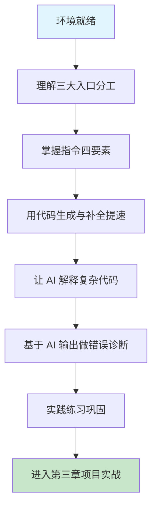

# 第二章 基础交互模式

## 1. 学习目标

本章把第一章建立起来的环境与理念落到日常使用：拆解 Chat、Builder、CUE 三大入口的分工，建立"自然语言 → AI 理解 → 代码产出"的指令工程框架，并配套介绍代码生成补全、代码解释注释、错误诊断修复三组能力。完成本章学习后，大家将能够：以"动作词 + 目标对象 + 具体要求 + 约束条件"四要素结构稳定地输出高质量提示词；用 CUE 内联编辑、Chat 自动上下文、`#` 显式引用三种方式精确控制上下文；阅读 AI 输出的解释/注释/重构建议并独立判断采纳与否；识别 AI 输出中的语法、逻辑、性能、安全四类常见缺陷并完成修复。

### 1.1 学习路径图



### 1.2 预期学习成果

本章结束时，开发者应能写出可被 AI 稳定执行的结构化提示词、能用 CUE 引擎或 `#` 引用主动管理上下文、能让 AI 生成带文档字符串的工业级代码、能让 AI 定位并修复语法 / 逻辑 / 性能 / 安全四类问题。这些能力是后续第三章 Hello World 实战与第二部分场景化项目的基础。

---

## 2. 前置技能检查

本章假设第一章配置完成、Trae IDE 可用、至少一个云端模型已接入。下面列出进入本章前必须确认的环境与能力。

### 2.1 环境就绪自检

| 维度           | 验证项                          | 验证方法                                                                  |
| :------------- | :------------------------------ | :------------------------------------------------------------------------ |
| **IDE**        | Trae 已安装并登录账号           | 右下角显示账号名                                                          |
| **AI 入口**    | Chat / Builder / CUE 全部可唤起 | `Cmd/Ctrl + L`、`Cmd/Ctrl + Shift + L`、`Cmd/Ctrl + I` 三个快捷键均有响应 |
| **模型**       | 至少一个模型可用                | Chat 中输入"你好"得到响应                                                 |
| **MCP**        | Server 状态绿色                 | Settings → MCP 中至少一个 Server 在线                                     |
| **基础工具链** | Node.js v18+、Python (uv)、Git  | `node -v` / `uv --version` / `git --version` 全部正常输出                 |

### 2.2 操作快速验证脚本

依次完成以下三步操作，验证环境处于"可学习"状态：

1. **基本响应**：在 Chat 中输入"你好，请用一句话介绍你能做什么"，期望得到关于 Trae AI 助手能力的简要回答；若长时间无响应，先检查网络与模型配额。
2. **智能体状态**：查看 Chat 输入框附近的 Agent 标识，确认当前 Agent 工具集包含文件系统、终端、Web Search 等基础工具；缺失工具会导致后续 §6.4 安全检测等案例无法复现。
3. **MCP 健康度**：在 Settings → MCP 面板中，确保至少一个 Server 处于绿色 `Connected` 状态；如出现红色 `Error`，先尝试 `Reconnect`，仍失败则参照第一章 §6.4 的故障排查流程定位。

> 任一项验证失败请回到第一章对应小节排查，否则后续案例可能无法复现。

---

## 3. 理论基础与设计原理

要让 AI 稳定输出高质量代码，光"会用 Trae"不够，更需要理解"提示词为什么有效"。本节给出一个可工程化的提示词框架，把"模糊需求 → 精确指令"的转化过程显式化。

### 3.1 指令四要素模型

Trae 与所有 LLM 一样，对结构化输入的响应质量明显高于自由叙述。一个稳定的指令应包含四个要素：

| 要素         | 作用                            | 缺失后果                      | 反例 → 正例                                            |
| :----------- | :------------------------------ | :---------------------------- | :----------------------------------------------------- |
| **动作词**   | 表明意图（创建/优化/解释/修复） | AI 不确定该写代码还是写说明   | "这段代码" → "重构这段代码"                            |
| **目标对象** | 锁定操作对象（函数/类/模块）    | AI 范围扩大或缩小，结果难复现 | "重构代码" → "重构 `OrderService.calculatePrice` 方法" |
| **具体要求** | 描述功能 / 接口 / 行为          | AI 只能凭训练先验猜测         | "更好" → "返回类型改为 `Money`，处理 0 与负数"         |
| **约束条件** | 技术栈 / 性能 / 风格边界        | AI 输出与团队规范冲突         | 无 → "TypeScript 严格模式，不引入新依赖"               |

四要素的标准格式：`[动作词] + [目标对象] + [具体要求] + [约束条件]`。例如："**重构** `OrderService.calculatePrice` 方法，**支持订单维度的满减优惠**，**TypeScript 严格模式且不引入新依赖**"。

### 3.2 动作词分类法

动作词不是越花哨越好，关键是稳定可预期。Trae 在大量实践中沉淀出的高频动作词可分为四类：

- **创建类**（创建 / 生成 / 实现 / 构建 / 设计）：从零产出新代码，AI 默认会写完整结构与示例。
- **修改类**（优化 / 重构 / 修复 / 扩展）：在现有代码上变更，AI 会先读再改，通常输出 Diff。
- **分析类**（解释 / 分析 / 检查 / 比较）：仅输出文字解释，不修改代码，适合 Code Review。
- **执行类**（运行 / 测试 / 部署 / 验证）：触发命令执行，受沙箱约束，需用户确认。

选错动作词的最大代价不是"代码差"，而是"AI 误解意图"——例如用"分析"想让 AI 改代码，AI 只会给文字报告。

### 3.3 上下文供给策略

光写指令不够，AI 还需"看到"上下文。Trae 提供三层供给机制，按精确度递增：

- **隐式（CUE 自动）**：CUE 引擎根据当前活跃文件、最近编辑位置、Git 状态自动构造上下文，开发者无需操作；适合简单任务。
- **半显式（活跃编辑器）**：唤起 Chat 时当前打开的文件自动作为主上下文；适合"基于当前文件改动"。
- **完全显式（`#` 引用）**：通过 `#file`、`#folder`、`#terminal`、`#problems` 主动注入指定文件、目录、终端日志、问题面板；适合跨文件、跨模块的精确任务。

经验法则：能用 CUE 不用 `#`；任务涉及 ≥2 个文件或需要终端日志时，优先用 `#` 显式标注。

### 3.4 多轮对话策略

复杂需求一次写不清楚，渐进式对话往往比一次性长 Prompt 更稳定：

```text
第 1 轮：定义骨架  →  "我需要一个用户管理系统，先列出模块清单与 API 列表"
第 2 轮：细化模块  →  "针对其中的角色权限模块，给出 PostgreSQL 表结构与 RBAC 设计"
第 3 轮：补集成    →  "在上面的设计上集成 LDAP 身份验证，给出中间件代码"
第 4 轮：补审计    →  "为关键操作添加审计日志记录，方案不能影响主流程性能"
```

这种"骨架 → 细化 → 集成 → 补强"的节奏让 AI 在每轮聚焦更小的问题，输出质量显著高于"一次写完所有需求"。

### 3.5 常见失败模式与对策

| 失败模式           | 典型现象                      | 对策                                     |
| :----------------- | :---------------------------- | :--------------------------------------- |
| **意图模糊**       | AI 输出与预期偏差大           | 补全四要素，特别是"具体要求"与"约束条件" |
| **上下文丢失**     | AI 写的代码引用了不存在的函数 | 用 `#file` 显式注入相关文件              |
| **过度自由发挥**   | AI 引入了没要求的依赖或框架   | 在约束中明确"不引入新依赖"               |
| **API 过时**       | 使用已废弃 API 或方法签名     | 在约束中指定库版本（如 React 18）        |
| **超长上下文遗忘** | 长对话中 AI 偏离最初指令      | 周期性 `/spec` 把已确认结论固化为规格    |

理解这些失败模式后，写提示词就从"碰运气"变成"工程化"。

---

## 4. 自然语言编程指令

本节把 §3 的理论框架落地到具体语法、动作词与场景化案例，是大家未来日常使用最频繁的部分。

### 4.1 什么是自然语言编程？

自然语言编程是 Trae 的核心特性之一，允许开发者使用日常语言描述编程需求，AI 助手会自动将这些描述转换为可执行的代码。

### 4.2 基本语法规则

#### 4.2.1 指令结构模式

**标准指令格式：**

```text
[动作词] + [目标对象] + [具体要求] + [约束条件]

示例：
"创建一个Python函数，用于计算两个数的最大公约数，要求使用递归算法"
 ↑      ↑           ↑                    ↑
动作词   目标对象     具体要求              约束条件
```

**常用指令模板：**

```text
1. 创建类指令：
   "创建/生成/写一个 [类型] [名称]，实现 [功能]，使用 [技术/方法]"

2. 修改类指令：
   "修改/优化/重构 [目标代码]，[具体改进要求]"

3. 解释类指令：
   "解释/分析 [代码/概念]，说明 [具体方面]"

4. 调试类指令：
   "检查/修复 [代码]，解决 [问题描述]"
```

#### 4.2.2 精确表达技巧

**具体化描述：**

```text
❌ 模糊表达："写个函数"
✅ 具体表达："写一个Python函数，接收用户输入的字符串，返回去除空格后的字符串长度"

❌ 模糊表达："优化这段代码"
✅ 具体表达："优化这段代码的性能，减少时间复杂度，并添加错误处理"
```

**上下文提供：**

```text
✅ 良好示例：
"我正在开发一个电商网站，需要一个购物车类。
要求：
- 添加商品到购物车
- 删除购物车中的商品
- 计算总价（含税）
- 支持优惠券功能
请使用Python实现，并包含完整的错误处理。"
```

### 4.3 常用动作词汇与应用

#### 4.3.1 创建类动作词

| 动作词        | 适用场景           | 示例                       |
| ------------- | ------------------ | -------------------------- |
| **创建/生成** | 从零开始编写代码   | "创建一个RESTful API接口"  |
| **实现**      | 实现特定算法或功能 | "实现快速排序算法"         |
| **构建**      | 搭建项目结构或框架 | "构建一个React组件库"      |
| **设计**      | 设计架构或数据结构 | "设计一个用户权限管理系统" |

**实战练习 1：创建类指令：**

```text
练习任务：使用不同的动作词，为以下需求编写指令

需求：制作一个计算器程序
1. 用"创建"：_________________
2. 用"实现"：_________________
3. 用"构建"：_________________
4. 用"设计"：_________________

参考答案：
1. "创建一个支持四则运算的计算器程序"
2. "实现计算器的核心运算逻辑"
3. "构建一个带图形界面的计算器应用"
4. "设计计算器的用户交互界面"
```

#### 4.3.2 修改类动作词

| 动作词   | 适用场景           | 示例                           |
| -------- | ------------------ | ------------------------------ |
| **优化** | 提升性能或代码质量 | "优化数据库查询性能"           |
| **重构** | 改进代码结构       | "重构这个类，提高可维护性"     |
| **修复** | 解决错误或bug      | "修复登录验证的安全漏洞"       |
| **扩展** | 添加新功能         | "扩展用户模块，支持第三方登录" |

#### 4.3.3 分析类动作词

| 动作词   | 适用场景       | 示例                         |
| -------- | -------------- | ---------------------------- |
| **解释** | 理解代码或概念 | "解释这个算法的工作原理"     |
| **分析** | 深入研究问题   | "分析这段代码的时间复杂度"   |
| **检查** | 代码审查或调试 | "检查这个函数是否有内存泄漏" |
| **比较** | 对比不同方案   | "比较React和Vue的优缺点"     |

### 4.4 实际应用示例与练习

#### 4.4.1 Web开发场景

**场景1：前端组件开发：**

```text
用户指令：
"创建一个React登录组件，包含用户名和密码输入框，
登录按钮，表单验证，以及错误提示功能。
使用TypeScript和styled-components。"

AI响应要点：
- 组件结构设计
- 状态管理
- 表单验证逻辑
- 样式实现
- 错误处理
```

**场景2：后端API开发：**

```text
用户指令：
"使用Node.js和Express创建一个用户注册API，
包含邮箱验证、密码加密、数据库存储，
返回JWT token，并添加完整的错误处理。"

AI响应要点：
- 路由设计
- 中间件配置
- 数据验证
- 安全处理
- 响应格式
```

#### 4.4.2 数据处理场景

**场景3：数据分析脚本：**

```text
用户指令：
"写一个Python脚本，读取CSV文件中的销售数据，
计算每月销售总额，生成可视化图表，
并导出分析报告到Excel文件。"

实战练习：
1. 尝试向AI发送这个指令
2. 观察AI如何分解任务
3. 运行生成的代码
4. 根据结果提出改进建议
```

#### 4.4.3 算法实现场景

**场景4：算法优化：**

```text
用户指令：
"这是我的冒泡排序实现：[粘贴代码]
请分析其时间复杂度，并提供一个更高效的排序算法，
要求保持代码简洁易懂。"

互动练习：
1. 先实现一个简单的冒泡排序
2. 向AI请求分析和优化
3. 比较不同算法的性能
4. 理解算法选择的权衡
```

### 4.5 高级交互技巧

#### 4.5.1 多轮对话策略

**渐进式需求细化：**

```text
第1轮："我需要一个用户管理系统"
第2轮："添加角色权限控制功能"
第3轮："集成LDAP身份验证"
第4轮："添加审计日志记录"
```

**问题分解方法：**

```text
复杂需求："开发一个在线教育平台"

分解为：
1. "设计用户注册和登录系统"
2. "创建课程管理模块"
3. "实现视频播放功能"
4. "开发在线考试系统"
5. "添加支付集成"
```

#### 4.5.2 上下文管理

**代码引用技巧（结合 CUE 引擎）：**

Trae 具备强大的上下文理解引擎（CUE），无需手动粘贴大量代码：

```text
方法1：CUE 内联编辑 (Cmd/Ctrl + I)
1. 在编辑器中选中相关代码，按下 Cmd+I (或 Ctrl+I)
2. 直接输入修改指令："优化这段代码的性能"
3. Trae 会直接在原位置生成 Diff 供大家 Review。

方法2：Chat 自动上下文 (Cmd/Ctrl + L)
1. 在编辑器中打开目标文件或选中代码。
2. 唤起 Chat，AI 会自动将当前活跃文件作为上下文。

方法3：显式文件/终端引用 (# 号)
在对话框输入 `#`，可以主动引用特定的文件、文件夹、终端日志（Terminal）或问题面板（Problems）作为上下文。
```

#### 4.5.3 错误处理与调试

**错误信息分析：**

```text
标准格式：
"我遇到了这个错误：[粘贴完整错误信息]
这是相关的代码：[粘贴代码片段]
请帮我分析原因并提供解决方案。"

调试请求：
"这段代码运行结果不符合预期：
期望结果：[描述期望]
实际结果：[描述实际]
代码：[粘贴代码]
请帮我找出问题。"
```

### 4.6 交互效果评估

#### 4.6.1 指令质量自检

**检查清单：**

```text
□ 动作词明确（创建、修改、分析等）
□ 目标对象具体（函数、类、模块等）
□ 需求描述详细（功能、约束、技术栈）
□ 上下文信息充分（项目背景、现有代码）
□ 预期结果清晰（输出格式、性能要求）
```

**常见问题与改进：**

```text
问题1：指令过于简单
❌ "写个函数"
✅ "写一个Python函数，计算列表中所有偶数的平均值"

问题2：缺乏上下文
❌ "优化这个"
✅ "优化这个数据库查询函数，减少查询时间，当前处理1万条记录需要5秒"

问题3：要求不明确
❌ "做个网站"
✅ "创建一个响应式的个人博客网站，使用HTML/CSS/JavaScript，支持文章分类和搜索"
```

#### 4.6.2 实战练习总结

**综合练习：智能对话挑战：**

```text
挑战任务：与AI协作完成一个完整的小项目

项目：个人任务管理器
要求：
1. 使用渐进式对话完成需求分析
2. 分步骤实现各个功能模块
3. 在过程中处理遇到的问题
4. 最终完成可运行的程序

评估标准：
- 指令表达的准确性
- 与AI交互的效率
- 问题解决的能力
- 最终项目的完整性
```

> 🎯 **学习建议**：
>
> - 从简单指令开始练习
> - 逐步增加指令的复杂度
> - 注意观察AI的响应模式
> - 学会根据反馈调整指令
> - 培养分解复杂问题的能力

#### 4.6.3 示例 1：创建基础函数

**自然语言指令：**

```text
创建一个函数，接收用户名和密码，验证登录信息
```

**生成的代码：**

```python
def validate_login(username, password):
    """
    验证用户登录信息

    Args:
        username (str): 用户名
        password (str): 密码

    Returns:
        bool: 登录是否成功
    """
    # 这里应该连接数据库验证用户信息
    # 示例实现
    valid_users = {
        "admin": "password123",
        "user1": "mypassword"
    }

    return username in valid_users and valid_users[username] == password

# 使用示例
if validate_login("admin", "password123"):
    print("登录成功")
else:
    print("用户名或密码错误")
```

#### 4.6.4 示例 2：创建数据处理函数

**自然语言指令：**

```text
写一个函数，从CSV文件读取数据，计算平均值，并生成图表
```

**生成的代码：**

```python
import pandas as pd
import matplotlib.pyplot as plt
import numpy as np

def analyze_csv_data(file_path, column_name):
    """
    从CSV文件读取数据，计算指定列的平均值并生成图表

    Args:
        file_path (str): CSV文件路径
        column_name (str): 要分析的列名

    Returns:
        float: 平均值
    """
    try:
        # 读取CSV文件
        df = pd.read_csv(file_path)

        # 检查列是否存在
        if column_name not in df.columns:
            raise ValueError(f"列 '{column_name}' 不存在")

        # 计算平均值
        average = df[column_name].mean()

        # 生成图表
        plt.figure(figsize=(10, 6))
        plt.hist(df[column_name], bins=20, alpha=0.7, color='skyblue')
        plt.axvline(average, color='red', linestyle='--',
                   label=f'平均值: {average:.2f}')
        plt.xlabel(column_name)
        plt.ylabel('频次')
        plt.title(f'{column_name} 数据分布')
        plt.legend()
        plt.grid(True, alpha=0.3)
        plt.show()

        return average

    except Exception as e:
        print(f"处理数据时出错: {e}")
        return None

# 使用示例
# average_score = analyze_csv_data('students.csv', 'score')
```

### 4.7 高级指令技巧

#### 4.7.1 指定技术栈

```text
使用 React 和 TypeScript 创建一个用户注册组件
用 Django REST Framework 实现用户管理API
使用 Vue.js 和 Element UI 开发数据表格
```

#### 4.7.2 指定设计模式

```text
使用单例模式创建数据库连接类
实现观察者模式的事件系统
用工厂模式创建不同类型的日志记录器
```

#### 4.7.3 指定性能要求

```text
创建一个高性能的图片压缩函数
实现内存优化的大文件处理器
开发支持并发的网络请求管理器
```

### 4.8 有效不等于正确

本章教了如何用精确的指令让 AI 生成代码，但**指令写得好 ≠ 代码没问题**。在进入后续章节前，回顾第一章 §7 的「四步审查法」：

- AI 生成的 `setInterval` 可能忘记清理 → **内存泄漏**
- AI 生成的 SQL 可能是字符串拼接 → **注入风险**
- AI 引用的 API 可能已废弃 → **运行时错误**

> **养成习惯**：每次收到 AI 的代码后，默念 **"正确性 → 安全性 → 性能 → 可维护性"** 四步走。这是 AI 编程时代最重要的职业习惯。

### 4.9 修正提示词语法（feedback grammar）

> **全书锚点**：`§4.9` 与 `§4.10` 是后续 Ch3-Ch16 所有「Vibe Coding 循环实录」与「修正提示词模板」列共同复用的**唯一**语法锚点。后续章节只引用、不重新定义。

写好首轮提示词只是 Vibe Coding 的一半；另一半是收到 AI 输出、发现缺陷后的**修正提示词（correction prompt）**。AI 95% 的概率不会一次到位，真正的关键能力不是「重写一遍」，而是用**精准的语言增量修正**——保留对的部分、定位错的部分、说明原因。

#### 4.9.1 修正提示词的标准模板

```text
保留 [X 不变]，修复 [Y]，原因是 [Z]。
不要改变 [X 的任何部分]。
验证标准：[可观测信号]。
```

四个槽位的填法：

| 槽位           | 必须包含                                     | 反面写法                      |
| :------------- | :------------------------------------------- | :---------------------------- |
| `[X 不变]`     | 已经正确的接口 / 测试 / 文件名 / 函数签名    | 「保留代码风格」——太抽象      |
| `[Y]`          | 单一、可定位的缺陷点（一次只修一个）         | 「修一下 bug」——AI 不知道修哪 |
| `[Z]`          | 可观测的失败现象 / 规范条款 / 性能指标       | 「不太好」——没有判据          |
| `[可观测信号]` | grep 命中 / 测试通过 / benchmark 数字 / 截图 | 「看起来没问题」——无法验证    |

#### 4.9.2 三个正例

**正例 1 — 保留接口，修复实现**：

```text
保留 applyDiscount(price, code) 的函数签名与导出方式，
修复折扣码大小写敏感问题——当 code = "vip10" 时也应返回 90。
原因：业务方反馈用户输入小写也被接受。
不要改变函数名、参数顺序、返回类型。
验证：新增测试 expect(applyDiscount(100, "vip10")).toBe(90) 通过。
```

**正例 2 — 保留测试，修复实现**：

```text
保留 user.spec.ts 中的全部 it 用例与 describe 层级，
修复实现文件 user.ts 中 createUser 在 email 为空时抛 TypeError 的问题——应抛业务错误 InvalidEmailError。
原因：当前测试 "rejects empty email" 报错信息不匹配。
不要改测试文件，只改 user.ts。
验证：vitest run user.spec.ts 全绿。
```

**正例 3 — 保留配置，修复运行时调用**：

```text
保留 vite.config.ts 中所有 plugin 顺序与别名配置，
修复 main.ts 中 import('virtual:routes') 路径错误——当前提示 "Cannot find module"。
原因：插件期望 import('@routes')。
不要修改 vite.config.ts。
验证：pnpm dev 启动无报错，路由可访问。
```

#### 4.9.3 三个反例（AI 会被带跑偏）

| 反例                             | 错在哪                     | 后果                              |
| :------------------------------- | :------------------------- | :-------------------------------- |
| 「重新写一遍，要更好」           | `[Y]` 与 `[X 不变]` 都缺失 | AI 推翻已正确的部分，引入新 bug   |
| 「修一下登录的 bug」             | `[Y]` 太宽，`[Z]` 缺失     | AI 猜测哪里是 bug，可能改错地方   |
| 「修复 X 同时优化 Y 顺便加上 Z」 | 一次塞三个修正             | AI 会牺牲质量换速度，三个都没改对 |

> **铁律**：一轮一个修正点。如果同时发现三个缺陷，写三轮独立的修正提示词，**不要合并**。

### 4.10 何时重新开始而非继续修正

修正提示词是利器，但不是万能药。Vibe Coding 最难的判断是：**这一组提示词是否已经走不通了？** 强行迭代会陷入「AI 改 A 坏 B、改 B 坏 C」的死循环。下面三个信号出现任一即应放弃当前轮次，**回到首轮重写更小范围的提示词**。

#### 4.10.1 三个放弃信号

| 信号                   | 现象                                                               | 含义                                        |
| :--------------------- | :----------------------------------------------------------------- | :------------------------------------------ |
| **3 轮不收敛**         | 连续 3 轮修正后，目标缺陷仍存在或变形复现                          | 提示词承载的语义超过单次推理能消化的范围    |
| **改 A 坏 B**          | 每轮修复目标缺陷，同时引入新的回归（测试由绿变红）                 | AI 的隐式假设与你的隐式假设冲突，必须显式化 |
| **缺陷类型是结构性的** | 缺陷涉及「应该用 X 模式而不是 Y 模式」（如该用状态机却写了 if 链） | 表面修补无法触达——需要重写需求骨架          |

#### 4.10.2 放弃后的三种重启策略

- **缩范围（recommended first try）**：把原 prompt 拆成 2-3 个更小的 prompt，每个只完成一个子任务；用上一轮的输出作为下一轮的 `[X 不变]`。
- **拆步骤**：把「实现 + 测试 + 文档」一次性 prompt 拆为「先写测试 → 让测试驱动实现 → 最后补文档」的三轮 prompt。
- **换模式**：如果 Builder + `/plan` 卡住，切到 Chat 让 AI 解释自己的方案；如果 Chat 兜不住改动量，切到 Builder 重新 `/plan`。模式选择见 [第一章 §5.4 三种交互模式决策树](../第一部分-Trae基础入门/第一章-Trae简介与环境配置.md)。

#### 4.10.3 反向铁律：让 AI 自己诊断不收敛

> **沉没成本陷阱**：当你已经迭代 5 轮还在修同一个 bug，**不要再写第 6 轮修正提示词**——把 AI 至今的全部输出贴回 Chat，问它：「以上方案为什么不收敛？应该如何重写需求？」 让 AI 自己诊断结构性缺陷，然后重启。这一招能省下 80% 的死循环时间。

---

## 5. 代码生成和补全

代码生成和补全是 Trae 的核心能力之一，它能显著提高编码效率。

### 5.1 智能代码补全

#### 5.1.1 上下文感知补全

Trae 会根据当前代码上下文提供智能建议：

```python
# 当输入以下代码时
class UserManager:
    def __init__(self):
        self.users = []

    def add_user(self, user):
        # 光标在这里，Trae 会建议：
        # self.users.append(user)
        # if user not in self.users:
        # self.users.insert(0, user)
```

#### 5.1.2 函数签名补全

```python
# 输入函数名后，自动补全参数
def calculate_distance(
    # Trae 建议: point1, point2

# 或者根据函数名推断参数类型
def send_email(
    # Trae 建议: recipient: str, subject: str, body: str
```

#### 5.1.3 导入语句补全

```python
# 当使用未导入的模块时，自动建议导入
np.array([1, 2, 3])
# 建议添加: import numpy as np

requests.get(url)
# 建议添加: import requests
```

### 5.2 代码模板生成

#### 5.2.1 类模板

**指令：** "创建一个数据模型类"

```python
class DataModel:
    """
    数据模型基类
    """
    def __init__(self, **kwargs):
        for key, value in kwargs.items():
            setattr(self, key, value)

    def to_dict(self):
        """转换为字典格式"""
        return {key: value for key, value in self.__dict__.items()
                if not key.startswith('_')}

    def from_dict(self, data):
        """从字典创建对象"""
        for key, value in data.items():
            setattr(self, key, value)
        return self

    def __repr__(self):
        return f"{self.__class__.__name__}({self.to_dict()})"
```

#### 5.2.2 API 接口模板

**指令：** "创建 RESTful API 接口"

```python
from flask import Flask, request, jsonify
from functools import wraps

app = Flask(__name__)

def validate_json(f):
    """验证 JSON 数据的装饰器"""
    @wraps(f)
    def decorated_function(*args, **kwargs):
        if not request.is_json:
            return jsonify({'error': '请求必须是 JSON 格式'}), 400
        return f(*args, **kwargs)
    return decorated_function

@app.route('/api/users', methods=['GET'])
def get_users():
    """获取用户列表"""
    try:
        # 这里应该从数据库获取用户数据
        users = []
        return jsonify({
            'success': True,
            'data': users,
            'total': len(users)
        })
    except Exception as e:
        return jsonify({'error': str(e)}), 500

@app.route('/api/users', methods=['POST'])
@validate_json
def create_user():
    """创建新用户"""
    try:
        data = request.get_json()

        # 验证必需字段
        required_fields = ['username', 'email']
        for field in required_fields:
            if field not in data:
                return jsonify({'error': f'缺少必需字段: {field}'}), 400

        # 这里应该保存到数据库
        user_id = 1  # 模拟生成的用户ID

        return jsonify({
            'success': True,
            'data': {'id': user_id, **data}
        }), 201

    except Exception as e:
        return jsonify({'error': str(e)}), 500

if __name__ == '__main__':
    app.run(debug=True)
```

### 5.3 智能重构建议

#### 5.3.1 代码优化

**原始代码：**

```python
def process_data(data):
    result = []
    for item in data:
        if item > 0:
            if item % 2 == 0:
                result.append(item * 2)
            else:
                result.append(item * 3)
    return result
```

**Trae 建议的优化：**

```python
def process_data(data):
    """处理数据：正偶数乘2，正奇数乘3"""
    return [item * (2 if item % 2 == 0 else 3) for item in data if item > 0]
```

#### 5.3.2 性能优化

**原始代码：**

```python
def find_duplicates(lst):
    duplicates = []
    for i in range(len(lst)):
        for j in range(i + 1, len(lst)):
            if lst[i] == lst[j] and lst[i] not in duplicates:
                duplicates.append(lst[i])
    return duplicates
```

**Trae 建议的优化：**

```python
from collections import Counter

def find_duplicates(lst):
    """查找列表中的重复元素（优化版本）"""
    counts = Counter(lst)
    return [item for item, count in counts.items() if count > 1]
```

---

### 5.4 Vibe Coding 循环实录：质数函数过度设计裁减

> **修正语法**：本节「修正提示词」按 §4.9 标准模板填写；3 轮未收敛触发 §4.10。模式选择查 [第一章 §5.4](第一章-Trae简介与环境配置.md)。

| 轮次 | AI 输出摘要                                             | 发现的缺陷                                      | 修正提示词（按 §4.9 模板）                                                                                                                                                                                 | 验证信号                                             |
| :--- | :------------------------------------------------------ | :---------------------------------------------- | :--------------------------------------------------------------------------------------------------------------------------------------------------------------------------------------------------------- | :--------------------------------------------------- |
| R1   | 输出 200 行带 `PrimeCache` 类、多线程锁、LRU 的过度设计 | 需求只是「判断质数」，被复杂化；cyclomatic 超限 | 保留 `is_prime(n: int) -> bool` 函数名与返回类型，删除类、锁、LRU 缓存代码。原因：需求是单函数、无状态。不要改函数名与参数。验证：`wc -l prime.py` 输出 ≤ 30                                               | `wc -l prime.py` ≤ 30；`grep -c class prime.py` == 0 |
| R2   | 精简后仍用 `try/except Exception` 包裹函数体            | 吞掉了 `n<2` 的业务边界，返回 True 是错的       | 保留函数体主逻辑，修复边界处理：去掉 try/except，在顶部加 `if n < 2: return False`。原因：0/1/负数不是质数，应明确返回 False 而不是吃掉异常。验证：`assert is_prime(0) is False and is_prime(-7) is False` | 3 个边界断言均过；`grep -c except prime.py` == 0     |
| R3   | 缺少 type hint 使 mypy strict 模式报错                  | 与项目 `pyproject.toml` 的 strict 配置冲突      | 保留函数体与逻辑不变，修复类型标注：签名改为 `def is_prime(n: int) -> bool`。原因：项目 mypy strict 要求全部函数有返回类型。不要动函数体。验证：`mypy --strict prime.py` 0 错误                            | `mypy --strict prime.py` exit 0                      |

> **收敛信号**：30 行以内 + 边界正确 + 类型完整。如 3 轮未收敛触发 §4.10 信号 3（结构性缺陷）：AI 默认在「质数」主题上过度设计。重启时在提示词首句补「只写单函数、不加任何类与缓存」硕化约束。

---

## 6. 代码解释和注释

### 6.1 自动代码解释

#### 6.1.1 复杂算法解释

**代码：**

```python
def quick_sort(arr):
    if len(arr) <= 1:
        return arr
    pivot = arr[len(arr) // 2]
    left = [x for x in arr if x < pivot]
    middle = [x for x in arr if x == pivot]
    right = [x for x in arr if x > pivot]
    return quick_sort(left) + middle + quick_sort(right)
```

**Trae 生成的解释：**

```markdown
## 快速排序算法解释

这是一个快速排序的递归实现：

1. **基础情况**: 如果数组长度 ≤ 1，直接返回（已排序）
2. **选择基准**: 选择数组中间位置的元素作为基准值
3. **分区操作**:
   - left: 所有小于基准的元素
   - middle: 所有等于基准的元素
   - right: 所有大于基准的元素
4. **递归排序**: 对左右两部分递归调用快速排序
5. **合并结果**: 将排序后的左部分 + 中间部分 + 排序后的右部分合并

**时间复杂度**: 平均 O(n log n)，最坏 O(n²)
**空间复杂度**: O(log n) 递归栈空间
```

#### 6.1.2 设计模式解释

**代码：**

```python
class Singleton:
    _instance = None
    _initialized = False

    def __new__(cls):
        if cls._instance is None:
            cls._instance = super().__new__(cls)
        return cls._instance

    def __init__(self):
        if not self._initialized:
            self.data = {}
            self._initialized = True
```

**Trae 生成的解释：**

```markdown
## 单例模式实现解释

这是一个线程安全的单例模式实现：

### 关键组件：

- `_instance`: 类变量，存储唯一实例
- `_initialized`: 防止重复初始化的标志

### 工作原理：

1. `__new__` 方法控制对象创建
2. 检查是否已存在实例，如果没有则创建
3. `__init__` 方法只在第一次创建时执行初始化
4. 后续调用返回同一个实例

### 使用场景：

- 数据库连接池
- 配置管理器
- 日志记录器
- 缓存管理器
```

### 6.2 智能注释生成

#### 6.2.1 函数文档字符串

**原始函数：**

```python
def calculate_compound_interest(principal, rate, time, compound_frequency):
    return principal * (1 + rate / compound_frequency) ** (compound_frequency * time)
```

**Trae 生成的文档：**

```python
def calculate_compound_interest(principal, rate, time, compound_frequency):
    """
    计算复利

    Args:
        principal (float): 本金金额
        rate (float): 年利率（小数形式，如 0.05 表示 5%）
        time (float): 投资时间（年）
        compound_frequency (int): 每年复利次数

    Returns:
        float: 复利计算后的最终金额

    Example:
        >>> calculate_compound_interest(1000, 0.05, 2, 4)
        1104.486

    Formula:
        A = P(1 + r/n)^(nt)
        其中 A=最终金额, P=本金, r=年利率, n=复利频率, t=时间
    """
    return principal * (1 + rate / compound_frequency) ** (compound_frequency * time)
```

#### 6.2.2 类文档生成

**原始类：**

```python
class BankAccount:
    def __init__(self, account_number, initial_balance=0):
        self.account_number = account_number
        self.balance = initial_balance
        self.transaction_history = []

    def deposit(self, amount):
        self.balance += amount
        self.transaction_history.append(f"存款: +{amount}")

    def withdraw(self, amount):
        if amount <= self.balance:
            self.balance -= amount
            self.transaction_history.append(f"取款: -{amount}")
            return True
        return False
```

**Trae 生成的文档：**

```python
class BankAccount:
    """
    银行账户类

    管理银行账户的基本操作，包括存款、取款和交易历史记录。

    Attributes:
        account_number (str): 账户号码
        balance (float): 当前余额
        transaction_history (list): 交易历史记录

    Example:
        >>> account = BankAccount("123456789", 1000)
        >>> account.deposit(500)
        >>> account.withdraw(200)
        >>> print(account.balance)
        1300
    """

    def __init__(self, account_number, initial_balance=0):
        """
        初始化银行账户

        Args:
            account_number (str): 账户号码
            initial_balance (float, optional): 初始余额. Defaults to 0.
        """
        self.account_number = account_number
        self.balance = initial_balance
        self.transaction_history = []

    def deposit(self, amount):
        """
        存款操作

        Args:
            amount (float): 存款金额

        Raises:
            ValueError: 如果存款金额为负数
        """
        if amount < 0:
            raise ValueError("存款金额不能为负数")
        self.balance += amount
        self.transaction_history.append(f"存款: +{amount}")

    def withdraw(self, amount):
        """
        取款操作

        Args:
            amount (float): 取款金额

        Returns:
            bool: 取款是否成功

        Raises:
            ValueError: 如果取款金额为负数
        """
        if amount < 0:
            raise ValueError("取款金额不能为负数")
        if amount <= self.balance:
            self.balance -= amount
            self.transaction_history.append(f"取款: -{amount}")
            return True
        return False
```

---

## 7. 错误诊断与修复建议

当代码出现问题时，Trae 能够智能地分析错误并提供一键修复建议。本节同时是“AI 生成代码的审查验证”能力的集中训练场——掌握以下四类问题的识别与修复后，大家的 Code Review 能力会质变。

### 7.1 语法错误检测

Trae 可以实时捕捉语法错误并给出修改建议。

#### 7.1.1 语法错误

**错误代码：**

```python
def calculate_area(radius):
    pi = 3.14159
    area = pi * radius * 2  # 错误：应该是 radius ** 2
    return area
```

**Trae 诊断和修复：**

```python
def calculate_area(radius):
    pi = 3.14159
    area = pi * radius ** 2  # 修复：使用正确的平方运算
    return area
```

#### 7.1.2 缩进错误

**错误代码：**

```python
def process_list(items):
result = []  # 缺少缩进
for item in items:
if item > 0:  # 缺少缩进
result.append(item)  # 缺少缩进
return result  # 缺少缩进
```

**Trae 诊断和修复：**

```python
def process_list(items):
    result = []  # 修复：添加缩进
    for item in items:
        if item > 0:  # 修复：添加缩进
            result.append(item)  # 修复：添加缩进
    return result  # 修复：添加缩进
```

### 7.2 逻辑错误检测

对于可能导致运行时异常的逻辑错误，Trae 会提前发出警告。

#### 7.2.1 无限循环检测

**问题代码：**

```python
def countdown(n):
    while n > 0:
        print(n)
        # 忘记递减 n
    print("完成！")
```

**Trae 警告：**

```markdown
⚠️ 潜在无限循环检测到：
问题: 循环变量 'n' 在循环体内没有被修改
建议: 在循环体内添加 n -= 1 或类似的递减操作
修复建议:
while n > 0:
print(n)
n -= 1 # 添加这行
```

#### 7.2.2 变量未定义检测

**问题代码：**

```python
def calculate_total(prices):
    for price in prices:
        total += price  # total 未定义
    return total
```

**Trae 诊断：**

```markdown
❌ 变量错误：
问题: 变量 'total' 在赋值前被使用
位置: 第3行
修复建议:

1. 在循环前初始化变量: total = 0
2. 或使用内置函数: return sum(prices)
```

### 7.3 性能问题检测

Trae 可以识别出低效的算法和内存使用问题，并提供优化方案。

#### 7.3.1 低效算法检测

**问题代码：**

```python
def find_common_elements(list1, list2):
    common = []
    for item1 in list1:
        for item2 in list2:
            if item1 == item2 and item1 not in common:
                common.append(item1)
    return common
```

**Trae 性能建议：**

```markdown
⚡ 性能问题检测到：
当前算法复杂度: O(n²)
问题: 嵌套循环 + 线性搜索
优化建议:
```

```python
def find_common_elements(list1, list2):
    """优化版本 - O(n) 复杂度"""
    set1 = set(list1)
    set2 = set(list2)
    return list(set1.intersection(set2))

# 或者更简洁的写法
def find_common_elements(list1, list2):
    return list(set(list1) & set(list2))
```

#### 7.3.2 内存使用优化

**问题代码：**

```python
def process_large_file(filename):
    with open(filename, 'r') as f:
        lines = f.readlines()  # 一次性读取所有行到内存
    result = []
    for line in lines:
        if 'important' in line:
            result.append(line.strip())
    return result
```

**Trae 内存优化建议：**

```python
def process_large_file(filename):
    """内存优化版本 - 逐行处理"""
    result = []
    with open(filename, 'r') as f:
        for line in f:  # 逐行读取，节省内存
            if 'important' in line:
                result.append(line.strip())
    return result

# 或者使用生成器进一步优化
def process_large_file_generator(filename):
    """生成器版本 - 最节省内存"""
    with open(filename, 'r') as f:
        for line in f:
            if 'important' in line:
                yield line.strip()
```

### 7.4 安全问题检测

Trae 能够检测出常见的安全漏洞，如 SQL 注入、XSS 等。

#### 7.4.1 SQL 注入风险

**危险代码：**

```python
def get_user(username):
    query = f"SELECT * FROM users WHERE username = '{username}'"  # 存在 SQL 注入风险
    return execute_query(query)
```

**Trae 安全警告：**

```markdown
🔒 安全风险检测到：
风险类型: SQL 注入
问题: 直接拼接用户输入到 SQL 查询
安全修复:
```

```python
def get_user(username):
    """安全版本 - 使用参数化查询"""
    query = "SELECT * FROM users WHERE username = %s"
    return execute_query(query, (username,))
```

#### 7.4.2 路径遍历风险

**危险代码：**

```python
def read_file(filename):
    # 存在路径遍历风险
    with open(f"/uploads/{filename}", 'r') as f:
        return f.read()
```

**Trae 安全建议：**

```python
import os
from pathlib import Path

def read_file(filename):
    """安全版本 - 验证文件路径"""
    # 验证文件名，防止路径遍历
    if '..' in filename or filename.startswith('/'):
        raise ValueError("非法文件路径")

    # 使用安全的路径拼接
    safe_path = Path("/uploads") / filename

    # 确保文件在允许的目录内
    if not str(safe_path).startswith("/uploads/"):
        raise ValueError("文件路径超出允许范围")

    with open(safe_path, 'r') as f:
        return f.read()
```

---

## 8. 实践练习

本节提供三档练习，按难度递增，建议顺序完成。完成后用第一章 §7 的四步审查法检查所有 AI 输出。

### 8.1 基础题：指令与补全

使用自然语言指令完成以下任务，并在 Chat 中保留一份提示词原始记录。

1. 以四要素格式写出提示词："创建一个 `StudentScore` 类，支持添加成绩 / 计算平均分 / 查找最高分，Python 3.10+ 并包含类型注解"；记录 AI 输出与预期的差异。
2. 实现一个简单购物车：支持添加/删除商品、计算总价；要求 AI 同时生成主体代码与单元测试，对比一次性长 Prompt 与多轮渐进式对话两种写法产出质量。
3. 写一个密码强度检查函数，要求包含大小写字母、数字、特殊字符；使用 CUE 内联编辑在同一个函数上连续迭代三轮，观察代码质量变化。

### 8.2 进阶题：重构与错误修复

在现有代码上使用 AI 完成优化与修复，重点验证 AI 输出的正确性与性能。

```python
# 待优化的代码
def find_max_min(numbers):
    max_num = numbers[0]
    min_num = numbers[0]
    for i in range(1, len(numbers)):
        if numbers[i] > max_num:
            max_num = numbers[i]
        if numbers[i] < min_num:
            min_num = numbers[i]
    return max_num, min_num
```

```python
# 待修复的代码
def calculate_factorial(n)
    if n = 0:
        return 1
    else
        return n * calculate_factorial(n - 1
```

完成要求：让 AI 分别完成优化与修复，提供优化前后的时间复杂度与使用原生 Python 运行 100 万元素的实测耗时；验证修复后的代码能运行 `calculate_factorial(0)`、`calculate_factorial(5)`、`calculate_factorial(20)` 三个用例。

### 8.3 开放题：提示词设计与 A/B 对比

选一个你熟悉的业务场景（如订单状态机、购物车优惠计算、文件上传处理），设计两种提示词：一份采用一次性长 Prompt、一份采用多轮渐进式对话。让 AI 分别生成代码后，以四步审查法逐项评分（1–5 分），记录两种策略的优劣势并总结 200 字以内的经验报告。

> 这份报告是后续第四章 §2.4 AI 协作能力自检的重要输入，请认真完成。

---

## 9. 小结

本章从理论与实践两侧完整覆盖了 Trae 的基础交互模式：以四要素模型与动作词分类法为骨架的提示词工程、以三层上下文供给策略为押手的上下文管理、以多轮对话为节奏的复杂需求拆解，以及代码生成/解释/诊断三组能力的实战案例。掌握这些交互模式使你从“使用者”迈向“架构者”——不再依赖偶然的提示词运气，而是能稳定复现高质量产出。下一章将通过一个完整的 Hello World 项目把本章讲过的所有能力集成于一场实战。

---

## 10. 延伸阅读

以下资源覆盖 Trae 与提示词工程、代码质量与重构、安全与文档规范三条主线，对应本章§3-§7的关键知识点。

### 10.1 Trae 与提示词工程

- **Trae 官方文档**：[https://docs.trae.ai](https://docs.trae.ai) — 2025 年最新版本发布记录与快捷键参考，是 Chat / Builder / CUE 三入口的一手资料。
- **Anthropic Prompt Engineering Guide**：[https://docs.anthropic.com/en/docs/build-with-claude/prompt-engineering](https://docs.anthropic.com/en/docs/build-with-claude/prompt-engineering) — 官方 Prompt 工程最佳实践，与本章四要素框架高度一致。
- **OpenAI Prompt Engineering Best Practices**：[https://platform.openai.com/docs/guides/prompt-engineering](https://platform.openai.com/docs/guides/prompt-engineering) — 跨模型提示词设计原则，可与 Anthropic 指南互为补充。
- **Google：Prompt Engineering for Developers**：[https://www.kaggle.com/whitepaper-prompt-engineering](https://www.kaggle.com/whitepaper-prompt-engineering) — Google 发布的 Prompt 工程白皮书，涵盖零样本 / 少样本 / CoT 等范式。

### 10.2 代码质量与重构

- **Refactoring (Martin Fowler)**：[https://refactoring.com/](https://refactoring.com/) — 重构模式经典著作与官网资源，为 AI 重构建议提供评判参照；对应 §6 代码解释与重构场景。
- **PEP 257 Docstring Conventions**：[https://peps.python.org/pep-0257/](https://peps.python.org/pep-0257/) — Python 文档字符串规范，评判 AI 生成注释质量的参考。

### 10.3 安全审查与 OWASP

- **OWASP Top 10 for Web Applications**：[https://owasp.org/www-project-top-ten/](https://owasp.org/www-project-top-ten/) — 审查 AI 生成代码安全性时的权威清单，与第二部分 §6/§8 直接呼应。
