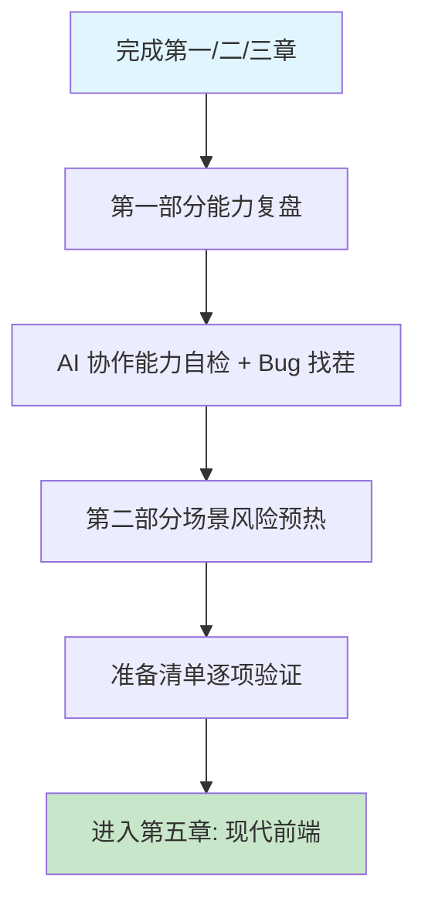

# 第四章 第一部分总结与进阶准备

## 1. 学习目标

本章承担第一部分的「出口」职责：把前三章建立的能力（环境与 SOLO 模式 / 提示词工程 / 多语言项目实战）放回一张体系化的能力地图上，用可量化的 rubric 检验"是否真的掌握了"，并诊断进入第二部分前的能力缺口。完成本章学习后，大家将能够：用一张能力矩阵自评 Trae 操作 / 提示词工程 / 代码审查 / 多语言基础 / 工程化五个维度的当前等级；以四步审查法独立完成 AI 生成代码的 Bug 找茬自测；识别第二部分前端 / 后端 / 数据库 / 安全四类场景中 AI 最易出错的高发点；在进入第五章前形成可执行的学习策略与复盘节奏。

### 1.1 学习路径图



### 1.2 预期学习成果

本章结束时将形成三份可迁移的产出：一份带 1–5 分自评分的「第一部分能力矩阵」，覆盖五个维度十项能力；一份「Bug 找茬」自测结果，记录在 §3 的注册函数代码中找出几个 Bug 以及自己的判断路径；一份「第二部分领域风险地图」，把 §4.2 的四类高频错误标注成可在第五章起即刻使用的审查清单。这三份产出是后续四章场景实战的入场凭证。

---

## 2. 第一部分技能复盘

第一部分完成了两项核心转变：**从传统编程到 AI 协作编程**——不再独自面对空白文件与搜索引擎，而是用结构化指令驱动 AI、在多轮对话中迭代方案、并以审查者而非接受者的身份对待 AI 输出；**从写代码到工程化交付**——通过 Git 分支管理、Docker 容器化、CI/CD 流水线和多语言项目组织，建立了把一段代码转化为可部署、可测试、可维护的软件制品的完整意识。四种语言（Python/JavaScript/Java/Go）的通览不是为了精通每一门，而是为了在第二部分进入 Web 全栈开发时，能根据场景选择最适合的语言，并理解不同生态系统（npm、Maven、go mod、pip）的共性模式。

### 2.1 能力矩阵

| 维度           | 已达成的能力                                      | 第二部分将进一步强化                          |
| :------------- | :------------------------------------------------ | :-------------------------------------------- |
| **Trae 操作**  | 独立安装配置、CUE 上下文引用、Builder 项目规划    | 用 Skills 系统创建可复用的前端/后端提示词模板 |
| **提示词工程** | 结构化指令（创建/修改/分析/调试）、多轮渐进式对话 | 单次对话中同时生成代码 + 测试 + 文档          |
| **代码审查**   | 四步审查法（正确性/安全性/性能/可维护性）         | 针对 React/Vue/SQL/JWT 的领域特定审查         |
| **多语言**     | Python、JavaScript、Java、Go 的基本程序结构       | 在真实 Web 全栈场景中深度使用一种语言         |
| **工程化**     | Git commit 规范、Dockerfile 编写、CI 配置         | 完整的 DevSecOps 流水线 + 监控 + 安全扫描     |

### 2.2 五维 rubric 自评

请用以下评分标准为自己的当前水平打分（1–5 分），并记录下"距离 5 分还差什么"。这份评分会决定第二部分的学习重点。

| 维度           | 1 分（陌生）      | 3 分（可用）                              | 5 分（熟练）                                           | 你的得分 |
| :------------- | :---------------- | :---------------------------------------- | :----------------------------------------------------- | :------- |
| **Trae 操作**  | 只会用 Chat 提问  | 能用 Builder 跑通完整任务                 | 能用 `/plan`、`#file`、CUE 内联编辑组合作战            | \_\_ / 5 |
| **提示词工程** | 只会"帮我写..."   | 四要素结构基本齐全                        | 能根据任务大小切换一次性 / 多轮 / 骨架填充             | \_\_ / 5 |
| **代码审查**   | 拿到代码就跑      | 能识别明显的语法和逻辑错误                | 四步审查法稳定输出，能识别 SQL 注入 / 资源泄漏         | \_\_ / 5 |
| **多语言**     | 只熟悉一门语言    | 能读懂四种语言的 Hello World              | 能为四种语言独立编写合规的项目骨架                     | \_\_ / 5 |
| **工程化**     | 知道 Git 基本命令 | 能完成 Conventional Commits + Docker 构建 | 能配置 GitHub Actions 多矩阵 CI 并审查 AI 生成的工作流 | \_\_ / 5 |

**判定规则**：总分 ≥ 20 分可直接进入第二部分；15–19 分建议针对最低分的维度做一次专题复习；< 15 分应回到对应章节重做练习题。

---

## 3. AI 协作能力自检

通过五道反思题与一道实战找茬题，把"我会用 Trae"具体化为可验证的判断力。这些不是勾选框——请在笔记中写下真实答案。

### 3.1 五道反思题

**Q1 提示词能力**：回看你最近一次向 Trae 发送的提示词。如果用第二章 §3.1 的「动作词 + 目标 + 要求 + 约束」公式评分（1–5 分），你能打几分？缺少了哪个部分？

**Q2 审查习惯**：在第三章的 Hello World 项目中，AI 生成的代码你**逐行通读**了哪一部分？直接跳过（连看都没看）的又是哪一部分？为什么？

**Q3 错误判断**：回想一次 AI 输出不符合预期的情况。你当时怎么发现的——是代码跑不起来、测试失败、还是肉眼看出问题？从发现到修复，你花了多长时间？

**Q4 信任边界**：以下场景中，你会完全信任 AI 输出、审查后采纳、还是会自己重写？为每一项明确选择并写出理由——AI 生成的单元测试 / AI 生成的 Dockerfile / AI 建议的 Git 提交信息 / AI 分析的性能瓶颈结论。

**Q5 角色转变**：用一句话总结：经过第一部分的学习，你与 Trae 的协作方式发生了什么变化？

> 任一题让你感到不确定，建议在进入第二部分前重新回顾第一章 §7 的四步审查法。

### 3.2 自测：找出 AI 生成代码中的 3 个 Bug

下面是 AI 生成的 Python 用户注册函数，包含 **3 个有意为之的 Bug**。在不运行代码的前提下，用四步审查法找出所有 3 个问题，并标注它们分别落在「正确性 / 安全性 / 性能 / 可维护性」中的哪一档。

```python
import hashlib
import sqlite3

def register_user(username, password, email):
    # 连接数据库
    conn = sqlite3.connect('users.db')
    cursor = conn.cursor()

    # 检查用户是否已存在
    query = f"SELECT * FROM users WHERE username = '{username}'"
    cursor.execute(query)
    if cursor.fetchone():
        return {"success": False, "error": "用户名已存在"}

    # 保存新用户
    password_hash = hashlib.md5(password.encode()).hexdigest()
    insert_query = f"INSERT INTO users (username, password, email) VALUES ('{username}', '{password_hash}', '{email}')"
    cursor.execute(insert_query)
    conn.commit()

    return {"success": True, "user_id": cursor.lastrowid}
```

<details>
<summary>点击查看答案（先自己找完再看）</summary>

**Bug 1 · 安全性 · SQL 注入**：第 10 行与第 16 行使用 f-string 拼接 SQL，`username` 和 `email` 直接进入查询。攻击者输入 `' OR '1'='1` 即可绕过所有检查。修复：`cursor.execute("SELECT * FROM users WHERE username = ?", (username,))`，参数化查询。

**Bug 2 · 安全性 · MD5 哈希密码**：第 15 行使用 `hashlib.md5()`，MD5 已被攻破且不应用于密码存储。修复：使用 `bcrypt` 或 `hashlib.pbkdf2_hmac('sha256', password.encode(), salt, 100000)`，并存储 salt。

**Bug 3 · 正确性 · 缺少输入校验与资源释放**：函数没有检查 `username/password/email` 是否为空或格式合法，且 `conn` 未在异常路径关闭。修复：函数开头加 `if not all([username, password, email])` 守卫与 email 正则；用 `with sqlite3.connect(...) as conn` 或 `try/finally` 保证连接释放。

</details>

> 找出 ≥ 2 个 Bug 即具备进入第二部分的审查能力；找出 0–1 个，建议在第二部分每章结束时回来重做这道题。

---

## 4. 从第一部分到第二部分

第一部分教会了使用 Trae 的基本技能；第二部分（前端 / 后端 API / 数据库 / 安全）将以这些技能为基础，但重点从「如何与 AI 对话」转移到「用 AI 构建什么」。

### 4.1 三项关键收获

**提示词工程是基础，但并非终点**。第一部分让你能写出精确的提示词；第二部分将要求你写出**更好的**提示词——一次对话中同时生成代码、测试、文档与部署配置。

**AI 生成 ≠ 可发布的代码**。前三章反复强调审查；第二部分构建真实 Web 应用时，审查更关键——AI 在前端框架细节、API 安全模式、数据库 schema 设计上更易出错。

**你是架构师，AI 是实施者**。第三章中你扮演产品经理，为四种语言写提示词；第二部分中你将转为架构师，决定**构建什么**与**如何构建**，再用 AI 加速实施。

### 4.2 第二部分领域风险地图

| 领域                 | AI 常犯的错误                                                                                   | 你需要特别检查                                   |
| :------------------- | :---------------------------------------------------------------------------------------------- | :----------------------------------------------- |
| **前端 (React/Vue)** | 过时的 hooks 模式（如使用废弃的 `componentWillMount`）、缺失 `useEffect` 清理、不必要的重新渲染 | 控制台是否有 red warning？组件卸载是否做了清理？ |
| **后端 API**         | 缺少输入校验、硬编码密钥、缺少 CORS 配置、不一致的错误响应格式                                  | 用户输入是否经过校验？密钥是否在环境变量中？     |
| **数据库**           | 缺少索引、N+1 查询、明文存储密码、缺失迁移文件                                                  | 查询是否高效？密码是否经过哈希？                 |
| **安全 (Auth)**      | 弱 JWT 配置、缺少速率限制、明文日志记录令牌、过于宽松的 CORS                                    | 令牌是否过期？认证失败时是否有速率限制？         |

> **第二部分学习策略**：阅读每一章时对照这张表逐项检查 AI 输出，把第一章的四步审查法应用到真实技术栈中。

---

## 5. 第二部分准备清单

第二部分将从零开始构建一个 Web 全栈应用。在进入之前，逐项验证以下五项必备能力——任一项不满足都建议先回到对应章节复习，而非"硬上"。

### 5.1 必备技能验证

| 技能               | 验证方式                                                          | 不满足时的复习路径 |
| :----------------- | :---------------------------------------------------------------- | :----------------- |
| 写出结构化提示词   | 不参考模板，独立写出含「动作词 + 目标 + 要求 + 约束」的完整提示词 | 第二章 §3.1 / §4   |
| 审查 AI 生成的代码 | 拿到 AI 输出后能用四步审查法逐项检查并定位至少一个问题            | 第一章 §7          |
| 识别 AI 常见错误   | 看到 `setInterval` 无清理、SQL 字符串拼接、缺输入校验等能立刻警觉 | 第二章 §3.5 + §7   |
| 独立搭建 Trae 项目 | 在 Trae 中从零创建项目、配置环境、运行和调试                      | 第一章 §4–§5       |
| 使用 Git 管理代码  | 能完成 `init → add → commit → branch → merge` 的基本工作流        | 第三章 §7.1        |

### 5.2 第二部分学习策略

进入第二部分后，建议遵循三条节奏规则。**不跳过审查**：第五章包含大量 AI 生成的 React/Vue 代码，在运行任何代码前先阅读，对照 §4.2 的表格检查；**每章结束做一份小结**：在笔记中记录"本章 AI 犯了哪些错误？我是如何发现并修复的？"，把发现的高频错误补进 §4.2 的领域风险地图；**遵循章节顺序**：第五章（前端）→ 第六章（后端）→ 第七章（数据库）→ 第八章（安全），每一章都是下一章的基础，跳读会显著降低后续章节的理解度。

---

### 5.3 Vibe Coding 循环实录：Skill 输出越界修正

> **修正语法**：「修正提示词」按 [第二章 §4.9 修正提示词语法](第二章-基础交互模式.md) 模板；3 轮未收敛触发 §4.10。模式选择查 [第一章 §5.4](第一章-Trae简介与环境配置.md)。

| 轮次 | AI 输出摘要                                    | 发现的缺陷                     | 修正提示词（按 §4.9 模板）                                                                                                                                                                            | 验证信号                         |
| :--- | :--------------------------------------------- | :----------------------------- | :---------------------------------------------------------------------------------------------------------------------------------------------------------------------------------------------------- | :------------------------------- |
| R1   | Skill 输出 10+ 行 Sphinx 风格 docstring        | 超出 PEP 257 、演变为代码卷轴  | 保留 Skill 的触发条件与函数识别逻辑，修复输出长度：在 Skill prompt 顶部加「docstring 总行数 ≤ 3」。原因：项目遵循 PEP 257 简洁原则。不要改动触发条件。验证：随机抽 5 个函数 docstring 行数全部 ≤ 3    | 抽 5 个 docstring 均 ≤ 3 行      |
| R2   | Skill 也给「\_」前缀的私有函数加了 docstring   | 内部实现不应外暴、增加阅读噪声 | 保留公共函数的 docstring 生成逻辑，修复作用范围：在 Skill prompt 加「跳过所有以 \_ 开头的函数」。原因：私有接口不需要公开文档。不要改动公共函数的 docstring。验证：`grep -c '_priv.*"""' src/` 输出 0 | `grep -c '_priv.*"""' src/` == 0 |
| R3   | Skill 输出中文 docstring 但项目是英文 codebase | 与项目语言风格不一致           | 保留 Skill 的触发条件与作用范围，修复输出语言：在 prompt 顶部加「docstring MUST be in English」。原因：仓库账号约定英文。不要改动触发条件。验证：CI 中 `flake8-docstrings` 与中文检查脚本 0 报警      | CI flake8-docstrings 0 报警      |

> **收敛信号**：Skill 生成的 docstring 全部 ≤3 行、只覆盖公共函数、语言一致。如未收敛触发 §4.10 信号 1（不收敛）：把 Skill prompt 拆为「选函数」与「生成 docstring」两个独立 Skill 重构。

---

## 6. 小结

本章把第一部分的能力体系化：用能力矩阵 + 五维 rubric 把"会用 Trae"具体化为可量化的判断力，用反思题 + Bug 找茬自测验证审查能力是否真正形成肌肉记忆，用领域风险地图把第二部分四类高频错误前置暴露。第一部分的核心交付不是"学完了多少功能"，而是"形成了 AI 协作的工程心智"——指令工程化、输出可审查化、交付工程化。带着这三份产出与五维 rubric 进入第二部分，从第五章开始的每一次 AI 协作都会有更清晰的判断锚点。

---

## 7. 延伸阅读

第二部分启动前推荐预读以下资料，覆盖提示词进阶、AI 代码审查、Web 全栈安全三条主线。

- **Trae 官方文档**：[https://docs.trae.ai](https://docs.trae.ai) — Skills 系统与 MCP 工具生态的最新指南，是第二部分前端 / 后端模板化的基础。
- **Anthropic · Building Effective Agents**：[https://www.anthropic.com/research/building-effective-agents](https://www.anthropic.com/research/building-effective-agents) — Workflow vs Agent 的设计模式综述，对应第二部分单次对话同时生成代码 + 测试 + 文档的工作流。
- **Google · Engineering Practices for Code Review**：[https://google.github.io/eng-practices/review/](https://google.github.io/eng-practices/review/) — Google 内部代码审查指南，可与四步审查法互为补充。
- **OWASP Top 10 (2021)**：[https://owasp.org/Top10/](https://owasp.org/Top10/) — Web 应用十大安全风险，第二部分 §6/§8 的核心审查清单。
- **MDN · Web Security**：[https://developer.mozilla.org/en-US/docs/Web/Security](https://developer.mozilla.org/en-US/docs/Web/Security) — 前端安全（CSP / CORS / XSS）权威参考。
- **PostgreSQL · Performance Tips**：[https://www.postgresql.org/docs/current/performance-tips.html](https://www.postgresql.org/docs/current/performance-tips.html) — 第七章数据库优化的官方起点。
- **Martin Fowler · Refactoring**：[https://refactoring.com/](https://refactoring.com/) — 评判 AI 重构建议质量的经典坐标系。

---

> **恭喜完成第一部分**。第二部分（第五至第八章）将以现代前端、高性能后端 API、数据库设计与优化、安全认证与权限管理为载体，把第一部分建立的 AI 协作能力放进真实工程问题里检验。
