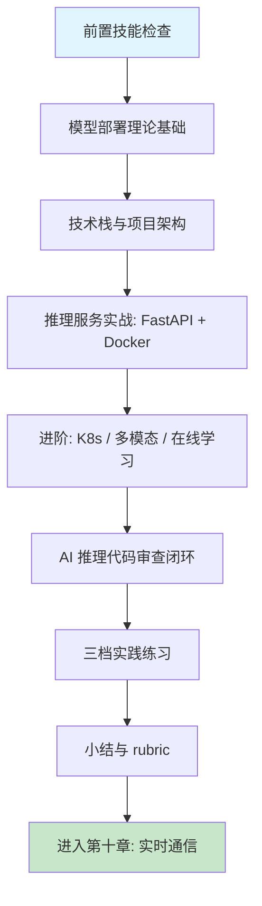

# 第九章 AI 模型集成与智能应用开发

## 1. 学习目标

本章把前两部分建立的工程化技能延伸到 AI 模型的生产化部署：从本地训练好的模型到容器化推理 API，再到云端弹性推理集群。完成本章学习后，大家将能够：用 Docker 把 PyTorch / TensorFlow 模型封装为可水平扩展的 RESTful 推理服务；设计包含模型版本管理、A/B 测试与灰度发布的生产级部署流水线；用四步审查法识别 AI 推理服务中的输入校验缺失、显存泄漏、冷启动延迟、模型版本回滚困难、推理结果非确定性五大典型陷阱；将本章产出的推理服务审查清单沉淀为团队级 Skill，作为后续推荐系统、对话系统、多模态服务的复用资产。

### 1.1 学习路径图



### 1.2 预期学习成果

本章结束时将形成四份可验证的交付物：一个 Docker 化的 PyTorch / TensorFlow 推理服务（含 RESTful API、输入 tensor shape / dtype 校验、健康检查 `/healthz` + `/readyz` 双探针、Prometheus `/metrics` 端点）；一份模型版本管理与灰度发布方案（含 MLflow 模型注册表、A/B 流量分配、一键回滚脚本）；一份针对 AI 生成推理代码的"三类边界测试记录"（空 body / 错误 shape / 超大输入，每条都有 curl 复现脚本与状态码截图）；一份推理服务审查 Skill 草稿（至少 5 条规则覆盖输入校验 / 显存释放 / 版本管理 / 限流 / 监控埋点）。

---

## 2. 前置技能检查

本章假设第二部分四章已完成，且对深度学习框架与容器化技术有可独立排查问题的能力。任一维度缺失都会导致 AI 生成的推理代码审查失效。

### 2.1 环境与能力自检

| 维度                 | 必备能力                                                                       | 自检方法                                                   |
| :------------------- | :----------------------------------------------------------------------------- | :--------------------------------------------------------- |
| **第二部分全部技能** | 前端 / 后端 / 数据库 / 安全四章产出的提示词模板与审查清单                      | 手头有 §8 沉淀的安全审查 Skill 与 curl 边界测试脚本        |
| **Python 与 ML 库**  | NumPy / Pandas / Scikit-learn 操作；PyTorch 或 TensorFlow 至少二选一可独立训练 | 能用 PyTorch / TF 加载预训练模型并跑一次 inference         |
| **REST API**         | 第六章 Express / Flask 章节产物可作集成对象                                    | 能用 FastAPI 写 `/predict` 端点并返回 JSON                 |
| **Docker**           | 镜像构建、多阶段构建、`docker compose up` 启停                                 | 能写一个 GPU 镜像（`nvidia/cuda` 基础）并跑通 `--gpus all` |
| **模型推理基础**     | tensor shape / dtype / device 概念；CPU vs GPU 推理差异                        | 能解释为什么同一模型在不同 GPU 上结果会有微小差异          |
| **GPU / CUDA 基础**  | `nvidia-smi` 读懂显存与利用率；CUDA OOM 排错                                   | 能用 `torch.cuda.memory_summary()` 定位显存泄漏            |
| **MLOps 概念**       | 模型版本、特征存储、模型监控、数据漂移                                         | 能说出 MLflow / DVC / Feast / Evidently 各自解决什么问题   |
| **Trae Skill 系统**  | 能创建 / 调用 / 修改 Skill                                                     | 在第二部分 §8.3.2 已沉淀过至少一条 Skill                   |

### 2.2 代码阅读自测

请确认能在 30 秒内读懂以下两段代码——它们代表本章默认的推理服务基线水平。读不懂的部分需要回到 PyTorch 官方教程或 FastAPI 文档补齐。

```python
# FastAPI + PyTorch 推理端点（含输入校验与显存安全释放）
from fastapi import FastAPI, HTTPException
from pydantic import BaseModel, Field
import torch

app = FastAPI()
model = torch.jit.load("model.pt").eval().to("cuda")  # ✅ 启动时预加载

class Req(BaseModel):
    features: list[float] = Field(min_length=128, max_length=128)

@app.post("/predict")
async def predict(req: Req):
    try:
        x = torch.tensor(req.features, dtype=torch.float32).unsqueeze(0).cuda()
        with torch.inference_mode():           # ✅ 关闭 grad，省显存
            logits = model(x)
        return {"prob": torch.softmax(logits, dim=-1).tolist()[0]}
    except torch.cuda.OutOfMemoryError:
        torch.cuda.empty_cache()                # ✅ 异常路径释放
        raise HTTPException(status_code=503, detail="GPU OOM")
```

```dockerfile
# 多阶段构建 + 非 root 用户 + 健康检查
FROM nvidia/cuda:12.4.0-runtime-ubuntu22.04 AS base
RUN useradd -m -u 1001 inference
USER inference                                  # ✅ 非 root
WORKDIR /app
COPY --chown=inference:inference requirements.txt .
RUN pip install --no-cache-dir -r requirements.txt
COPY --chown=inference:inference . .
HEALTHCHECK --interval=30s --timeout=5s --retries=3 \
  CMD curl -fsS http://localhost:8000/readyz || exit 1
CMD ["uvicorn", "app.main:app", "--host", "0.0.0.0", "--port", "8000"]
```

> 任一项不达标请回到对应章节排查；推理服务的审查依赖对 tensor、显存、容器三层概念的同时掌握。

---

## 3. 理论基础：AI 模型部署的策略与陷阱

推理代码的审查标准比第二部分更高——一个未释放的显存或一处缺失的 shape 校验会在生产环境放大成为整批 GPU 雪崩。理解以下三组概念，是接受 AI 生成的推理代码之前必须建立的判断力。

### 3.1 模型部署方案对比：AI 生成策略差异

| 部署方式                | AI 生成质量                 | 典型优势                           | 典型缺陷                                          |
| :---------------------- | :-------------------------- | :--------------------------------- | :------------------------------------------------ |
| **本地 FastAPI**        | 高 — 模式固定，训练数据丰富 | 端点结构正确、Pydantic schema 完整 | **shape / dtype 校验缺失**、异常路径不释放显存    |
| **Docker 容器化**       | 中高 — Dockerfile 范式成熟  | 多阶段构建结构正确、入口正确       | 基础镜像过大（>10GB）、缺 HEALTHCHECK、用 root 跑 |
| **Kubernetes**          | 中 — YAML 多但配置复杂      | Deployment / Service 结构正确      | resources.limits 缺失、liveness vs readiness 混用 |
| **Serverless / 函数**   | 中低 — 平台差异大           | 基础 handler 正确                  | 冷启动 > 30s、超时 < 模型加载耗时、显存配额不足   |
| **Triton / TF-Serving** | 低 — 训练数据稀疏           | 模型仓库布局基本正确               | dynamic batching 配置错误、模型版本路径错乱       |

> **选型铁律**：先用 FastAPI + Docker 跑通业务，再按"流量大→K8s+HPA""低频长尾→Serverless""多模型多版本→Triton"的顺序按需引入。直接让 AI 生成"FastAPI + Triton + K8s + Istio 一锅端"的命中率极低。

### 3.2 AI 生成推理代码的六类高频缺陷

| 类别             | 典型表现                                                              | 如何发现                                                   | 审查优先级 | 修正提示词模板（按 [Ch2 §4.9](../第一部分-Trae基础入门/第二章-基础交互模式.md)）                                                                               |
| :--------------- | :-------------------------------------------------------------------- | :--------------------------------------------------------- | :--------- | :------------------------------------------------------------------------------------------------------------------------------------------------------------- |
| **输入校验缺失** | 不校验 tensor shape / dtype / 数值范围；NaN / Inf 直接进模型          | curl 发空 body / 错误 shape / 超大输入；查 Pydantic schema | **P0**     | 保留 endpoint 路径，加 Pydantic 校验 shape/dtype/数值范围 + 拒 NaN/Inf。不要动模型调用。验证：错 shape 输入返 422 而非 500                                     |
| **显存泄漏**     | 异常路径不 `empty_cache`；保留 grad 图；`tensor.cpu()` 后旧引用未释放 | 长时间压测后 `nvidia-smi` 显存单调上升                     | **P0**     | 保留推理调用，包 `with torch.no_grad():` + finally `torch.cuda.empty_cache()` + del 中间张量。不要动模型权重。验证：1h 压测显存稳定                            |
| **冷启动延迟**   | 模型加载放在 request handler 内；JIT 编译首次触发；权重远程下载       | 首请求耗时 > 平均 10×；`/readyz` 在加载完成前已就绪        | **P0**     | 保留 endpoint 实现，模型加载移到 startup event + `/readyz` 加载完成才返 200。不要动权重路径。验证：首请求耗时 ≈ 平均请求耗时                                   |
| **版本管理缺失** | 模型文件直接覆盖；`/healthz` 不返回模型版本号；无回滚脚本             | `git log models/` 看到二进制 diff；线上无法回滚到旧版本    | **P0**     | 保留模型加载路径，加 `model_version` 字段到 `/healthz` + DVC/MLflow 注册 + rollback.sh。不要动推理逻辑。验证：`/healthz` 返 version；rollback 一条命令切回旧版 |
| **推理非确定性** | 未固定 seed；CUDNN 非 deterministic；浮点累加顺序差异                 | 同一输入多次调用结果不一致；离线评估与线上指标不对齐       | P1         | 保留前向计算，加 `torch.manual_seed(42)` + `cudnn.deterministic=True` + `cudnn.benchmark=False`。不要动算子。验证：同一输入 100 次结果完全一致                 |
| **监控埋点缺失** | 无 Prometheus `/metrics`；无推理时延 / 错误率 / batch size 直方图     | Grafana 面板空白；故障无法回溯 latency 抖动归因            | P1         | 保留 endpoint，加 `prometheus_client` Histogram（latency/error/batch_size）+ `/metrics` 暴露。不要动业务返回。验证：`/metrics` 含三类指标                      |

> **铁律**：每个 AI 生成的推理端点都必须跑过 §7.2 三类边界测试（空 body / 错误 shape / 超大输入）+ §7.3 显存监控测试，全部通过才允许部署。漏掉任意一条都禁止上线。

### 3.3 传统 ML 工程 vs AI 辅助 ML 工程

| 维度         | 传统手动开发                        | AI 辅助开发 (Trae)            | 核心转变                           |
| :----------- | :---------------------------------- | :---------------------------- | :--------------------------------- |
| **API 封装** | 逐步实现 FastAPI / Flask / Pydantic | AI 一次生成完整推理端点       | 从「实现」→「审查 shape / 显存」   |
| **容器化**   | 写 Dockerfile / 多阶段 / 健康检查   | AI 生成多阶段 Dockerfile      | 从「装配」→「审查镜像体积 / 用户」 |
| **K8s 部署** | 写 Deployment / Service / HPA YAML  | AI 一次生成全套 manifest      | 从「编写」→「审查资源 / 探针」     |
| **模型管理** | 手工管理版本 + 注册表               | AI 推荐 MLflow + DVC 工作流   | 从「记录」→「验证回滚链路」        |
| **审查重心** | 检查自己写的逻辑漏洞                | 检查 AI 生成的硬编码 / 弱配置 | 从「自查」→「审它 + 边界测试」     |

---

## 4. 技术栈与项目架构

### 4.1 技术栈选型

下表给出本章默认采用的版本组合。**最低版本**列必须显式写在提示词「约束条件」中，避免 AI 沿用旧 API（如 PyTorch 1.x vs 2.x 的 `torch.compile` 差异、FastAPI 0.95 vs 0.110 的 lifespan API 变更）。

| 技术分类     | 主要技术                                       | 最低版本          | 在本章中的角色                               |
| :----------- | :--------------------------------------------- | :---------------- | :------------------------------------------- |
| **推理框架** | PyTorch 2.3 / TensorFlow 2.16                  | PyTorch 2.3       | PyTorch 2.3 默认 `torch.compile` 提速 1.5-2× |
| **API 框架** | FastAPI 0.110 + Pydantic 2 + Uvicorn 0.30      | FastAPI 0.110     | Pydantic 2 校验性能比 v1 快 5-50×            |
| **模型格式** | TorchScript / ONNX 1.16 / SavedModel           | ONNX 1.16         | 跨框架部署首选 ONNX                          |
| **推理优化** | ONNX Runtime 1.18 / TensorRT 10 / OpenVINO     | ONNX Runtime 1.18 | CPU 推理首选；GPU 推理选 TensorRT            |
| **容器**     | Docker 24 + nvidia/cuda:12.4 base              | Docker 24         | 多阶段构建；最终镜像 < 5GB                   |
| **编排**     | Kubernetes 1.30 + KEDA 2.14                    | K8s 1.30          | KEDA 支持基于 GPU 利用率的自动扩缩容         |
| **模型注册** | MLflow 2.13 + DVC 3.50                         | MLflow 2.13       | 版本化模型 + 实验追踪                        |
| **特征存储** | Feast 0.40                                     | Feast 0.40        | 在线 / 离线特征一致性                        |
| **监控**     | Prometheus + Grafana + Evidently 0.4           | Evidently 0.4     | 数据漂移与模型性能监控                       |
| **数据库**   | PostgreSQL 16（复用 Ch7）+ Redis 7（复用 Ch8） | PG 16 / Redis 7   | 用户特征 + 推理结果缓存                      |

**选型原则**：可观测优先（默认集成 Prometheus + Evidently，禁止盲投）、版本化（模型 + 特征 + 代码三者强制版本化）、可回滚（部署即提供回滚脚本，不允许只有"前进"按钮）、轻镜像（基础镜像 `runtime` 而非 `devel`，最终 < 5GB）。

### 4.2 项目架构

本章实战项目 `ai-recommendation-service` 在 Ch6 后端 API 与 Ch7 数据 schema 基础上扩展，形成 Part-3 起点。

```bash
ai-recommendation-service/
├── README.md                       # 项目总览 + 跨章节集成说明
├── docker-compose.yml              # 复用 Ch7/Ch8 的 PG + Redis 容器
├── .env.example                    # MODEL_VERSION / MLFLOW_URI / DB / REDIS
├── docs/
│   ├── model-card.md               # 模型卡：性能指标、训练数据、已知偏差
│   └── runbook.md                  # 部署 / 回滚 / OOM 应急剧本
├── app/                            # §5.1 推理服务
│   ├── main.py                     # FastAPI 入口 + lifespan 预加载模型
│   ├── api/
│   │   └── predict.py              # /predict / /healthz / /readyz / /metrics
│   ├── inference/
│   │   ├── loader.py               # 模型加载 + warmup
│   │   ├── pipeline.py             # 预处理 + 推理 + 后处理
│   │   └── safety.py               # shape / dtype / NaN 校验
│   └── metrics.py                  # Prometheus 直方图 / 计数器
├── ml/                             # §5.2 模型训练（参考实现）
│   ├── train.py                    # 训练 + MLflow 注册
│   └── eval.py                     # 离线评估 + 数据漂移基线
├── deployment/                     # §6 K8s / Helm / KEDA
│   ├── helm/                       # Helm chart
│   └── kustomize/                  # 多环境覆盖
├── tests/
│   ├── unit/                       # 单元测试
│   ├── integration/                # 含真实模型加载
│   └── boundary/                   # §7.2 三类边界测试
└── .github/workflows/              # 安全 + 模型评估 + 镜像扫描
```

---

## 5. FastAPI + Docker 推理服务实战

本节走通推理服务的核心三件套：FastAPI 端点封装、模型加载与显存安全、Docker 多阶段构建。其他场景（K8s / Triton / 在线学习 / 多模态）在 §6 集中处理。

### 5.1 FastAPI 推理端点

#### 5.1.1 提示词模板

```text
为 ai-recommendation-service 实现 FastAPI + PyTorch 推理端点，要求：

【模块边界】
- 文件：app/main.py / app/api/predict.py / app/inference/{loader,pipeline,safety}.py
- 集成 Ch7 PostgreSQL（user_features 表）+ Ch8 JWT 认证

【推理硬约束】
- 模型加载：FastAPI lifespan 启动钩子；TorchScript .pt；warmup 跑 3 次 dummy input
- 输入校验：Pydantic 2 schema；features 长度固定 128；float32 范围 [-10, 10]；拒绝 NaN/Inf
- 推理：torch.inference_mode() 包裹；显式 .to("cuda") 与 .cpu() 释放
- 异常：torch.cuda.OutOfMemoryError → empty_cache + 503；其他 → 500 + requestId
- 响应：固定 schema { prob: float[10], model_version: str, latency_ms: float }

【可观测】
- /healthz：进程存活
- /readyz：模型加载完成 + warmup 通过
- /metrics：Prometheus 直方图 inference_latency_ms（buckets: 5/10/25/50/100/250/500/1000）
                                          + 计数器 inference_errors_total{type}

【生成约束】
- 输出 diff，不出整段代码
- 每个端点配套至少 3 条 pytest 测试（正常 / 错误 shape / 显存 OOM mock）
```

#### 5.1.2 AI 生成的推理端点（带审查标注）

下面是 Trae 通常会生成的代码。**注释标出 AI 做对的地方与遗漏的地方**——审查闭环不是"看 AI 写了什么"，而是"看 AI 漏了什么"。

```python
# app/api/predict.py
from fastapi import APIRouter, Depends, HTTPException
from pydantic import BaseModel, Field, field_validator
import torch, time, math

router = APIRouter()

class PredictReq(BaseModel):
    features: list[float] = Field(min_length=128, max_length=128)  # ✅ 长度固定
    @field_validator("features")
    def no_nan(cls, v):
        if any(math.isnan(x) or math.isinf(x) for x in v):           # ✅ 拒绝 NaN/Inf
            raise ValueError("features contain NaN/Inf")
        return v

@router.post("/predict")
async def predict(req: PredictReq, model=Depends(get_model)):
    start = time.perf_counter()
    try:
        x = torch.tensor(req.features, dtype=torch.float32).unsqueeze(0).cuda()
        with torch.inference_mode():                                  # ✅ 关闭 grad
            logits = model(x)
        prob = torch.softmax(logits, dim=-1).cpu().tolist()[0]        # ⚠️ AI 经常遗漏：cpu() 后原 cuda tensor 应显式 del
        latency_ms = (time.perf_counter() - start) * 1000
        INFER_LATENCY.observe(latency_ms)                              # ✅ 监控埋点
        return {"prob": prob,
                "model_version": MODEL_VERSION,                       # ✅ 版本号回显
                "latency_ms": latency_ms}
    except torch.cuda.OutOfMemoryError:
        torch.cuda.empty_cache()                                       # ✅ 异常路径释放
        INFER_ERRORS.labels(type="oom").inc()
        raise HTTPException(503, "GPU OOM")
    # ⚠️ AI 经常遗漏：捕获通用 Exception 并打 inference_errors_total{type=unknown}，
    #    否则 Grafana 错误率面板会出现"沉默失败"
```

**审查发现**：AI 正确实现了 Pydantic schema、NaN 校验、`inference_mode`、版本号回显、OOM 显存释放、Prometheus 埋点；但 (1) `tensor.cpu().tolist()` 后未 `del x` 与 `torch.cuda.empty_cache()`，长时压测会显存爬升；(2) 缺通用 `Exception` 兜底导致非 OOM 错误"沉默失败"；(3) `Depends(get_model)` 默认每次 resolve 一次，应改为模块级单例 + lifespan 加载。三处都需要在第二轮提示词中显式要求补齐。

### 5.2 Dockerfile 多阶段构建

#### 5.2.1 提示词模板

```text
为 ai-recommendation-service 写多阶段 Dockerfile，要求：

【镜像约束】
- 基础镜像：nvidia/cuda:12.4.0-runtime-ubuntu22.04（runtime 而非 devel）
- 用户：UID/GID = 1001 inference 用户，禁止 root 启动
- 模型权重：构建期通过 ARG MODEL_S3_URI 拉取；权重文件 chown 给 inference 用户
- 最终镜像 < 5GB；Trivy 扫描必须 0 个 HIGH/CRITICAL 漏洞

【启动行为】
- HEALTHCHECK：每 30s 调 /readyz
- CMD：uvicorn 4 worker；--limit-concurrency 50 防雪崩
- 环境变量：MODEL_VERSION 必须从镜像 LABEL 读取，禁止硬编码

【生成约束】
- 多阶段：builder（pip install + 模型下载） + runtime（仅复制必要文件）
- 输出 diff；附带一份 docker buildx build + docker compose up 的验证脚本
```

#### 5.2.2 关键审查点

| 维度            | AI 默认输出                         | 标准输出                                                 |
| :-------------- | :---------------------------------- | :------------------------------------------------------- |
| **基础镜像**    | `nvidia/cuda:devel`（>15GB）        | `nvidia/cuda:runtime`（< 3GB）                           |
| **用户**        | 默认 root                           | `useradd -m -u 1001 inference` + `USER inference`        |
| **HEALTHCHECK** | 缺失                                | `CMD curl -fsS http://localhost:8000/readyz \|\| exit 1` |
| **模型权重**    | 直接 COPY 进镜像                    | builder 阶段 ARG 拉取，runtime 阶段 `--from=builder`     |
| **依赖安装**    | `pip install` 不带 `--no-cache-dir` | `pip install --no-cache-dir`，最终镜像减 200MB+          |
| **入口命令**    | `python main.py`（开发模式）        | `uvicorn ... --workers 4 --limit-concurrency 50`         |

> **镜像审查铁律**：每次构建后立刻跑 `docker images | grep ai-rec` 确认 < 5GB，再跑 `trivy image` 确认 0 个 HIGH/CRITICAL。任意一条不达标，回到提示词补 `--no-cache-dir` 或切 base image。

---

### 5.3 Vibe Coding 循环实录：OpenAI 调用重试退避修正

> **修正语法**：「修正提示词」按 [Ch2 §4.9 修正提示词语法](../第一部分-Trae基础入门/第二章-基础交互模式.md) 模板；3 轮未收敛触发 §4.10。模式选择查 [Ch1 §5.4](../第一部分-Trae基础入门/第一章-Trae简介与环境配置.md)。

| 轮次 | AI 输出摘要                                        | 发现的缺陷                         | 修正提示词（按 §4.9）                                                                                                                                                               | 验证信号                    |
| :--- | :------------------------------------------------- | :--------------------------------- | :---------------------------------------------------------------------------------------------------------------------------------------------------------------------------------- | :-------------------------- |
| R1   | `client.chat.completions.create(...)` 裸调用无重试 | 上游 429 / 5xx 直接报错，SLO 损失  | 保留 callOpenAI 接口签名与返回类型，修复调用项：用 tenacity 包裹 3 次指数退避，初始 1s ×2。原因：OpenAI 429 / 503 常见且可重试。不要动接口签名。验证：模拟 2 次 429 后第 3 次返 200 | mock 2 次 429 后返 200      |
| R2   | 重试间隔无 jitter                                  | 100 个客户端同时重试 → 雪崩        | 保留 3 次退避策略，修复 jitter：每次等待加±20% 随机偏移。原因：同步重试会造成质数雪崩。不要动重试次数。验证：100 客户端重试时间序列标准差 > 0.1s                                    | 100 客户端重试标准差 > 0.1s |
| R3   | 遇 401 也重试                                      | 付费 quota 被无意义的 401 重试压耐 | 保留 jitter 与退避，修复重试条件：只在 status ∈ {429, 500, 502, 503, 504} 重试，其他立即 raise。原因：401 / 400 不会因重试变成功。不要动退避逻辑。验证：mock 401 后 0 重试          | mock 401 后 0 重试          |

> **收敛信号**：3 次退避 + jitter + 条件化重试。如未收敛触发 §4.10 信号 1：拆 prompt 为「添加退避」 / 「加 jitter」 / 「状态码筛选」三轮。

---

## 6. 进阶：K8s、模型版本管理、多模态、在线学习

六类进阶场景的提示词共享同一范式："核心推理服务（§5）跑通后，按需引入"。下表给出关键差异点与精简提示词。

### 6.1 进阶场景速查表

| 场景                | 适用条件                           | 关键差异                                                           | 核心提示词（精简版）                                                                                                       |
| :------------------ | :--------------------------------- | :----------------------------------------------------------------- | :------------------------------------------------------------------------------------------------------------------------- |
| **K8s + KEDA**      | 流量波动大 / 多副本 / GPU 共享     | Deployment + GPU resources.limits + KEDA ScaledObject              | `用 K8s 1.30 + KEDA 2.14 部署：Deployment 限 nvidia.com/gpu=1，KEDA 按 P95 延迟 > 200ms 扩容，最大 10 副本，最小 1 副本`   |
| **MLflow 版本管理** | 多模型版本 / A/B / 回滚            | MLflow Tracking Server + Model Registry + 灰度阶段（Staging/Prod） | `用 MLflow 2.13 注册模型：训练完成自动登记 Run + Model Version；线上 /predict 通过 MODEL_STAGE=Production 拉取最新版本`    |
| **A/B 测试 / 灰度** | 新模型上线 / 多版本对比            | 流量切分（按 user_id hash）+ 双跑 + 指标对齐                       | `按 user_id % 100 < 10 的 10% 流量走模型 v2，其余走 v1；记录 model_version 到 Prometheus label，Grafana 对比 P95 / 准确率` |
| **Triton 推理服务** | 多模型 / 多框架 / dynamic batching | model_repository 布局 + config.pbtxt + dynamic_batching            | `用 Triton 24.05：模型仓库放 v1/model.onnx + config.pbtxt（max_batch_size=32, preferred_batch_size=[8,16]，超时 50ms）`    |
| **在线学习 / 实时** | 用户行为流 / 强反馈循环            | Kafka + Flink / Bytewax + 增量训练 + 影子模型                      | `用 Kafka 7.6 收 user_click 事件，Bytewax 0.19 流式聚合，每 1h 触发 LightFM partial_fit；新模型先做影子推理对比再上线`     |
| **多模态推荐**      | 文本 + 图像 + 视频混合             | CLIP / BLIP-2 / Sentence-Transformers + 向量检索（Faiss / Milvus） | `用 sentence-transformers 5 + CLIP 抽取文本 / 图像向量；Milvus 2.4 存向量；推荐时召回 top-200 → 精排 top-10`               |

### 6.2 进阶提示词使用约定

进阶场景必须满足三个条件，否则 AI 输出几乎不可用：

1. **承接已有项目**：明确"在 §5 已生成的推理服务基础上扩展"，否则 AI 会重写已有结构导致冲突。
2. **量化目标**：写明 P95 延迟阈值、扩容触发条件、模型版本切换比例、向量召回数量，避免模糊描述。
3. **审查检查点**：在提示词末尾追加"输出后对照 §3.2 六大缺陷自检"，AI 会主动给出 checklist。

> 不要在第一轮就让 AI 生成"K8s + Triton + 在线学习 + 多模态"四合一栈——上下文超限会导致每个模块都做不彻底。逐个引入、每次审查通过后再叠加是更稳妥的做法。

### 6.3 性能与稳定性基线

| 指标               | 目标值（默认场景）               | 测量工具                            | 主要优化手段                            |
| :----------------- | :------------------------------- | :---------------------------------- | :-------------------------------------- |
| **推理 P95 延迟**  | < 100ms（CPU）/ < 30ms（GPU）    | Prometheus 直方图 + Grafana         | torch.compile / ONNX Runtime / TensorRT |
| **推理 P99 延迟**  | < 250ms（CPU）/ < 80ms（GPU）    | 同上                                | dynamic batching + warmup               |
| **GPU 利用率**     | > 60%（推理高峰）                | `nvidia-smi dmon` / DCGM exporter   | dynamic batching；多模型共置            |
| **GPU 显存稳定性** | 24h 压测显存波动 < 5%            | `torch.cuda.memory_stats()` 趋势    | empty_cache 与 `del` 显式释放           |
| **模型 QPS**       | > 200（CPU 单卡）/ > 2000（GPU） | autocannon / locust                 | batching + 异步                         |
| **冷启动**         | < 30s（含模型加载 + warmup）     | `time docker run` + `/readyz` 轮询  | 镜像层缓存 + 模型文件预下载到镜像       |
| **错误率**         | < 0.1%                           | Prometheus `inference_errors_total` | 输入校验 + OOM 兜底                     |

---

## 7. AI 生成的推理代码审查

### 7.1 四步审查清单（推理服务特化）

回顾第一章 §7 的「四步审查法」。推理代码的审查标准比第二部分更高——一行漏审都可能导致整批 GPU 雪崩。

| 步骤         | 推理服务特定检查                                                                         |
| :----------- | :--------------------------------------------------------------------------------------- |
| **正确性**   | tensor shape / dtype / NaN 是否校验？输出 schema 是否固定？模型版本号是否回显？          |
| **安全性**   | 推理端点是否有认证？CUDA 错误是否暴露给用户？模型权重 S3 URI 是否走 IAM？                |
| **性能**     | 模型是否启动时预加载 + warmup？是否启用 inference_mode？是否 torch.compile / ONNX 优化？ |
| **可维护性** | 模型版本是否在 `/healthz` 返回？回滚脚本是否就绪？数据漂移是否有 Evidently 监控？        |

### 7.2 三类边界测试：必跑的 curl 验收

在接受 Trae 生成的任何推理端点之前，依次跑完以下三类边界；任意一条失败都禁止部署。

```bash
# 边界 1：空 body —— 必须 422，不应是 500
curl -i -X POST http://localhost:8000/predict \
     -H "Content-Type: application/json" -d '{}'
# 期望：HTTP/1.1 422 + body 提示 features required

# 边界 2：错误 shape —— features 长度 = 64（应为 128）
curl -i -X POST http://localhost:8000/predict \
     -H "Content-Type: application/json" \
     -d "{\"features\":$(python -c 'import json;print(json.dumps([0.1]*64))')}"
# 期望：HTTP/1.1 422 + body 提示 length must be 128

# 边界 3：超大输入 —— features 数值 = NaN 或 Inf
curl -i -X POST http://localhost:8000/predict \
     -H "Content-Type: application/json" \
     -d "{\"features\":$(python -c 'import json;print(json.dumps([float(\"nan\")]*128))')}"
# 期望：HTTP/1.1 422 + body 提示 features contain NaN/Inf
```

### 7.3 显存监控测试（24h 压测）

```bash
# 1. 启动服务并记录基线显存
docker compose up -d
GPU_BASELINE=$(nvidia-smi --query-gpu=memory.used --format=csv,noheader,nounits)

# 2. 24h 持续压测
locust -f tests/load.py --headless -u 50 -r 10 -t 24h --host http://localhost:8000

# 3. 检查显存波动（必须 < 5% 基线）
GPU_NOW=$(nvidia-smi --query-gpu=memory.used --format=csv,noheader,nounits)
echo "drift = $(echo "scale=4; ($GPU_NOW - $GPU_BASELINE) / $GPU_BASELINE * 100" | bc) %"
```

> **铁律**：边界测试 + 24h 显存压测全部通过才能进生产；任意一条不通过整个推理服务作废重新审查——这是"FastAPI 单测过、生产 OOM"的最常见漏洞。

### 7.4 扫到问题后用什么提示词改？

上面 §7.2 / §7.3 只识别「失败」；下一步必须按统一语法把意图写回 AI（参照 [Ch2 §4.9](../第一部分-Trae基础入门/第二章-基础交互模式.md)）。

| 测试命中                          | 命中后修正提示词模板                                                                                                                                                                                                    |
| :-------------------------------- | :---------------------------------------------------------------------------------------------------------------------------------------------------------------------------------------------------------------------- |
| 边界 1：空 body 返 500            | 保留 `/predict` 路径与响应 schema，body 用 `pydantic.BaseModel` 强制 `features: list[float]` 必填，缺字段返 `422`。不要动模型加载逻辑。验证：`curl -d '{}'` 返 422 + `detail` 提示 `features required`。                |
| 边界 2：错误 shape 返 500         | 保留 features 字段名，pydantic `validator` 校验 `len(features)==128`，否则返 `422`。不要动 dtype。验证：长度 64 输入返 422 + 提示 `length must be 128`。                                                                |
| 边界 3：NaN/Inf 返 500 或污染推理 | 保留 inference 调用，前置 `np.isfinite(x).all()` 校验，不通过返 `422`。不要动 model.forward。验证：NaN 输入返 422，GPU 内存无突增。                                                                                     |
| 24h 显存漂移 > 5%                 | 保留模型加载位置与版本，推理路径包 `with torch.inference_mode()`，每批末 `del intermediate; torch.cuda.empty_cache()`；KV cache 设 `max_kv_size`。不要动 `batch_size`。验证：24h locust 后 `nvidia-smi` 显存漂移 < 1%。 |

> 3 轮未收敛触发 [§4.10](../第一部分-Trae基础入门/第二章-基础交互模式.md) 的「换模式 / 缩范围 / 拆步骤」。

---

## 8. 实践练习

以下练习按难度递增分三档，要求**自己编写提示词**。每完成一项，按 §3.2 六类缺陷与 §7.2 三类边界测试逐项验证。

### 8.1 基础题：单模型推理实战

#### 8.1.1 ResNet-18 图像分类服务

**要求**：基于 §5 模板实现 `POST /classify`：接收 base64 编码图像，返回 ImageNet 1000 类 top-5 标签。Pydantic 校验 base64 长度 < 4MB；推理用 `torch.inference_mode`；启动时加载 + warmup；`/metrics` 暴露推理时延直方图。

**你的任务**：自己写提示词（参考 §5.1.1 模板），提交给 Trae，对照 §3.2 六大缺陷与 §7.2 三类边界测试，记录至少一处需要修复的问题。

#### 8.1.2 Dockerfile 多阶段构建

**要求**：为 §8.1.1 服务写多阶段 Dockerfile，最终镜像 < 4GB；非 root 用户；HEALTHCHECK 通过。

**你的任务**：让 AI 生成 Dockerfile，独立跑 `trivy image` 扫描，记录修复 ≥ 1 个 HIGH 漏洞的过程。

### 8.2 进阶题：多组件协同与压测

#### 8.2.1 K8s + KEDA 自动扩缩容

**要求**：部署 §8.1 服务到 K8s 1.30；GPU resources.limits = 1；KEDA 按 P95 延迟 > 200ms 扩容；最小 1 副本，最大 10 副本。

**安全验收**：用 locust 50 并发持续 10 分钟，必须观察到 HPA 从 1 → ≥ 4 副本的扩容事件，且服务 P95 < 250ms。

#### 8.2.2 MLflow A/B 灰度发布

**要求**：训练 v1（baseline）和 v2（new）两个模型；MLflow 注册；服务通过 `MODEL_STAGE` env 切换；按 user_id % 100 < 10 走 v2；Prometheus 双指标对比。

**安全验收**：Grafana 上能看到 v1 vs v2 的 P95 延迟与准确率两条曲线；执行回滚脚本后流量 100% 回到 v1，耗时 < 1 分钟。

### 8.3 开放题：AI 输出审查与 Skill 沉淀

#### 8.3.1 推理服务缺陷命中表

**要求**：让 Trae 生成 5 个推理端点（/predict / /batch_predict / /healthz / /readyz / /reload_model），**不告诉 AI 任何最佳实践**。然后用 §3.2 六大缺陷 + §7.2 三类边界测试 + §7.3 显存压测逐项检查，统计 AI 各类缺陷命中率。

**交付物**：一份 5×6 的"端点 × 缺陷"命中表 + 每条缺陷的复现脚本 + 修复 patch。

#### 8.3.2 推理审查 Skill 草稿

**要求**：基于 §8.1 / §8.2 / §8.3.1 产出，沉淀一份团队级 Trae Skill，至少包含 5 条审查规则覆盖输入校验 / 显存释放 / 版本号回显 / `/readyz` 正确性 / 监控埋点。Skill 应能在 AI 生成推理代码时自动触发并返回 checklist。

**交付物**：一个可调用的 Skill 文件 + 一份不超过 800 字的使用说明，作为团队跨项目复用资产。

> 三档练习产出的 Skill 与命中表会作为后续第十至十二章的复用输入；请认真完成并归档。

---

## 9. 小结

### 9.1 核心收获

本章以 FastAPI + Docker + 推理服务为主线，把第二部分积累的提示词工程、代码审查、curl 边界测试能力延伸到 AI 模型部署这一新场景。核心收获包括：**AI 生成推理代码的质量分布两极分化**——FastAPI 端点 / Pydantic schema 等模式固定的部分准确率高，显存释放 / 模型版本管理 / `/readyz` 探针等 AI / MLOps 知识相关的部分错误率显著上升；**推理服务审查必须落到三类边界 + 24h 显存压测**——空 body / 错误 shape / NaN 三条边界与显存波动 < 5% 是底线；**模型版本必须从代码 / 镜像 / 注册表三层版本化**——`/healthz` 回显 + MLflow 注册 + 镜像 LABEL 三者一致才允许上线；**推理提示词必须显式约束运行时配置**——`torch.inference_mode` / Pydantic 2 / 多阶段 Dockerfile / 非 root 用户必须写在「约束条件」中，否则 AI 会回退到训练模式默认值；**Skill 沉淀仍是最有价值的资产**——把六类缺陷 / 三类边界 / 显存压测固化为可触发的 Skill 规则，能让团队所有人复用本章训练成果。

### 9.2 推理服务能力自评 rubric

请用以下标准为自己的推理服务交付能力打分（1-5 分），并记录"距离 5 分还差什么"。

| 维度             | 1 分（陌生）               | 3 分（可用）                              | 5 分（熟练）                                             | 你的得分 |
| :--------------- | :------------------------- | :---------------------------------------- | :------------------------------------------------------- | :------- |
| **API 封装**     | 只能复制粘贴 AI 的 FastAPI | 能独立写 Pydantic 校验 + lifespan 预加载  | 能根据吞吐 / 延迟目标设计 batching / 异步 / 显存回收策略 | \_\_ / 5 |
| **容器化**       | 不知道镜像层与缓存的区别   | 能写多阶段 Dockerfile 并切换 runtime base | 能让最终镜像 < 5GB 且 Trivy 0 HIGH                       | \_\_ / 5 |
| **K8s / 编排**   | 看不懂 Deployment YAML     | 能配置 GPU resources.limits 与 HPA        | 能用 KEDA 按 P95 延迟扩容并设计回滚策略                  | \_\_ / 5 |
| **模型版本管理** | 直接覆盖模型文件           | 用 MLflow 注册并能回滚                    | 能设计灰度 + 影子模型 + 一键回滚的完整版本工作流         | \_\_ / 5 |
| **审查意识**     | 信任 AI 的推理代码         | 能识别缺 shape 校验与缺 OOM 兜底          | 能跑完 §7.2 三类边界 + §7.3 24h 显存压测 + 沉淀 Skill    | \_\_ / 5 |

**判定规则**：总分 ≥ 20 可直接进入第十章；15-19 建议针对最低分维度做一次专题复习；< 15 应重做 §7.2 三类边界测试 + §7.3 显存压测。

---

## 10. 延伸阅读

以下资源覆盖推理框架与服务化、模型工程化与 MLOps、AI 系统观测与安全三条主线，对应本章 §3-§7 的关键知识点。

### 10.1 推理框架与服务化

- **PyTorch 2.x 文档**：[https://pytorch.org/docs/stable/](https://pytorch.org/docs/stable/) — `torch.compile` / `inference_mode` / TorchScript 官方一手资料。
- **FastAPI 官方文档**：[https://fastapi.tiangolo.com/](https://fastapi.tiangolo.com/) — Pydantic 2 集成、lifespan、依赖注入是 §5.1 的基础。
- **NVIDIA Triton Inference Server**：[https://docs.nvidia.com/deeplearning/triton-inference-server/user-guide/](https://docs.nvidia.com/deeplearning/triton-inference-server/user-guide/) — 多模型 / 多框架 / dynamic batching 工业级方案。
- **ONNX Runtime**：[https://onnxruntime.ai/docs/](https://onnxruntime.ai/docs/) — 跨框架部署首选；CPU 推理性能优于原生 PyTorch 2-5×。

### 10.2 模型工程化与 MLOps

- **MLflow 文档**：[https://mlflow.org/docs/latest/index.html](https://mlflow.org/docs/latest/index.html) — Tracking / Models / Registry 三件套，§6.1 灰度发布的基础。
- **Google · Rules of Machine Learning**：[https://developers.google.com/machine-learning/guides/rules-of-ml](https://developers.google.com/machine-learning/guides/rules-of-ml) — Google 内部 43 条 ML 工程铁律，对推理工程化有深远影响。
- **Made With ML · MLOps Course**：[https://madewithml.com/](https://madewithml.com/) — 端到端 MLOps 实战课程，覆盖从训练到部署的全链路。
- **Feast Feature Store**：[https://docs.feast.dev/](https://docs.feast.dev/) — 在线 / 离线特征一致性方案。

### 10.3 AI 系统观测与安全

- **Evidently AI**：[https://docs.evidentlyai.com/](https://docs.evidentlyai.com/) — 数据漂移与模型性能监控的开源标杆。
- **Anthropic · Building Effective Agents**：[https://www.anthropic.com/research/building-effective-agents](https://www.anthropic.com/research/building-effective-agents) — Workflow vs Agent 设计模式综述，对应"提示词生成代码 + 边界测试自动验证"的工作流。
- **OWASP Machine Learning Security Top 10**：[https://owasp.org/www-project-machine-learning-security-top-10/](https://owasp.org/www-project-machine-learning-security-top-10/) — ML 系统的 OWASP 视角，覆盖对抗样本、模型偷取、数据投毒等专项风险。
- **Trae 官方文档**：[https://docs.trae.ai/](https://docs.trae.ai/) — Skills 系统是 §8.3.2 推理审查 Skill 的承载平台。

---

> **进入第十章前**：完成 §8 至少一道基础题、一道进阶题、一道开放题；§9.2 rubric 总分必须 ≥ 20；§8.3.2 推理审查 Skill 必须可在 Trae 中调用。本章产出的推理服务（FastAPI 端点 + 多阶段镜像 + K8s manifest + MLflow 注册）会作为第十章实时通信、第十一章数据分析、第十二章微服务的复用基础。
