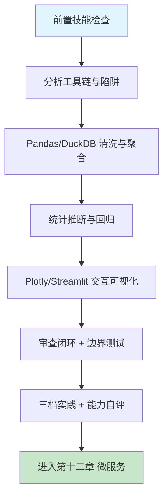

# 第十一章 数据分析与智能可视化

## 1. 学习目标

本章把第七章的关系型数据查询、第十章的事件流，升级为可解释、可复用、可上生产的数据分析能力：从"跑出一个图"演进到"经得起审查的数据闭环"。完成本章学习后，大家将能够：用 pandas 2 + DuckDB + Plotly 构建从清洗到交互可视化的完整流水线；让 AI 生成统计与聚合代码并独立验证其正确性；用四步审查法识别数据错误、统计陷阱、可视化误导、性能反模式四类高频缺陷。

### 1.1 学习路径图



### 1.2 预期学习成果

本章结束时，应交付四份产物：（1）一份从 CSV/PostgreSQL/Kafka 三种数据源出发，输出清洗结果 + 描述统计 + 假设检验 + 交互可视化的 Jupyter Notebook；（2）一个可部署的 Streamlit 自助式分析仪表板（复用第十章 Kafka 事件作为实时数据源）；（3）一份针对 AI 生成分析代码的统计陷阱审查记录（含 p-hacking、Simpson's paradox、可视化误导真实案例至少 3 例）；（4）一个 `analysis-review` Skill 草稿，沉淀本章的危险模式 grep 规则与边界数据测试集。

## 2. 前置技能检查

### 2.1 技能自查清单

在开始本章前，请确认：

- 已完成第七章 SQL 实战，能写 `JOIN` + `GROUP BY` + 窗口函数。
- 已完成第十章 Kafka 实战，能消费 `chat.messages` topic 用作分析输入。
- 熟悉 Python 3 + pandas 基础（read_csv / merge / groupby / pivot）。
- 理解描述统计（均值/中位数/四分位/方差）与基础假设检验（t 检验、卡方检验）。
- 能区分相关性与因果性，听说过 Simpson's paradox 与 p-hacking。

### 2.2 代码自测：能否独立写出最小分析流水线？

在阅读后续章节前，先尝试用 30 行内代码完成以下需求，写不出来再回到第七章/Pandas 文档补基础：

```python
# self_check.py — 从 CSV 到一张可读图的最小流水线
import pandas as pd
import plotly.express as px

df = pd.read_csv("orders.csv", parse_dates=["created_at"])

# 1) 清洗：去掉金额为空 / 负数 / 未来日期的脏数据
df = df.dropna(subset=["amount"])
df = df[(df["amount"] > 0) & (df["created_at"] <= pd.Timestamp.utcnow())]

# 2) 聚合：按周 + 渠道统计 GMV 与订单数
weekly = (df.assign(week=df["created_at"].dt.to_period("W").dt.start_time)
            .groupby(["week", "channel"], as_index=False)
            .agg(gmv=("amount", "sum"), orders=("id", "count")))

# 3) 可视化：分渠道周趋势（y 轴从 0 开始，明确单位与标题）
fig = px.line(weekly, x="week", y="gmv", color="channel",
              title="周 GMV 趋势（单位：元）",
              labels={"week": "周（自然周）", "gmv": "GMV (元)"})
fig.update_yaxes(rangemode="tozero")    # ✅ 防止误导性截断
fig.write_html("weekly_gmv.html")
```

完成自测后再进入下一节。如果对 `parse_dates`、`groupby` 与 `rangemode="tozero"` 三个细节存在困惑，本章对应的审查规则也将无法生效。

---

## 3. 理论基础：AI 生成分析代码的策略与陷阱

### 3.1 分析工具链对比

| 工具                        | 适用场景           | AI 生成质量 | 典型优势                 | 典型缺陷                             |
| :-------------------------- | :----------------- | :---------- | :----------------------- | :----------------------------------- |
| **pandas 2 + PyArrow**      | < 10 GB 单机分析   | 高          | groupby/merge/pivot 准确 | NaN 处理缺失、链式 inplace 误用      |
| **DuckDB**                  | < 1 TB 单机 OLAP   | 中高        | SQL 语法标准、零运维     | 时区处理、ARRAY/STRUCT 嵌套类型      |
| **Polars**                  | 10-100 GB 单机分析 | 中          | lazy + 多核              | API 与 pandas 差异，AI 易混          |
| **Apache Spark**            | 集群级大数据       | 中          | 标准 PySpark 模板        | 数据倾斜分区、shuffle OOM            |
| **Matplotlib**              | 静态出版图         | 中高        | 基本图正确               | 中文字体缺失、tight_layout 漏调用    |
| **Plotly / Plotly Express** | 交互式可视化       | 中高        | px.\* 高层 API 正确      | hovertemplate、坐标轴范围、色盲友好  |
| **Streamlit / Dash**        | 自助式 BI / 应用   | 中高        | 单脚本即仪表板           | session_state 误用、cache 失效条件错 |

> 选型经验：< 10 GB → pandas 2 + Arrow；需要 SQL → DuckDB；> 100 GB → Spark；交付仪表板 → Streamlit；交付报告 → Quarto / Jupyter nbconvert。

### 3.2 分析代码的六类高频缺陷

| 类别             | 典型表现                                                      | 根因                                         | 审查优先级 | 修正提示词模板（按 [Ch2 §4.9](../第一部分-Trae基础入门/第二章-基础交互模式.md)）                                                      |
| :--------------- | :------------------------------------------------------------ | :------------------------------------------- | :--------- | :------------------------------------------------------------------------------------------------------------------------------------ |
| **数据错误**     | NaN 静默传播；类型隐式转换（"0001" → 1）；时区错位            | `read_csv` 不指定 `dtype`/`parse_dates`/`tz` | **P0**     | 保留读入路径，`read_csv` 显式传 `dtype=` / `parse_dates=` / `tz=` 参数。不要动文件路径。验证：`DataFrame.info()` 类型与时区与预期一致 |
| **统计陷阱**     | 多重比较未校正；Simpson's paradox；混淆相关与因果             | 直接看 p<0.05 而不看效应量与置信区间         | **P0**     | 保留检验方法，加 Bonferroni / BH 校正 + 报告效应量与 95% CI。不要动原始检验函数。验证：报告同时含 p 值 + effect size + CI             |
| **聚合错误**     | `mean(rate)` 而非加权平均；`count(*)` 含 NULL；分组维度漏     | AI 默认用 `mean()`，未理解业务口径           | **P0**     | 保留分组键，rate 聚合改 `sum(num)/sum(denom)` 加权平均；`count(*)` 加 `IS NOT NULL`。不要动表名。验证：与 SQL 业务口径结果一致        |
| **可视化误导**   | y 轴不从 0；双 y 轴；3D 饼图；色盲不友好；缺单位              | AI 模板默认未设 `rangemode="tozero"`         | P1         | 保留数据，y 轴加 `rangemode='tozero'` + colorblind palette + 补单位与 legend。不要动数据集。验证：灰度截图仍可区分两组且含单位        |
| **性能反模式**   | for 循环内 `pd.concat`；`apply(axis=1)` 替代向量化；全量 read | AI 直接套官方文档示例，不分数据量            | P1         | 保留逻辑，`pd.concat` 移出 for；`apply(axis=1)` 改向量化运算；大文件用 `chunksize`。不要动输出 schema。验证：1M 行处理 < 5s           |
| **泄漏与硬编码** | DB password / API key 写在 Notebook；样本/测试数据混入训练    | AI 在 Notebook 上下文容易把 secret 当字面量  | P1         | 保留分析逻辑，secret 迁 `.env` + 训测划分用 `random_state`。不要动模型参数。验证：notebook `grep -E "sk-\|password"` 返 0             |

### 3.3 传统数据分析 vs AI 辅助开发

| 维度         | 传统手写                    | AI 辅助（Trae）                               |
| :----------- | :-------------------------- | :-------------------------------------------- |
| 清洗代码     | 重复抄 dropna/fillna/astype | 一句话生成清洗骨架                            |
| 统计选型     | 翻教材选检验方法            | AI 直接给 t 检验/卡方/ANOVA，但常忽略前提假设 |
| 可视化默认值 | 手调坐标轴/颜色/标题        | 默认值多半"看着像"但不严谨（y 轴/单位/色盲）  |
| 业务口径     | 手动对齐指标定义            | AI 不懂业务，会出 `mean(rate)` 这类错误       |
| 注释与解读   | 经常漏写                    | AI 默认会写但内容空泛，需要人工替换为业务解读 |

> 结论：AI 写代码快，但分析的可信度来自审查（口径、假设、单位、范围、色盲、p-hacking）。本章 §7 的四步法和 §3.2 的六类缺陷是这一可信度的具体抓手。

---

## 4. 技术栈与项目架构

### 4.1 技术栈与最低版本

| 层         | 选型                    | 最低版本    | 选型说明                                            |
| :--------- | :---------------------- | :---------- | :-------------------------------------------------- |
| 单机分析   | pandas                  | **2.2+**    | PyArrow backend、`copy_on_write=True`，避免链式赋值 |
| 列存内核   | PyArrow                 | 16+         | pandas 2 的 Arrow backend 必需                      |
| 单机 OLAP  | DuckDB                  | **1.0+**    | 1.0 是稳定 GA 版本，前向兼容                        |
| 大数据     | PySpark                 | 3.5+        | Spark Connect 解耦客户端与集群                      |
| 统计建模   | statsmodels / scipy     | 0.14 / 1.13 | OLS/GLM/假设检验                                    |
| 机器学习   | scikit-learn            | 1.4+        | API 稳定，自动 set_output("pandas")                 |
| 可视化     | Plotly + Plotly Express | **5.20+**   | Plotly Express 模板成熟                             |
| 仪表板     | Streamlit               | **1.32+**   | `st.cache_data` / `st.cache_resource` 区分清晰      |
| Notebook   | JupyterLab              | 4.1+        | 与 Quarto / nbconvert 集成                          |
| 实时数据源 | kafkajs / kafka-python  | 2.0+        | 复用第十章 Kafka topic                              |

> 升级提示：pandas 2 默认仍是 NumPy backend；要享受 Arrow 的零拷贝与字符串性能，必须显式 `pd.options.future.infer_string = True` 或在 `read_csv(..., dtype_backend="pyarrow")`。AI 生成代码经常忘记这一行。

### 4.2 项目目录（复用第七/十章成果）

```text
intelligent-analytics-platform/
├── pyproject.toml            # 锁定 pandas/pyarrow/duckdb/plotly 版本
├── data/
│   ├── raw/                  # 原始数据（gitignore，仅放 README + sample）
│   ├── interim/              # 清洗中间结果（parquet，按日期分区）
│   └── processed/            # 可分析数据集（parquet）
├── notebooks/
│   ├── 01_eda.ipynb          # 探索性分析（含数据质量报告）
│   ├── 02_stats.ipynb        # 假设检验 + 回归
│   └── 03_viz.ipynb          # 交互式可视化与图表导出
├── pipelines/
│   ├── etl_orders.py         # CSV/Postgres → Parquet（DuckDB SQL）
│   └── etl_events.py         # 复用 Ch10 Kafka chat.messages → Parquet
├── app/
│   ├── streamlit_app.py      # 自助式仪表板入口
│   ├── components/           # 复用图表 / 控件
│   └── queries.sql           # DuckDB SQL 仓库（避免散落）
├── tests/
│   ├── test_etl.py           # 含 NaN / 边界 / 时区测试集
│   └── test_stats.py         # 数值稳定性 / 已知答案
└── ops/
    ├── Dockerfile            # python:3.12-slim，固定 pandas/duckdb 版本
    └── prometheus-exporter/  # 数据质量与作业耗时监控
```

> 跨章复用：`pipelines/etl_events.py` 直接消费第十章 `chat.messages` topic（exactly-once 已在 §10 保证）；分析结果可写回第七章 PostgreSQL `analytics.*` schema 供其他服务查询。

---

## 5. 主框架实战：从 CSV 到交互可视化

### 5.1 ETL 与清洗

#### 5.1.1 提示词模板

```text
为 intelligent-analytics-platform 实现 orders 数据 ETL，要求：

1. 输入：data/raw/orders/*.csv（每日一份），字段：id, user_id, channel, amount, created_at, status。
2. 用 DuckDB SQL 完成清洗：
   - 仅保留 status='paid'；
   - amount > 0 且 < 1e7（防极端值）；
   - created_at 解析为 UTC，过滤未来时间；
   - 去重 id（保留 created_at 最新）。
3. 输出：data/processed/orders.parquet，按 dt=created_at::date 分区（snappy）。
4. 同时输出数据质量报告 data/processed/orders_quality.json：
   - 行数、唯一 user_id 数、缺失率、按渠道分布、p99 amount。
5. 失败时退出码非零；用 logging 而非 print；不要硬编码路径，用 argparse。
```

#### 5.1.2 AI 生成结果审查（带 ✅/⚠️ 标注）

```python
# pipelines/etl_orders.py
import argparse, json, logging, sys
from pathlib import Path
import duckdb

def run(raw_dir: Path, out_dir: Path) -> int:
    con = duckdb.connect()                                    # ✅ in-process，无外部依赖
    con.execute("SET TimeZone='UTC';")                        # ✅ 显式 UTC，避免本地时区污染

    con.execute(f"""
        CREATE OR REPLACE TABLE staging AS
        SELECT id, user_id, channel,
               CAST(amount AS DOUBLE) AS amount,
               CAST(created_at AS TIMESTAMPTZ) AS created_at,
               status
        FROM read_csv_auto('{raw_dir}/*.csv',
                           types={{'id':'VARCHAR'}})           -- ✅ 强制字符串 id，避免 "0001" → 1
    """)

    cleaned = con.execute("""
        WITH dedup AS (
            SELECT *, ROW_NUMBER() OVER (PARTITION BY id
                       ORDER BY created_at DESC) AS rn         -- ✅ 同 id 取最新
            FROM staging
            WHERE status = 'paid'
              AND amount > 0 AND amount < 1e7
              AND created_at <= now()                          -- ✅ 过滤未来时间
        )
        SELECT * EXCLUDE (rn) FROM dedup WHERE rn = 1
    """).df()

    # 数据质量报告
    quality = {
        "rows": len(cleaned),
        "unique_users": int(cleaned["user_id"].nunique()),
        "null_rate": cleaned.isna().mean().to_dict(),          # ✅ 每列缺失率
        "by_channel": cleaned["channel"].value_counts().to_dict(),
        "amount_p99": float(cleaned["amount"].quantile(0.99)),
    }
    out_dir.mkdir(parents=True, exist_ok=True)
    cleaned.to_parquet(out_dir / "orders.parquet",
                       partition_cols=["dt"] if "dt" in cleaned else None,
                       compression="snappy")
    (out_dir / "orders_quality.json").write_text(json.dumps(quality, indent=2))
    logging.info("done: %s rows -> %s", len(cleaned), out_dir)
    # ⚠️ AI 经常遗漏：没有给 dt 列做 partition（需要 cleaned["dt"] = cleaned["created_at"].dt.date）
    # ⚠️ AI 经常遗漏：金额单位 / 币种没在 quality 报告中体现，跨币种聚合会失真
    return 0

if __name__ == "__main__":
    logging.basicConfig(level=logging.INFO,
                        format="%(asctime)s %(levelname)s %(message)s")
    ap = argparse.ArgumentParser()
    ap.add_argument("--raw", type=Path, required=True)
    ap.add_argument("--out", type=Path, required=True)
    sys.exit(run(ap.parse_args().raw, ap.parse_args().out))
```

### 5.2 统计推断：t 检验与回归（最容易踩坑的环节）

```python
# notebooks/02_stats.ipynb 节选
import pandas as pd, numpy as np
from scipy import stats
import statsmodels.formula.api as smf

df = pd.read_parquet("data/processed/orders.parquet")

# 1) A/B 单日 GMV 差异：用 Welch's t（不假设方差相等），同时报告效应量与 95% CI
a = df.query("channel == 'A'")["amount"]
b = df.query("channel == 'B'")["amount"]
t, p = stats.ttest_ind(a, b, equal_var=False)               # ✅ Welch
diff = a.mean() - b.mean()
se = np.sqrt(a.var(ddof=1)/len(a) + b.var(ddof=1)/len(b))
ci = (diff - 1.96*se, diff + 1.96*se)                       # ✅ 报告 CI 而不是只看 p
print(f"diff={diff:.2f}, 95%CI={ci}, p={p:.4f}")
# ⚠️ AI 经常遗漏：未做正态性检验（Shapiro / Q-Q 图）；未做多重比较校正（>1 个 metric 时 Bonferroni / FDR）

# 2) 控制 user_age + channel 对 amount 的回归（业务往往要"控制变量"）
model = smf.ols("amount ~ C(channel) + user_age", data=df).fit(
    cov_type="HC3"                                          # ✅ 异方差稳健标准误
)
print(model.summary())
# ⚠️ AI 经常遗漏：残差图、VIF 多重共线性、影响点（Cook's distance）
```

### 5.3 交互可视化与仪表板

```python
# app/streamlit_app.py
import duckdb, pandas as pd, plotly.express as px, streamlit as st

st.set_page_config(page_title="GMV Insight", layout="wide")
st.title("GMV 自助分析")

@st.cache_data(ttl=300)                                      # ✅ 5 分钟缓存
def load(start, end):
    return duckdb.query(f"""
        SELECT date_trunc('day', created_at) AS day, channel,
               SUM(amount) AS gmv, COUNT(*) AS orders
        FROM 'data/processed/orders.parquet'
        WHERE created_at BETWEEN '{start}' AND '{end}'
        GROUP BY 1,2 ORDER BY 1
    """).df()

start = st.date_input("开始", pd.Timestamp.utcnow() - pd.Timedelta(days=30))
end   = st.date_input("结束", pd.Timestamp.utcnow())

df = load(start, end)
fig = px.line(df, x="day", y="gmv", color="channel",
              title="日 GMV 趋势（单位：元，UTC）",
              labels={"day":"日期 (UTC)","gmv":"GMV (元)"})
fig.update_yaxes(rangemode="tozero")                         # ✅ 防 y 轴误导
fig.update_layout(hovermode="x unified")                     # ✅ 同日多渠道悬浮对比
st.plotly_chart(fig, use_container_width=True)

# ⚠️ AI 经常遗漏：未提供色盲友好色板（应使用 px.colors.qualitative.Safe）
# ⚠️ AI 经常遗漏：start > end 时未做参数校验，DuckDB 会返回空结果而无任何提示
```

---

### 5.4 Vibe Coding 循环实录：图表过度绘制修正

> **修正语法**：「修正提示词」按 [Ch2 §4.9 修正提示词语法](../第一部分-Trae基础入门/第二章-基础交互模式.md) 模板；3 轮未收敛触发 §4.10。模式选择查 [Ch1 §5.4](../第一部分-Trae基础入门/第一章-Trae简介与环境配置.md)。

| 轮次 | AI 输出摘要                        | 发现的缺陷                           | 修正提示词（按 §4.9）                                                                                                                                                                                       | 验证信号                 |
| :--- | :--------------------------------- | :----------------------------------- | :---------------------------------------------------------------------------------------------------------------------------------------------------------------------------------------------------------- | :----------------------- |
| R1   | 1M 散点直接 `plt.scatter` 全量绘制 | 浏览器卡死、点重叠成黑块、看不出分布 | 保留数据加载与字段选择不变，修复绘制策略：按时间分钟桶聚合后用 `hexbin` 或 `datashader`。原因：超过 10k 点的散点在屏幕上必然过度绘制（overplotting）。不要改变 X/Y 字段。验证：渲染 < 2s 且密度梯度肉眼可辨 | 渲染 < 2s + 可见密度梯度 |
| R2   | 调色板使用红绿区分两组             | 色盲用户无法区分，灰度打印失真       | 保留聚合方法不变，修复调色板：换为 `viridis` 或 ColorBrewer 的 colorblind-safe 方案。原因：默认红绿对 8% 男性用户不可达。不要动数据维度映射。验证：截图转灰度后两组对比度 > 30%                             | 灰度仍可区分两组         |
| R3   | 缺图例、坐标轴无单位               | 同事不知道 Y 轴是「次/秒」还是「ms」 | 保留图形主体不变，修复元数据：补 `title` / `xlabel`（含单位）/ `ylabel`（含单位）/ `legend`。原因：可视化必须自包含可读。不要动颜色与聚合。验证：单张截图脱离上下文仍能解读                                 | 截图自包含可读           |

> **收敛信号**：性能 + 可达性 + 可读性三层达标。如未收敛触发 §4.10 信号 2（改 A 坏 B：换聚合后图例失效），按「拆步骤」重启——分别提交「聚合」与「美化」两轮独立 PR。

---

## 6. 进阶速查表

### 6.1 进阶场景索引

| 场景                    | 关键技术                               | AI 高频缺陷                            | 建议提示词关键词                            |
| :---------------------- | :------------------------------------- | :------------------------------------- | :------------------------------------------ |
| **大数据集（> 10 GB）** | Polars lazy / DuckDB / PySpark         | 直接 `pd.read_csv` 全量加载 OOM        | "lazy 模式 + 列裁剪 + 谓词下推"             |
| **时间序列预测**        | statsmodels SARIMAX / Prophet / Nixtla | 未做 stationarity 检验、训练集泄漏     | "ADF 检验 + 滚动预测 + walk-forward CV"     |
| **异常检测**            | IsolationForest / STL+残差 / EWM       | 阈值硬编码、未区分 contextual vs point | "动态阈值（k×MAD）+ 业务窗口"               |
| **A/B 实验**            | bootstrap CI / CUPED / 序贯检验        | 偷看导致 α 膨胀                        | "固定样本量 + 提交期分析 + 多重比较 FDR"    |
| **大屏实时监控**        | Kafka → Flink → ClickHouse → Grafana   | 维度爆炸，慢查询                       | "预聚合 + 物化视图 + 索引投影"              |
| **NL2SQL**              | LangChain SQL Agent / DuckDB           | 未做 schema 限制 + SQL 注入            | "白名单 schema + read-only 角色 + 行数限制" |

### 6.2 性能基线（单机 16C / 32 GB 参考）

| 指标                           | 目标值    | 测量方法                                                                        |
| :----------------------------- | :-------- | :------------------------------------------------------------------------------ |
| pandas 2 + Arrow 加载 1 GB CSV | < 8 秒    | `time python -c "import pandas; pandas.read_csv(..., dtype_backend='pyarrow')"` |
| DuckDB 1 亿行 GROUP BY         | < 5 秒    | `EXPLAIN ANALYZE`                                                               |
| Streamlit 首屏渲染             | < 1.5 秒  | `st.cache_data` 命中率 + Lighthouse                                             |
| Notebook 端到端                | < 60 秒   | `papermill --report-mode` 全量重跑                                              |
| 仪表板并发                     | ≥ 50 用户 | locust 压测 + p95 < 2 秒                                                        |

### 6.3 配置 Cheatsheet

```python
# pandas 2 推荐全局配置
import pandas as pd
pd.options.mode.copy_on_write = True                # 避免链式赋值副作用
pd.options.future.infer_string = True               # 默认 PyArrow string
pd.options.display.max_columns = 80
pd.options.display.float_format = "{:,.4f}".format

# DuckDB 推荐
con = duckdb.connect(config={"memory_limit":"24GB",
                             "threads":"16",
                             "preserve_insertion_order":"false"})
```

---

## 7. 审查闭环

### 7.1 四步审查法（数据分析专用）

| 步骤         | 关键检查项                                                                                                              |
| :----------- | :---------------------------------------------------------------------------------------------------------------------- |
| **正确性**   | 是否显式 `dtype`/`parse_dates`/`tz`？聚合维度是否覆盖业务口径？mean vs 加权 mean？JOIN key 类型是否一致？               |
| **安全性**   | DB 连接 / API key 是否在 `.env` 而非 Notebook？是否限制 NL2SQL 为只读角色？是否对外发布 Notebook 时清理了 cell output？ |
| **性能**     | 数据量 > 10 GB 时是否切到 Polars/DuckDB？是否消除 `.apply(axis=1)`？是否在循环内 `concat`？是否用 parquet + 列裁剪？    |
| **可维护性** | 图表是否有标题/单位/坐标轴含义？颜色是否色盲友好？统计结论是否同时报告效应量与 CI？是否记录数据快照版本？               |

### 7.2 三类边界数据测试（AI 最容易遗漏）

```python
# 1) 空集与全 NaN：聚合应返回明确 0/NaN，而不是抛 KeyError
empty = pd.DataFrame({"amount": [], "channel": []})
assert clean(empty).shape[0] == 0

# 2) 时区与未来时间：UTC 跨年、夏令时切换、异常未来戳
t = pd.DataFrame({
    "created_at": pd.to_datetime(["2025-12-31T23:59:59Z",
                                  "2099-01-01T00:00:00Z",      # 未来
                                  "2025-03-30T02:30:00+01:00"]),# DST gap (Europe)
    "amount":[1,2,3], "status":["paid","paid","paid"]})
out = clean(t); assert (out["created_at"] <= pd.Timestamp.utcnow()).all()

# 3) 极端值与浮点累加：1 亿行 + 含 inf/-inf，sum 不应溢出
import numpy as np
big = pd.DataFrame({"amount": np.r_[np.full(10**8, 1.0),
                                    np.array([np.inf, -np.inf])]})
assert np.isfinite(clean(big)["amount"]).all()
```

### 7.3 危险模式扫描

```bash
# 1) 链式赋值（pandas 2 已默认警告，CoW 未开则可能静默失败）
rg -n "\.loc\[.*\]\s*=\s*.+\n.+\.loc\[" notebooks app pipelines

# 2) 循环内 concat（典型反模式）
rg -nU "for .+:\n\s+.*pd\.concat" notebooks app pipelines

# 3) read_csv 未指定 dtype/parse_dates
rg -n "read_csv\([^)]*\)" --multiline | rg -v "dtype|parse_dates|dtype_backend"

# 4) Plotly 未防 y 轴截断
rg -n "px\.(line|bar|area)\b" notebooks app | rg -v "rangemode"

# 5) Notebook 中疑似硬编码 secret
rg -n "(password|secret|api_key|token)\s*=\s*['\"][^'\"]{8,}" notebooks
```

### 7.4 扫到问题后用什么提示词改？

上面 5 条 rg 只识别「位置」；下一步必须按统一语法把意图写回 AI（参照 [Ch2 §4.9](../第一部分-Trae基础入门/第二章-基础交互模式.md)）。

| #   | 命中后修正提示词模板                                                                                                                                                                        |
| :-- | :------------------------------------------------------------------------------------------------------------------------------------------------------------------------------------------ |
| 1   | 保留赋值目标列，链式 `df.loc[m].col = v` → `df.loc[m, 'col'] = v`，并启用 `pd.set_option('mode.copy_on_write', True)`。不要动业务过滤条件。验证：rg 命令返 0；SettingWithCopyWarning 消失。 |
| 2   | 保留循环内派生逻辑，循环外 `pd.concat([list_of_df], ignore_index=True)`。不要动过滤条件。验证：100k 行场景耗时下降 ≥ 5×。                                                                   |
| 3   | 保留 csv 路径与列名，加 `dtype={...}` + `parse_dates=[...]` + `dtype_backend='pyarrow'`。不要动文件路径。验证：`df.dtypes` 全部为期望类型，无 `object` 时间列。                             |
| 4   | 保留图表类型与数据，`fig.update_yaxes(rangemode='tozero', ticksuffix=' 元')` + 色盲友好调色板。不要动 x 轴。验证：截图 y 轴起点 = 0、含单位。                                               |
| 5   | 保留 notebook cell 顺序，secret 迁 `os.environ['XXX']` + `python-dotenv`。不要动业务调用。验证：grep 返 0；`nbconvert` 后 `.html` 不含密钥。                                                |

> 3 轮未收敛触发 [§4.10](../第一部分-Trae基础入门/第二章-基础交互模式.md) 的「换模式 / 缩范围 / 拆步骤」。

---

## 8. 三档实践

### 8.1 基础题（90 分钟，必做）

复刻 §5 主流水线：（1）用 DuckDB 完成 CSV → Parquet 清洗，并产出 `orders_quality.json`；（2）做一次 Welch's t 检验比较两个渠道 GMV，输出 diff、95% CI、p；（3）用 Plotly Express 画分渠道周趋势图，y 轴从 0 开始 + 单位 + 色盲友好色板；（4）跑 §7.2 三类边界测试并提交 pytest 报告。

### 8.2 进阶题（半天，建议完成）

构建可发布的自助分析：（1）在 §5 基础上新增 SARIMAX 月度预测 + 95% 预测区间；（2）将 ETL 改造为消费第十章 Kafka `chat.messages` 的实时 ETL（Kafka → DuckDB），每分钟刷新；（3）部署 Streamlit 仪表板到 Docker，用 locust 压测 50 并发，记录 P95；（4）输出一份 PDF 数据质量月报（Quarto/nbconvert）。

### 8.3 开放题（开放周期）

任选其一深度展开：

- **Simpson's paradox 案例库**：在公开数据集（UCI Adult / Berkeley Admissions）上复现至少 2 个典型悖论，配套可视化与业务解读。
- **NL2SQL 受限仪表板**：用 LangChain + DuckDB read-only role 实现自然语言查询，列出至少 5 个被白名单/限流拦截的危险问句。
- **缺陷命中表 + Skill 沉淀**：基于本章 §3.2 六类缺陷做一次真实 Notebook 审查，记录每条规则的命中次数、false-positive，最终沉淀为 `analysis-review` Skill（含 §7.3 grep + §7.2 边界测试集）。

---

## 9. 小结

数据分析的瓶颈不在写代码，而在三道闸：数据是不是干净（dtype/tz/NaN）、统计是不是诚实（前提假设/效应量/多重比较）、图表是不是无误导（y 轴/单位/色盲）。AI 助手能 30 秒生成一份漂亮 Notebook，但默认值往往在这三道闸上偷工——这正是 §3.2 六类缺陷与 §7.1 四步审查法的存在意义。本章交付的 `analysis-review` Skill、Streamlit 仪表板、Kafka → DuckDB 实时 ETL 将在第十二章微服务（指标埋点 + SLO 仪表板）继续被复用。

### 9.1 章节交付物清单

| 编号   | 交付物                                   | 复用去向                    |
| :----- | :--------------------------------------- | :-------------------------- |
| D-11-1 | DuckDB ETL + 数据质量报告脚本            | Ch12 微服务可观测的指标聚合 |
| D-11-2 | t 检验 + OLS + 边界测试 Notebook         | A/B 实验平台基线            |
| D-11-3 | Streamlit 自助仪表板（Kafka 实时数据源） | Ch12 SLO 大盘原型           |
| D-11-4 | 六类缺陷 grep 规则 + 边界数据集          | `analysis-review` Skill     |

### 9.2 数据分析能力自评 Rubric

| 维度     | 入门（1-2）        | 熟练（3-4）                            | 精通（5）                                       |
| :------- | :----------------- | :------------------------------------- | :---------------------------------------------- |
| 数据清洗 | 能做 dropna/fillna | 能显式 dtype/tz、处理 dedup 与未来时间 | 能设计幂等可重放 ETL（含分区/版本/血缘）        |
| 统计能力 | 会算均值方差       | 能选检验方法 + 报告 CI/效应量          | 能识别 Simpson's paradox / 多重比较 / 共线性    |
| 可视化   | 能画基础图         | y 轴/单位/色盲均到位                   | 设计过支撑决策的可视化叙事（dashboard story）   |
| 工程化   | 单文件 Notebook    | 能 pipeline 化 + 缓存 + 测试           | 能把 Notebook 变成可部署服务并运行在生产 SLO 内 |
| 审查能力 | 会跑 §7.3 grep     | 能识别六类缺陷                         | 能输出可复用 Skill + 团队规约                   |

---

## 10. 延伸阅读

### 10.1 工具与一手文档

- **pandas 2 What's New**：[https://pandas.pydata.org/docs/whatsnew/v2.2.0.html](https://pandas.pydata.org/docs/whatsnew/v2.2.0.html) — Arrow backend、Copy-on-Write 语义。
- **DuckDB Documentation**：[https://duckdb.org/docs/](https://duckdb.org/docs/) — SQL 语法、Parquet 谓词下推、扩展。
- **Polars User Guide**：[https://docs.pola.rs/](https://docs.pola.rs/) — lazy frame、表达式、流式执行。
- **Plotly Python Reference**：[https://plotly.com/python/](https://plotly.com/python/) — Express vs Graph Objects 选用边界。
- **Streamlit Documentation**：[https://docs.streamlit.io/](https://docs.streamlit.io/) — `st.cache_data` 与 `st.cache_resource` 区别。

### 10.2 统计与数据分析（理论与方法）

- **《Python for Data Analysis》（3rd Edition, 2022）— Wes McKinney**：pandas 作者亲笔，pandas 2 章节最权威。
- **《Statistical Rethinking》（2nd Edition）— Richard McElreath**：对效应量、CI、贝叶斯思维的最易读入门。
- **《Causal Inference: The Mixtape》— Scott Cunningham**：相关性 vs 因果性的工程化视角，含代码。
- **Andrew Gelman's Blog**：[https://statmodeling.stat.columbia.edu/](https://statmodeling.stat.columbia.edu/) — p-hacking、forking paths 的真实案例。
- **OpenIntro Statistics（免费 PDF）**：[https://www.openintro.org/book/os/](https://www.openintro.org/book/os/) — 假设检验、回归基础。

### 10.3 可视化与 AI 辅助审查

- **《Storytelling with Data》— Cole Nussbaumer Knaflic**：商业可视化叙事，避免本章 §3.2 的"可视化误导"。
- **ColorBrewer 2.0**：[https://colorbrewer2.org/](https://colorbrewer2.org/) — 色盲友好色板的事实标准。
- **Datawrapper Blog**：[https://blog.datawrapper.de/](https://blog.datawrapper.de/) — 图表最佳实践案例库。
- **Trae 技巧**：将 §7.3 grep 规则与 §3.2 六类缺陷沉淀为 `analysis-review` Skill，并与第七章 SQL 审查 Skill、第十章 `realtime-review` Skill 串联，形成"数据 → 实时 → 分析"完整审查链。
- **Trae 提示词模板**：审查 Notebook 时附加 "请按照六类缺陷（数据/统计/聚合/可视化/性能/泄漏）逐项检查，并对每条统计结论同时给出效应量与 95% CI"，可显著降低统计陷阱漏检率。

---

**下一章预告**：第十二章将把第六章 API、第十章实时通信、本章数据分析整合进微服务架构，覆盖服务拆分、服务网格、可观测三大支柱，并复用本章的指标 Pipeline 构建生产级 SLO 大盘。
