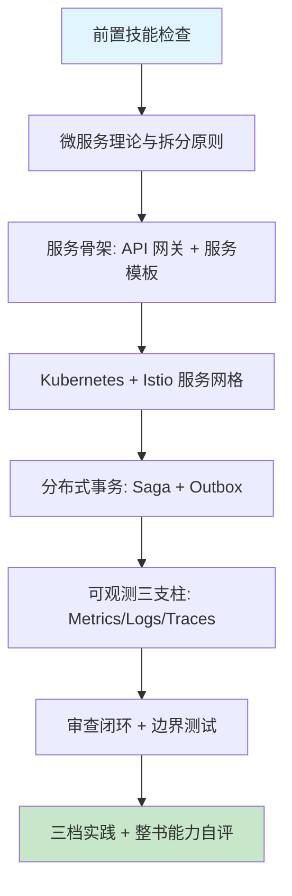

# 第十二章 微服务架构与服务治理

## 1. 学习目标

本章是第三部分的收官之作——把第五至十一章的能力（前端、API、数据库、安全、AI 推理、实时通信、数据分析）整合到生产级微服务架构中。完成本章学习后，大家将能够：用领域驱动设计（DDD）的限界上下文方法把单体应用拆分为独立可演进的微服务；用 Kubernetes 1.30 + Istio 1.22 + OpenTelemetry 1.0 构建包含服务发现、负载均衡、熔断、mTLS、全链路追踪的服务网格；用四步审查法识别服务间强耦合、配置漂移、分布式事务缺失、可观测断层、安全边界模糊、API 兼容性失守六类高频缺陷。

### 1.1 学习路径图



### 1.2 预期学习成果

本章结束时，应交付五份产物：（1）一个由至少 3 个独立服务组成的电商微服务平台（user / order / inference，分别对应 Ch6/8、Ch9 推理服务、Ch11 分析仪表板）；（2）一份 Kong + Istio 的 API 网关 + 服务网格配置（含 mTLS 严格模式、JWT 鉴权、限流、金丝雀发布）；（3）一份基于 Outbox + Saga 的订单/库存分布式事务方案，含补偿与幂等键；（4）一套 OpenTelemetry + Prometheus + Loki + Tempo 的可观测大盘（覆盖 RED + USE 指标、SLO 错误预算）；（5）一个 `microservice-review` Skill 草稿，沉淀本章的危险模式 grep 规则与边界测试脚本。

---

## 2. 前置技能检查

### 2.1 技能自查清单

在开始本章前，请确认：

- 已完成第六章 RESTful API、第八章 JWT/RBAC、第九章推理服务、第十章 Kafka、第十一章数据分析。
- 理解 Docker 多阶段构建、Kubernetes Deployment / Service / Ingress / ConfigMap / Secret。
- 理解 CAP / PACELC 与最终一致性，听说过 Saga / TCC / Outbox / 2PC 区别。
- 至少在本地集群（k3d / kind / minikube）部署过一次 Helm Chart。
- 熟悉 OpenTelemetry 三支柱（Traces / Metrics / Logs）的概念。

### 2.2 代码自测：能否独立写出最小服务模板？

在阅读后续章节前，先尝试用 50 行内代码 + 一份 Helm values 完成以下需求，写不出来再回到第六章/第八章补基础：

```python
# services/_template/main.py — 任何微服务都应满足的最小契约
from fastapi import FastAPI, Request
from prometheus_fastapi_instrumentator import Instrumentator
from opentelemetry import trace
from opentelemetry.instrumentation.fastapi import FastAPIInstrumentor
import logging, os, uuid

app = FastAPI(title=os.environ["SERVICE_NAME"],
              version=os.environ["SERVICE_VERSION"])

# 1) 健康检查（K8s liveness / readiness 必须区分）
@app.get("/livez")  # 进程存活
def livez(): return {"ok": True}

@app.get("/readyz") # 依赖就绪（DB / 缓存 / 外部 API）
def readyz(): return {"ok": True}      # 真实实现需检查 DB ping

# 2) 请求标识透传（X-Request-Id 与 W3C traceparent）
@app.middleware("http")
async def trace_ctx(request: Request, call_next):
    rid = request.headers.get("x-request-id", uuid.uuid4().hex)
    response = await call_next(request)
    response.headers["x-request-id"] = rid
    return response

# 3) 指标 + Trace（OpenTelemetry 自动埋点）
Instrumentator().instrument(app).expose(app, endpoint="/metrics")
FastAPIInstrumentor.instrument_app(app)

# 4) 结构化日志（一律 JSON，含 trace_id / request_id）
logging.basicConfig(level=logging.INFO,
    format='{"ts":"%(asctime)s","level":"%(levelname)s",'
           '"svc":"' + os.environ["SERVICE_NAME"] + '","msg":"%(message)s"}')
```

```yaml
# helm/values.yaml — 任何服务都应有的最小生产配置
resources:
  requests: { cpu: 100m, memory: 256Mi }
  limits: { cpu: 1000m, memory: 1Gi } # 必须设上限避免邻居噪声
livenessProbe: { httpGet: { path: /livez, port: 8000 }, periodSeconds: 10 }
readinessProbe: { httpGet: { path: /readyz, port: 8000 }, periodSeconds: 5 }
podDisruptionBudget: { minAvailable: 1 }
hpa: { minReplicas: 2, maxReplicas: 20, targetCPUUtilizationPercentage: 70 }
networkPolicy: { enabled: true } # 默认拒绝所有，按需开放
```

完成自测后再进入下一节。如果对 livez/readyz 区别、PDB、NetworkPolicy 三个概念存在困惑，本章关于"治理"的内容大概率会跑偏。

---

## 3. 理论基础：微服务的策略与陷阱

### 3.1 拆分策略对比

| 拆分策略                                      | 适用场景             | AI 生成质量         | 典型优势                | 典型缺陷                          |
| :-------------------------------------------- | :------------------- | :------------------ | :---------------------- | :-------------------------------- |
| **按业务能力拆分**                            | 团队按产品域划分     | 高 — 模式固定       | 服务边界与组织对齐      | 易忽略数据依赖与跨域事务          |
| **按子域拆分（DDD 限界上下文）**              | 复杂业务、需建模     | 中 — 需要业务上下文 | 限界上下文 + 防腐层准确 | AI 难理解业务语义，需领域专家校准 |
| **按技术层拆分**                              | 反模式（仅用于演示） | 中低                | 结构简单                | 任何业务变更跨多服务，耦合严重    |
| **按变化频率拆分**                            | 微调演进             | 中                  | 高频变化与稳态隔离      | 需配合可观测识别热点              |
| **基于团队拓扑（Stream-aligned / Platform）** | 大型组织             | 中 — 需组织设计     | 与 DevEx / 运维分层对齐 | 早期组织未成熟时反而拖累          |

> 选型经验：从"业务能力 + DDD 子域"双视角切入，不要按技术层拆分；服务粒度的红线是"两周内一个团队能独立交付一个完整故事"。

### 3.2 微服务架构的六类高频缺陷

| 类别               | 典型表现                                                                | 根因                                               | 审查优先级 | 修正提示词模板（按 [Ch2 §4.9](../第一部分-Trae基础入门/第二章-基础交互模式.md)）                                                                  |
| :----------------- | :---------------------------------------------------------------------- | :------------------------------------------------- | :--------- | :------------------------------------------------------------------------------------------------------------------------------------------------ |
| **服务间强耦合**   | 同步 RPC 调用链 ≥ 4 跳；无熔断/降级；调用方手抄被调方 schema            | 缺少异步事件 + 客户端契约（OpenAPI/Protobuf）      | **P0**     | 保留 RPC 调用位置，引入异步事件（Kafka） + OpenAPI codegen + Resilience4j 熔断。不要动业务语义。验证：跨服务同步调用链 ≤ 2 跳                     |
| **分布式事务缺失** | 跨服务写操作直接两次 HTTP，失败即数据撞裂                               | 未引入 Outbox + Saga 或 TCC                        | **P0**     | 保留写操作语义，引入 Outbox 表 + Saga（Choreography）补偿。不要动业务字段。验证：注入跨服务失败后 0 数据撞裂                                      |
| **安全边界模糊**   | 服务间裸 HTTP、东西向流量未鉴权                                         | 未启用 Istio mTLS STRICT、未配 AuthorizationPolicy | **P0**     | 保留路由规则，启用 `PeerAuthentication mTLS:STRICT` + `AuthorizationPolicy ALLOW source.principal`。不要动 VirtualService。验证：未授权调用返 403 |
| **可观测断层**     | 跨服务 trace 断裂；日志无 trace_id；无 SLO/错误预算                     | 未透传 W3C traceparent；指标只有 RED 没有 USE      | **P0**     | 保留日志埋点，OpenTelemetry SDK 透传 traceparent + log inject `trace_id`。不要动 metric 名。验证：Jaeger 跨服务 trace 完整无断裂                  |
| **配置与版本漂移** | 同一字段每个服务一种命名；image tag 用 `latest`；不同服务用不同日志格式 | 缺少配置中心 + 服务模板 + GitOps                   | P1         | 保留服务名，引入 Argo CD + image 锁 sha256 digest + 统一 logfmt。不要动环境变量。验证：所有 manifest 无 `:latest` tag                             |
| **API 兼容性失守** | 直接修改字段类型/语义导致下游崩；无 deprecation 策略                    | 未做契约测试 + consumer-driven contract            | P1         | 保留对外 schema，加 contract test（Pact） + 6 月 deprecation 窗口。不要动业务逻辑。验证：CI breaking change 检测阻塞 merge                        |

### 3.3 单体演进 vs AI 辅助微服务

| 维度           | 传统手写             | AI 辅助（Trae）                                                 |
| :------------- | :------------------- | :-------------------------------------------------------------- |
| 服务骨架       | 每个服务复制粘贴     | 一句话生成模板，但易遗漏 readyz / NetworkPolicy / PDB           |
| K8s 清单       | 反复对照官方文档     | 默认产出可用，但常用 `latest` tag、缺资源限制                   |
| Istio 流量规则 | 文档驱动调试         | AI 可生成 VirtualService，但 mTLS、AuthorizationPolicy 默认缺位 |
| 分布式事务     | 严肃设计 Saga 状态机 | AI 倾向写"两次 HTTP"反模式，需主动追问 Outbox                   |
| 监控大盘       | 手画 Grafana JSON    | AI 能生成 RED 大盘但漏 SLO + Burn Rate Alert                    |

> 结论：AI 大幅压缩"骨架"成本，但治理（边界、契约、事务、可观测）的正确性来自显式约束。本章 §7 的四步法 + §3.2 六类缺陷正是这些约束的清单化。

---

## 4. 技术栈与项目架构

### 4.1 技术栈与最低版本

| 层                 | 选型                                  | 最低版本               | 选型说明                                              |
| :----------------- | :------------------------------------ | :--------------------- | :---------------------------------------------------- |
| 容器运行时         | containerd                            | 1.7+                   | K8s 1.30 默认                                         |
| 编排               | Kubernetes                            | **1.30+**              | Sidecar Containers 稳定、ValidatingAdmissionPolicy GA |
| 包管理             | Helm                                  | 3.14+                  | OCI registry 支持                                     |
| 服务网格           | Istio                                 | **1.22+**              | Ambient 模式可用、mTLS STRICT 默认                    |
| API 网关           | Kong / Traefik                        | Kong 3.7 / Traefik 3.0 | OpenTelemetry 集成                                    |
| 服务注册           | Kubernetes Service / Consul           | 1.18 (Consul)          | 大多数场景 K8s 内置足够                               |
| 可观测             | OpenTelemetry SDK                     | **1.0+ (stable spec)** | Trace + Metrics + Logs 统一协议                       |
| 指标存储           | Prometheus                            | 2.50+                  | Native histograms + remote-write v2                   |
| 日志               | Loki                                  | 3.0+                   | LogQL 与 Grafana 集成                                 |
| 追踪               | Tempo / Jaeger                        | Tempo 2.4              | TraceQL 支持                                          |
| 服务框架（Python） | FastAPI                               | 0.110+                 | 与 OTEL 自动埋点兼容                                  |
| 服务框架（Java）   | Spring Boot                           | 3.2+                   | 复用 Spring AI、Native Image                          |
| 消息队列           | Apache Kafka                          | 3.7+                   | KIP-848（复用 Ch10）                                  |
| 配置中心           | ConfigMap + External Secrets Operator | ESO 0.9+               | Secret 来自云 KMS / Vault                             |
| GitOps             | Argo CD                               | 2.10+                  | OCI Helm Chart + 多集群同步                           |

> 升级提示：Istio 1.22 默认启用 PeerAuthentication STRICT 与 dual-stack；AI 生成的旧示例（1.18 之前）经常关掉 mTLS 或用 PERMISSIVE，必须人工核对。

### 4.2 项目目录（汇总 Ch5-Ch11 成果）

```text
ecommerce-microservices/
├── platform/                     # 平台层（GitOps 入口）
│   ├── argocd/                   # ApplicationSet：每服务一个 App
│   ├── istio/                    # PeerAuthentication STRICT、AuthorizationPolicy
│   ├── observability/            # kube-prometheus-stack + Loki + Tempo
│   └── networkpolicy/            # default-deny + 分服务白名单
├── services/
│   ├── _template/                # §2.2 模板（任何新服务必须 fork 自此）
│   ├── user-service/             # 复用 Ch6 RESTful + Ch8 JWT/RBAC
│   ├── order-service/            # 引入 Outbox + Saga（本章重点）
│   ├── inference-service/        # 复用 Ch9 PyTorch + Triton 推理
│   ├── realtime-service/         # 复用 Ch10 Socket.IO + Kafka
│   └── analytics-service/        # 复用 Ch11 DuckDB + Streamlit
├── contracts/                    # OpenAPI + AsyncAPI + Protobuf
│   ├── user.openapi.yaml
│   ├── order.events.asyncapi.yaml
│   └── inference.proto
├── helm/                         # 公共 chart（_template）
│   └── microservice/             # 一份 chart，参数化所有服务
├── ops/
│   ├── slo/                      # SLO YAML（按服务）+ Burn Rate Alert
│   └── chaos/                    # LitmusChaos：网络分区 / Pod kill 实验
└── tests/
    ├── contract/                 # consumer-driven contract（Pact）
    ├── e2e/                      # K6 端到端
    └── boundary/                 # §7.2 边界场景脚本
```

> 跨章复用：`order-service` 调用 `inference-service`（Ch9）做反欺诈打分、消费 `realtime-service`（Ch10）的 Kafka 事件做状态推送、把分析数据落到 `analytics-service`（Ch11）；`user-service` 复用 Ch6 task-management-api 的 Postgres schema 与 Ch8 的 JWT 中间件。

---

## 5. 主框架实战：电商微服务平台

### 5.1 服务模板与最小可上线服务

#### 5.1.1 提示词模板

```text
基于 services/_template 创建 order-service，要求：

1. 框架：FastAPI 0.110+；OpenAPI schema 落到 contracts/order.openapi.yaml。
2. 健康检查：/livez 仅检查进程；/readyz 检查 PG + Kafka producer ready。
3. 鉴权：复用 Ch8 verifyToken 中间件（RS256 公钥来自 ConfigMap，不要硬编码）。
4. 数据：PostgreSQL（复用 Ch7）+ outbox 表（id, aggregate_id, event_type, payload, created_at, published_at）。
5. 事件：发到 Kafka topic order.events（acks=all + idempotent）。
6. 可观测：OpenTelemetry 自动埋点 + 结构化 JSON 日志（含 trace_id / request_id / user_id）。
7. K8s：基于 helm/microservice chart 出 Helm values，必须包含 PDB、HPA、NetworkPolicy、resources limits。
8. Istio：sidecar 自动注入；PeerAuthentication STRICT；AuthorizationPolicy 仅放行 user-service / api-gateway 调用 POST /orders。

不要：使用 image tag latest；使用同步 HTTP 调用 inventory（必须走 Saga + 事件）。
```

#### 5.1.2 AI 生成结果审查（带 ✅/⚠️ 标注）

```python
# services/order-service/app/api.py 节选
@router.post("/orders", status_code=201)
async def create_order(req: CreateOrderReq, user=Depends(verify_jwt)):
    idem_key = req.idempotency_key                              # ✅ 强制幂等键
    async with db.transaction():                                # ✅ 业务写 + outbox 同事务
        existing = await orders.get_by_idem(user.sub, idem_key)
        if existing: return existing                            # ✅ 幂等返回

        order = await orders.create(user_id=user.sub,
                                     items=req.items,
                                     status="PENDING_INVENTORY",
                                     idem_key=idem_key)
        await outbox.append(                                    # ✅ Outbox 模式
            aggregate_id=order.id,
            event_type="OrderCreated",
            payload=order.to_event())
    return order                                                # 注意：此处不直接调 inventory
    # ⚠️ AI 经常遗漏：response 应回 ETag / Location，便于客户端缓存与跟踪
```

```python
# services/order-service/app/outbox_relay.py — 独立后台任务
async def relay():
    async for batch in outbox.fetch_unpublished(limit=100):
        for evt in batch:
            try:
                await producer.send(topic="order.events",
                                     key=evt.aggregate_id,
                                     value=evt.payload,
                                     acks=-1)                    # ✅ acks=all
                await outbox.mark_published(evt.id)
            except Exception:
                log.exception("relay failed", extra={"event_id": evt.id})
                # ⚠️ AI 经常遗漏：连续失败应回退到 dead-letter outbox 表，否则会无限重试
```

```yaml
# services/order-service/helm/values.yaml — 关键审查点
image:
  repository: registry.example.com/order-service
  tag: "1.4.2" # ✅ 显式 tag，禁止 latest
resources:
  requests: { cpu: 200m, memory: 512Mi }
  limits: { cpu: 2000m, memory: 2Gi } # ✅ limit 必填
podDisruptionBudget: { minAvailable: 2 } # ✅ 滚动升级与节点维护时不全断
hpa:
  minReplicas: 3
  maxReplicas: 30
  metrics:
    [
      {
        type: Resource,
        resource:
          { name: cpu, target: { type: Utilization, averageUtilization: 70 } },
      },
    ]
networkPolicy:
  ingress:
    - from: [{ namespaceSelector: { matchLabels: { name: gateway } } }] # ✅ 仅网关入口
    - from: [{ podSelector: { matchLabels: { app: user-service } } }]
istio:
  peerAuthentication: STRICT # ✅ mTLS 强制
  authorizationPolicy: # ✅ 显式白名单
    rules:
      - from: [{ source: { principals: ["cluster.local/ns/gateway/sa/kong"] } }]
        to:
          [
            {
              operation:
                { methods: ["POST", "GET"], paths: ["/orders", "/orders/*"] },
            },
          ]
# ⚠️ AI 经常遗漏：pod-level securityContext（runAsNonRoot, readOnlyRootFilesystem, drop ALL capabilities）
```

### 5.2 分布式事务：Saga + Outbox

```text
order-service                inventory-service            payment-service
    │ POST /orders                  │                           │
    ├─[txn]─ INSERT orders+outbox ──┤                           │
    │ 200 (PENDING_INVENTORY)       │                           │
    │                               │                           │
[outbox-relay] → Kafka order.events:OrderCreated                │
                  ├──► inventory consumer                       │
                  │   reserve(orderId, items) ┐                 │
                  │   on success → emit InventoryReserved       │
                  │   on fail    → emit InventoryRejected       │
order consumer ◄──┴───────────────────────────────────────────► │
    if InventoryReserved: → emit OrderReady → payment           │
    if InventoryRejected: → compensating: OrderCancelled        │
                                                                │
payment consumer ─► charge → emit PaymentSucceeded / Failed     │
order consumer ◄────────────────────────────────────────────────┘
    if PaymentSucceeded: status=PAID
    if PaymentFailed:    compensating: emit ReleaseInventory + OrderCancelled
```

| 关键设计     | 说明                                                             |
| :----------- | :--------------------------------------------------------------- |
| **幂等键**   | 每个事件携带 `aggregate_id` + `event_id`，消费端先查后写         |
| **Outbox**   | 业务写与事件写在同一事务，消除"业务成功但事件丢失"的不一致       |
| **补偿可逆** | 任何前向步骤都必须有对应的后向补偿事件                           |
| **超时机制** | Saga orchestrator 监听超时，超时即触发补偿（不能等下游永远不回） |
| **死信**     | 连续失败 N 次进入 DLQ，人工介入；不要无限重试                    |

### 5.3 API 网关 + 服务网格

```yaml
# Istio PeerAuthentication：全网格 mTLS STRICT
apiVersion: security.istio.io/v1
kind: PeerAuthentication
metadata: { name: default, namespace: istio-system }
spec: { mtls: { mode: STRICT } } # ✅ 东西向必须 mTLS

---
# AuthorizationPolicy：order-service 仅允许网关与 user-service 访问
apiVersion: security.istio.io/v1
kind: AuthorizationPolicy
metadata: { name: order-allow, namespace: prod }
spec:
  selector: { matchLabels: { app: order-service } }
  action: ALLOW
  rules:
    - from: [{ source: { principals: ["cluster.local/ns/gateway/sa/kong"] } }]
    - from:
        [{ source: { principals: ["cluster.local/ns/prod/sa/user-service"] } }]

---
# VirtualService：金丝雀，5% 流量到 v2
apiVersion: networking.istio.io/v1
kind: VirtualService
metadata: { name: order, namespace: prod }
spec:
  hosts: [order-service]
  http:
    - route:
        - destination: { host: order-service, subset: v1 }
          weight: 95
        - destination: { host: order-service, subset: v2 }
          weight: 5
      retries:
        { attempts: 2, perTryTimeout: 1s, retryOn: "5xx,reset,connect-failure" }
      timeout: 3s # ✅ 显式超时，避免无限挂起
```

---

### 5.4 Vibe Coding 循环实录：Sidecar 超时雪崩修正

> **修正语法**：「修正提示词」按 [Ch2 §4.9 修正提示词语法](../第一部分-Trae基础入门/第二章-基础交互模式.md) 模板；3 轮未收敛触发 §4.10。模式选择查 [Ch1 §5.4](../第一部分-Trae基础入门/第一章-Trae简介与环境配置.md)。

| 轮次 | AI 输出摘要                              | 发现的缺陷                                  | 修正提示词（按 §4.9）                                                                                                                                                                                                            | 验证信号            |
| :--- | :--------------------------------------- | :------------------------------------------ | :------------------------------------------------------------------------------------------------------------------------------------------------------------------------------------------------------------------------------- | :------------------ |
| R1   | Istio VirtualService 全局 `timeout: 30s` | 慢调用堆积 Envoy outbound 队列 → 整 mesh 卡 | 保留路由规则不变，修复超时分级：按目标服务设置（payment: 5s，catalog: 1s，search: 800ms）。原因：单一全局超时无法匹配 SLO 差异。不要动 host/subset。验证：Envoy `cluster.upstream_rq_timeout` 指标按服务分桶可见                 | 超时按服务分桶      |
| R2   | 单次失败立即返错                         | 网络瞬抖导致用户面失败率虚高                | 保留 timeout 分级，修复重试：加 `retries: { attempts: 3, perTryTimeout: 1s, retryOn: "5xx,reset,connect-failure" }`。原因：分布式抖动需重试吸收。不要动超时值。验证：注入 5% 抖动后用户面失败率 < 0.1%                           | 失败率 < 0.1%       |
| R3   | 故障实例仍接收流量                       | 单坏实例拖累集群，重试加剧雪崩              | 保留超时与重试，修复 outlier 检测：加 `outlierDetection: { consecutive5xxErrors: 5, interval: 30s, baseEjectionTime: 30s }`。原因：必须主动隔离坏实例。不要动 retryOn 列表。验证：杀死 1 个 pod 后 30s 内被 Envoy 标记 unhealthy | 坏实例 30s 内被隔离 |

> **收敛信号**：分级 + 重试 + 隔离三件齐备。如未收敛触发 §4.10 信号 3（结构性缺陷：服务无幂等键导致重试不安全），按「换模式」重启——切到 Chat 先讨论幂等性设计，再回 Builder 写 retry 配置。

---

## 6. 进阶速查表

### 6.1 进阶场景索引

| 场景                  | 关键技术                                   | AI 高频缺陷             | 建议提示词关键词                            |
| :-------------------- | :----------------------------------------- | :---------------------- | :------------------------------------------ |
| **金丝雀 / 蓝绿发布** | Istio + Argo Rollouts / Flagger            | 没有指标驱动回滚        | "基于 P95/error rate 自动 rollback"         |
| **混沌工程**          | LitmusChaos / Chaos Mesh                   | 只演练 happy-path       | "网络分区 + Pod kill + DB latency 三类实验" |
| **配额与多租户**      | ResourceQuota + LimitRange + NetworkPolicy | 默认无 quota → 邻居噪声 | "namespace 级 quota + default-deny"         |
| **GitOps**            | Argo CD ApplicationSet                     | 直接 kubectl apply      | "PR-based + auto-sync + drift detection"    |
| **API 兼容性**        | Pact / Schemathesis                        | 只跑 happy-path         | "consumer-driven contract + fuzz"           |
| **Serverless 互通**   | Knative / KEDA                             | 冷启动未评估            | "scale-to-zero + concurrency 上限"          |
| **多集群**            | Istio multicluster + Cilium ClusterMesh    | 仅在单集群验证          | "故障域隔离 + 流量锁"                       |
| **服务级 FinOps**     | Kubecost / OpenCost                        | 无成本归因              | "按 namespace + label 月度归因"             |

### 6.2 性能与 SLO 基线（参考）

| 指标                        | 目标值            | 测量方法                               |
| :-------------------------- | :---------------- | :------------------------------------- |
| 端到端 P95 延迟（用户下单） | < 400 ms          | k6 / OpenTelemetry trace               |
| 服务可用性                  | ≥ 99.9%           | SLO + 错误预算 + Burn Rate Alert       |
| Pod 启动 → readyz           | < 15 s            | `kubectl get events` + readiness gates |
| 滚动升级期间错误率增量      | < 0.1%            | Argo Rollouts analysis template        |
| Istio sidecar CPU 占比      | < 业务 Pod 的 15% | Istio dashboards                       |
| 跨服务 trace 完整率         | ≥ 99%             | Tempo TraceQL 抽样校验                 |

### 6.3 SLO + Burn Rate Alert 模板

```yaml
# ops/slo/order.yaml
slo:
  service: order-service
  objective: 99.9 # 30 天可用性目标
  sli:
    metric: |
      sum(rate(http_requests_total{job="order-service",code!~"5.."}[$window])) /
      sum(rate(http_requests_total{job="order-service"}[$window]))
alerts:
  - name: ErrorBudgetBurn-Fast # 1 小时窗口烧掉 5% 预算
    severity: page
    expr: |
      (1 - sli{window="1h"}) > 14.4 * (1 - 0.999)
  - name: ErrorBudgetBurn-Slow # 6 小时窗口烧掉 10% 预算
    severity: ticket
    expr: |
      (1 - sli{window="6h"}) > 6 * (1 - 0.999)
```

---

## 7. 审查闭环

### 7.1 四步审查法（微服务专用）

| 步骤         | 关键检查项                                                                                                                                                           |
| :----------- | :------------------------------------------------------------------------------------------------------------------------------------------------------------------- |
| **正确性**   | livez 与 readyz 是否区分？readyz 是否真的检查依赖？跨服务调用是否带 timeout + retry？Saga 是否每个前向步都有补偿？                                                   |
| **安全性**   | Istio mTLS 是否 STRICT？AuthorizationPolicy 是否最小权限？Secret 是否来自 ESO/Vault 而非明文 ConfigMap？securityContext 是否 runAsNonRoot + readOnlyRootFilesystem？ |
| **性能**     | 是否有 HPA + PDB + resources limits？Sidecar 是否限制 CPU？是否启用 zstd 日志压缩？数据库连接池是否按服务独立？                                                      |
| **可维护性** | image 是否禁用 latest？OpenAPI/AsyncAPI 是否进版本仓库？SLO 与 Burn Rate Alert 是否覆盖每个服务？日志是否结构化 + 含 trace_id？                                      |

### 7.2 三类边界测试（AI 最容易遗漏）

```bash
# 1) 网络分区：随机切断 order-service ↔ inventory-service 网络 60s
kubectl apply -f ops/chaos/network-partition.yaml
# 期望：Saga 触发补偿，订单状态最终为 CANCELLED；不应出现"已扣库存但订单未生成"

# 2) Pod kill：在峰值流量下随机 kill 30% order-service pod
kubectl apply -f ops/chaos/pod-kill.yaml
# 期望：错误率增量 < 0.1%（PDB + readyz 生效）；trace 完整率 ≥ 99%

# 3) 配置漂移：手动改 ConfigMap 引入错误参数
kubectl edit configmap order-config -n prod
# 期望：Argo CD 在 5 min 内检测 drift 并自动恢复（auto-sync + self-heal）

# 4) 契约破坏：在 contracts/order.openapi.yaml 修改字段类型
pact-broker can-i-deploy --pacticipant order-service --version $SHA
# 期望：CI 阻止合并（consumer-driven contract 失败）
```

### 7.3 危险模式扫描

```bash
# 1) image: latest（生产禁用）
rg -n "image:\s*[^\s]+:latest" services platform helm

# 2) 直接同步 RPC 替代事件（应走 Outbox + Kafka）
rg -nU "httpx\.(post|put|delete).+inventory|requests\.(post|put|delete).+inventory" services/order-service

# 3) Istio mTLS 非 STRICT
rg -nU "PeerAuthentication" -A 6 platform/istio | rg -v "STRICT"

# 4) Pod 缺 readiness/liveness（仅 livez 没有 readyz）
rg -n "livenessProbe" helm services -A 3 | rg -v "readinessProbe"

# 5) 缺 NetworkPolicy（namespace 默认应 default-deny）
rg -L "NetworkPolicy" platform/networkpolicy

# 6) Helm values 未设 resources.limits
rg -n "resources:" helm services -A 4 | rg -v "limits"

# 7) 调用无 timeout（VirtualService 缺 timeout 字段）
rg -nU "kind:\s*VirtualService" -A 20 platform | rg -v "timeout"
```

### 7.4 扫到问题后用什么提示词改？

上面 7 条 rg 只识别「位置」；下一步必须按统一语法把意图写回 AI（参照 [Ch2 §4.9](../第一部分-Trae基础入门/第二章-基础交互模式.md)）。

| #   | 命中后修正提示词模板                                                                                                                                                                                       |
| :-- | :--------------------------------------------------------------------------------------------------------------------------------------------------------------------------------------------------------- |
| 1   | 保留服务名，image 钉到 `:v1.2.3` 或 `@sha256:...` digest；imagePullPolicy: IfNotPresent。不要动 replicas。验证：rg 返 0；Argo CD diff 无漂移。                                                             |
| 2   | 保留 order-service handler 出参，写库 + 发 Kafka 改用 Outbox 表 + Debezium；inventory 调用改为订阅 `OrderCreated` 消费。不要动 inventory API。验证：rg 查不到 httpx 直接调 inventory；Kafka topic 有事件。 |
| 3   | 保留 PeerAuthentication 名字与 selector，`mtls.mode: STRICT`。不要动 namespace selector。验证：`istioctl x authz check` 返 STRICT；明文调用被拒。                                                          |
| 4   | 保留 livenessProbe 配置，补 `readinessProbe`（依赖 DB/Redis 探测）+ `startupProbe`。不要动端口。验证：rolling update 期间 0 错误请求；k6 压测 5xx = 0。                                                    |
| 5   | 保留 namespace，落 default-deny + 按 label 放行的 NetworkPolicy。不要动 Service。验证：测试 Pod 跨 ns curl 被拒；同 ns 同 label 能通。                                                                     |
| 6   | 保留 requests，补 limits（CPU = requests×2、Memory = requests）+ `LimitRange`。不要动 replicas。验证：`kubectl describe` 显示 limits；OOMKilled 事件 0。                                                   |
| 7   | 保留 VirtualService route、host，加 `timeout: 3s` + `retries: { attempts: 2, perTryTimeout: 1s, retryOn: 5xx,gateway-error }`。不要动 host。验证：注入 5s 延迟，P99 ≤ 3.5s。                               |

> 3 轮未收敛触发 [§4.10](../第一部分-Trae基础入门/第二章-基础交互模式.md) 的「换模式 / 缩范围 / 拆步骤」。

---

## 8. 三档实践

### 8.1 基础题（半天，必做）

把第六章 task-management-api 拆为 user-service + task-service 两个微服务，并部署到 k3d 本地集群：（1）使用 §2.2 模板，必须包含 livez/readyz/metrics/JSON 日志/Helm chart；（2）通过 Kong 网关暴露 API，内部互调走 Istio sidecar 与 mTLS STRICT；（3）跑通 §7.3 grep 全部规则零命中；（4）输出一份 Grafana RED 大盘截图。

### 8.2 进阶题（一周，建议完成）

在基础题之上引入分布式事务与混沌实验：（1）新增 inventory-service + payment-service，用 Outbox + Saga 实现下单 → 扣库存 → 扣款 → 完单的端到端事务；（2）所有事件经 Kafka 流转，消费者必须幂等；（3）跑 §7.2 三类混沌实验并记录系统在网络分区/Pod kill/配置漂移下的恢复时间与错误率；（4）配置 Argo Rollouts 金丝雀，结合 Burn Rate Alert 做自动 rollback；（5）输出一份 SLO 月报。

### 8.3 开放题（开放周期）

任选其一深度展开：

- **整书能力综合作品**：整合第五（前端）、八（安全）、九（推理）、十（实时）、十一（分析）所有交付物，落成一个真正可演示的"AI 反欺诈电商平台"，并准备一份 30 分钟技术评审稿。
- **多集群灾备**：用 Istio multicluster 把同一服务部署到两个集群，演练主备切换；输出 RTO/RPO 实测报告。
- **缺陷命中表 + Skill 沉淀**：基于六类缺陷做一次真实代码与配置审查，记录每条规则的命中次数与误报率，最终沉淀 `microservice-review` Skill（含 §7.3 grep + §7.2 边界脚本 + SLO 模板），并把它与 Ch7 SQL、Ch8 安全、Ch9 推理、Ch10 实时、Ch11 分析的 Skill 串联为完整审查链。

---

## 9. 小结

微服务的复杂度不在于"拆"，而在于"治"：边界清晰、契约稳定、事务可补偿、安全默认拒绝、可观测端到端、版本与配置可追溯。AI 助手能高效产出服务骨架与 K8s YAML，但治理的正确性来自显式约束——Istio STRICT 而非 PERMISSIVE、显式 image tag 而非 latest、Outbox + Saga 而非两次 HTTP、契约测试而非 happy-path、SLO 与 Burn Rate Alert 而非"看起来挺稳"。本章交付的 `microservice-review` Skill 与第七至十一章的 Skill 串联起来，构成了一条覆盖"数据→实时→推理→分析→服务"全链路的审查闭环。

### 9.1 章节交付物清单

| 编号   | 交付物                                                             | 复用去向                    |
| :----- | :----------------------------------------------------------------- | :-------------------------- |
| D-12-1 | 服务模板 + Helm chart（含 PDB/HPA/NetworkPolicy/securityContext）  | 任何新服务的起点            |
| D-12-2 | Outbox + Saga 订单事务方案                                         | 第四部分高级架构案例        |
| D-12-3 | Istio mTLS STRICT + AuthorizationPolicy + VirtualService（金丝雀） | 生产网格基础配置            |
| D-12-4 | OpenTelemetry + Prom + Loki + Tempo 大盘 + SLO + Burn Rate Alert   | 生产 SRE 基线               |
| D-12-5 | 六类缺陷 grep + 三类混沌实验脚本                                   | `microservice-review` Skill |

### 9.2 微服务能力自评 Rubric

| 维度       | 入门（1-2）       | 熟练（3-4）                              | 精通（5）                                   |
| :--------- | :---------------- | :--------------------------------------- | :------------------------------------------ |
| 服务设计   | 能拆出 2-3 个服务 | 能用 DDD 子域 + 事件风暴拆分             | 能用团队拓扑设计组织与服务双视图            |
| 治理       | 部署到 K8s        | mTLS STRICT + AuthorizationPolicy + 配额 | 多集群 + 多租户 + 成本归因                  |
| 事务一致性 | 知道分布式事务难  | 实现过 Outbox + Saga + 幂等键            | 设计过端到端 exactly-once + 多步补偿状态机  |
| 可观测     | 看 Pod CPU        | RED + USE + 结构化日志 + 全链路 trace    | SLO + 错误预算 + Burn Rate Alert + 容量预测 |
| 审查       | 能跑 §7.3 grep    | 能识别六类缺陷                           | 能输出团队规约 + 多 Skill 联动审查链        |

### 9.3 整书能力地图（Ch1-Ch12 Skill 串联）

| Skill                 | 来源        | 主要规则                          | 串联触发场景                |
| :-------------------- | :---------- | :-------------------------------- | :-------------------------- |
| `prompt-template-set` | Ch2/Ch3/Ch4 | 提示词分层模板                    | 任何新任务起手              |
| `frontend-review`     | Ch5         | 可访问性 + 状态管理 + 安全（XSS） | PR 触及前端                 |
| `api-review`          | Ch6         | 状态码 + 幂等 + 错误模型          | PR 触及 API                 |
| `sql-review`          | Ch7         | 索引 + N+1 + 事务隔离             | PR 触及 SQL                 |
| `security-review`     | Ch8         | OWASP API Top 10 + 鉴权           | PR 触及鉴权或敏感接口       |
| `inference-review`    | Ch9         | 显存 + 推理稳定性 + 监控          | PR 触及模型服务             |
| `realtime-review`     | Ch10        | 心跳 + ack + 重连 + 背压          | PR 触及 WS / Kafka          |
| `analysis-review`     | Ch11        | 数据/统计/可视化/泄漏             | PR 触及 Notebook / 分析脚本 |
| `microservice-review` | Ch12        | 网格/事务/可观测/契约             | PR 触及 K8s/Helm/Istio/契约 |

---

## 10. 延伸阅读

### 10.1 架构与设计（理论奠基）

- **《Microservices Patterns》— Chris Richardson**：Saga / Outbox / API Composition / CQRS 的权威实现。
- **《Building Microservices》（2nd Edition, 2021）— Sam Newman**：服务拆分与组织结构的对齐。
- **《Team Topologies》— Matthew Skelton & Manuel Pais**：Stream-aligned / Platform / Enabling / Complicated-subsystem 团队模型。
- **《Designing Data-Intensive Applications》— Martin Kleppmann**：复制、分区、共识、一致性的工程化全景。
- **DDD Reference (Eric Evans)**：[https://www.domainlanguage.com/ddd/reference/](https://www.domainlanguage.com/ddd/reference/) — 限界上下文、聚合、领域事件官方定义。

### 10.2 平台与一手文档

- **Kubernetes Documentation**：[https://kubernetes.io/docs/](https://kubernetes.io/docs/) — 1.30+ 新特性 Sidecar Containers / VAP。
- **Istio Documentation**：[https://istio.io/latest/docs/](https://istio.io/latest/docs/) — Ambient Mesh / mTLS / AuthorizationPolicy。
- **OpenTelemetry Specification**：[https://opentelemetry.io/docs/specs/otel/](https://opentelemetry.io/docs/specs/otel/) — Trace + Metrics + Logs 统一规范。
- **Argo CD / Argo Rollouts**：[https://argo-cd.readthedocs.io/](https://argo-cd.readthedocs.io/) — GitOps + 渐进式发布。
- **Pact Documentation**：[https://docs.pact.io/](https://docs.pact.io/) — Consumer-Driven Contract 实战。

### 10.3 SRE、可观测与 AI 辅助审查

- **《Site Reliability Engineering》& 《The Site Reliability Workbook》（Google）**：SLO / SLI / 错误预算 / Burn Rate 的原始出处。
- **《Observability Engineering》— Charity Majors et al.**：从监控到可观测的范式跃迁。
- **Cloud Native Computing Foundation Landscape**：[https://landscape.cncf.io/](https://landscape.cncf.io/) — 各层选型导航。
- **Trae 技巧**：把本章 §7.3 grep + §7.2 混沌脚本 + SLO 模板沉淀为 `microservice-review` Skill，并按 §9.3 地图把全书 9 个 Skill 串成 PR 自动审查管道；任意 PR 触发对应 Skill，未通过自动评论并打 review-required 标签。
- **Trae 提示词模板**：审查 K8s/Helm/Istio 变更时附加"请按照六类缺陷（强耦合/事务缺失/安全模糊/可观测断层/配置漂移/契约失守）逐项检查并给出修复 patch"，可显著降低治理项漏检率。

---

**全书完结**：从第一章的 Trae 入门到本章的微服务治理，我们走完了一条"工具上手 → 场景实战 → 高级架构"的完整路径。真正的工程能力来自把每章交付物（9 个 Skill、若干提示词模板、缺陷清单与混沌脚本）持续应用到自己的项目中，在每一次 PR 中沉淀为可被团队共享的规约。祝大家在 AI 原生开发的浪潮中持续精进。
