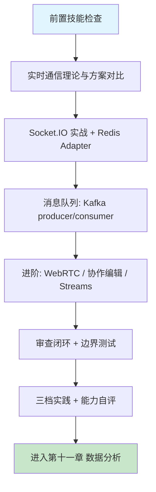

# 第十章 实时通信与消息系统

## 1. 学习目标

本章将第六章的请求-响应式 API 升级为事件驱动的实时通信：从轮询和短连接迁移到 WebSocket 长连接、消息队列与流处理。完成本章学习后，大家将能够：用 Socket.IO + Redis Adapter 构建支持万级并发的实时聊天与推送服务；用 Kafka producer/consumer 实现跨服务的事件流水线（含 ack/offset/重试/死信）；用四步审查法识别连接泄漏、消息丢失、重连风暴、背压缺失四类高频缺陷。

### 1.1 学习路径图



### 1.2 预期学习成果

本章结束时，应交付四份产物：（1）一个支持房间、在线状态、心跳与断线重连的 Socket.IO 聊天服务（复用第八章 JWT 认证、第六章 task-management-api 数据层）；（2）一条 Kafka producer/consumer 流水线（含 ack=all、幂等 producer、消费者组 offset 管理）；（3）一份针对实时系统的连接/消息/重连/背压审查记录；（4）一个 `realtime-review` Skill 草稿，沉淀本章的危险模式 grep 规则与边界测试脚本。

## 2. 前置技能检查

### 2.1 技能自查清单

在开始本章前，请确认：

- 已完成第六章 RESTful API 实战，理解 HTTP 长连接、Keep-Alive 与无状态语义。
- 已完成第八章 JWT/RBAC 实战，能复用 `verifyToken` 中间件用于 WebSocket 握手鉴权。
- 掌握 Node.js 异步编程（Promise / async-await / EventEmitter）或 Python asyncio。
- 理解 TCP 三次握手、四次挥手、半关闭，以及 Nginx upstream 与 sticky session。
- 熟悉 Docker Compose（用于一键拉起 Redis + Kafka + Zookeeper）。

### 2.2 代码自测：能否独立写出最小 Socket.IO 服务？

在阅读后续章节前，先尝试用 30 行内代码完成以下需求，写不出来再回到第八章补 JWT 中间件：

```javascript
// server.js — 最小可用的鉴权聊天服务
import { Server } from "socket.io";
import jwt from "jsonwebtoken";

const io = new Server(3001, {
  cors: { origin: process.env.WEB_ORIGIN, credentials: true },
  pingInterval: 25_000, // 心跳间隔（默认 25s）
  pingTimeout: 20_000, // 心跳超时（默认 20s）
  maxHttpBufferSize: 1e6, // 单条消息上限 1 MB，防止大包攻击
});

io.use((socket, next) => {
  const token = socket.handshake.auth?.token;
  try {
    socket.user = jwt.verify(token, process.env.JWT_PUBLIC_KEY, {
      algorithms: ["RS256"],
    });
    next();
  } catch {
    next(new Error("UNAUTHORIZED"));
  }
});

io.on("connection", (socket) => {
  socket.on("room:join", (roomId, ack) => {
    socket.join(`room:${roomId}`);
    ack?.({ ok: true }); // 客户端必须传 ack 回调
  });
  socket.on("msg:send", (payload, ack) => {
    io.to(`room:${payload.roomId}`).emit("msg:new", {
      ...payload,
      from: socket.user.sub,
      at: Date.now(),
    });
    ack?.({ ok: true });
  });
  socket.on("disconnect", () => {
    /* 清理：见 §5.1.2 审查清单 */
  });
});
```

完成自测后再进入下一节。如果对心跳、ack、room 概念存在困惑，先阅读 Socket.IO 官方文档的 Rooms 与 Acknowledgements 章节。

---

## 3. 理论基础：实时通信的策略与陷阱

### 3.1 实时通信方案对比

| 方案                         | 适用场景                     | 协议特征            | AI 生成质量     | 典型缺陷                             |
| :--------------------------- | :--------------------------- | :------------------ | :-------------- | :----------------------------------- |
| **WebSocket / Socket.IO**    | 双向实时（聊天、协同、游戏） | TCP 长连接，全双工  | 高 — 模板成熟   | 心跳/重连/上限缺失                   |
| **SSE (Server-Sent Events)** | 服务端单向推送（行情、通知） | HTTP/1.1 流式响应   | 中高 — API 简单 | 断线重连策略缺失                     |
| **WebRTC**                   | 点对点音视频/数据通道        | UDP + ICE/STUN/TURN | 中 — 信令复杂   | TURN 配置缺失、ICE 重连未处理        |
| **Kafka**                    | 高吞吐事件流（日志、CDC）    | 持久化日志 + 分区   | 中 — 模板丰富   | 分区 key、ack、offset 提交时机错误   |
| **Redis Pub/Sub**            | 轻量广播（无持久化要求）     | 内存 fan-out        | 中 — 命令简单   | 无持久化、无 ACK、订阅者掉线即丢消息 |
| **Redis Streams**            | 中等吞吐持久化队列           | XADD/XREADGROUP     | 中 — 概念较新   | consumer group 命名混乱、PEL 未回收  |

> 选型经验：单机/同机房双向交互 → Socket.IO；跨服务异步解耦 → Kafka；服务实例间事件广播 → Redis Pub/Sub；需要重放与 offset → Redis Streams 或 Kafka。

### 3.2 实时系统的六类高频缺陷

| 类别             | 典型表现                                                        | 根因                                                  | 审查优先级 | 修正提示词模板（按 [Ch2 §4.9](../第一部分-Trae基础入门/第二章-基础交互模式.md)）                                                               |
| :--------------- | :-------------------------------------------------------------- | :---------------------------------------------------- | :--------- | :--------------------------------------------------------------------------------------------------------------------------------------------- |
| **连接泄漏**     | 断开后定时器/监听器/Redis 订阅未清理，进程内存爬升              | `disconnect` 处理函数缺失或抛错被吞                   | **P0**     | 保留 connect 路径，`disconnect` handler 内清理 timer/listener/redis sub + try/catch 不吞错。不要动业务事件。验证：1h 压测 FD 数稳定            |
| **消息丢失**     | Kafka producer 用默认 `acks=1`，broker 主副本宕机即丢           | 未显式配 `acks=all` + `enable.idempotence=true`       | **P0**     | 保留 producer 调用，配 `acks=all` + `enable.idempotence=true` + `retries=Integer.MAX_VALUE`。不要动 topic。验证：杀 broker 主副本时 0 消息丢失 |
| **重连风暴**     | 服务重启瞬间数千客户端同时重连，CPU 100%                        | 客户端未实现指数退避 + 抖动                           | **P0**     | 保留 reconnect 入口，加指数退避 `min(30, 2^n)` + ±25% jitter + 上限 10 次。不要动连接 URL。验证：1000 客户端重连时间均匀散布 > 30s             |
| **无背压控制**   | 生产 > 消费，消息在内存堆积，最终 OOM                           | `socket.emit` 不感知 `bufferedAmount`；消费者无限拉取 | P1         | 保留消息语义，发送前查 `socket.bufferedAmount > 1MB` 则丢/排队；消费者 `prefetch=10`。不要动事件名。验证：生产 > 消费时 RSS 不持续上涨         |
| **心跳配置错误** | `pingTimeout > pingInterval` 或都 < TCP keepalive，假死连接堆积 | 复制示例代码未理解参数语义                            | P1         | 保留信令通道，配 `pingInterval=25s` + `pingTimeout=20s` 且 < TCP keepalive。不要动协议版本。验证：客户端假死 25s 内被踢                        |
| **无连接上限**   | 单实例承载 > 10 万连接，FD 耗尽，新连接被拒                     | 缺少 `ulimit -n`、`maxConnections` 配置               | P1         | 保留监听端口，加 `maxConnections` + 容器 `ulimit -n 65535` + LB 横向分摊。不要动业务。验证：FD 利用率 < 70%                                    |

### 3.3 传统实时系统 vs AI 辅助开发

| 维度         | 传统手写               | AI 辅助（Trae）                              |
| :----------- | :--------------------- | :------------------------------------------- |
| 协议样板代码 | 手抄 ws/Socket.IO 文档 | 一句话生成最小可用骨架                       |
| 多实例广播   | 手动配置 Redis Adapter | AI 默认会接入，但易漏 sticky session         |
| 心跳/重连    | 经常忘记或参数错配     | AI 生成的客户端常见无指数退避                |
| Kafka 配置   | 文档驱动               | AI 易用默认 `acks=1`，需明确要求 `acks=all`  |
| 边界测试     | 手写 wscat 脚本        | AI 通常只生成 happy-path，需主动追问异常路径 |

> 结论：AI 大幅降低骨架成本，但实时系统的可靠性来自异常路径与生产参数。审查应聚焦于参数（心跳/ack/重连）与生命周期（连接/订阅/定时器）。

---

## 4. 技术栈与项目架构

### 4.1 技术栈与最低版本

| 层             | 选型                     | 最低版本  | 选型说明                                     |
| :------------- | :----------------------- | :-------- | :------------------------------------------- |
| WebSocket 框架 | Socket.IO                | **4.7+**  | 修复了 v4.6 的 CVE-2024-38355 中间件鉴权绕过 |
| 原生 WebSocket | ws                       | **8.18+** | 修复 permessage-deflate 内存放大漏洞         |
| 多实例适配器   | @socket.io/redis-adapter | 8.3+      | 配合 Redis 7.x Pub/Sub                       |
| 消息队列       | Apache Kafka             | **3.7+**  | KIP-848 新一代消费者组协议                   |
| Kafka 客户端   | kafkajs                  | 2.2+      | 支持 idempotent producer                     |
| 内存广播 / 流  | Redis                    | **7.2+**  | Streams 稳定 + ACL 完善                      |
| 信令 + ICE     | coturn                   | 4.6+      | 自建 TURN/STUN                               |
| 协作算法       | Yjs / ShareDB            | Yjs 13+   | CRDT，比 OT 更易集成                         |
| 监控           | Prometheus + Grafana     | 2.50 / 10 | 配合 socket.io-prometheus-metrics            |

> 升级提示：Socket.IO 3.x 与 4.x 客户端/服务端协议不兼容，混用会出现握手 400。AI 生成代码常混合两版导入路径，需手动校对。

### 4.2 项目目录（复用第六/八章成果）

```text
realtime-collab-platform/
├── docker-compose.yml          # Redis 7 + Kafka 3.7 + Zookeeper / KRaft
├── server/
│   ├── src/
│   │   ├── app.ts              # Express + Socket.IO 同端口
│   │   ├── socket/
│   │   │   ├── index.ts        # io 实例 + Redis Adapter
│   │   │   ├── auth.ts         # JWT 中间件（复用 Ch8 verifyToken）
│   │   │   ├── chat.ts         # room/msg/ack 事件
│   │   │   ├── presence.ts     # 在线状态 + 心跳
│   │   │   └── rateLimit.ts    # 单连接消息频控
│   │   ├── kafka/
│   │   │   ├── producer.ts     # acks=all + idempotent
│   │   │   ├── consumer.ts     # 消费者组 + 手动 commit
│   │   │   └── topics.ts       # topic 名 + 分区策略
│   │   └── routes/             # 复用 Ch6 task-management-api
│   └── tests/
│       ├── ws.boundary.test.ts # wscat 三类边界
│       └── kafka.idem.test.ts  # 重复发送幂等性
├── web/                        # 复用 Ch5 React 工程
│   └── src/services/socketClient.ts
└── ops/
    ├── grafana-dashboard.json
    └── k8s/                    # 含 sticky session Ingress
```

> 跨章复用：`auth.ts` 直接 import 第八章 `verifyToken`；Kafka 事件最终落库到第七章 PostgreSQL（`messages` 表 + `created_at` 索引）。

---

## 5. 主框架实战：Socket.IO 聊天服务

### 5.1 服务端实现

#### 5.1.1 提示词模板

```text
为 realtime-collab-platform 实现 Socket.IO 服务端，要求：

1. 鉴权：使用 socket.io middleware 校验 JWT（RS256，复用 Ch8 verifyToken）；
   失败时返回 socket.disconnect(true)，不要静默放过。
2. 房间：room:join / room:leave 事件，参数校验用 zod；返回 ack。
3. 消息：msg:send 事件，全部带 ack 回调；服务端落 Kafka topic chat.messages（acks=all + idempotent producer）。
4. 在线状态：presence 用 Redis SET，TTL = pingTimeout × 2，心跳续期。
5. 多实例：用 @socket.io/redis-adapter 连 Redis 7。
6. 限流：单连接 20 msg/s，超过断连。
7. 配置：pingInterval=25s, pingTimeout=20s, maxHttpBufferSize=1MB。

不要：使用 socket.broadcast.emit 广播到全实例（应使用 Redis Adapter 自动 fan-out）。
```

#### 5.1.2 AI 生成结果审查（带 ✅/⚠️ 标注）

```typescript
// server/src/socket/chat.ts
io.use(authMiddleware); // ✅ 鉴权前置
io.adapter(createAdapter(pubClient, subClient)); // ✅ Redis Adapter 多实例

io.on("connection", (socket) => {
  const userId = socket.user.sub;
  presenceSet(userId, socket.id); // ✅ Redis 在线状态

  // 单连接频控：令牌桶，20 msg/s
  const limiter = new RateLimiter(20, 1000); // ✅ 防止单连接刷消息

  socket.on("room:join", async (roomId, ack) => {
    const parsed = roomJoinSchema.safeParse({ roomId }); // ✅ 参数校验
    if (!parsed.success) return ack({ ok: false, code: "BAD_REQUEST" });
    if (!(await canAccessRoom(userId, roomId)))
      // ✅ 鉴权（复用 Ch8 RBAC）
      return ack({ ok: false, code: "FORBIDDEN" });
    socket.join(`room:${roomId}`);
    ack({ ok: true });
  });

  socket.on("msg:send", async (payload, ack) => {
    if (!limiter.tryAcquire()) {
      socket.disconnect(true); // ✅ 超频直接断
      return;
    }
    const msg = msgSchema.parse(payload);
    await producer.send({
      topic: "chat.messages",
      messages: [{ key: msg.roomId, value: JSON.stringify(msg) }],
      acks: -1, // ✅ acks=all
    });
    io.to(`room:${msg.roomId}`).emit("msg:new", msg);
    ack({ ok: true });
    // ⚠️ AI 经常遗漏：消息持久化失败时不应回 ack=true（应改为 try/catch + ack=false）
  });

  socket.on("disconnect", async () => {
    await presenceDel(userId, socket.id); // ✅ 清理在线状态
    limiter.dispose(); // ✅ 清理定时器
    // ⚠️ AI 经常遗漏：用户在多设备登录时，应只在最后一个 socket 断开后清理 presence
    // ⚠️ AI 经常遗漏：未取消订阅的 Redis subscribe 会泄漏（适配器内部已处理，但自定义订阅需手动 unsubscribe）
  });
});
```

### 5.2 客户端：指数退避重连

```typescript
// web/src/services/socketClient.ts
import { io } from "socket.io-client";

export const socket = io(import.meta.env.VITE_WS_URL, {
  auth: { token: getToken() },
  reconnection: true,
  reconnectionAttempts: Infinity,
  reconnectionDelay: 1000, // ✅ 起始 1s
  reconnectionDelayMax: 30_000, // ✅ 上限 30s（指数退避 + 抖动由库实现）
  randomizationFactor: 0.5, // ✅ ±50% 抖动，避免重连风暴
  transports: ["websocket"], // ⚠️ 不退化到 polling，可显著降低后端 CPU
});

// 鉴权失效统一处理：跳登录页，不要无限重试
socket.on("connect_error", (err) => {
  if (err.message === "UNAUTHORIZED") {
    socket.disconnect();
    redirectLogin();
  }
});
```

### 5.3 横向扩展：Sticky Session + Redis Adapter

| 层              | 配置项                      | 推荐值           | 错误后果                                         |
| :-------------- | :-------------------------- | :--------------- | :----------------------------------------------- |
| Nginx / Ingress | `ip_hash` 或 cookie sticky  | sticky cookie    | 握手协议在多实例间错乱（Engine.IO 长轮询会失败） |
| Socket.IO       | `transports: ["websocket"]` | 仅 WS            | 避免长轮询带来 sticky 强依赖                     |
| Redis Adapter   | Redis 7 cluster             | 单 Master + 哨兵 | Adapter 不感知 cluster slot，需用 single primary |
| Kafka 分区 key  | `roomId`                    | 同房间消息有序   | 用随机 key 会导致乱序                            |

---

### 5.4 Vibe Coding 循环实录：WebSocket 重连风暴修正

> **修正语法**：「修正提示词」按 [Ch2 §4.9 修正提示词语法](../第一部分-Trae基础入门/第二章-基础交互模式.md) 模板；3 轮未收敛触发 §4.10。模式选择查 [Ch1 §5.4](../第一部分-Trae基础入门/第一章-Trae简介与环境配置.md)。

| 轮次 | AI 输出摘要        | 发现的缺陷                              | 修正提示词（按 §4.9）                                                                                                                                                                                  | 验证信号                |
| :--- | :----------------- | :-------------------------------------- | :----------------------------------------------------------------------------------------------------------------------------------------------------------------------------------------------------- | :---------------------- |
| R1   | 断线后固定 1s 重连 | 服务恢复瞬间全部客户端同时连 → 源站被压 | 保留 reconnect 函数调用位置，修复退避算法：改为指数退避 `delay = min(30, 1 * 2^attempt)`。原因：同步重连形成 thundering herd。不要动调用位置。验证：服务重启后服务端连接日志时间跨度 > 30s             | 服务端连接跨度 > 30s    |
| R2   | 指数退避仍同步触发 | 同一场在线人数迫近同一轮次              | 保留指数退避公式，修复 jitter：delay 乘 `random.uniform(0.75, 1.25)`。原因：同步仍会零点对齐。不要动重连上限。验证：1000 客户端重连连接时间序列均匀散布                                                | 1000 客户端重连均匀散布 |
| R3   | 无重连上限         | 隔离网客户端永远重连耗费资源            | 保留退避 + jitter，修复最大重试：补 `maxReconnectAttempts: 10`，超过后 dispatch UI 提示「请手动刷新」。原因：无上限重连会耗尽 FD。不要动退避与 jitter。验证：模拟隔离 10 轮后控制台看到「give up」日志 | 控制台出现 give up      |

> **收敛信号**：重连跨度 + 均匀散布 + 有上限。如未收敛触发 §4.10 信号 1：拆 prompt 为「退避」 / 「jitter」 / 「上限」三轮独立实现。

---

## 6. 进阶速查表

### 6.1 进阶场景索引

| 场景              | 关键技术                                        | AI 高频缺陷                                    | 建议提示词关键词                                  |
| :---------------- | :---------------------------------------------- | :--------------------------------------------- | :------------------------------------------------ |
| **Kafka 流水线**  | acks=all / idempotent producer / consumer group | 消费者用自动 commit + 异步处理，宕机即重复消费 | "手动 commit、隔离级别 read_committed"            |
| **WebRTC 信令**   | SDP 交换 / ICE / TURN coturn                    | 漏配 TURN，跨 NAT 失败                         | "必须包含 TURN credential 与重连流程"             |
| **协作编辑**      | Yjs CRDT / ShareDB OT                           | 历史合并未做快照，长文档卡顿                   | "Yjs + IndexedDB 持久化 + snapshot"               |
| **SSE 推送**      | text/event-stream / Last-Event-ID               | 反向代理缓冲未关，消息延迟分钟级               | "Nginx proxy_buffering off"                       |
| **Redis Streams** | XADD / XREADGROUP / XACK                        | PEL 未回收，pending 列表无限增长               | "XCLAIM + 死信处理"                               |
| **Apache Flink**  | EventTime / Watermark / Checkpoint              | Watermark 未配置，窗口永不触发                 | "BoundedOutOfOrderness + Checkpoint EXACTLY_ONCE" |

### 6.2 性能基线（单实例参考）

| 指标                     | 目标值                         | 测量方法                             |
| :----------------------- | :----------------------------- | :----------------------------------- |
| WebSocket P95 端到端延迟 | < 100 ms（同机房）             | wscat + timestamp echo               |
| 单实例并发连接数         | ≥ 10 000                       | `ulimit -n 65535` + `ss -s`          |
| 消息丢失率               | < 0.01%（Kafka acks=all）      | producer/consumer 计数对账           |
| 重连成功率               | > 99%（30 s 内）               | 客户端埋点 + Grafana                 |
| Kafka producer 吞吐      | ≥ 50 MB/s（单 broker）         | `kafka-producer-perf-test.sh`        |
| 心跳超时检出             | < 45 s（pingInterval+Timeout） | 客户端拔网线后服务端 disconnect 时延 |

### 6.3 配置 Cheatsheet

```yaml
# Kafka producer 推荐参数（kafkajs）
{
  acks: -1,                       # acks=all
  idempotent: true,               # 幂等去重
  maxInFlightRequests: 5,         # 兼顾吞吐与有序
  retry: { retries: 5, initialRetryTime: 300 },
  compression: CompressionTypes.LZ4,
}

# Kafka consumer 推荐参数
{
  groupId: "chat-persist",
  sessionTimeout: 30_000,
  heartbeatInterval: 3_000,
  autoCommit: false,              # 处理成功后手动 commit
  isolationLevel: "read_committed",
}
```

---

## 7. 审查闭环

### 7.1 四步审查法（实时系统专用）

| 步骤         | 关键检查项                                                                                                                                        |
| :----------- | :------------------------------------------------------------------------------------------------------------------------------------------------ |
| **正确性**   | `disconnect` 处理是否清理定时器/订阅/Redis presence？心跳参数 `pingTimeout < pingInterval`？Kafka producer `acks=all`？consumer 是否手动 commit？ |
| **安全性**   | WebSocket 握手是否验 JWT？消息是否经 zod/Joi 校验？是否设置 `maxHttpBufferSize`？wss + Origin 检查？                                              |
| **性能**     | 是否限制单连接频率？是否开启 Kafka idempotent producer？多实例是否接入 Redis Adapter？是否开启 LZ4 压缩？                                         |
| **可维护性** | 事件名是否有 namespace（如 `room:join`）？payload 是否带 schema 版本号？告警是否覆盖连接数 / 消息延迟 / 重连率？                                  |

### 7.2 三类边界测试（AI 最容易遗漏）

```bash
# 1. 断线重连：客户端拔网线 30 秒，验证服务端在 pingTimeout 内 disconnect 并清理 presence
wscat -c "wss://api.example.com/socket.io/?token=$JWT" \
  -x '42["msg:send",{"roomId":"r1","text":"hi"}]'
# 然后 ifconfig en0 down && sleep 45 && ifconfig en0 up

# 2. 超大消息：发送 2 MB 的 JSON 字符串，应被服务端 maxHttpBufferSize 拒绝并断开
node -e 'console.log(JSON.stringify({text:"x".repeat(2_000_000)}))' \
  | wscat -c "wss://api.example.com/socket.io/?token=$JWT"

# 3. 高并发洪泛：1000 客户端同时连接 + 每秒 50 msg，验证背压与频控
artillery run artillery-ws.yml   # 或 thor / autocannon-ws
```

### 7.3 危险模式扫描

```bash
# 1. 客户端无重连退避（reconnectionDelayMax 缺失或 = 1s）
rg -n "reconnectionDelay\b" web/src

# 2. Kafka 默认 ack=1（应为 acks=-1 / "all"）
rg -n "acks\s*[:=]\s*1\b" server/src/kafka

# 3. 自动 commit（应改手动）
rg -n "autoCommit\s*[:=]\s*true" server/src/kafka

# 4. socket.broadcast.emit 在多实例下不会跨实例广播（应用 io.emit）
rg -n "socket\.broadcast\.emit" server/src

# 5. disconnect 处理为空函数
rg -n "on\(\s*['\"]disconnect['\"]\s*,\s*\(\)\s*=>\s*\{\s*\}" server/src
```

### 7.4 扫到问题后用什么提示词改？

上面 5 条 rg 只识别「位置」；下一步必须按统一语法把意图写回 AI（参照 [Ch2 §4.9](../第一部分-Trae基础入门/第二章-基础交互模式.md)）。

| #   | 命中后修正提示词模板                                                                                                                                                                          |
| :-- | :-------------------------------------------------------------------------------------------------------------------------------------------------------------------------------------------- |
| 1   | 保留 socket 连接逻辑与认证 token，加 `reconnectionDelayMax: 5000` + `randomizationFactor: 0.5` 指数退避；本地 60s 内最多 6 次。不要动 namespace。验证：断网 30s 内重连尝试间隔分布 1→2→4→5s。 |
| 2   | 保留 producer 实例化位置，`acks: -1` + `enable.idempotence=true` + `max.in.flight=5` + `compression.type=lz4`。不要动 partitioner。验证：`kafkacat -C` 监听 ISR 副本同时收到。                |
| 3   | 保留 consumer 订阅 topic，`enable.auto.commit=false`，业务处理成功后 `commitSync`；失败入 DLQ。不要动 `group.id`。验证：杀进程后重启不丢消息、不重复（DB 唯一键 0 冲突）。                    |
| 4   | 保留事件名与 room 命名，`socket.broadcast.emit` → `io.of('/').to(room).emit`，并接 `@socket.io/redis-adapter`。不要动鉴权。验证：双实例下 room 内消息双方都能收到。                           |
| 5   | 保留 disconnect 触发位置，回调里补 leave room + 清理 `user→socket` 映射 + 写审计日志。不要动 connect 流程。验证：客户端断开 1s 内 `online_users` Gauge -1。                                   |

> 3 轮未收敛触发 [§4.10](../第一部分-Trae基础入门/第二章-基础交互模式.md) 的「换模式 / 缩范围 / 拆步骤」。

---

## 8. 三档实践

### 8.1 基础题（90 分钟，必做）

构建最小聊天室：（1）Socket.IO 服务端 + 客户端 + JWT 鉴权（复用第八章）；（2）支持 join/leave/msg；（3）所有事件带 ack；（4）客户端实现指数退避 + 抖动重连；（5）使用 wscat 完成 §7.2 的三类边界测试并提交录屏或日志。

### 8.2 进阶题（半天，建议完成）

扩展为生产级：（1）接入 @socket.io/redis-adapter 并部署 2 个服务实例 + Nginx sticky session；（2）消息落 Kafka topic `chat.messages`（acks=all + idempotent + LZ4），消费者写入第七章 PostgreSQL；（3）在 Grafana 创建 dashboard，监控连接数 / 消息延迟 P95 / Kafka producer 重试次数；（4）压测：用 artillery 模拟 1k 并发连接 + 每秒 5k 消息，验证吞吐与丢失率。

### 8.3 开放题（开放周期）

任选其一深度展开：

- **WebRTC 1V1 视频通话**：自建 coturn TURN 服务器，实现 SDP 交换、ICE 重连、断网恢复；输出延迟与丢包率报告。
- **Yjs 协作编辑器**：在第五章 React 工程中集成 Yjs + IndexedDB，支持离线编辑 + 上线合并；提交合并冲突案例分析。
- **缺陷命中表 + Skill 沉淀**：基于本章六类缺陷做一次真实代码审查，记录每条规则的命中次数与 false-positive，最终沉淀为 `realtime-review` Skill（含 §7.3 的 grep 规则与 §7.2 的边界测试脚本）。

---

## 9. 小结

实时通信的复杂度不在协议本身，而在生命周期与异常路径：连接何时建立、何时清理、断线后如何重连、消息如何不丢不重。AI 助手能高效产出 Socket.IO 与 Kafka 的样板代码，但在心跳参数、ack 配置、重连退避、背压控制、连接上限这五个维度上的默认值往往不达生产标准——这正是 §3.2 六类缺陷与 §7.1 四步审查法的核心价值。本章交付的 `realtime-review` Skill 与压测脚本可在第十一章数据分析（实时数据流）和第十二章微服务（事件驱动通信）中继续复用。

### 9.1 章节交付物清单

| 编号   | 交付物                                        | 复用去向                         |
| :----- | :-------------------------------------------- | :------------------------------- |
| D-10-1 | Socket.IO 鉴权聊天服务（含 ack/心跳/重连）    | Ch12 服务网格的 sidecar 注入参考 |
| D-10-2 | Kafka 生产消费流水线（acks=all + idempotent） | Ch11 实时数据分析的事件源        |
| D-10-3 | 实时系统六类缺陷审查清单 + grep 规则          | `realtime-review` Skill          |
| D-10-4 | wscat / artillery 三类边界测试脚本            | 所有实时服务回归测试             |

### 9.2 实时通信能力自评 Rubric

| 维度     | 入门（1-2）                       | 熟练（3-4）                                  | 精通（5）                                           |
| :------- | :-------------------------------- | :------------------------------------------- | :-------------------------------------------------- |
| 协议理解 | 能区分 WS / SSE / WebRTC 适用场景 | 能解释握手、心跳、frame 切片                 | 能调试浏览器 chrome://webrtc-internals 与 wireshark |
| 可靠性   | 知道 acks=all                     | 能配 idempotent + 手动 commit                | 设计过端到端 exactly-once 流水线                    |
| 扩展性   | 部署单实例                        | 用 Redis Adapter + sticky session 部署多实例 | 设计过分片 + 跨机房灾备的实时系统                   |
| 审查能力 | 能跑 §7.3 grep                    | 能识别六类缺陷                               | 能输出可复用 Skill 与团队规约                       |
| 监控     | 看连接数                          | 配 P95 延迟 + 重连率告警                     | 用 Flink/Prometheus 做容量预测                      |

---

## 10. 延伸阅读

### 10.1 协议与库（一手规范）

- **RFC 6455**：The WebSocket Protocol — 帧格式、控制帧、扩展协商。
- **RFC 8441**：Bootstrapping WebSockets with HTTP/2 — WS over h2 的握手。
- **Socket.IO 4.x Protocol**：[https://socket.io/docs/v4/](https://socket.io/docs/v4/) — 客户端服务端协议、Adapter、Acknowledgements、Rooms。
- **WebRTC 1.0 W3C Recommendation**：[https://www.w3.org/TR/webrtc/](https://www.w3.org/TR/webrtc/) — RTCPeerConnection / RTCDataChannel API。
- **MDN Server-Sent Events**：[https://developer.mozilla.org/docs/Web/API/Server-sent_events](https://developer.mozilla.org/docs/Web/API/Server-sent_events)。

### 10.2 消息系统与流处理（工程实践）

- **《Kafka: The Definitive Guide》（2nd Edition, 2021）**：分区策略、消费者组、exactly-once 语义。
- **Confluent KIP-848**：[https://cwiki.apache.org/confluence/display/KAFKA/KIP-848](https://cwiki.apache.org/confluence/display/KAFKA/KIP-848) — 新一代消费者组协议。
- **《Designing Data-Intensive Applications》第 11 章**：流处理基础与 exactly-once。
- **Apache Flink 官方文档**：[https://nightlies.apache.org/flink/flink-docs-stable/](https://nightlies.apache.org/flink/flink-docs-stable/) — Watermark / Checkpoint / Savepoint。
- **Yjs Documentation**：[https://docs.yjs.dev/](https://docs.yjs.dev/) — CRDT 协作编辑工程化。

### 10.3 监控、可靠性与 AI 辅助审查

- **socket.io-prometheus-metrics**：内置 connections / events / latency 指标。
- **Cloudflare：How we built real-time using Durable Objects**：[https://blog.cloudflare.com/](https://blog.cloudflare.com/) — 大规模 WebSocket 工程经验。
- **Discord：How Discord Stores Trillions of Messages**：消息系统选型与扩容案例。
- **Trae 技巧**：将本章 §7.3 grep 规则与 §3.2 缺陷表沉淀为 `realtime-review` Skill，配合 Ch7 SQL 审查 Skill 形成完整的"实时 + 持久化"双重审查闭环。
- **Trae 提示词模板**：审查 WebSocket 代码时附加 "请按照六类缺陷（连接泄漏/消息丢失/重连风暴/无背压/心跳错配/无连接上限）逐项检查并给出修复建议"，可显著降低漏检率。

---

**下一章预告**：第十一章将进入数据分析与智能可视化，把本章 Kafka 流水线产出的事件作为数据源，构建从原始日志 → ETL → 仪表板 → 异常检测的完整数据闭环。
