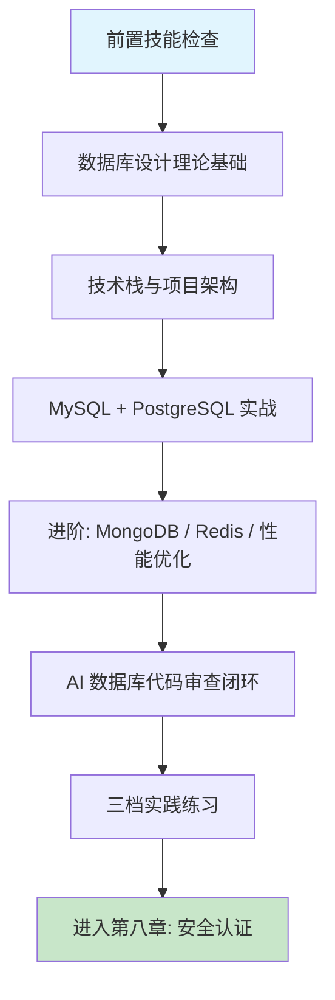

# 第七章 数据库设计与优化

## 1. 学习目标

本章将前端与后端积累的审查技能应用到数据库领域——这是 AI 最容易产生**破坏性错误**的领域，一个错误的 `DROP TABLE` 或缺失的 `WHERE` 子句可以摧毁生产数据。本章覆盖关系型（MySQL 8 / PostgreSQL 16）、文档型（MongoDB 7）与键值型（Redis 7）四类数据库的 AI 辅助设计与优化全链路。完成本章学习后，大家将能够：用结构化提示词驱动 AI 生成符合三范式的电商 DDL（含外键、索引、分区）、PostgreSQL 分析表（含 JSONB 索引、物化视图）、MongoDB Schema 验证规则与 Redis 缓存策略；用 `EXPLAIN`/`EXPLAIN ANALYZE` 量化判断 AI 生成查询的执行计划是否走索引；以"非生产数据库 + 危险语句扫描 + 边界数据测试"三道闸门保证 AI 生成的 SQL 在部署前是安全的；在 AI 生成的 DDL 中识别缺失外键、缺失索引、敏感数据明文、`DROP/TRUNCATE` 等四类致命缺陷。

### 1.1 学习路径图



### 1.2 预期学习成果

本章结束时将形成四份可验证的交付物：一份在**非生产数据库**上跑通过的电商 MySQL DDL（至少含 users、orders、order_items 三表，外键 / 索引 / 分区齐全）；一份 PostgreSQL 分析库配置（JSONB GIN 索引 + 物化视图 + 时间分区）；一份 Redis 分布式锁与限流的 Lua 脚本（保证原子性）；一份针对 AI 生成 SQL 的"审查 + EXPLAIN"记录（含至少一处缺失外键/索引的修复证据，与对应的执行计划 before/after 对比）。这四份交付物会作为第八章身份认证章节的存储层依据。

---

## 2. 前置技能检查

本章假设第六章后端 API 已完成，且对 SQL 与 NoSQL 的基本概念有可独立写出 CRUD 的能力。下面以 Ch1-Ch6 同款方式给出可执行自检清单。

### 2.1 环境与能力自检

| 维度               | 必备能力                                                          | 自检方法                                                     |
| :----------------- | :---------------------------------------------------------------- | :----------------------------------------------------------- |
| **SQL 基础**       | SELECT / INSERT / UPDATE / DELETE / 多表 JOIN / GROUP BY / 子查询 | 手写一条按用户分组统计订单总额的 SQL                         |
| **关系数据库概念** | 表、索引、约束（主键 / 外键 / 唯一 / CHECK）、事务与隔离级别      | 能解释为什么外键重要、READ COMMITTED 与 REPEATABLE READ 区别 |
| **NoSQL 基础**     | 文档型与键值型的适用场景、与关系型的取舍                          | 能列举三个不应该用 MongoDB 的业务场景                        |
| **执行计划基础**   | `EXPLAIN` 输出含义、type 列（ALL / index / range / ref / eq_ref） | 能识别 `type=ALL` 是全表扫描                                 |
| **Trae 操作**      | 熟练使用 Chat / Builder / CUE，能写出含四要素的提示词             | 用 Builder 生成一个 MySQL 建表语句并审查输出                 |
| **命令行工具**     | `mysql`、`psql`、`mongosh`、`redis-cli` 客户端可用                | 在本地分别连通四种数据库并执行一次基本查询                   |
| **后端章节产出**   | 第六章产出的 API 接口契约可作为本章数据建模输入                   | 手头有第六章 §8 沉淀的提示词模板与缺陷记录                   |

### 2.2 代码阅读自测

请确认能在 30 秒内读懂以下两段代码——它们代表本章默认的数据库基线水平。读不懂的部分需要回到 SQL/NoSQL 基础或对应官方文档补齐。

```sql
-- 多表 JOIN + 子查询 + 聚合
SELECT u.id, u.email, COUNT(o.id) AS order_count, SUM(o.total_amount) AS total_spent
FROM   users u
LEFT JOIN orders o ON o.user_id = u.id AND o.status = 'paid'
WHERE  u.created_at >= '2025-01-01'
GROUP BY u.id, u.email
HAVING total_spent > 1000
ORDER BY total_spent DESC
LIMIT 50;
```

```javascript
// MongoDB 聚合管道：按地区统计平均评分
db.product_reviews.aggregate([
  {
    $match: {
      rating: { $gte: 1, $lte: 5 },
      createdAt: { $gte: ISODate("2025-01-01") },
    },
  },
  { $group: { _id: "$region", avg: { $avg: "$rating" }, n: { $sum: 1 } } },
  { $match: { n: { $gte: 100 } } },
  { $sort: { avg: -1 } },
]);
```

> 任一项验证失败请回到对应章节排查；SQL/NoSQL 基线不达标会显著拉低 AI 输出审查的有效性——审查不是"读懂语法"，而是"用业务语义判断对错"。

---

## 3. 理论基础：AI 生成数据库代码的策略与陷阱

数据库是 AI 最容易产生**破坏性错误**的领域：前端代码出错最多让浏览器报错，后端代码出错最多让服务返回 500，但数据库代码出错可以**永久摧毁数据**。理解以下三组概念，是在接受 AI 生成的 DDL 之前必须建立的判断力。

### 3.1 关系型 vs 文档型 vs 键值型：AI 生成策略对比

| 数据库类型     | AI 生成质量                | 典型优势                             | 典型缺陷                                          |
| :------------- | :------------------------- | :----------------------------------- | :------------------------------------------------ |
| **MySQL**      | 高 — 训练数据最丰富        | DDL 结构完整、索引创建正确           | **外键约束经常遗漏**、字符集易回退到 latin1       |
| **PostgreSQL** | 中高 — 高级特性覆盖充分    | 分区表、JSONB、物化视图结构准确      | SERIAL vs IDENTITY 混淆、RLS 策略缺失             |
| **MongoDB**    | 中 — Schema 验证模式可预测 | 集合结构清晰、索引定义正确           | 嵌入 vs 引用决策欠佳、聚合管道效率低、缺 TTL 索引 |
| **Redis**      | 中低 — 数据结构多样        | 基本 GET/SET 与 String/Hash 操作正确 | Lua 脚本原子性、集群分片、哨兵配置缺失            |

> **选型铁律**：先用 MySQL/PostgreSQL 跑通业务，再按"文档非结构化→MongoDB""读密集缓存→Redis"的顺序按需引入。直接让 AI 生成"四种数据库混合架构"的命中率极低。

### 3.2 AI 生成 DDL/查询的六类高频缺陷

| 类别              | 典型表现                                                            | 如何发现                                                  | 审查优先级        | 修正提示词模板（按 [Ch2 §4.9](../第一部分-Trae基础入门/第二章-基础交互模式.md)）                                                                                        |
| :---------------- | :------------------------------------------------------------------ | :-------------------------------------------------------- | :---------------- | :---------------------------------------------------------------------------------------------------------------------------------------------------------------------- |
| **缺失外键**      | `order_items` 无 `FOREIGN KEY (order_id) REFERENCES orders(id)`     | `SHOW CREATE TABLE order_items` 检查 / `pg_dump --schema` | **P0**            | 保留表名与字段不变，补 `FOREIGN KEY (order_id) REFERENCES orders(id) ON DELETE RESTRICT`。不要动列定义。验证：插入孤儿 `order_id` 报 `errno 1452`                       |
| **缺失索引**      | 频繁出现在 WHERE / JOIN / ORDER BY 中的列无索引                     | `EXPLAIN SELECT ...` 看 `type=ALL` 或 Seq Scan            | **P0**            | 保留查询不变，对 WHERE/JOIN/ORDER BY 涉及列加 `INDEX` 或 `UNIQUE INDEX`（联合索引按选择性排序）。不要动 SQL。验证：`EXPLAIN` 不再出现 `type=ALL` 或 Seq Scan            |
| **敏感数据明文**  | 密码使用 VARCHAR 而非 CHAR(60) bcrypt；token 未加密                 | `grep -i "password\|secret\|token" schema.sql`            | **P0**            | 保留字段语义不变，password 改 `CHAR(60)` 存 bcrypt hash；token 加应用层 AES-GCM。不要动表名。验证：`SELECT password FROM users LIMIT 1` 返 `$2b$...` 而非明文           |
| **危险语句**      | 脚本开头 `DROP TABLE IF EXISTS` / 无 WHERE 的 `DELETE` / `TRUNCATE` | `grep -E "DROP\|TRUNCATE\|DELETE FROM[^W]*;" *.sql`       | **P0 — 生产致命** | 保留 schema 创建逻辑，删 `DROP TABLE IF EXISTS` 与 `TRUNCATE`；`DELETE` 必须带 `WHERE`。不要动表结构。验证：`grep -E "DROP\|TRUNCATE\|DELETE FROM[^W]*;" *.sql` 返 0    |
| **N+1 查询**      | ORM 默认懒加载产生循环 SELECT                                       | 慢日志 / `pg_stat_statements`                             | P1                | 保留 ORM 模型定义，关联查询用 `include` / `joinedload` 预加载。不要动业务逻辑。验证：单接口 SQL 执行次数 ≤ 3（慢日志确认）                                              |
| **字符集 / 时区** | 表用 `latin1` / `utf8`（伪 UTF-8）/ 时区未声明                      | `SHOW VARIABLES LIKE 'character_set%'` / `SHOW TIME ZONE` | P1                | 保留表名，统一改 `utf8mb4` + `COLLATE utf8mb4_0900_ai_ci`；时间列用 `TIMESTAMP WITH TIME ZONE`。不要动业务字段。验证：`SHOW VARIABLES LIKE 'character_set%'` 全 utf8mb4 |

> **铁律**：在接受 AI 生成的任何 SQL 前，在**非生产数据库**上跑一遍并执行 `EXPLAIN`，全文检索一遍 `DROP / TRUNCATE / DELETE FROM` 关键字。

### 3.3 传统数据库设计 vs AI 辅助数据库设计

| 维度            | 传统手动设计           | AI 辅助设计 (Trae)             | 核心转变                    |
| :-------------- | :--------------------- | :----------------------------- | :-------------------------- |
| **DDL 编写**    | 逐表手写 CREATE TABLE  | AI 一次生成全部建表语句        | 从「打字」→「审查约束」     |
| **索引设计**    | 分析慢查询后手动添加   | AI 根据查询模式推荐索引        | 从「分析」→「验证 EXPLAIN」 |
| **Schema 迁移** | 手写 migration 文件    | AI 生成 up / down migration    | 从「编码」→「审查回滚」     |
| **性能优化**    | 手动调参、看慢查询日志 | AI 分析 EXPLAIN 输出并建议优化 | 从「定位瓶颈」→「验证优化」 |
| **审查重心**    | 检查自己写的逻辑错误   | 检查 AI 生成的危险语句与缺约束 | 从「自查」→「审它」         |

---

## 4. 技术栈与项目架构

进入实战前先固化本章使用的技术组合与目录结构。版本统一是让 AI 输出可复用的前提——任意一处版本漂移都会导致 AI 沿用旧版语法（如 SQLAlchemy 1.x vs 2.x、MongoDB 4 vs 7 driver、Redis 6 vs 7 stream）。

### 4.1 技术栈选型

下表给出本章默认采用的版本组合。**最低版本**列必须显式写在提示词的「约束条件」中。

| 技术分类   | 主要技术                                          | 最低版本          | 在本章中的角色                       |
| :--------- | :------------------------------------------------ | :---------------- | :----------------------------------- |
| **关系型** | MySQL 8.0、PostgreSQL 16                          | MySQL 8.0 / PG 15 | MySQL 跑业务、PG 跑分析              |
| **文档型** | MongoDB 7                                         | 7.0               | 用户活动日志、评论、CMS              |
| **键值型** | Redis 7（含 Streams / Functions）                 | 7.0               | 缓存、分布式锁、限流、轻量队列       |
| **ORM**    | Prisma 5（Node）、SQLAlchemy 2（Py）、TypeORM 0.3 | 各自最新          | 强制类型化 ORM，禁止裸 SQL           |
| **迁移**   | Prisma Migrate、Alembic、golang-migrate           | 各自最新          | 强制 up + down 双向迁移              |
| **客户端** | mysql-cli 8、psql 16、mongosh 2、redis-cli 7      | 各自最新          | §7.2 危险语句扫描与 EXPLAIN 验证依赖 |
| **监控**   | Prometheus + Grafana、pg_stat_statements、PMM     | 各自最新          | 慢查询、连接池、QPS 可观测           |
| **备份**   | mysqldump、pg_dump、mongodump、Xtrabackup         | 各自最新          | 测试 / 上线前必跑                    |

**选型原则**：安全优先（外键 + 类型化 ORM 是基线，禁止 AI 生成裸 SQL 与 `latin1` 表）、可压测（默认集成 sysbench / pgbench）、可观测（默认开启 pg_stat_statements / MySQL slow_log）、版本统一（同一仓库内禁止 MySQL 5.7 / 8 混用）。

### 4.2 项目架构

本章实战项目 `data-management-system` 采用四数据库并行架构，便于在同一业务场景下对比四类数据库的 AI 生成质量与适用边界。

```bash
data-management-system/
├── README.md                        # 项目总览 + 选型说明
├── docker-compose.yml               # 四个数据库 + 一个监控面板
├── .env.example                     # 连接串与凭证模板（强制 env 化）
├── docs/
│   ├── data-model.md                # ER 图与集合关系
│   └── runbook.md                   # 备份 / 恢复 / 故障演练
├── mysql-ecommerce/                 # §5.1 主业务库
│   ├── schema/
│   │   ├── tables.sql               # 表 + 外键 + 索引
│   │   └── partitions.sql           # 按月分区
│   └── migrations/                  # 必含 up + down
├── postgres-analytics/              # §5.2 分析库
│   ├── schema/
│   │   ├── tables.sql               # 含 JSONB
│   │   └── partitions.sql           # 时间分区
│   └── views/
│       └── materialized.sql         # 物化视图 + 刷新策略
├── mongodb-collections/             # §6.1
│   ├── validators/                  # JSON Schema 验证
│   └── indexes/                     # 复合 / TTL / 文本 / 地理
├── redis-strategies/                # §6.2
│   └── scripts/                     # lock.lua / rate-limit.lua
└── monitoring/                      # §6.3
    ├── prometheus.yml
    └── grafana-dashboards/
```

> 四数据库并行的目的是训练"在同一业务问题上判断该选哪种存储"。**实际项目通常只用 1-2 种**——电商业务用 MySQL + Redis 即可覆盖 80% 场景。

---

## 5. MySQL 与 PostgreSQL 实战

本节走通两个主流关系型数据库的「提示词 → 生成 → 审查 → 改进」完整链路。MongoDB 与 Redis 的进阶模式在 §6 集中处理。

### 5.1 MySQL 8 电商主业务库

#### 5.1.1 提示词模板

```text
为电商主业务库生成 MySQL 8.0 DDL，要求：

【业务范围】
- 用户：users（认证 + 角色）、user_addresses
- 商品：products、categories、inventory
- 订单：orders（按月分区）、order_items、payments
- 审计：audit_logs

【DDL 硬约束】
- 字符集：utf8mb4 + utf8mb4_0900_ai_ci，禁止 latin1 / utf8
- 引擎：InnoDB；所有表必须有 PRIMARY KEY
- 外键：所有 *_id 列必须显式 FOREIGN KEY，ON DELETE 策略明确（RESTRICT / CASCADE / SET NULL）
- 密码列：CHAR(60) 存 bcrypt，禁止 VARCHAR
- 时间列：TIMESTAMP + ON UPDATE CURRENT_TIMESTAMP；显式声明 DEFAULT
- 金额列：DECIMAL(12,2)，禁止 FLOAT/DOUBLE

【索引硬约束】
- 所有外键列必须有索引
- 复合索引按"等值列在前、范围列在后"排列
- 高基数列（email / order_no）必须 UNIQUE

【生成约束】
- 输出按 tables.sql / indexes.sql / partitions.sql 三文件分离
- 禁止脚本顶部出现 DROP TABLE / TRUNCATE
- 迁移文件必须含 up + down 两段
```

#### 5.1.2 AI 生成的电商 DDL（带审查标注）

下面是 Trae 通常会为电商架构中的核心三表生成的代码。**注释标出了 AI 做对的地方与遗漏的地方**——审查闭环不是"看 AI 写了什么"，而是"看 AI 漏了什么"。

```sql
-- 用户表
CREATE TABLE users (
    id BIGINT AUTO_INCREMENT PRIMARY KEY,
    username VARCHAR(50) NOT NULL UNIQUE,
    email VARCHAR(255) NOT NULL UNIQUE,
    password_hash CHAR(60) NOT NULL,                            -- ✅ bcrypt 哈希固定 60 字符
    role ENUM('customer', 'admin', 'seller') DEFAULT 'customer',
    created_at TIMESTAMP DEFAULT CURRENT_TIMESTAMP,
    updated_at TIMESTAMP DEFAULT CURRENT_TIMESTAMP ON UPDATE CURRENT_TIMESTAMP,
    INDEX idx_email (email),                                    -- ✅ 登录查询索引
    INDEX idx_role_created (role, created_at)                   -- ✅ 复合索引顺序正确
) ENGINE=InnoDB DEFAULT CHARSET=utf8mb4 COLLATE=utf8mb4_0900_ai_ci;

-- 订单表（按月分区）
CREATE TABLE orders (
    id BIGINT AUTO_INCREMENT,
    user_id BIGINT NOT NULL,
    order_no VARCHAR(32) NOT NULL,
    total_amount DECIMAL(12,2) NOT NULL,                        -- ✅ 金额用 DECIMAL
    status ENUM('pending','paid','shipped','cancelled') DEFAULT 'pending',
    created_at TIMESTAMP DEFAULT CURRENT_TIMESTAMP,
    PRIMARY KEY (id, created_at),                               -- 分区键必须在主键中
    UNIQUE KEY uniq_order_no (order_no, created_at),            -- ✅ 业务订单号唯一
    FOREIGN KEY (user_id) REFERENCES users(id) ON DELETE RESTRICT,  -- ✅ 显式 ON DELETE
    INDEX idx_user_status (user_id, status, created_at)         -- ✅ 用户 + 状态 + 时间
) ENGINE=InnoDB DEFAULT CHARSET=utf8mb4
PARTITION BY RANGE (UNIX_TIMESTAMP(created_at)) (
    PARTITION p202501 VALUES LESS THAN (UNIX_TIMESTAMP('2025-02-01')),
    PARTITION p202502 VALUES LESS THAN (UNIX_TIMESTAMP('2025-03-01')),
    PARTITION p_future VALUES LESS THAN MAXVALUE
);

-- ⚠️ AI 生成时容易遗漏：order_items 缺少对 orders 的外键
-- 审查发现并手动补全：
CREATE TABLE order_items (
    id BIGINT AUTO_INCREMENT PRIMARY KEY,
    order_id BIGINT NOT NULL,
    product_id BIGINT NOT NULL,
    quantity INT NOT NULL CHECK (quantity > 0),
    unit_price DECIMAL(10,2) NOT NULL,
    -- ⚠️ AI 经常生成裸字段：FOREIGN KEY 完全缺失
    -- 必须手动补齐两条外键 + 对应索引
    FOREIGN KEY (order_id) REFERENCES orders(id) ON DELETE CASCADE,
    FOREIGN KEY (product_id) REFERENCES products(id) ON DELETE RESTRICT,
    INDEX idx_order (order_id),
    INDEX idx_product (product_id)
) ENGINE=InnoDB DEFAULT CHARSET=utf8mb4;
```

**审查发现**：AI 正确实现了字符集、bcrypt CHAR(60)、DECIMAL 金额、分区键、复合索引顺序；但 (1) `order_items` 经常缺失外键——这是 §3.2 标注的 P0；(2) `audit_logs` 表的 `details` 列容易回退到 TEXT 而非 JSON；(3) 分区只生成 3 个月，需要补齐到 12 个月或加分区维护事件。

#### 5.1.3 EXPLAIN 验证

让 AI 生成的索引"看起来合理"还不够，必须用 `EXPLAIN` 验证执行计划真正走了索引：

```sql
-- 业务高频查询：查某用户最近 10 笔已支付订单
EXPLAIN SELECT id, order_no, total_amount, created_at
FROM   orders
WHERE  user_id = 12345 AND status = 'paid'
ORDER BY created_at DESC
LIMIT 10;
```

**期望结果**：`type=ref`（或更优 `eq_ref`）、`possible_keys` 含 `idx_user_status`、`Extra` 不出现 `Using filesort`。若出现 `type=ALL` 或 `Using filesort`，说明索引设计未命中查询模式，需要重新调整 `idx_user_status` 的列顺序或新建覆盖索引。

### 5.2 PostgreSQL 16 分析库

#### 5.2.1 提示词模板

```text
为分析数据库生成 PostgreSQL 16 DDL，要求：

【业务范围】
- analytics_events：用户行为事件（按天分区，含 JSONB 自定义属性）
- products：商品分析视图（JSONB attributes）
- user_profiles：用户画像（JSONB tags）
- recommendations：推荐结果物化视图

【DDL 硬约束】
- 主键统一用 GENERATED ALWAYS AS IDENTITY，禁止 SERIAL（PG 10+ 推荐写法）
- 时间列：TIMESTAMPTZ + 默认 CURRENT_TIMESTAMP，强制带时区
- JSONB 列必须建 GIN 索引（针对实际查询路径）
- 时间分区：使用 PARTITION BY RANGE (event_time)，每天一个分区
- 启用 RLS（Row-Level Security）保护用户级数据

【性能要求】
- 物化视图必须配套 REFRESH MATERIALIZED VIEW CONCURRENTLY 的定时策略
- 提供 pg_stat_statements 接入说明
- 禁止脚本顶部出现 DROP / TRUNCATE
```

#### 5.2.2 关键差异点（与 MySQL 对照）

| 维度         | MySQL 8                                     | PostgreSQL 16                         |
| :----------- | :------------------------------------------ | :------------------------------------ |
| **主键**     | `BIGINT AUTO_INCREMENT`                     | `BIGINT GENERATED ALWAYS AS IDENTITY` |
| **时间**     | `TIMESTAMP` + `ON UPDATE CURRENT_TIMESTAMP` | `TIMESTAMPTZ` + 触发器实现 updated_at |
| **JSON**     | `JSON`（5.7+）                              | `JSONB` + GIN 索引（标准做法）        |
| **分区**     | `PARTITION BY RANGE (UNIX_TIMESTAMP)`       | `PARTITION BY RANGE (event_time)`     |
| **AI 陷阱**  | 字符集回退 / 缺外键                         | SERIAL vs IDENTITY 混淆 / RLS 缺失    |
| **审查重点** | `SHOW CREATE TABLE` + 字符集                | `\d+ table` + RLS + JSONB 索引选择性  |

> **JSONB 索引陷阱**：AI 经常对整个 JSONB 列建 GIN 索引而不区分查询模式。若实际只查 `attributes->>'category'`，应建表达式索引 `CREATE INDEX ON products USING GIN ((attributes->'category'))` 而非全列 GIN，可显著降低索引体积。

---

### 5.3 Vibe Coding 循环实录：商品列表 N+1 修正

> **修正语法**：「修正提示词」按 [Ch2 §4.9 修正提示词语法](../第一部分-Trae基础入门/第二章-基础交互模式.md) 模板；3 轮未收敛触发 §4.10。模式选择查 [Ch1 §5.4](../第一部分-Trae基础入门/第一章-Trae简介与环境配置.md)。

| 轮次 | AI 输出摘要                       | 发现的缺陷                            | 修正提示词（按 §4.9）                                                                                                                                                                           | 验证信号              |
| :--- | :-------------------------------- | :------------------------------------ | :---------------------------------------------------------------------------------------------------------------------------------------------------------------------------------------------- | :-------------------- |
| R1   | ORM 查商品后在循环里逐条查类目    | 经典 N+1：一次请求变成 N+1 次 SQL     | 保留 listProducts 接口签名与返回类型，修复查询逻辑：改用 ORM 的 join / include 一次加载类目。原因：循环查是 N+1，压低吞吐。不要动接口签名。验证：DB 日志请求 SQL 计数 == 1                      | DB 请求 SQL 计数 == 1 |
| R2   | join 后 `SELECT * FROM products`  | 拉了大 BLOB / TEXT 字段，网络传输放大 | 保留 join 结构，修复列选择：显式 `SELECT id, name, price, category_name`，移除 `description`、`image_blob`。原因：列表页不需详情。不要动 join 条件。验证：`EXPLAIN ANALYZE` 输出 cost 下降 ≥50% | EXPLAIN cost 降 ≥50%  |
| R3   | `category_id` 上无索引仕 Seq Scan | 热查询 P95 超 100ms                   | 保留 SQL 语句不变，修复索引：生成 migration `CREATE INDEX idx_products_category ON products(category_id)`。原因：FK 列需索引支持 join。不要动 SQL。验证：`EXPLAIN ANALYZE` 出现 Index Scan      | EXPLAIN 出 Index Scan |

> **收敛信号**：1 SQL + 选列精准 + Index Scan。如未收敛触发 §4.10 信号 1：拆 prompt 为「去 N+1」 / 「限列」 / 「加索引」三轮。

---

## 6. 进阶：MongoDB、Redis 与性能优化

三类进阶场景遵循同一范式："基础业务先用关系型跑通 → 局部场景按需引入"。下表给出关键差异点与精简提示词。

### 6.1 进阶场景速查表

| 场景           | 适用条件                              | 关键差异                                                      | 核心提示词（精简版）                                                                                                   |
| :------------- | :------------------------------------ | :------------------------------------------------------------ | :--------------------------------------------------------------------------------------------------------------------- |
| **MongoDB**    | 半结构化日志 / CMS / 评论 / 实时聊天  | JSON Schema 验证、复合索引、TTL 索引、GeoSpatial、聚合管道    | `用 MongoDB 7 设计 user_activities / product_reviews / chat_messages 集合，写 JSON Schema 验证、TTL 索引、复合索引`    |
| **Redis 缓存** | 热点查询缓存 / 会话 / 计数 / 分布式锁 | cache-aside、TTL + LRU、Lua 脚本原子性、cluster slot 分布     | `用 Redis 7 + Lua 实现分布式锁、令牌桶限流、用户会话；保证 SET-NX-EXPIRE 单脚本原子；cluster 模式可用`                 |
| **慢查询治理** | P95 > 100ms 或 CPU > 70%              | 慢日志开启、`EXPLAIN ANALYZE`、覆盖索引、读写分离、连接池调优 | `分析 orders 表 P95 > 200ms 的查询：开启 slow_log（long_query_time=0.1）、提取 top 10 慢查询、用 EXPLAIN 给出索引建议` |

### 6.2 进阶提示词使用约定

进阶场景的提示词必须满足三个条件，否则 AI 输出几乎不可用：

1. **承接已有 schema**：明确"在 §5.1 已生成的 mysql-ecommerce schema 基础上"扩展，否则 AI 会重新设计冲突的字段名。
2. **量化目标**：写明 P95、QPS、缓存命中率、慢查询阈值等具体数值，AI 才会选择恰当的优化手段；模糊描述如"高性能"会得到通用模板。
3. **审查检查点**：在提示词末尾追加"输出后对照 §3.2 六类缺陷与 §7.2 危险语句清单自检"，AI 会主动给出 checklist。

> 不要在第一轮就让 AI 生成"四数据库统一架构 + 完整监控告警"——上下文超限会导致每个模块都做不彻底。逐个引入、每次审查通过后再叠加是更稳妥的做法。

### 6.3 性能优化基线指标

| 指标                 | 目标值（默认场景）           | 测量工具                            | 主要优化手段                     |
| :------------------- | :--------------------------- | :---------------------------------- | :------------------------------- |
| **关系查询 P95**     | < 100ms（读）/ < 200ms（写） | `pg_stat_statements` / slow_log     | 覆盖索引、覆盖分区裁剪           |
| **慢查询占比**       | < 1%                         | slow_log + `pt-query-digest`        | 索引调优、SQL 重写               |
| **缓存命中率**       | > 80%                        | Redis `INFO stats`                  | 合理 TTL + 二级缓存              |
| **连接池占用**       | < 70%                        | Prisma metrics / `pg_stat_activity` | 连接池大小、长事务治理           |
| **MongoDB 集合扫描** | `COLLSCAN` < 5%              | `db.currentOp()` / 慢日志           | 复合索引、查询字段限制           |
| **Redis 内存碎片率** | < 1.5                        | `INFO memory`                       | maxmemory-policy + 重启 / defrag |

---

## 7. AI 生成数据库代码的审查闭环

### 7.1 四步审查清单（数据库特化）

回顾第一章 §7 的「四步审查法」，数据库代码的安全性审查至关重要——一个错误的 `DROP TABLE` 或缺失的 `WHERE` 子句可以摧毁生产数据。

| 步骤         | 数据库特定检查                                                                          |
| :----------- | :-------------------------------------------------------------------------------------- |
| **正确性**   | 表结构是否符合业务？外键关系是否正确？字段类型是否合理（金额禁 FLOAT、密码 CHAR(60)）？ |
| **安全性**   | 密码是否 bcrypt？是否有 SQL 注入风险（裸字符串拼接）？敏感字段是否加密？是否有 RLS？    |
| **性能**     | WHERE/JOIN/ORDER BY 列是否都有索引？是否有 N+1？分区键是否合理？连接池是否够用？        |
| **可维护性** | 是否有 up + down 迁移？字符集/时区是否统一？是否有数据字典与 schema 注释？              |

### 7.2 三道闸门：必跑的部署前检查

在接受 Trae 生成的任何 SQL 前，依次跑完以下三道闸门；任意一道失败都禁止进入生产数据库。

**闸门 1：危险语句扫描**:

```bash
# 全文扫描 DROP / TRUNCATE / 无条件 DELETE
grep -rE '\b(DROP\s+(TABLE|DATABASE|SCHEMA)|TRUNCATE|DELETE\s+FROM\s+\w+\s*;)' \
     ./mysql-ecommerce ./postgres-analytics

# 任何命中都需要人工确认；典型情况下生产部署脚本不应包含这些关键字
```

**闸门 2：非生产数据库验证**:

```bash
# 在隔离的本地容器或 staging 库上跑 schema
docker compose -f docker-compose.staging.yml up -d mysql
mysql -h 127.0.0.1 -P 33060 -uroot -p < mysql-ecommerce/schema/tables.sql
mysql -h 127.0.0.1 -P 33060 -uroot -p -e "SHOW CREATE TABLE order_items\G" | grep -i "FOREIGN KEY"
# 期望：order_items 至少出现两条 FOREIGN KEY；没有就回到 §5.1.2 修复
```

**闸门 3：EXPLAIN 执行计划核对**:

```sql
-- 业务高频 Top 5 查询逐条 EXPLAIN，检查 type / Extra
EXPLAIN SELECT ... FROM orders WHERE user_id=? AND status=? ORDER BY created_at DESC LIMIT 10;
-- 期望：type=ref/eq_ref；Extra 不含 'Using filesort' / 'Using temporary'
-- 失败：调整 idx_user_status 列顺序或新建覆盖索引
```

> **铁律**：三道闸门全部通过才能进生产；一旦发现 AI 在脚本里写了 `DROP TABLE IF EXISTS`，**整个脚本作废重提示词**——这不是"小问题"，是 AI 对你存量数据的最严重威胁。

### 7.3 扫到问题后用什么提示词改？

三道闸门只识别「危险脚本」；下一步必须按统一语法把意图写回 AI（参照 [Ch2 §4.9](../第一部分-Trae基础入门/第二章-基础交互模式.md)），不要让 AI 自由删表。

| 闸门命中                                | 命中后修正提示词模板                                                                                                                                                                                                                                                                                              |
| :-------------------------------------- | :---------------------------------------------------------------------------------------------------------------------------------------------------------------------------------------------------------------------------------------------------------------------------------------------------------------- |
| 闸门 1：DROP/TRUNCATE/无 WHERE DELETE   | 保留 schema 创建顺序与字段定义，删除所有 `DROP TABLE IF EXISTS` / `TRUNCATE` / 无 `WHERE` 的 `DELETE`；需要重置改用迁移工具的 `down` 脚本（`flyway` / `alembic` / `prisma migrate reset` 仅 dev）。不要动表结构。验证：`grep -rE "DROP\|TRUNCATE\|DELETE FROM[^W]*;" *.sql` 返 0；干净库 idempotent 跑 2 次成功。 |
| 闸门 2：staging 验证（外键 / 索引缺失） | 保留表名与字段名，按 §3.2 缺陷表补外键 `ON DELETE`、索引（高频 WHERE/ORDER BY 列）、`bcrypt` 密码列 `CHAR(60)`。不要动主键策略。验证：`SHOW CREATE TABLE` 含期望 FK；`EXPLAIN` 走索引（type=ref/eq_ref）。                                                                                                        |
| 闸门 3：EXPLAIN 出现 filesort/temporary | 保留查询语义，按 WHERE+ORDER BY 列顺序新建覆盖索引或调整复合索引列序。不要动业务条件。验证：`EXPLAIN` 中 `Extra` 不含 `Using filesort` / `Using temporary`；P95 下降 ≥ 5×。                                                                                                                                       |

> 3 轮未收敛触发 [§4.10](../第一部分-Trae基础入门/第二章-基础交互模式.md) 的「换模式 / 缩范围 / 拆步骤」。

---

## 8. 实践练习

以下练习按难度递增分三档，要求**自己编写提示词**。每完成一项，按 §3.2 六类缺陷表与 §7.2 三道闸门逐项验证。

### 8.1 基础题：单库 schema 实战

#### 8.1.1 用户管理 schema (PostgreSQL)

**要求**：用 PostgreSQL 16 设计用户管理库，包含 users（认证）、roles（角色）、permissions（权限）、user_roles / role_permissions（多对多关联）、audit_logs。要求：所有外键显式 ON DELETE；密码 CHAR(60) bcrypt；`audit_logs.details` 用 JSONB + GIN 索引；启用 RLS 让普通用户只能看自己的 audit_logs。

**你的任务**：自己写提示词（参考 §5.1.1 模板），提交给 Trae，对照 §3.2 与 §7.2 闸门，记录至少一处需要修复的问题（例如缺失的 RLS 策略或外键 ON DELETE 漏配）。

#### 8.1.2 商品分析 JSONB 索引 (PostgreSQL)

**要求**：基于 §5.2 的 products 表，为业务高频查询 `WHERE attributes @> '{"category": "electronics"}'` 与 `WHERE attributes->>'brand' = 'Apple'` 设计两个不同的 JSONB 索引；用 `EXPLAIN ANALYZE` 验证两条查询都走索引而非顺序扫描。

**你的任务**：让 AI 生成索引，自己跑 `EXPLAIN ANALYZE` 验证；若出现 `Seq Scan` 则调整索引类型（GIN vs 表达式索引）。

### 8.2 进阶题：多组件协同与压测

#### 8.2.1 Redis 分布式锁 + 限流 Lua

**要求**：用 Redis 7 + Lua 脚本实现：(1) 分布式锁（SET key value NX PX + 释放时校验 value 防误删，全部在一段 Lua 中完成保证原子）；(2) 令牌桶限流（每秒补 N 个令牌，最多 M 个）。两段 Lua 都必须能在 Redis Cluster 模式下用 hashtag 保证同 slot。

**性能验收**：用 `redis-benchmark -t eval` 压测 Lua 脚本，QPS > 50k 单节点；锁误释放率 = 0（用并发竞争脚本验证）。

#### 8.2.2 MySQL 慢查询治理

**要求**：在 §5.1 的 orders 表中插入 100 万行模拟数据，开启 `slow_log = ON, long_query_time = 0.1`，跑 `pt-query-digest` 提取 Top 5 慢查询；让 AI 给出索引优化建议；对每条建议做 before / after `EXPLAIN` + 实测耗时对比。

**交付物**：一份 5 行的慢查询治理表（查询语句 / 优化前耗时 / 优化前 type / 索引建议 / 优化后耗时 / 优化后 type），证明每条建议都有效。

### 8.3 开放题：AI 输出审查与提示词复用

#### 8.3.1 危险语句植入实验

**要求**：让 Trae 生成一份包含 8 张表的电商 schema。**不告诉 AI 任何审查要求**。然后用 §7.2 闸门 1 的 `grep` 命令扫描，统计 AI 生成 `DROP/TRUNCATE/无条件 DELETE` 的命中率；用闸门 3 的 `EXPLAIN` 检查 5 条业务高频查询是否走索引。

**交付物**：一份 8×6 的"表 × 缺陷"命中表（覆盖 §3.2 六类缺陷），列出哪张表缺哪类约束、复现方式、修复 patch。

#### 8.3.2 提示词模板沉淀

**要求**：基于 §8.1、§8.2 的产出，沉淀一份团队可复用的"数据库 schema 提示词模板"，必须包含：固定的字符集 / 时区 / 主键风格、强制的外键 / 索引 / 密码列约束、明确的"禁止 DROP/TRUNCATE"条款、§7.2 三道闸门 checklist。

**交付物**：一份不超过 800 字的模板，作为后续章节（第八章身份认证、第九章后续微服务）的复用资产。

> 三档练习产出的提示词与缺陷记录会作为第八章身份认证的存储层依据；请认真完成并存档，特别是 §8.3.2 的提示词模板会在权限模型设计中再次使用。

---

## 9. 小结

本章以 MySQL 8 与 PostgreSQL 16 为主线，把第一部分提示词工程与第六章后端审查能力放进数据库设计这一**风险最高**的工程领域里检验。核心收获包括：**AI 生成 DDL 的质量分梯度明显**——MySQL 训练数据最丰富首版可用率最高，PG 高级特性次之，MongoDB 与 Redis 的 schema/Lua 需要最严格的人工审查；**数据库审查必须落到执行计划与危险语句扫描**——`EXPLAIN` / `pg_stat_statements` 是判断索引是否真正生效的硬指标，`grep DROP/TRUNCATE` 是阻断破坏性脚本的最后防线；**外键缺失是 AI 最高频的 P0 缺陷**——任何 `*_id` 列都必须显式 FOREIGN KEY + ON DELETE 策略，AI 生成的 90% schema 在这点上不合格；**性能优化必须先 baseline 后改**——P95 / 慢查询占比 / 缓存命中率 / COLLSCAN 占比是判断 AI 输出是否生产可用的硬标尺；**三道闸门是不可跳过的纪律**——危险语句扫描 + 非生产数据库验证 + EXPLAIN 计划核对，缺一不可。

下一章进入身份认证与权限管理，本章产出的 users / roles / permissions schema（§8.1.1）将作为第八章 RBAC 与 JWT 的存储层依据；审查重心会从 schema 与索引转移到加密策略、token 生命周期与攻击面分析。

---

## 10. 延伸阅读

以下资源覆盖关系型数据库、NoSQL 与监控运维、AI 辅助数据库开发实践三条主线。

### 10.1 关系型数据库

- [PostgreSQL 16 官方文档](https://www.postgresql.org/docs/16/) — 重点关注 Performance Tips、Indexes 与 Partitioning 章节，是审查 AI 生成 PG DDL 的权威标尺。
- [MySQL 8.0 Optimization Guide](https://dev.mysql.com/doc/refman/8.0/en/optimization.html) — `EXPLAIN` 输出与索引设计的官方说明，§5.1.3 与 §7.2 闸门 3 直接依赖此文档。
- [Use The Index, Luke!](https://use-the-index-luke.com/) — Markus Winand 的索引设计经典教程，跨数据库覆盖 B-Tree 选择性、复合索引顺序等核心议题。
- [PostgreSQL Performance Tuning](https://wiki.postgresql.org/wiki/Performance_Optimization) — 社区维护的性能优化清单，含 pg_stat_statements 接入方法。

### 10.2 NoSQL、缓存与运维

- [MongoDB Manual (v7.0)](https://www.mongodb.com/docs/v7.0/) — JSON Schema 验证、聚合管道、复合 / TTL / 地理索引的权威说明。
- [Redis 官方文档](https://redis.io/docs/) — Streams / Functions / Cluster 章节是审查 AI 生成 Redis 代码的依据；Lua 脚本最佳实践见 EVAL 文档。
- [pt-query-digest 文档](https://docs.percona.com/percona-toolkit/pt-query-digest.html) — §8.2.2 慢查询治理的核心工具，能从 slow_log 提取 Top N 慢查询及指纹。
- [Prometheus MySQL Exporter](https://github.com/prometheus/mysqld_exporter) / [PostgreSQL Exporter](https://github.com/prometheus-community/postgres_exporter) — 本章 §6.3 监控基线指标的采集器实现。

### 10.3 AI 辅助数据库开发与安全

- [OWASP SQL Injection Prevention Cheat Sheet](https://cheatsheetseries.owasp.org/cheatsheets/SQL_Injection_Prevention_Cheat_Sheet.html) — 与 §3.2 安全性检查项一致，是审查 AI 生成动态 SQL 的依据。
- [Prisma Migrate 文档](https://www.prisma.io/docs/concepts/components/prisma-migrate) / [Alembic 文档](https://alembic.sqlalchemy.org/) — 强制 up + down 双向迁移的工具，避免 AI 生成不可回滚的破坏性脚本。
- [Trae 官方文档](https://docs.trae.ai/) — Skills 系统与 MCP 工具生态，是沉淀 §8.3.2 团队提示词模板的基础。
- [Anthropic · Building Effective Agents](https://www.anthropic.com/research/building-effective-agents) — Workflow vs Agent 的设计模式综述，对应本章「一次提示词生成 schema + EXPLAIN 验证 + 慢查询治理」的工作流。

---

> **进入第八章前**：完成 §8 的至少一道基础题与一道开放题，把产出的提示词模板（§8.3.2）与危险语句扫描结果（§8.3.1）归档；这是第八章身份认证 RBAC 模型与权限存储层设计的前置输入。
