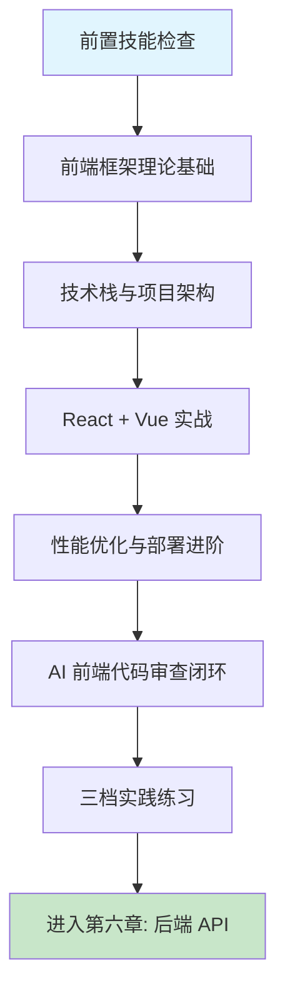

# 第五章 现代前端开发实战

## 1. 学习目标

本章承接第一部分的基础交互技能，将其应用到现代前端工程中：用 React 18 / Vue 3 从零构建包含路由、状态管理、组件化结构和响应式布局的完整前端应用；用 TypeScript 强类型系统减少 AI 生成代码中的运行时错误；以四步审查法识别 AI 生成前端代码中的 hooks 清理缺失、不必要的重新渲染、XSS 风险和过时的 API 调用。完成本章学习后，大家将能够：用结构化提示词驱动 AI 生成 React / Vue 生产级组件和项目架构；在浏览器控制台中定位并修复 AI 生成代码的红色警告；以 Lighthouse 与 Web Vitals 量化性能优化效果；为任一主流框架编写可复用的提示词模板。

### 1.1 学习路径图



### 1.2 预期学习成果

本章结束时将形成三份可验证的交付物：一个在本地可运行的 React 18 + TypeScript 管理系统骨架（含路由、状态管理、Ant Design 组件）；一个 Vue 3 + Composition API 电商页面（含 Pinia、Element Plus、Vite 构建）；一份针对 AI 生成 DataTable 组件的审查记录（含发现的 hooks 清理缺失、重渲染问题与对应修复）。这三份交付物会作为第六章后端 API 的前端联调对象。

---

## 2. 前置技能检查

本章假设第一部分已完成，且对 JavaScript ES6+ 与 HTML/CSS 有可独立运行小型页面的能力。下面以 Ch1/Ch2/Ch3 同款方式给出可执行自检清单。

### 2.1 环境与能力自检

| 维度                | 必备能力                                                           | 自检方法                                                 |
| :------------------ | :----------------------------------------------------------------- | :------------------------------------------------------- |
| **Trae 基础操作**   | 熟练使用 Chat / Builder / CUE 三大入口，能独立完成环境配置         | 用 `/plan` 生成任意一个简单页面的开发计划                |
| **自然语言编程**    | 能写出含「动作词 + 目标 + 要求 + 约束」四要素的结构化提示词        | 不参考模板独立写一个 React 组件的完整提示词              |
| **JavaScript ES6+** | 异步编程 (async/await)、模块系统 (import/export)、解构与模板字符串 | 能读懂 `fetchUserData` 异步函数和 `UserProfile` 组件代码 |
| **HTML/CSS**        | 语义化标签、Flexbox/Grid 布局、响应式设计、CSS 变量                | 能手写一个两栏自适应布局                                 |
| **HTTP 与 RESTful** | 理解请求方法、状态码、JSON 结构、CORS 概念                         | 能读懂 `curl` 输出并判断错误类型                         |
| **Node.js 工具链**  | Node 18+ 与 npm/pnpm 可用，能执行 `vite` / `create-react-app`      | `node -v` / `pnpm -v` 正常输出                           |
| **Git 基础**        | clone / add / commit / branch / merge 基本工作流                   | 能独立完成一次 feature 分支提交                          |

### 2.2 代码阅读自测

请确认能在 30 秒内读懂以下两段代码——它们代表本章默认的 JavaScript 基线水平。读不懂的部分需要回到第一部分或 MDN 补齐基础后再进入 §3。

```javascript
// 异步数据获取
const fetchUserData = async (userId) => {
  try {
    const response = await fetch(`/api/users/${userId}`);
    const userData = await response.json();
    return userData;
  } catch (error) {
    console.error("获取用户数据失败:", error);
    throw error;
  }
};

// 组件化思维
const UserProfile = ({ user, onUpdate }) => {
  const [isEditing, setIsEditing] = useState(false);
  // 组件逻辑...
};
```

> 任一项验证失败请回到对应章节排查；JavaScript 基线不达标会显著拉低 AI 输出审查的有效性。

---

## 3. 理论基础：AI 生成前端代码的策略与陷阱

第一部分教会了用提示词驱动 AI 写代码，但前端代码有其特殊性：它是用户直接交互的第一层，错误会即时暴露在浏览器控制台中。理解以下三组概念，能让 AI 生成的代码质量显著提高。

### 3.1 框架选择对 AI 生成质量的影响

AI 对不同前端框架的训练数据量差异巨大，直接影响生成代码的质量和可靠性。选型前先评估「AI 友好度」与团队需求的匹配度，比纯粹的性能 benchmark 更关键。

| 框架           | AI 生成质量                         | 典型优势                                  | 典型缺陷                                                   |
| :------------- | :---------------------------------- | :---------------------------------------- | :--------------------------------------------------------- |
| **React 18**   | 高 — 训练数据最丰富                 | 组件化结构清晰、Hooks 模式准确            | 容易生成过时的 class 组件、缺失 useEffect 清理             |
| **Vue 3**      | 中高 — Composition API 覆盖充分     | `<script setup>` 语法准确、响应式逻辑正确 | Options API 与 Composition API 混用、`ref`/`reactive` 混淆 |
| **Angular 15** | 中 — 版本碎片化影响准确度           | 模块结构完整                              | 过时的 NgModule 模式、不兼容的 RxJS 版本                   |
| **Next.js 13** | 中 — Server Components 知识截至较新 | App Router 结构基本正确                   | 'use client' 指令遗漏、Server/Client 边界混淆              |

### 3.2 AI 生成前端代码的六类高频缺陷

| 类别                 | 典型表现                                                          | 浏览器症状                                                           | 审查优先级 | 修正提示词模板（按 [Ch2 §4.9](../第一部分-Trae基础入门/第二章-基础交互模式.md)）                                                                 |
| :------------------- | :---------------------------------------------------------------- | :------------------------------------------------------------------- | :--------- | :----------------------------------------------------------------------------------------------------------------------------------------------- |
| **Hooks 清理缺失**   | `setInterval` / `addEventListener` 未在 `useEffect` return 中清理 | 内存泄漏、计时器加速                                                 | **P0**     | 保留 useEffect 业务体不变，补 `return () => clearInterval(id) / removeEventListener(...)`。不要动依赖数组。验证：unmount 后 console 无定时器日志 |
| **状态更新竞态**     | 组件卸载后仍调用 `setState`                                       | React 警告："Can't perform a state update on an unmounted component" | **P0**     | 保留请求逻辑不变，包 `AbortController` + `isMounted` ref 守卫 setState。不要动 fetch URL。验证：快速切路由 0 React 警告                          |
| **不必要的重新渲染** | 未使用 `useMemo`/`useCallback`，props 每次创建新引用              | 页面卡顿、JS 帧率下降                                                | P1         | 保留组件层级不变，父级传给子组件的对象/函数包 `useMemo` / `useCallback`。不要动 JSX 结构。验证：DevTools Profiler 子组件 render 次数 = 1         |
| **过时的 API**       | `componentWillMount`、`ReactDOM.render`（React 17 旧 API）        | 编译警告或运行时错误                                                 | P1         | 保留组件功能不变，`componentWillMount → useEffect`，`ReactDOM.render → createRoot`。不要动业务逻辑。验证：控制台 0 deprecation warning           |
| **XSS 漏洞**         | `dangerouslySetInnerHTML` 无输入清理                              | 无直接症状，安全隐患                                                 | **P0**     | 保留富文本展示需求，`dangerouslySetInnerHTML` 前用 `DOMPurify.sanitize(html)`。不要动渲染位置。验证：注入 `<script>alert(1)</script>` 不弹窗     |
| **缺失无障碍属性**   | 无 `aria-label`、`role`、`tabIndex`                               | 键盘无法导航、屏幕阅读器失效                                         | P2         | 保留视觉样式不变，补 `aria-label` / `role` / `tabIndex`。不要动 className。验证：axe-core 0 violations                                           |

> 在收到 AI 生成的前端代码后，对照这张表逐项检查。红色控制台警告 = AI 出了错，不是浏览器的 Bug。

### 3.3 传统前端开发 vs AI 辅助前端开发

| 维度         | 传统手动开发                       | AI 辅助开发 (Trae)                  | 核心转变                    |
| :----------- | :--------------------------------- | :---------------------------------- | :-------------------------- |
| **组件创建** | 手写 JSX/模板、逐个 import         | Builder 一句话生成所有文件          | 从「写代码」→「写提示词」   |
| **样式实现** | 调试 CSS、对 Figma 标注            | AI 一次生成 Tailwind 类或 CSS-in-JS | 从「调像素」→「审结果」     |
| **状态管理** | 设计 store 结构、写 reducer/action | AI 生成 store 骨架 + 样板代码       | 从「设计模式」→「审查模式」 |
| **错误修复** | 逐行调试、查 Stack Overflow        | 控制台红字 → 截图发给 AI → 自动修复 | 从「定位」→「验证修复」     |
| **审查重心** | 检查自己写的逻辑错误               | 检查 AI 生成的架构缺陷和安全隐患    | 从「自查」→「审它」         |

---

## 4. 技术栈与项目架构

进入实战前，先固化本章使用的技术组合与目录结构。统一技术栈是让 AI 输出可复用的前提——任意一处版本漂移都会导致 AI 沿用旧版 API。

### 4.1 技术栈选型

下表给出本章默认采用的版本组合。**最低版本**列代表 AI 生成代码时必须显式声明的约束（在提示词「约束条件」要素中写明），否则 AI 会回退到训练数据中最常见但可能已过时的版本。

| 技术分类     | 主要技术                                     | 最低版本             | 在本章中的角色                        |
| :----------- | :------------------------------------------- | :------------------- | :------------------------------------ |
| **前端框架** | React 18、Vue 3                              | React 18.2 / Vue 3.4 | 主框架，§5 实战核心                   |
| **开发语言** | TypeScript 5.0+                              | 5.0                  | 强制类型，降低 AI 运行时错误率        |
| **构建工具** | Vite 5+                                      | 5.0                  | 默认脚手架，HMR + ESM 加载            |
| **UI 框架**  | Ant Design 5、Element Plus 2、Tailwind CSS 3 | 各自最新             | React 用 Antd，Vue 用 Element Plus    |
| **状态管理** | Redux Toolkit 2、Pinia 2                     | 各自最新             | React 用 RTK，Vue 用 Pinia            |
| **路由管理** | React Router 6、Vue Router 4                 | 各自最新             | SPA 路由 + 导航守卫                   |
| **测试工具** | Vitest 1 + Testing Library + Playwright 1.4  | 各自最新             | 单元测试（Vitest）+ E2E（Playwright） |
| **代码质量** | ESLint 9、Prettier 3、Husky 9                | 各自最新             | Pre-commit 检查 + 格式化              |
| **性能监控** | Web Vitals 3、Lighthouse 11                  | 各自最新             | §6 性能优化的量化标尺                 |

**选型原则**：性能优先（构建速度与运行效率）、生态完善（社区活跃度与文档质量）、类型安全（强制 TypeScript 严格模式）、版本统一（避免在同一仓库内出现 React 17 / 18 混用）。

### 4.2 项目架构

本章实战项目 `frontend-ecosystem` 采用 Monorepo 架构，便于 React / Vue / 共享组件库共存与版本统一。

```bash
frontend-ecosystem/
├── README.md                    # 项目总览
├── package.json                 # workspace 根配置
├── pnpm-workspace.yaml          # pnpm 工作区
├── packages/
│   ├── react-admin/             # React 管理系统（§5.1）
│   │   ├── src/
│   │   ├── vite.config.ts
│   │   └── package.json
│   ├── vue-ecommerce/           # Vue 电商前台（§5.2）
│   │   ├── src/
│   │   ├── vite.config.ts
│   │   └── package.json
│   ├── ui-components/           # 跨框架共享组件库
│   └── shared-utils/            # 工具函数 + TypeScript 类型
├── tools/                       # ESLint / Vitest / 部署脚本
├── docs/                        # 设计文档与 API 说明
└── scripts/                     # build / deploy / test
```

> Monorepo 不是必须的——若只学习 React 或 Vue 单一框架，可拆为独立仓库。但跨框架对比与共享组件复用是本章的训练目标，Monorepo 能显著降低后续维护成本。

---

## 5. React 与 Vue 实战

本节走通两个主框架的「提示词 → 生成 → 审查 → 改进」完整链路。其余框架（Angular / Next.js / RN / Flutter / Electron）共享相同模式，列在 §5.3 参考表中按需展开。

### 5.1 React 18 管理系统骨架

#### 5.1.1 提示词

```text
创建一个 React 18 企业管理系统骨架，要求：

【项目基本信息】
- 名称：react-admin-system
- 功能：用户管理、数据可视化、权限控制
- 技术栈：React 18.2 + TypeScript 5 严格模式 + Vite 5 + Ant Design 5

【架构要求】
- 模块化：组件 / 页面 / 服务 / hooks 分离
- 路由：React Router 6 + 懒加载 + 401/403 守卫
- 状态：Redux Toolkit 2 + RTK Query 处理服务端状态
- 国际化：react-i18next + 中英双语

【安全要求】
- JWT 认证 + 自动刷新 + token 持久化策略
- RBAC 权限模型 + 路由级别访问控制
- 所有用户输入经 DOMPurify 清洗，禁止裸用 dangerouslySetInnerHTML

【生成约束】
- 输出 diff / 文件列表，而非整段代码
- 每个 useEffect 必须显式声明依赖与清理函数
- 所有 fetch 必须使用 AbortController 取消未完成请求
```

#### 5.1.2 AI 生成的 DataTable 组件（带审查标注）

下面是 Trae 通常会为数据表格生成的 React 18 + TypeScript 代码。**注释标出了 AI 做对的地方与遗漏的地方**——审查闭环不是"看 AI 写了什么"，而是"看 AI 漏了什么"。

```tsx
interface DataTableProps<T> {
  data: T[];
  columns: ColumnConfig<T>[];
  pageSize?: number;
}

function DataTable<T extends { id: string }>({
  data,
  columns,
  pageSize = 10,
}: DataTableProps<T>) {
  const [currentPage, setCurrentPage] = useState(1);
  const [searchTerm, setSearchTerm] = useState("");

  // ✅ useMemo 缓存过滤结果，避免每次渲染重新计算
  const filteredData = useMemo(
    () =>
      data.filter((row) =>
        columns.some((col) => String(row[col.key]).includes(searchTerm)),
      ),
    [data, columns, searchTerm],
  );

  // ⚠️ 实际场景中 data 通常来自 fetch，AI 经常遗漏 AbortController
  // useEffect(() => {
  //   const controller = new AbortController();
  //   fetch("/api/data", { signal: controller.signal }).then(...);
  //   return () => controller.abort(); // ← 必须手动补齐
  // }, []);

  return (
    <table role="grid" aria-label="数据表格">
      <thead>
        <tr>
          {columns.map((c) => (
            <th key={c.key} scope="col">
              {c.label}
            </th>
          ))}
        </tr>
      </thead>
      <tbody>
        {filteredData
          .slice((currentPage - 1) * pageSize, currentPage * pageSize)
          .map((row) => (
            <tr key={row.id} tabIndex={0}>
              {columns.map((c) => (
                <td key={c.key}>{String(row[c.key])}</td>
              ))}
            </tr>
          ))}
      </tbody>
    </table>
  );
}
```

**审查发现**：AI 正确使用了 `useMemo`、`role="grid"`、`scope="col"` 等无障碍属性；但缺失 `AbortController` 清理逻辑、缺失键盘导航事件、`searchTerm` 变化时未自动重置 `currentPage`。这三处遗漏需要在第二轮提示词中明确要求补齐。

### 5.2 Vue 3 + Composition API 实战

#### 5.2.1 提示词

```text
创建一个 Vue 3 电商前台页面，要求：

【项目基本信息】
- 名称：vue-ecommerce
- 功能：商品列表、购物车、结算流程
- 技术栈：Vue 3.4 + TypeScript 5 + Vite 5 + Element Plus 2 + Pinia 2

【架构要求】
- 全部使用 <script setup> 语法，禁止 Options API
- ref / reactive 用法明确：基本类型用 ref，对象用 reactive
- 路由：Vue Router 4 + meta.requiresAuth 字段做权限守卫
- 状态：Pinia 2 + setup store 写法 + 持久化插件

【生成约束】
- 不混用 Options API；不引入 vue-class-component
- 异步操作用 async/await + try/catch，禁止裸 .then().catch()
- 列表渲染必须显式提供 :key（不用 index 当 key）
```

#### 5.2.2 关键差异点（与 React 对照）

| 维度         | React 18                         | Vue 3                                    |
| :----------- | :------------------------------- | :--------------------------------------- |
| **响应式**   | useState + 手动 setter           | ref / reactive 自动追踪                  |
| **副作用**   | useEffect + 显式依赖数组         | watch / watchEffect + 自动依赖收集       |
| **AI 陷阱**  | useEffect 清理缺失、依赖数组不全 | ref/reactive 误用、Options API 混用      |
| **审查重点** | 控制台 React 严格模式警告        | Vue DevTools 中的响应式追踪与 store 状态 |

### 5.3 其他框架与平台参考

以下框架与技术遵循与 React / Vue 相同的「提示词 → 生成 → 审查」流程。此处提供核心提示词与关键差异点，可按需选择实践。

| 框架/技术             | 关键差异                                                                | 核心提示词（精简版）                                                                            |
| :-------------------- | :---------------------------------------------------------------------- | :---------------------------------------------------------------------------------------------- |
| **Angular 15**        | Standalone Components、NgRx 状态管理、Angular Material、OnPush 变更检测 | `使用 Angular 15 + TypeScript 创建企业管理系统，包含 NgRx store、懒加载模块和 JWT 认证`         |
| **Next.js 13**        | App Router、Server Components、SSR/SSG/ISR、Prisma ORM                  | `使用 Next.js 13 App Router + TypeScript 创建全栈应用，包含 Server Components 和 Prisma 数据库` |
| **React Native**      | 跨平台组件、Native Module 桥接、响应式布局、热重载                      | `使用 React Native + TypeScript 创建跨平台移动应用，包含 Native Module 桥接和推送通知`          |
| **Flutter**           | Dart 语言、Material Design 3、Widget 组合、跨平台渲染引擎               | `使用 Flutter 3 + Dart 创建跨平台移动应用，包含 Material Design 3 组件和状态管理`               |
| **Electron**          | Chromium + Node.js、IPC 通信、原生菜单、自动更新                        | `使用 Electron + React 创建桌面应用，包含 IPC 通信、原生对话框和自动更新机制`                   |
| **Module Federation** | Webpack 5 模块联邦、运行时共享依赖、独立部署                            | `使用 Webpack 5 Module Federation 配置微前端架构，支持多团队独立构建和运行时集成`               |
| **PWA**               | Service Worker、离线缓存、推送通知、可安装                              | `将现有 Web 应用转换为 PWA，添加 Service Worker 离线缓存、推送通知和 manifest 配置`             |
| **WebAssembly**       | C++/Rust 编译到 wasm、近原生性能、JS 互操作                             | `使用 Rust + wasm-pack 创建 WebAssembly 模块，在 React 应用中调用高性能计算函数`                |

---

### 5.4 Vibe Coding 循环实录：登录表单 RTL 测试可访问性修正

> **修正语法**：「修正提示词」按 [Ch2 §4.9 修正提示词语法](../第一部分-Trae基础入门/第二章-基础交互模式.md) 模板；3 轮未收敛触发 §4.10。模式选择查 [Ch1 §5.4](../第一部分-Trae基础入门/第一章-Trae简介与环境配置.md)。

| 轮次 | AI 输出摘要                                 | 发现的缺陷                                   | 修正提示词（按 §4.9）                                                                                                                                                                                                      | 验证信号                                 |
| :--- | :------------------------------------------ | :------------------------------------------- | :------------------------------------------------------------------------------------------------------------------------------------------------------------------------------------------------------------------------- | :--------------------------------------- |
| R1   | 用 `getByTestId('submit-btn')` 选中提交按钮 | 依赖 testid 不反映用户路径，隐藏可访问性问题 | 保留 `LoginForm.test.tsx` 的 describe / it 层级，修复选择器：全部 testid 改为 `getByRole('button', { name: /登录/i })`。原因：RTL 官方推荐 ARIA-first。不要改变 it 名称。验证：`grep -c testId LoginForm.test.tsx` == 0    | `grep -c testId LoginForm.test.tsx` == 0 |
| R2   | 用 `screen.findByText('错误')` 断言 toast   | toast 用 aria-live，未走可访问性树           | 保留错误场景用例，修复 toast 断言：改为 `await screen.findByRole('alert')`。原因：findByText 绕过了 ARIA 语义。不要改动错误触发逻辑。验证：`pnpm axe LoginForm` 0 violations                                               | axe-core 0 violations                    |
| R3   | 缺键盘导航测试                              | Tab 顺序无校验，无障碍人群可能卡住           | 保留现有测试不动，新增 `it('Tab 顺序：邮箱 → 密码 → 提交', ...)`，使用 `userEvent.tab()` 三次后断言 `expect(submitBtn).toHaveFocus()`。原因：WCAG 2.1 要求键盘可达。不要改变现有用例。验证：`pnpm test -t 'Tab 顺序'` 通过 | `pnpm test -t 'Tab 顺序'` 绿             |

> **收敛信号**：0 testid + 0 axe violations + Tab 顺序覆盖。如 3 轮未收敛触发 §4.10 信号 3（结构性）：AI 默认 testid 习惯，应在第一轮 prompt 就加「禁止 testid」硬化约束。

---

## 6. 性能优化与部署进阶

本节把性能从模糊概念变为可量化指标。所有优化都必须先用 Lighthouse / Web Vitals 测量基线，再做改动，再次测量——否则就是"盲优化"。

### 6.1 性能基线与目标

| 指标类型       | 目标值                   | 测量工具                   | 主要优化手段                 |
| :------------- | :----------------------- | :------------------------- | :--------------------------- |
| **加载性能**   | FCP < 1.5s, LCP < 2.5s   | Lighthouse、WebPageTest    | 代码分割、CDN、关键 CSS 内联 |
| **交互性能**   | FID < 100ms, INP < 200ms | Real User Monitoring (RUM) | 减少长任务、Web Worker       |
| **视觉稳定性** | CLS < 0.1                | Layout Shift API           | 预留尺寸、字体 swap          |
| **包体积**     | Initial Bundle < 200KB   | Bundle Analyzer            | Tree Shaking、动态 import    |
| **内存占用**   | Heap Size < 50MB         | Chrome DevTools Memory     | 内存泄漏检测、虚拟滚动       |

### 6.2 React 性能优化案例（before / after）

下面是一个含 5000 行数据表格的页面，从初始版本到优化版本的实测数据（Chrome 124，MacBook M1，data 模拟 5k 行 × 8 列）。

| 指标               | before （未优化） | after （优化后） | 变化 |
| :----------------- | :---------------- | :--------------- | :--- |
| LCP                | 4.2s              | 1.8s             | -57% |
| INP（搜索框输入）  | 380ms             | 90ms             | -76% |
| Initial Bundle     | 480KB             | 180KB            | -62% |
| 滚动 1k 行内存峰值 | 142MB             | 48MB             | -66% |

**所用手段**：路由级别 `React.lazy` + `Suspense` 切码 → 降 Initial Bundle；`useMemo` 缓存过滤结果 + `useDeferredValue` 推迟搜索 → 降 INP；`react-window` 虚拟滚动 → 降内存与首屏 LCP；图片改用 `loading="lazy"` + WebP → 降 LCP。

### 6.3 部署与监控提示词模板

```text
为 frontend-ecosystem 配置生产部署流水线，要求：

【CI/CD】
- GitHub Actions 矩阵跑 React 与 Vue 两个包
- 节点：lint → unit test → build → preview → e2e (Playwright)
- 失败时自动回滚到上一个成功的镜像

【容器化】
- 多阶段 Docker：builder 用 node:20-alpine 跑 build；runner 用 nginx:alpine 仅含产物
- 镜像最终大小 < 50MB
- nginx 配置 gzip + brotli + cache-control

【监控】
- 集成 Web Vitals 上报到 /api/metrics
- Sentry 接收前端 uncaught error
- 关键指标 LCP > 3s / CLS > 0.2 时触发告警
```

> 微前端、WASM、PWA 的进阶部署模式可参考 §5.3 表格按需展开；本章默认场景下不需要 Module Federation。

---

## 7. AI 生成前端代码的审查验证

第二部分每一章都大量依赖 AI 生成代码。回顾第一章 §7 的「四步审查法」，前端代码需要特别关注以下检查项。

| 步骤         | 前端特定检查                                                                      |
| :----------- | :-------------------------------------------------------------------------------- |
| **正确性**   | 组件是否渲染？props 类型是否正确？事件处理是否绑定？路由跳转是否生效？            |
| **安全性**   | 是否有 XSS 风险（裸用 `dangerouslySetInnerHTML`）？API 密钥是否暴露在前端代码中？ |
| **性能**     | useEffect 是否有清理函数？大列表是否使用虚拟滚动？图片是否懒加载？                |
| **可维护性** | 组件拆分是否合理？状态管理是否清晰？CSS 是否有命名冲突？                          |

**操作约定**：在接受 Trae 生成的任何 React/Vue/Angular 组件之前，在浏览器中打开它并检查控制台是否有红色警告。**红色警告 = AI 犯了错**，必须当场修复或退回 AI 重写，禁止"先看到能跑就 commit"。

### 7.2 扫到问题后用什么提示词改？

上面四步只识别「问题」；下一步必须按统一语法把意图写回 AI（参照 [Ch2 §4.9](../第一部分-Trae基础入门/第二章-基础交互模式.md)），不要让 AI 自由发挥。

| 控制台/审查命中                            | 命中后修正提示词模板                                                                                                                                                          |
| :----------------------------------------- | :---------------------------------------------------------------------------------------------------------------------------------------------------------------------------- |
| Hooks 清理缺失 / 内存泄漏                  | 保留 useEffect 业务体不变，补 `return () => clearInterval(id) / removeEventListener / abortController.abort()`。不要动依赖数组。验证：unmount 后 DevTools Memory 无递增曲线。 |
| `dangerouslySetInnerHTML` 直接渲染用户输入 | 保留组件 props，渲染前过 `DOMPurify.sanitize()` 或改用 `<MarkdownRenderer>`。不要动样式。验证：注入 `` 不触发。                                              |
| 状态管理空/加载/错误三态缺失               | 保留状态字段命名，加 `status: 'idle' / 'loading' / 'error'` 判别 + 对应 UI 分支。不要动 reducer key。验证：mock 网络失败显示错误态而非空白。                                  |
| 大列表未虚拟化                             | 保留数据流，列表换 `react-window` / `@tanstack/react-virtual`。不要动数据 schema。验证：10k 行场景 FPS ≥ 55、INP < 100ms。                                                    |
| 路由/异步竞态                              | 保留 fetch URL，包 `AbortController` + 路由 `cleanup` 取消。不要动响应解析。验证：快速切换路由不触发旧响应渲染。                                                              |

> 3 轮未收敛触发 [§4.10](../第一部分-Trae基础入门/第二章-基础交互模式.md) 的「换模式 / 缩范围 / 拆步骤」。

---

## 8. 实践练习

以下练习按难度递增分三档，要求**自己编写提示词**。每完成一项，按 §3.2 的六类缺陷表与 §7 的四步审查法逐项验证。

### 8.1 基础题：单组件实战

#### 8.1.1 受控搜索表单

**要求**：实现一个含「关键词 + 分类下拉 + 价格区间 + 排序」四个字段的搜索表单，使用 React 18 + TypeScript。表单状态用 `useReducer` 管理；搜索结果通过 fetch 获取并支持取消。

**你的任务**：自己写提示词（参考 §5.1.1 模板），提交给 Trae，对照 §3.2 的六类缺陷表逐项检查 AI 生成的代码，记录至少一处需要修复的问题。

#### 8.1.2 暗色模式切换

**要求**：用 Vue 3 + Pinia 实现暗色模式切换，状态持久化到 `localStorage`，刷新不丢失。CSS 通过 `:root` 变量切换。

**你的任务**：仿照 §5.2.1 的 Vue 提示词写法独立实现。验收点：刷新后保留模式选择；切换时无 FOUC（Flash Of Unstyled Content）。

### 8.2 进阶题：多组件协同与性能

#### 8.2.1 虚拟滚动 + 无限加载

**要求**：实现一个能流畅展示 10 万行数据的 React 表格，每滚到底部自动加载下一页 1000 行。需要使用 `react-window` 或 `@tanstack/react-virtual`。

**性能验收**：滚动 FPS ≥ 55；内存占用 < 80MB；INP < 100ms。用 Chrome DevTools Performance 面板录屏并截图。

#### 8.2.2 多框架共享组件库

**要求**：在 §4.2 的 Monorepo 结构下，编写一个 `<Button>` 组件，能同时被 React 与 Vue 项目通过 Web Components（`@vue/web-component-wrapper` 或 React 自定义元素）使用。

**你的任务**：自己设计提示词，让 AI 生成跨框架方案；对比 React、Vue 各自的引入方式与运行时差异。

### 8.3 开放题：AI 输出审查实验

#### 8.3.1 缺陷植入与发现

**要求**：让 Trae 生成一个含 200 行代码的中等复杂度组件（如一个带筛选 + 分页 + 行内编辑的 DataTable）。**不告诉 AI 任何审查要求**。然后用 §3.2 的六类缺陷表逐项检查，统计 AI 各类缺陷的命中率。

**交付物**：一份「AI 缺陷命中表」，列出六类缺陷各自是否出现、出现位置、严重程度。

#### 8.3.2 提示词 A/B 实验

**要求**：选一个业务场景（如商品详情页 / 用户设置面板 / 数据看板），设计两组提示词：A 组只描述功能，B 组在 A 基础上加上 §5.1.1 中的「生成约束」段落。让 Trae 分别生成代码，对比代码质量、Bug 数量、Lighthouse 评分。

**交付物**：一份不超过 300 字的对比报告，作为后续章节自定义提示词模板的参考。

> 三档练习产出的提示词与缺陷记录会作为第六章后端 API 联调的输入，请认真完成并存档。

---

## 9. 小结

本章以 React 18 与 Vue 3 为主线，把第一部分的提示词工程与代码审查能力放进真实的前端工程问题里检验。核心收获包括：**框架选型直接影响 AI 输出质量**——训练数据丰度决定了首版代码的可用率，React 18 友好度最高，Angular 与 SSR 框架需要额外约束；**前端代码的审查必须落到浏览器**——红色控制台警告是最可靠的"AI 出错信号"，比阅读静态代码更高效；**性能优化必须以 Web Vitals 量化**——LCP/INP/CLS 是判断优化是否真正生效的硬指标，而非感觉；**Monorepo + TypeScript 严格模式**是降低 AI 跨包/跨框架错误率的工程性保障。

下一章进入后端 API 设计与高性能实现，本章的提示词模板与审查清单将继续作为基础工具被使用，但审查重心会从浏览器控制台转移到接口契约与压力测试结果。

---

## 10. 延伸阅读

以下资源覆盖框架官方文档、性能与可访问性规范、AI 辅助前端开发实践三条主线。

### 10.1 框架与构建工具

- [React 官方文档](https://react.dev/) — 18 起以 hooks-first 视角重写，是审查 AI 生成 React 代码的权威标尺。
- [Vue 3 官方文档](https://vuejs.org/) — Composition API 与 `<script setup>` 章节是约束 AI 输出的最佳模板来源。
- [Vite 官方文档](https://vitejs.dev/) — 默认脚手架，了解 Vite 的 plugin 机制有助于审查 AI 生成的 `vite.config.ts`。
- [TypeScript Handbook](https://www.typescriptlang.org/docs/handbook/) — 严格模式与高级类型，是降低 AI 运行时错误率的第一道闸门。

### 10.2 性能、可访问性与质量

- [Web Vitals](https://web.dev/vitals/) — Google 提出的 LCP / INP / CLS 三大核心指标定义与实测方法。
- [Lighthouse](https://developer.chrome.com/docs/lighthouse/) — 性能 / 可访问性 / SEO 综合评分工具，建议在每次 AI 生成代码后跑一次。
- [MDN · Web Accessibility](https://developer.mozilla.org/en-US/docs/Web/Accessibility) — WAI-ARIA 与键盘导航规范，用于审查 AI 生成的无障碍属性。
- [OWASP Top 10 (2021)](https://owasp.org/Top10/) — Web 应用安全风险清单，§7 安全性审查的来源。

### 10.3 测试与 AI 辅助开发

- [Testing Library](https://testing-library.com/) — 以"用户视角"驱动的测试范式，与 AI 生成的组件天然契合。
- [Playwright](https://playwright.dev/) — 跨浏览器 E2E 测试，§6.3 部署流水线推荐使用。
- [Trae 官方文档](https://docs.trae.ai/) — Skills 系统与 MCP 工具生态的最新指南，是创建可复用前端提示词模板的基础。
- [Anthropic · Building Effective Agents](https://www.anthropic.com/research/building-effective-agents) — Workflow vs Agent 的设计模式综述，对应本章「一次对话生成代码 + 测试 + 部署配置」的工作流。

---

> **进入第六章前**：完成 §8 的至少一道基础题与一道开放题，把产出的提示词模板与缺陷记录归档；这是高性能后端 API 章节联调测试的前置输入。
