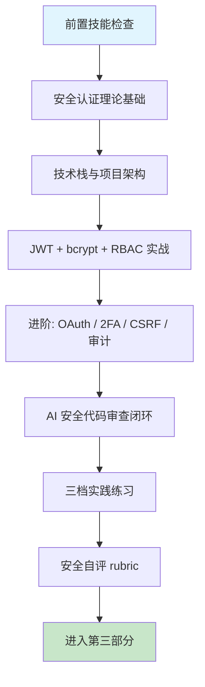

# 第八章 安全认证与权限管理

## 1. 学习目标

本章是第二部分的高潮——把前端、后端、数据库三章构建的系统**穿上防弹衣**。安全代码的审查标准最高，安全漏洞一旦被部署后果难以挽回。完成本章学习后，大家将能够：用 JWT + bcrypt + RBAC 构建包含注册、登录、鉴权、权限控制、审计日志的完整安全认证系统；以"正常登录 / 过期令牌 / 越权访问"三条必经路径手动验证 AI 生成的认证代码；用 OWASP Top 10 视角识别 AI 生成代码中的弱加密、缺失速率限制、令牌泄漏、CSRF 缺失、密钥硬编码等致命缺陷；将本章产出的安全审查清单沉淀为团队级 Skill 规则，作为第二部分跨章节的复用资产。

### 1.1 学习路径图



### 1.2 预期学习成果

本章结束时将形成四份可验证的交付物：一个本地可运行的 Node.js 安全认证服务（含 JWT 签发与验证、bcrypt 密码哈希、RBAC 中间件、登录速率限制、审计日志）；一份针对 AI 生成认证代码的"三路径测试记录"（正常登录通过 / 过期令牌被拒 / 越权访问被拦截，每条都有 `curl` 复现脚本与状态码截图）；一份安全审查 Skill 规则草稿（至少 5 条规则，覆盖 OWASP Top 5）；一份本章 §9.2 安全能力自评 rubric 的完整打分记录，作为是否进入第三部分的判定依据。

---

## 2. 前置技能检查

本章假设第二部分前 3 章已完成，且对 HTTP / 数据库 / 加密基本概念有可独立分析问题的能力。安全章节对前置技能要求**最高**——任一维度缺失都可能导致无法识别 AI 生成代码中的安全漏洞。

### 2.1 环境与能力自检

| 维度                 | 必备能力                                                                 | 自检方法                                               |
| :------------------- | :----------------------------------------------------------------------- | :----------------------------------------------------- |
| **第一部分全部技能** | Trae 操作、提示词工程、四步审查法、多语言项目经验                        | 能独立用 `/plan` 规划完整功能并审查 AI 输出            |
| **HTTP / HTTPS**     | 请求方法、状态码、Cookie / Session / Token 机制、Same-Origin 策略        | 能解释 401 vs 403 区别、JWT 三段结构与 base64url 编码  |
| **RESTful API**      | 第六章产出的 API 接口契约可作为认证集成对象                              | 能用 curl/Postman 测试一个需鉴权端点并解析返回头       |
| **数据库基础**       | 第七章产出的 users / roles / permissions schema 可直接复用               | 能写出参数化查询并解释为何 `$1` 占位比字符串拼接更安全 |
| **加密基础**         | 哈希 vs 加密、对称 vs 非对称、bcrypt / scrypt / argon2 选型              | 能解释为什么 MD5/SHA1 不应用于密码存储                 |
| **OWASP Top 10**     | 至少能说出 5 类（注入、失效身份验证、敏感数据暴露、XXE、失效访问控制等） | 拿到一个登录端点能立刻列出 3 个潜在攻击面              |
| **Trae Skill 系统**  | 能创建 / 调用 / 修改一个项目级 Skill                                     | 在第一部分作业中已为团队沉淀过至少一条 Skill 规则      |

### 2.2 代码阅读自测

请确认能在 30 秒内读懂以下两段代码——它们代表本章默认的安全代码基线水平。读不懂的部分需要回到加密基础或 OWASP 文档补齐。

```javascript
// JWT 签发 + bcrypt 校验
const passwordHash = await bcrypt.hash(plainPassword, 12);
const token = jwt.sign({ sub: userId, role }, process.env.JWT_PRIVATE_KEY, {
  algorithm: "RS256",
  expiresIn: "15m",
  issuer: "auth.example.com",
});

// 验证（每次请求中间件运行）
const claims = jwt.verify(token, process.env.JWT_PUBLIC_KEY, {
  algorithms: ["RS256"],
  issuer: "auth.example.com",
});
```

```javascript
// RBAC 中间件
function authorize(requiredPerm) {
  return async (req, res, next) => {
    const perms = await loadUserPermissions(req.user.sub); // Redis 缓存
    if (!perms.has(requiredPerm))
      return res.status(403).json({ code: "FORBIDDEN" });
    next();
  };
}

router.delete(
  "/api/users/:id",
  authenticate,
  authorize("user:delete"),
  userController.remove,
);
```

> 任一项验证失败请回到对应章节排查；安全基线不达标会显著拉低 AI 输出审查的有效性——审查不是"读懂语法"，而是"用攻击者视角判断对错"。

---

## 3. 理论基础：AI 生成安全代码的策略与致命陷阱

安全代码的审查标准是第二部分**最高**的——前端 / 后端 / 数据库的缺陷会导致功能异常，安全缺陷会导致**数据泄露**。理解以下三组概念，是在接受 AI 生成的安全代码之前必须建立的判断力。

### 3.1 认证方案对比：AI 生成策略差异

| 认证方案             | AI 生成质量                 | 典型优势                                  | 典型缺陷                                                  |
| :------------------- | :-------------------------- | :---------------------------------------- | :-------------------------------------------------------- |
| **JWT + bcrypt**     | 高 — 模式固定，训练数据丰富 | bcrypt 哈希正确、JWT sign/verify 流程完整 | **expiresIn 常被忽略或设过长**、密钥有时硬编码            |
| **Session + Cookie** | 中 — 各框架实现差异大       | 基本 session 配置可用                     | CSRF token 缺失、`secure` / `httpOnly` 标志遗漏           |
| **OAuth 2.0 / OIDC** | 中低 — 流程复杂             | 授权码流程基本正确                        | PKCE 缺失、`state` 参数防 CSRF 遗漏、refresh token 明文存 |
| **API Key + HMAC**   | 中 — 简单场景准确           | 签名算法（HMAC-SHA256）正确               | 时间戳防重放缺失、key 轮换机制缺失                        |

> **选型铁律**：先用 JWT + bcrypt 跑通业务，再按"第三方登录→OAuth/OIDC""服务间调用→API Key+HMAC""高安全场景→Session+Cookie"的顺序按需引入。直接让 AI 生成"一套搞定四种方案"的命中率极低。

### 3.2 AI 生成安全代码的六大致命缺陷

| 类别              | 典型表现                                                          | 如何发现                                                  | 审查优先级 | 修正提示词模板（按 [Ch2 §4.9](../第一部分-Trae基础入门/第二章-基础交互模式.md)）                                                               |
| :---------------- | :---------------------------------------------------------------- | :-------------------------------------------------------- | :--------- | :--------------------------------------------------------------------------------------------------------------------------------------------- | ------ | ----------------------------------------------------------------------------------------------------------------------------------- |
| **弱密码哈希**    | MD5 / SHA1 / 明文存储；bcrypt salt rounds < 10                    | `grep -rE "md5\(                                          | sha1\(     | crypto\.createHash" src/`                                                                                                                      | **P0** | 保留 user 表结构，hash 改 `bcrypt.hash(pw, 12)` 或 `argon2.hash(...)`。不要动注册流程。验证：`grep -rE "md5\\(\|sha1\\(" src/` 返 0 |
| **JWT 配置缺陷**  | `expiresIn` 缺失 / 设为 365d / `algorithm: 'none'` / HS256 弱密钥 | 读 `jwt.sign()` 第三参数、`JWT_SECRET` 长度               | **P0**     | 保留 sign 调用位置，加 `expiresIn:'15m'` + `algorithm:'RS256'` + key ≥ 32B。不要动 payload 字段。验证：`jwt.io` 解码 token 含 exp，`alg=RS256` |
| **密钥硬编码**    | `JWT_SECRET = 'mysecret'` / `bcrypt.hash(pw, 'staticsalt')`       | `grep -rEi "secret\|password\|api_key" src/`              | **P0**     | 保留 sign / encrypt 调用，secret 迁 `process.env` 或 KMS（AWS / Vault）。不要动算法。验证：`grep -rEi "secret\|password" src/` 返 0 字面量     |
| **无速率限制**    | 登录端点无 `express-rate-limit`，可被暴力破解                     | 检查 import 与中间件链；循环发送 100 个请求看是否全部 200 | **P0**     | 保留 `/login` `/register` 路径，加 `rate-limit` 5 次/15min（IP+username 双维度）+ Redis store。不要动业务。验证：第 6 次失败返 429             |
| **CSRF 保护缺失** | Cookie 无 `sameSite=strict` / 无 CSRF token 校验                  | 检查 cookie 配置 + `csurf` 中间件 + state 参数            | P1         | 保留 cookie 设置位置，加 `sameSite:'strict'` + `secure:true` + `csurf` 中间件。不要动 session store。验证：跨站伪造请求返 403                  |
| **越权访问**      | 仅检查"已登录"未检查"是否本人"；缺资源所有权校验                  | 用 user1 token 访问 user2 资源，应 403 而非 200           | **P0**     | 保留 RBAC 鉴权层，handler 内补 `resource.userId === req.user.id` 校验或 ABAC 策略。不要动路由。验证：user1 访 user2 资源返 403                 |

> **铁律**：每个 AI 生成的认证 / 授权端点都必须跑过 §7.2 三条路径测试（正常 / 过期 / 越权），三条路径全部通过才算及格。漏了任意一条都禁止部署到生产。

### 3.3 传统安全开发 vs AI 辅助安全开发

| 维度         | 传统手动开发                     | AI 辅助开发 (Trae)                   | 核心转变                         |
| :----------- | :------------------------------- | :----------------------------------- | :------------------------------- |
| **认证实现** | 逐步实现 bcrypt / JWT / 中间件   | AI 一次生成完整认证模块              | 从「实现」→「审查 expires/algo」 |
| **权限模型** | 设计 RBAC schema、写权限检查函数 | AI 生成 RBAC 模型与中间件            | 从「建模」→「审查粒度与所有权」  |
| **加密策略** | 选算法、配 cost、做密钥管理      | AI 推荐 bcrypt cost / JWT algo       | 从「选型」→「验证强度」          |
| **攻击防护** | 逐项配置 Helmet / CORS / 限流    | AI 一次装配安全中间件栈              | 从「装配」→「渗透测试」          |
| **审查重心** | 检查自己写的逻辑漏洞             | 检查 AI 生成的硬编码 / 弱算法 / 越权 | 从「自查」→「审它 + OWASP 对照」 |

---

## 4. 技术栈与项目架构

进入实战前先固化本章使用的技术组合与目录结构。版本统一是让 AI 输出可复用的前提——任意一处版本漂移都会导致 AI 沿用旧版 API（如 jsonwebtoken 8 vs 9 的算法默认值差异、bcrypt 4 vs 5 的 promise 接口）。

### 4.1 技术栈选型

下表给出本章默认采用的版本组合。**最低版本**列必须显式写在提示词的「约束条件」中——尤其是 jsonwebtoken 9 修复了多个安全漏洞，禁止回退到 8.x。

| 技术分类        | 主要技术                                   | 最低版本        | 在本章中的角色                                   |
| :-------------- | :----------------------------------------- | :-------------- | :----------------------------------------------- |
| **后端框架**    | Express.js 4.18+ / Fastify 4               | Express 4.18    | 复用第六章基础设施                               |
| **认证库**      | jsonwebtoken 9、Passport.js 0.7、bcrypt 5  | jwt 9.0         | jwt 9 修复了 algorithm confusion 漏洞            |
| **加密**        | argon2 0.31（推荐）/ bcrypt 5（兼容）      | argon2 0.31     | 新项目首选 argon2id；bcrypt 兼容场景用 cost ≥ 12 |
| **2FA**         | speakeasy 2 / otplib 12                    | otplib 12       | TOTP 时间窗口默认 30s，禁止 > 60s                |
| **数据库**      | PostgreSQL 16 + Redis 7                    | PG 16 / Redis 7 | 复用第七章 schema；Redis 存 token blacklist      |
| **安全中间件**  | helmet 7、express-rate-limit 7、csurf 1.11 | helmet 7        | helmet 7 修复了 CSP 默认配置缺陷                 |
| **审计**        | winston 3 + winston-elasticsearch / pino 8 | winston 3       | 审计日志强制结构化 JSON 格式                     |
| **前端**        | React 18 + TypeScript 5                    | React 18.2      | 复用第五章成果；强制 HttpOnly Cookie             |
| **测试**        | Jest 29 + Supertest 6 + OWASP ZAP          | Jest 29         | 自动化安全测试 + 半自动渗透扫描                  |
| **CI 安全扫描** | npm audit、Snyk、Trivy（容器扫描）         | 各自最新        | CI 流水线必跑                                    |

**选型原则**：算法优先（argon2id > bcrypt > scrypt，禁止 MD5/SHA1）、版本最新（jwt 9+ / helmet 7+ 修复了已知 CVE）、密钥外置（一律走 env / vault / KMS，禁止源码硬编码）、可审计（所有认证 / 权限变更 / 鉴权失败强制写审计日志）。

### 4.2 项目架构

本章实战项目 `enterprise-auth-platform` 在第六章 `task-management-api` 与第七章 `data-management-system` 的基础上扩展，形成 Part 2 完整闭环。

```bash
enterprise-auth-platform/
├── README.md                       # 项目总览 + 跨章节集成说明
├── docker-compose.yml              # PG + Redis + 服务（复用 Ch6/7 容器）
├── .env.example                    # JWT_PRIVATE_KEY / JWT_PUBLIC_KEY / DB / REDIS
├── docs/
│   ├── threat-model.md             # STRIDE 威胁建模
│   └── runbook.md                  # 密钥轮换 / 应急响应剧本
├── config/                         # auth.config / database.config / redis.config
├── src/
│   ├── auth/                       # §5.1 认证模块
│   │   ├── strategies/             # local / jwt / oauth / totp
│   │   ├── middleware/             # authenticate / authorize / rateLimit / csrf
│   │   ├── controllers/            # authController / userController
│   │   └── services/               # authService / tokenService / encryptionService
│   ├── rbac/                       # §5.2 权限模型与中间件
│   ├── security/                   # §6 加密 / 审计 / 威胁检测
│   └── api/v1/                     # 复用 Ch6 路由风格
├── frontend/src/                   # §6 前端安全组件（PermissionGuard / useAuth）
├── tests/
│   ├── unit/                       # 单元测试
│   ├── security/                   # OWASP Top 10 自动化测试
│   └── pen-test/                   # 半自动渗透测试脚本
└── .github/workflows/              # 安全扫描 CI（npm audit / Snyk / Trivy）
```

> 项目继承 Ch6 的中间件链与 Ch7 的 RBAC schema；本章新增内容集中在 `auth/` `rbac/` `security/` 三个目录。

---

## 5. JWT + bcrypt + RBAC 实战

本节走通安全认证的核心三件套：JWT 令牌签发与验证、bcrypt 密码哈希、RBAC 权限中间件。其他场景（OAuth / 2FA / CSRF / 审计 / 合规）在 §6 集中处理。

### 5.1 JWT + bcrypt 认证

#### 5.1.1 提示词模板

```text
为 enterprise-auth-platform 实现 JWT + bcrypt 认证模块，要求：

【模块边界】
- 文件：authService.ts / authController.ts / authenticate.ts middleware
- 集成第七章 users 表（已含 password_hash CHAR(60)、role 列）

【认证硬约束】
- 密码哈希：argon2id 优先（memoryCost 19MiB / timeCost 2 / parallelism 1）；bcrypt 兼容场景 cost = 12
- JWT 签名：RS256（私钥签发 / 公钥验证），禁止 HS256
- access token：expiresIn = 15m；refresh token：expiresIn = 7d 并存 Redis 白名单
- 密钥：JWT_PRIVATE_KEY / JWT_PUBLIC_KEY 一律走 env，禁止硬编码或写入仓库
- 登录失败：恒定时间响应（即使用户不存在也跑一次 dummy bcrypt.compare）

【接口】
- POST /auth/register：含密码强度校验（≥ 8 字符、含字母数字符号）
- POST /auth/login：含 express-rate-limit（5 次 / 分钟 / IP）
- POST /auth/refresh：用 refresh token 换新 access token
- POST /auth/logout：将 refresh token 加入黑名单（Redis SET，TTL = token 剩余过期时间）

【错误响应】
- 统一格式 { code, message, requestId }
- 用户不存在 / 密码错误 → 同一错误码 INVALID_CREDENTIALS（避免账号枚举）

【生成约束】
- 输出 diff，不出整段代码
- 每个端点必须配套至少 3 条 supertest 测试（正常 / 过期 / 越权）
```

#### 5.1.2 AI 生成的 authService（带审查标注）

下面是 Trae 通常会生成的代码。**注释标出 AI 做对的地方与遗漏的地方**——审查闭环不是"看 AI 写了什么"，而是"看 AI 漏了什么"。

```javascript
// src/auth/services/authService.js
const bcrypt = require("bcrypt");
const jwt = require("jsonwebtoken");

const SALT_ROUNDS = 12; // ✅ 合理工作因子（生产 ≥ 10）
const DUMMY_HASH = "$2b$12$" + "x".repeat(53); // ✅ 用于 timing-safe 登录失败比对

async function registerUser({ username, password, email }) {
  // ⚠️ AI 经常遗漏：密码强度校验（仅长度不够，应加复杂度规则）
  if (!username || !password || password.length < 8) {
    throw new ApiError("INVALID_INPUT", "用户名和密码必填，密码至少 8 位");
  }
  const passwordHash = await bcrypt.hash(password, SALT_ROUNDS);
  const user = await User.create({ username, email, passwordHash });
  return { id: user.id, username: user.username }; // ✅ 不返回密码哈希
}

async function loginUser({ username, password }) {
  const user = await User.findOne({ where: { username } });
  // ✅ AI 正确：用户不存在也走 bcrypt.compare 防 timing-attack
  const hash = user ? user.passwordHash : DUMMY_HASH;
  const isValid = await bcrypt.compare(password, hash);
  // ✅ AI 正确：不区分"用户不存在"与"密码错误"
  if (!user || !isValid) throw new ApiError("INVALID_CREDENTIALS");

  const token = jwt.sign(
    { sub: user.id, role: user.role },
    process.env.JWT_PRIVATE_KEY, // ✅ env 化
    {
      algorithm: "RS256",
      expiresIn: "15m", // ✅ 显式声明算法
      issuer: "auth.example.com",
    }, // ✅ issuer 防混淆
  );
  // ⚠️ AI 经常遗漏：refresh token 应写入 httpOnly + Secure + SameSite=Strict cookie，
  //    不能与 access token 一起返回 JSON
  // ⚠️ AI 经常遗漏：登录成功审计日志（不含 password；含 IP / userAgent / loginAt）
  return { token, user: { id: user.id, role: user.role } };
}
```

**审查发现**：AI 正确实现了 bcrypt cost、timing-safe 比对、env 密钥、显式算法、issuer；但 (1) 密码强度仅校验长度，应加大小写 + 数字 + 符号规则；(2) refresh token 直接返回 JSON 易被 XSS 窃取，应改为 httpOnly cookie；(3) 缺登录审计日志，无法做异常登录检测。这三处都需要在第二轮提示词中显式要求补齐。

### 5.2 RBAC 权限模型与中间件

#### 5.2.1 提示词模板

```text
基于第七章 users / roles / permissions / user_roles / role_permissions schema，
实现 RBAC 权限模型与中间件，要求：

【模型语义】
- 权限名格式：resource:action，如 user:read / order:write / admin:*
- 角色继承：role.parent_id 实现单层继承；admin 角色显式赋全部权限，禁止"超级用户绕过检查"
- 资源所有权：所有 *:write / *:delete 操作必须额外校验 ownership（除非角色含 admin:*）

【中间件 API】
- authorize("user:read")：单权限检查
- authorize(["user:read", "user:write"], "AND")：多权限组合
- authorize({ resource: "user", action: "update", ownership: true })：含所有权
- 失败一律返回 403 + { code: "FORBIDDEN", required, missing }

【性能】
- Redis 缓存用户权限集（key: perms:<userId>，TTL = 5min）
- 角色 / 权限 / 用户角色变更触发缓存失效（pub/sub）

【生成约束】
- 输出 diff；中间件必须有 100% 单元测试覆盖
- 必跑 §7.2 越权路径测试：用 user 角色 token 访问 admin 端点必须 403
```

#### 5.2.2 关键设计差异

| 维度         | 简单 if-role 检查                | 标准 RBAC                  | 工业级 RBAC（本章目标）              |
| :----------- | :------------------------------- | :------------------------- | :----------------------------------- |
| **粒度**     | 角色级（admin / user）           | 角色 + 权限两级            | 角色 + 权限 + 资源所有权三级         |
| **配置**     | 硬编码                           | 数据库表配置               | 数据库表 + Redis 缓存 + pub/sub 失效 |
| **AI 陷阱**  | AI 默认生成此模式                | AI 容易漏掉缓存失效        | AI 容易漏掉所有权检查                |
| **审查重点** | `if (role === 'admin')` 出现位置 | 权限名是否统一格式 (`r:a`) | 越权测试是否覆盖"同角色不同用户"     |

> **越权陷阱**：AI 生成的 RBAC 经常只检查"角色是否拥有权限"，而忽略"该用户是否拥有资源"。如 user1 用合法 token 访问 `GET /api/users/2/orders`，若中间件只校验 `user:read` 权限会通过——但应额外校验 `req.user.id === req.params.userId`。

---

### 5.3 Vibe Coding 循环实录：JWT 签发安全修正

> **修正语法**：「修正提示词」按 [Ch2 §4.9 修正提示词语法](../第一部分-Trae基础入门/第二章-基础交互模式.md) 模板；3 轮未收敛触发 §4.10。模式选择查 [Ch1 §5.4](../第一部分-Trae基础入门/第一章-Trae简介与环境配置.md)。

| 轮次 | AI 输出摘要                                 | 发现的缺陷                       | 修正提示词（按 §4.9）                                                                                                                                                                                              | 验证信号               |
| :--- | :------------------------------------------ | :------------------------------- | :----------------------------------------------------------------------------------------------------------------------------------------------------------------------------------------------------------------- | :--------------------- |
| R1   | `jwt.sign({ userId }, secret)` 签发后无 exp | token 长期有效，被劫持后无法作废 | 保留 issueToken 函数签名，修复 payload：在 `jwt.sign` 第三个参数中补 `{ expiresIn: '15m' }`。原因：无 exp 反常识权象实践。不要动函数签名。验证：jwt.io decode 后 payload 含 exp 字段                               | jwt.io decode 含 exp   |
| R2   | `secret = 'mysecret'` 硬编码于源文件        | 泄露后全量 token 失控，无法轮换  | 保留签名逻辑与 exp 配置，修复密钥来源：改为 `process.env.JWT_SECRET`，缺失时启动即 throw。原因：硬编码会进 git 历史。不要动签名逻辑。验证：`grep -E "secret\s*=\s*['\"][a-zA-Z0-9]+['\"]" src/` 0 命中             | grep 硬编码密钥 0 命中 |
| R3   | 使用 HS256 但生产需 RS256                   | 对称算法无法跨服务轮换密钥       | 保留 issueToken 接口，修复算法：改为 `RS256`，静态加载 `JWT_PRIVATE_KEY` / 验证侧加载 `JWT_PUBLIC_KEY`。原因：RS256 支持公私钥分离，便于轮换。不要动 exp 与 secret 逻辑。验证：`jwt --decode <token>` alg == RS256 | decode alg == RS256    |

> **收敛信号**：exp 存在 + 密钥外部化 + RS256。如未收敛触发 §4.10 信号 2（改 A 坏 B）：升级算法可能引入验证侧遗漏，拆为「签发侧」与「验证侧」独立仓库两轮 prompt。

---

## 6. 进阶：OAuth、2FA、CSRF、审计与合规

六类进阶场景的提示词共享同一范式："核心认证（§5）跑通后，按需引入"。下表给出关键差异点与精简提示词。

### 6.1 进阶场景速查表

| 场景                 | 适用条件                                 | 关键差异                                                                     | 核心提示词（精简版）                                                                                                         |
| :------------------- | :--------------------------------------- | :--------------------------------------------------------------------------- | :--------------------------------------------------------------------------------------------------------------------------- |
| **OAuth 2.0 / OIDC** | 接入第三方登录（Google / GitHub / 微信） | 授权码流程、PKCE 强制、state 防 CSRF、refresh token 加密存储                 | `用 passport-oauth2 接入 Google + GitHub，强制 PKCE（code_challenge_method=S256），state 用 crypto.randomBytes(32)`          |
| **2FA / TOTP**       | 高安全场景 / 管理员账号                  | `otplib` TOTP（30s 时间窗）、QR 码（otpauth URL）、一次性恢复码（10 个）     | `用 otplib 实现 TOTP 二次验证：登录后若 user.totp_enabled，必须先校验 6 位 OTP；恢复码用 argon2 哈希后入库，使用即作废`      |
| **CSRF 保护**        | Cookie 鉴权场景（非 SPA + Bearer）       | `sameSite=strict` cookie + `csurf` 中间件 + 双 cookie 模式                   | `为基于 cookie 的接口加 CSRF 保护：cookie 设 sameSite=Strict + Secure + httpOnly，状态变更接口用 csurf 校验 X-CSRF-Token`    |
| **API 安全防护**     | 公网暴露 / 多租户 SaaS                   | helmet 全套头 + CORS 白名单 + rate-limit 分层 + express-validator 输入校验   | `加固 enterprise-auth-platform：helmet 默认 + CSP 严格白名单、CORS 仅放行 https://app.example.com、登录 5/min、查询 100/min` |
| **审计与异常检测**   | 合规要求（GDPR / SOX）/ 高价值业务       | 结构化审计日志 + 异常登录检测（地理 / 设备 / 时间）+ 暴力破解检测 + 实时告警 | `审计 winston JSON 输出：login / logout / role_change / perm_grant 事件全记录；同一 IP 5 分钟内 ≥ 10 次失败触发 PagerDuty`   |
| **前端安全集成**     | React / Vue 集成认证                     | HttpOnly cookie 存 token、ProtectedRoute、PermissionGuard、useAuth Hook      | `React 集成认证：access token 存内存 + refresh 走 httpOnly cookie；PermissionGuard 高阶组件按权限隐藏 UI；登出清空所有状态`  |

### 6.2 进阶提示词使用约定

进阶场景必须满足三个条件，否则 AI 输出几乎不可用：

1. **承接已有项目**：明确"在 §5 已生成的认证模块基础上扩展"，否则 AI 会重写已有结构导致冲突。
2. **量化目标**：写明速率限制阈值、TOTP 时间窗、token 过期时间、审计采样率等具体数值，避免模糊描述。
3. **审查检查点**：在提示词末尾追加"输出后对照 §3.2 六大缺陷与 §7.2 三条路径自检"，AI 会主动给出 checklist。

> 不要在第一轮就让 AI 生成"OAuth + 2FA + CSRF + 审计"四合一安全栈——上下文超限会导致每个模块都做不彻底。逐个引入、每次审查通过后再叠加是更稳妥的做法。

### 6.3 部署运维安全基线

| 控制项       | 默认要求                                  | 验证手段                                |
| :----------- | :---------------------------------------- | :-------------------------------------- |
| **容器**     | 非 root 用户运行；只读文件系统            | `docker run --user 1001 --read-only`    |
| **K8s**      | Pod Security Standard = restricted        | OPA Gatekeeper / Kyverno 策略           |
| **密钥**     | Vault / AWS Secrets Manager / K8s Secrets | 任何 commit 不应出现 `JWT_*_KEY` 字面量 |
| **CI 扫描**  | npm audit + Snyk + Trivy（镜像）          | CI 失败即阻止合并                       |
| **TLS**      | TLS 1.3 only；HSTS max-age ≥ 1 year       | SSL Labs A+ 评级                        |
| **依赖更新** | Dependabot 周更新；高危 CVE 24h 内修复    | GitHub Security Alerts 全部清零         |

---

## 7. AI 生成的安全代码审查

### 7.1 四步审查清单（安全特化）

回顾第一章 §7 的「四步审查法」，安全代码的审查标准最高——一行漏审都可能导致数据泄露。

| 步骤         | 安全特定检查                                                                        |
| :----------- | :---------------------------------------------------------------------------------- |
| **正确性**   | JWT 是否能正确签发与验证？过期逻辑是否生效？RBAC 权限是否含资源所有权检查？         |
| **安全性**   | 密钥是否走 env？密码是否 argon2/bcrypt？是否限流？CSRF 是否开启？算法是否显式声明？ |
| **性能**     | bcrypt cost 是否合理（10-14）？JWT 缓存是否走 Redis？权限缓存失效策略是否正确？     |
| **可维护性** | 安全配置是否集中管理？审计日志是否结构化？密钥轮换是否有 runbook？                  |

### 7.2 三条必经路径：AI 生成认证代码的验收测试

在接受 Trae 生成的任何认证 / 授权代码之前，依次跑完以下三条路径；任意一条失败都禁止部署到生产。

```bash
# 路径 1：正常登录 — 必须返回 200 + JWT
curl -X POST http://localhost:3000/auth/login \
     -H "Content-Type: application/json" \
     -d '{"username":"alice","password":"correct-password"}'
# 期望：HTTP/1.1 200，body 含合法 token，token 解码后 exp - iat = 900（15 min）

# 路径 2：过期令牌 — 必须返回 401
EXPIRED=$(node -e "console.log(jwt.sign({sub:1},process.env.JWT_PRIVATE_KEY,{algorithm:'RS256',expiresIn:'-1s'}))")
curl -X GET http://localhost:3000/api/users/me -H "Authorization: Bearer $EXPIRED"
# 期望：HTTP/1.1 401，body = { code: "TOKEN_EXPIRED" }

# 路径 3：越权访问 — 必须返回 403
USER1_TOKEN=$(curl -s ... | jq -r .token)  # alice 的 token
curl -X GET http://localhost:3000/api/users/2/orders -H "Authorization: Bearer $USER1_TOKEN"
# 期望：HTTP/1.1 403，body = { code: "FORBIDDEN", required: "user:read", missing: "ownership" }
```

> **铁律**：三条路径全部通过才能进生产；一旦发现 AI 生成的 RBAC 中间件在路径 3 返回 200，整个 RBAC 模块作废重提示词——这是"角色检查通过但所有权未校验"的最常见漏洞，OWASP 称为 BOLA（Broken Object Level Authorization），是 API 安全 Top 1。

### 7.3 危险模式扫描

```bash
# 1. 弱哈希算法
grep -rEi 'md5\(|sha1\(|crypto\.createHash\(["\x27](md5|sha1)' src/

# 2. 硬编码密钥
grep -rEi '(secret|password|api_key|jwt_)\s*[:=]\s*["\x27][a-zA-Z0-9]{8,}' src/

# 3. JWT algorithm: none
grep -rEi 'algorithm:\s*["\x27]none["\x27]' src/

# 4. 危险 OAuth state 跳过
grep -rEi 'state:\s*(false|null|undefined)' src/

# 5. CORS 通配
grep -rE 'origin:\s*["\x27]\*["\x27]' src/
```

> 每条命令必须返回 0 行匹配。任意一条命中都视为 P0 阻塞。

### 7.4 扫到问题后用什么提示词改？

上面 5 条 grep 只识别「危险模式」；下一步必须按统一语法把修复意图写回 AI（参照 [Ch2 §4.9](../第一部分-Trae基础入门/第二章-基础交互模式.md)）。

| #   | grep 命中规则           | 命中后修正提示词模板                                                                                                                                                                               |
| :-- | :---------------------- | :------------------------------------------------------------------------------------------------------------------------------------------------------------------------------------------------- |
| 1   | 弱哈希算法（md5/sha1）  | 保留登录 / 注册流程，password hash 切 `bcrypt.hash(pw, 12)` 或 `argon2.hash`；存量用户首次登录时 lazy-rehash。不要动 `users` schema 字段名。验证：`grep -rEi 'md5\(\|sha1\('` 返 0；e2e 登录通过。 |
| 2   | 硬编码密钥              | 保留 sign / encrypt 调用点，secret 迁 `process.env.JWT_SECRET` 或 KMS（AWS / Vault），缺失时启动 throw。不要动算法。验证：grep 返 0；启动日志含 `JWT_SECRET=*** loaded`。                          |
| 3   | JWT algorithm: 'none'   | 保留 token 结构与 payload，`jwt.verify` options 锁定 `algorithms:['RS256']` 白名单。不要动 `claims`。验证：手工伪造 `alg=none` token 返 401。                                                      |
| 4   | OAuth state 跳过        | 保留 redirect URL，`state` 必须由 `crypto.randomBytes(32).toString('hex')` 生成 + session 校验后再换 token。不要动 `client_id`。验证：state 不一致或重复返 403 + `code='STATE_MISMATCH'`。         |
| 5   | CORS 通配 `origin: '*'` | 保留 CORS 中间件位置与挂载顺序，`origin` 改白名单数组（按 env 注入）。不要动 `credentials` 配置。验证：非白名单 Origin 触发浏览器 CORS 拒绝。                                                      |

> 3 轮未收敛触发 [§4.10](../第一部分-Trae基础入门/第二章-基础交互模式.md) 的「换模式 / 缩范围 / 拆步骤」。

---

## 8. 实践练习

以下练习按难度递增分三档，要求**自己编写提示词**。每完成一项，按 §3.2 六类缺陷表与 §7.2 三条路径逐项验证。

### 8.1 基础题：单端点安全实战

#### 8.1.1 注册端点 + 密码强度

**要求**：基于 §5.1 的 authService 实现 `POST /auth/register`。规则：用户名唯一、邮箱唯一、密码 ≥ 12 字符且包含大小写 + 数字 + 符号、用 argon2id 哈希、注册失败统一返回 `{ code: "INVALID_INPUT", fields }`、注册成功返回 201 + 用户公开字段。

**你的任务**：自己写提示词（参考 §5.1.1 模板），提交给 Trae，对照 §3.2 六大缺陷与 §7.3 危险模式扫描，记录至少一处需要修复的问题。

#### 8.1.2 RBAC 单中间件

**要求**：实现 `authorize("user:read")` 中间件，从 Redis 读取用户权限集，未命中再回查数据库并写回缓存（TTL = 5 min）；权限变更时通过 Redis pub/sub 失效缓存。

**你的任务**：让 AI 生成实现，独立写 supertest 测试覆盖三条路径（正常 / 过期 / 越权），用 §7.2 命令验证。

### 8.2 进阶题：多组件安全协同

#### 8.2.1 2FA + 恢复码

**要求**：在已有登录链路中加入 TOTP 二次验证。流程：登录密码正确后，若 user.totp_enabled 返回 `{ challenge: "TOTP_REQUIRED", session_token }`；前端再调 `/auth/2fa/verify` 提交 6 位 OTP；成功才签发正式 access token。恢复码：注册 2FA 时生成 10 个一次性恢复码，argon2 哈希入库，使用即作废。

**安全验收**：用错误 OTP 连续 5 次必须触发账号锁定 15 分钟；恢复码用过一次后第二次必须 401。

#### 8.2.2 OAuth + PKCE

**要求**：用 `passport-oauth2` 接入 Google 与 GitHub。流程：`/auth/oauth/:provider/start` 生成 `code_verifier` 与 `state`（均 `crypto.randomBytes(32)`），存 Redis（TTL = 10 min）；`/auth/oauth/:provider/callback` 校验 state 防 CSRF、用 code 换 access token、再换 user info；首次登录自动建本地账号；refresh token 用 AES-256-GCM 加密入库。

**安全验收**：state 不匹配必须 400；code_verifier 不匹配必须 400；refresh token 入库前必须加密。

### 8.3 开放题：安全审查 Skill 沉淀

#### 8.3.1 OWASP Top 10 命中表

**要求**：让 Trae 生成一份含 8 个端点的认证服务（注册 / 登录 / 刷新 / 登出 / 修改密码 / 重置密码 / 2FA 启用 / OAuth 接入）。**不告诉 AI 任何安全要求**。然后用 §3.2 六大缺陷 + §7.2 三条路径 + §7.3 危险扫描逐项检查，统计 AI 各类缺陷的命中率。

**交付物**：一份 8×6 的"端点 × 缺陷"命中表 + 每条缺陷的复现脚本 + 修复 patch。

#### 8.3.2 安全审查 Skill 规则草稿

**要求**：基于 §8.1 / §8.2 / §8.3.1 的产出，沉淀一份团队级 Trae Skill（项目级或全局），至少包含 5 条审查规则覆盖 OWASP Top 5（弱认证 / 失效访问控制 / 注入 / 敏感数据暴露 / 安全配置错误）。Skill 应能在 AI 生成认证 / 授权代码时自动触发并返回 checklist。

**交付物**：一个可调用的 Skill 文件 + 一份不超过 800 字的使用说明，作为团队跨项目复用资产。

> 三档练习产出的 Skill 与命中表会作为第三部分（高级特性 / 工程化 / DevOps）的输入；请认真完成并归档，特别是 §8.3.2 的 Skill 是第二部分对团队最有价值的沉淀。

---

## 9. 小结

### 9.1 核心收获

本章以 JWT + bcrypt + RBAC 为主线，把第二部分前 7 章积累的提示词工程、代码审查、压测、危险扫描能力综合应用到**安全**这一最严苛的工程领域。核心收获包括：**AI 生成安全代码的质量分布两极分化**——bcrypt / JWT 等模式固定的部分准确率高，OAuth / RBAC 资源所有权 / 2FA 恢复码等流程复杂的部分错误率显著上升；**安全审查必须落到三条必经路径**——正常登录通 / 过期令牌拒 / 越权访问拦，三条任一失败都禁止部署；**OWASP Top 10 是不可妥协的硬约束**——弱哈希、密钥硬编码、JWT 配置缺陷、无速率限制、CSRF 缺失、越权访问每一条都是 P0；**安全提示词必须显式约束算法版本与配置**——argon2id / RS256 / cost ≥ 12 / expiresIn = 15m 必须写在「约束条件」中，否则 AI 容易回退到弱默认值；**Skill 沉淀是第二部分对团队最有价值的资产**——把六类缺陷 / 三条路径 / 危险扫描固化为可触发的 Skill 规则，能让团队所有人复用本章训练成果。

### 9.2 安全能力自评 rubric

请用以下标准为自己的安全审查能力打分（1-5 分），并记录"距离 5 分还差什么"。这份评分会决定第三部分的学习重点。

| 维度         | 1 分（陌生）                   | 3 分（可用）                                | 5 分（熟练）                                          | 你的得分 |
| :----------- | :----------------------------- | :------------------------------------------ | :---------------------------------------------------- | :------- |
| **认证实现** | 只能复制粘贴 AI 的 JWT 代码    | 能独立写出 JWT sign/verify 并配置 expiresIn | 能根据安全需求选择算法 / 时长 / 密钥管理方案          | \_\_ / 5 |
| **密码安全** | 不知道哈希与加密的区别         | 能识别 MD5 / SHA1 并替换为 bcrypt           | 能根据场景选 argon2id vs bcrypt 与 cost 参数          | \_\_ / 5 |
| **权限控制** | 只知道 `if (role === "admin")` | 能实现 RBAC 角色 + 权限两级模型             | 能设计含资源所有权 + 缓存 + pub/sub 失效的工业级 RBAC | \_\_ / 5 |
| **安全测试** | 拿到代码就跑，不测试           | 能跑通"正常登录"路径                        | 能系统性跑完正常 / 过期 / 越权三条路径并写脚本        | \_\_ / 5 |
| **审查意识** | 信任 AI 的安全代码             | 能识别硬编码密钥与弱哈希                    | 能对照 OWASP Top 10 + §7.3 危险扫描系统性审查 AI      | \_\_ / 5 |

**判定规则**：总分 ≥ 20 可直接进入第三部分；15-19 建议针对最低分维度做一次专题复习；< 15 应重做 §7.2 三条路径验证 + §7.3 危险扫描。

### 9.3 第二部分整体收尾

| 章节    | 关键产物                                 | 在第三部分的复用方式                         |
| :------ | :--------------------------------------- | :------------------------------------------- |
| **Ch5** | 前端提示词模板 + DataTable 审查记录      | 第三部分微前端 / SSR 章节复用前端审查清单    |
| **Ch6** | API 提示词模板 + curl 边界测试集         | 微服务 / 网关章节复用 API 边界测试           |
| **Ch7** | DDL 提示词模板 + 三道闸门 + 慢查询治理表 | 数据治理 / 分库分表章节复用闸门策略          |
| **Ch8** | 安全 Skill + OWASP 命中表 + 三条路径测试 | 第三部分**全部**章节复用安全审查作为最终闸门 |

> 第三部分的所有交付物都必须先跑过第二部分四份审查清单（前端控制台 / curl 边界 / DDL 闸门 / 安全三路径），任意一条失败都禁止合并。

---

## 10. 延伸阅读

以下资源覆盖认证授权标准、攻击防护与漏洞研究、AI 辅助安全开发实践三条主线。

### 10.1 标准与规范

- [OWASP Top 10 (2021)](https://owasp.org/Top10/) — Web 应用安全风险的事实标准；§3.2 六大缺陷与 §7.3 危险扫描的来源，每条至少看一次。
- [OWASP API Security Top 10 (2023)](https://owasp.org/API-Security/) — API 场景特化清单，BOLA（越权访问）排第 1，与 §7.2 路径 3 直接对应。
- [JWT Best Current Practices (RFC 8725)](https://datatracker.ietf.org/doc/html/rfc8725) — JWT 选型与配置的权威参考；明确禁止 `algorithm: none` 与 HS256 弱密钥。
- [OAuth 2.0 Security Best Current Practice (RFC 9700)](https://datatracker.ietf.org/doc/html/rfc9700) — OAuth 2.0 强制 PKCE / state 防 CSRF / 公共客户端禁用密码流的依据。
- [NIST Digital Identity Guidelines (SP 800-63B)](https://pages.nist.gov/800-63-3/sp800-63b.html) — 密码长度、复杂度、过期策略的官方建议（与传统"必须 90 天改密码"相反）。

### 10.2 攻击防护与漏洞研究

- [PortSwigger Web Security Academy](https://portswigger.net/web-security) — 含可交互的 SQL 注入 / XSS / CSRF / SSRF / 认证漏洞实验，是最好的攻击者视角训练平台。
- [HackerOne CWE Top 25](https://cwe.mitre.org/top25/) — 现实漏洞赏金项目的高频 CWE 排名；与 OWASP Top 10 互补。
- [Auth0 Blog · Security](https://auth0.com/blog/topics/security/) — 工业级身份认证的实战经验，含 JWT / OAuth / SAML 多种方案对比。
- [Have I Been Pwned](https://haveibeenpwned.com/Passwords) — 密码泄露数据库；可用于密码注册时的"已泄露密码"检查（k-anonymity API）。

### 10.3 AI 辅助安全开发与持续学习

- [Trae 官方文档](https://docs.trae.ai/) — Skills 系统与 MCP 工具生态，是沉淀 §8.3.2 安全审查 Skill 的基础。
- [Anthropic · Building Effective Agents](https://www.anthropic.com/research/building-effective-agents) — Workflow vs Agent 的设计模式综述，对应本章「一次提示词生成认证模块 + 三路径自动化验证」的工作流。
- [Snyk Vulnerability DB](https://security.snyk.io/) / [GitHub Advisory Database](https://github.com/advisories) — 依赖库漏洞情报；CI 安全扫描的数据源。
- [CTF Time](https://ctftime.org/) — 安全竞赛聚合站，进阶训练攻击者视角；推荐从 picoCTF / WebGoat 入门。
- [Krebs on Security](https://krebsonsecurity.com/) — 安全事件深度报道；理解真实世界攻击链与防御失效的最佳读物之一。

---

> **进入第三部分前**：完成 §8 至少一道基础题、一道进阶题、一道开放题；§9.2 rubric 总分必须 ≥ 20；§8.3.2 的安全审查 Skill 必须可在 Trae 中调用。第二部分的所有交付物（前端审查清单 / API 边界测试 / DDL 闸门 / 安全三路径）都将作为第三部分章节合并的最终闸门——任意一条失败都禁止合并。
