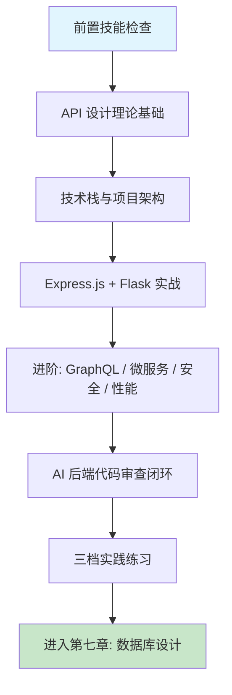

# 第六章 高性能后端 API 开发

## 1. 学习目标

本章将第一部分建立的提示词工程和审查技能应用到后端 API 开发：用 Express.js / Flask 从零构建包含认证、鉴权、输入校验、错误处理和速率限制的 RESTful API 平台；以四步审查法检查每个端点的输入校验完整性、密钥管理安全性和错误响应一致性；用 `curl` 与压测工具量化 AI 生成 API 的边界鲁棒性。完成本章学习后，大家将能够：用结构化提示词驱动 AI 生成完整的 Express.js / Flask API 项目骨架；用 `curl -X POST -d '{}'` / 超长字符串 / 特殊字符等手段手动验证 AI 生成端点的边界处理；在 AI 生成的 API 代码中识别缺失输入校验、硬编码密钥、CORS 过宽与不一致的错误响应格式；以 P95 延迟、QPS 与错误率三项硬指标判断后端代码是否达到生产可用水平。

### 1.1 学习路径图



### 1.2 预期学习成果

本章结束时将形成三份可验证的交付物：一个本地可运行的 Express.js + TypeScript API 服务（含 JWT 认证、Joi/Zod 请求校验、Swagger 文档、Helmet 安全头）；一个 Flask + SQLAlchemy API 服务（含 Flask-Migrate 迁移、Marshmallow 序列化、JWT-Extended 认证）；一份针对 AI 生成 API 端点的「审查 + 压测」记录（含至少一处缺失校验/CORS 过宽的修复证据，与 P95/QPS/错误率三项压测数字）。这三份交付物会作为第七章数据库设计的接口契约依据。

---

## 2. 前置技能检查

本章假设第一部分已完成且能写出含四要素的提示词，并对 HTTP 协议与 RESTful 风格有基本理解。下面以 Ch1-Ch5 同款方式给出可执行自检清单。

### 2.1 环境与能力自检

| 维度                     | 必备能力                                                    | 自检方法                                              |
| :----------------------- | :---------------------------------------------------------- | :---------------------------------------------------- |
| **Trae 基础操作**        | 熟练使用 Chat / Builder / CUE 三大入口                      | 用 `/plan` 生成一个 REST API 的开发计划               |
| **提示词工程**           | 能写出含「动作词 + 目标 + 要求 + 约束」四要素的结构化提示词 | 不参考模板独立写一个 Express.js 路由的完整提示词      |
| **JavaScript / Python**  | 异步编程、模块系统、基本错误处理                            | 能读懂 §2.2 的 `async/await` 和 `try/except` 代码片段 |
| **HTTP 协议**            | GET/POST/PUT/DELETE/PATCH 语义、2xx/4xx/5xx 状态码、请求头  | 能解释 200/201/204/400/401/403/409/422/500 的语义差异 |
| **RESTful 设计**         | 资源命名、幂等性、状态码与错误响应结构                      | 能手写一个 `POST /users` 创建用户的成功与错误响应     |
| **命令行工具**           | `curl`、`jq`、基础 shell pipe                               | 用 `curl -i` 调一个公网 API 并用 `jq` 提取响应字段    |
| **Node / Python 工具链** | Node 18+、Python 3.10+ 与 `pip` / `pnpm` 可用               | `node -v` / `python --version` 输出符合最低版本       |
| **Git 基础**             | clone / add / commit / branch / merge                       | 能独立完成一次 feature 分支提交                       |

### 2.2 代码阅读自测

请确认能在 30 秒内读懂以下两段代码——它们代表本章默认的后端基线水平。读不懂的部分需要回到第一部分或 MDN / Python 官方文档补齐基础。

```javascript
// Express.js 异步路由
router.post("/login", async (req, res, next) => {
  try {
    const { email, password } = req.body;
    const user = await userService.verify(email, password);
    if (!user) return res.status(401).json({ code: "INVALID_CREDENTIALS" });
    const token = signJwt({ uid: user.id });
    res.json({ token });
  } catch (err) {
    next(err);
  }
});
```

```python
# Flask + SQLAlchemy
@app.post("/api/tasks")
@jwt_required()
def create_task():
    data = TaskSchema().load(request.get_json() or {})
    task = Task(owner_id=get_jwt_identity(), **data)
    db.session.add(task)
    db.session.commit()
    return TaskSchema().dump(task), 201
```

> 任一项验证失败请回到对应章节排查；HTTP / RESTful 基础不达标会显著拉低 AI 生成 API 的审查有效性——审查不是"读代码"，而是"用业务语义判断对错"。

---

## 3. 理论基础：AI 生成后端代码的策略与陷阱

后端代码是数据的守门人——一个未经检查的 API 端点可以将整个数据库暴露给攻击者。理解以下三组概念，能让 AI 生成的后端代码从"能跑"提升到"安全可靠"。

### 3.1 RESTful vs GraphQL vs 微服务：AI 生成策略对比

| 架构模式              | AI 生成质量                   | 典型优势                          | 典型缺陷                                       |
| :-------------------- | :---------------------------- | :-------------------------------- | :--------------------------------------------- |
| **RESTful (Express)** | 高 — 训练数据最丰富           | 路由结构清晰、中间件链完整        | 容易遗漏输入校验、错误响应格式不一致           |
| **RESTful (Flask)**   | 中高 — Python 后端生态成熟    | SQLAlchemy 模型准确、JWT 配置完整 | CORS 配置常被忽略、SQLAlchemy session 管理欠佳 |
| **GraphQL**           | 中 — Schema 解析器结构可预测  | 类型定义准确、DataLoader 集成     | N+1 查询问题、query depth 无限制               |
| **微服务**            | 中低 — 复杂度高，上下文易超限 | 单服务模块结构清晰                | 服务间通信、事务一致性、分布式链路追踪缺失     |

> 选型建议：先用 RESTful 跑通业务闭环，再按"读多写少→GraphQL""高隔离需求→微服务"的顺序演进。直接让 AI 生成微服务架构的命中率极低。

### 3.2 AI 生成后端代码的六类高频缺陷

| 类别                 | 典型表现                                               | 如何发现                                          | 审查优先级 | 修正提示词模板（按 [Ch2 §4.9](../第一部分-Trae基础入门/第二章-基础交互模式.md)）                                                                   |
| :------------------- | :----------------------------------------------------- | :------------------------------------------------ | :--------- | :------------------------------------------------------------------------------------------------------------------------------------------------- |
| **缺失输入校验**     | 未检查 `req.body` 字段类型、长度、格式                 | `curl -X POST -d '{}'` 或超长字符串看是否静默通过 | **P0**     | 保留 handler 路径不变，加 `zod` / `joi` schema 校验 `req.body`（类型+长度+格式）。不要动业务逻辑。验证：超长字符串与空对象返回 400 而非 500        |
| **硬编码密钥**       | JWT_SECRET / DB_PASSWORD 写在代码中                    | `grep -rE "secret\|password\|api_key" src/`       | **P0**     | 保留 sign / connect 调用位置，迁 secret 到 `process.env.*` + 写 `.env.example`。不要动算法。验证：`grep -rE "secret\|password" src/` 返回 0 字面量 |
| **CORS 过于宽松**    | `Access-Control-Allow-Origin: *` + `credentials: true` | 检查 `cors()` 配置和 OPTIONS 响应头               | **P0**     | 保留 `cors()` 调用位置，origin 改白名单数组；`credentials:true` 时禁 `*`。不要动 methods 列表。验证：跨域 OPTIONS 仅放行白名单 origin              |
| **错误响应不一致**   | 有的返回 `{error}`，有的返回 `{message}`               | 访问各个端点，对比错误响应结构                    | P1         | 保留各 handler 业务，统一错误中间件返回 `{ code, message, traceId }`。不要动 status code。验证：所有 4xx/5xx 响应同一 schema                       |
| **无速率限制**       | 无 `express-rate-limit` 或 `flask-limiter`             | 循环发送 100 个请求，看是否全部通过               | P1         | 保留 routes 不变，在 `/login` `/register` 加 `express-rate-limit`（5 次/分钟，IP+username 维度）。不要动业务逻辑。验证：第 6 次请求返回 429        |
| **日志泄露敏感信息** | JWT token / password 被写入日志                        | 检查 `logger.info(req.body)` 是否出现在代码中     | **P0**     | 保留日志埋点位置，logger 中间件加字段过滤（password/token/authorization）。不要动 log level。验证：`grep -E "password\|Bearer" logs/*` 返 0        |

> 在接受 AI 生成的任何 API 端点前，对照这张表逐项 `curl` 测试边界：空 body、超长字符串（>10KB）、特殊字符（`'; DROP TABLE`）、缺失 Authorization 头。后端代码的审查不是"看了就行"，而是"测了才行"。

### 3.3 传统后端开发 vs AI 辅助后端开发

| 维度           | 传统手动开发                  | AI 辅助开发 (Trae)              | 核心转变                          |
| :------------- | :---------------------------- | :------------------------------ | :-------------------------------- |
| **路由实现**   | 手写 controller、middleware   | Builder 一句话生成完整路由文件  | 从「实现」→「审查」               |
| **数据模型**   | 设计 schema、写 ORM 定义      | AI 生成模型 + 关联关系          | 从「建模」→「校验关联」           |
| **错误处理**   | 逐个 endpoint 添加 try/catch  | AI 自动生成全局错误处理中间件   | 从「写 boilerplate」→「验证覆盖」 |
| **安全防护**   | 逐一配置 CORS、Helmet、限流   | AI 一次生成完整安全中间件栈     | 从「装配」→「渗透测试」           |
| **文档与测试** | 手写 Swagger 注释、写测试用例 | AI 生成 Swagger + Jest 测试骨架 | 从「编写」→「补完边界」           |

---

## 4. 技术栈与项目架构

进入实战前先固化本章使用的技术组合与目录结构。版本统一是让 AI 输出可复用的前提——任意一处版本漂移都会导致 AI 沿用旧版 API（如 Express 4 vs 5、Flask 1 vs 3、SQLAlchemy 1.x vs 2.x）。

### 4.1 技术栈选型

下表给出本章默认采用的版本组合。**最低版本**列必须显式写在提示词的「约束条件」中，否则 AI 容易回退到训练数据中最常见但已过时的版本。

| 技术分类     | 主要技术                                               | 最低版本     | 在本章中的角色                         |
| :----------- | :----------------------------------------------------- | :----------- | :------------------------------------- |
| **JS 框架**  | Express.js 4.x、Fastify 4（可选）                      | Express 4.18 | 默认主框架；Fastify 用于性能进阶对照   |
| **PY 框架**  | Flask 3.x、Flask-RESTful、FastAPI（可选）              | Flask 3.0    | Python 主框架；FastAPI 用于异步对照    |
| **开发语言** | TypeScript 5.0+、Python 3.10+                          | TS 5.0       | Express 强制 TS 严格模式               |
| **数据库**   | PostgreSQL 16、MongoDB 7                               | PG 15        | SQL 用 PG，文档型用 Mongo              |
| **ORM/ODM**  | Prisma 5（Node）、SQLAlchemy 2（Py）、Mongoose 8       | 各自最新     | 强制使用类型化 ORM，避免裸 SQL         |
| **认证**     | JWT (jsonwebtoken / PyJWT)、OAuth 2.0、bcrypt          | 各自最新     | 默认 JWT；bcrypt cost ≥ 12             |
| **校验**     | Zod 3 / Joi 17 (Node)、Marshmallow 3 / Pydantic 2 (Py) | 各自最新     | 所有入口必校验，禁止裸用 `req.body`    |
| **文档**     | Swagger / OpenAPI 3.1                                  | 3.1          | 通过 `swagger-jsdoc` / `flasgger` 生成 |
| **测试**     | Jest 29 + Supertest、pytest 8 + httpx                  | 各自最新     | 单测 + API 集成测试                    |
| **部署**     | Docker 24、Docker Compose v2、Nginx 1.25               | 各自最新     | 多阶段构建，runtime 镜像 < 80MB        |

**选型原则**：安全优先（ORM + 类型化校验是基线，禁止 AI 生成裸 SQL 与未校验路由）、可观测（Winston/Loguru + 请求 ID 全链路）、可压测（默认集成 `autocannon` / `wrk`）、版本统一（同一仓库内禁止 Express 4 / 5 混用）。

### 4.2 项目架构

本章实战项目 `task-management-api` 采用双语言并行架构，便于对比 Express 与 Flask 在同一业务场景下的差异。

```bash
task-management-api/
├── README.md                       # 项目总览与对比说明
├── docker-compose.yml              # 开发环境编排（Postgres + Redis + 双 API）
├── .env.example                    # 环境变量模板（DB / JWT_SECRET / CORS_ORIGIN）
├── docs/
│   ├── api-specification.yml       # OpenAPI 3.1 规范
│   └── deployment-guide.md
├── express-api/                    # Node.js + TypeScript 实现
│   ├── package.json
│   ├── tsconfig.json
│   ├── Dockerfile                  # 多阶段构建
│   └── src/
│       ├── app.ts                  # 应用装配（中间件链 + 路由注册）
│       ├── config/                 # database.ts / auth.ts / cors.ts
│       ├── controllers/            # auth / task / user
│       ├── middleware/             # auth.ts / validate.ts / errorHandler.ts / rateLimit.ts
│       ├── models/                 # Prisma schema 派生类型
│       ├── routes/                 # 路由聚合
│       ├── schemas/                # Zod 校验 schema
│       └── utils/                  # logger.ts / asyncHandler.ts
├── flask-api/                      # Python 实现
│   ├── pyproject.toml
│   ├── Dockerfile
│   ├── app.py
│   ├── config.py
│   ├── models/                     # SQLAlchemy 2 declarative
│   ├── resources/                  # Flask-RESTful Resource 类
│   ├── schemas/                    # Marshmallow schema
│   ├── utils/                      # auth.py / validators.py
│   └── tests/
└── shared/
    ├── database/                   # init.sql / seed.sql
    └── nginx/                      # 反向代理配置
```

> 双实现的目的是让大家在同一业务问题上对比两种生态的 AI 生成质量。**实际项目只需选一种**——Node 优先选 Express + Prisma，Python 优先选 Flask + SQLAlchemy 2。

---

## 5. Express.js 与 Flask 实战

本节走通两个主框架的「提示词 → 生成 → 审查 → 改进」完整链路。GraphQL / 微服务 / 安全 / 性能等进阶模式在 §6 集中以参考表与差异化提示词处理。

### 5.1 Express.js + TypeScript

#### 5.1.1 提示词模板

```text
创建一个 Express.js 4.18 + TypeScript 5 API 项目骨架，要求：

【项目基本信息】
- 名称：express-api（属于 task-management-api 单体仓库）
- 业务：用户注册/登录、任务 CRUD、JWT 鉴权、RBAC（user / admin）
- 数据库：PostgreSQL 16 + Prisma 5

【架构要求】
- 严格 TypeScript：tsconfig 开启 strict / noUncheckedIndexedAccess
- 中间件链：helmet → cors（白名单）→ rate-limit → request-id → body-parser → 路由 → 全局 errorHandler
- 校验：所有入口用 Zod schema 校验，失败返回 422 + { code, fields }
- 鉴权：JWT (RS256)，access 15 min + refresh 7 days；密钥从 env 加载，禁止硬编码

【可观测】
- 请求日志：Winston JSON 格式，包含 request-id / user-id / latency
- 错误响应统一结构：{ code, message, requestId }
- 健康检查：GET /healthz 返回数据库连通性

【生成约束】
- 输出文件树 + 关键文件 diff，而非整段代码
- 禁止裸 SQL；所有数据库访问经 Prisma
- 不返回 stack trace 给客户端；生产环境屏蔽 errorHandler 详情
```

#### 5.1.2 AI 生成的登录端点（带审查标注）

下面是 Trae 通常会为登录路由生成的 Express.js + TypeScript 代码。**注释标出了 AI 做对的地方与遗漏的地方**——审查闭环不是"看 AI 写了什么"，而是"看 AI 漏了什么"。

```typescript
// ✅ 用 Zod 做了输入校验
const LoginSchema = z.object({
  email: z.string().email(),
  password: z.string().min(8).max(72),
});

router.post(
  "/auth/login",
  rateLimit({ windowMs: 60_000, max: 5 }), // ✅ 登录端点单独限流
  validate(LoginSchema),
  async (req, res, next) => {
    try {
      const { email, password } = req.body;
      const user = await prisma.user.findUnique({ where: { email } });
      // ⚠️ AI 经常遗漏：用户不存在时也要走 bcrypt 比对，避免 timing attack
      if (!user) return res.status(401).json({ code: "INVALID_CREDENTIALS" });
      const ok = await bcrypt.compare(password, user.passwordHash);
      if (!ok) return res.status(401).json({ code: "INVALID_CREDENTIALS" });

      const token = jwt.sign(
        { uid: user.id, role: user.role },
        process.env.JWT_PRIVATE_KEY!, // ✅ 从 env 读取
        { algorithm: "RS256", expiresIn: "15m" },
      );
      // ⚠️ AI 经常遗漏：refresh token 应写入 httpOnly + Secure + SameSite=Strict cookie
      res.json({ token });

      // ⚠️ AI 经常遗漏：应记录登录成功审计日志（不含 password）
    } catch (err) {
      next(err);
    }
  },
);
```

**审查发现**：AI 正确实现了 Zod 校验、限流、bcrypt、env 密钥；但 (1) 用户不存在时直接 return，存在 timing-attack 风险，需补一次 dummy `bcrypt.compare`；(2) refresh token 未走 httpOnly cookie，存在 XSS 窃取风险；(3) 缺登录审计日志。这三处遗漏需要在第二轮提示词中明确要求补齐。

### 5.2 Flask + SQLAlchemy 2

#### 5.2.1 提示词模板

```text
创建一个 Flask 3 + SQLAlchemy 2 API 项目骨架，要求：

【项目基本信息】
- 名称：flask-api（与 express-api 业务等价）
- 数据库：PostgreSQL 16 + SQLAlchemy 2 declarative + Alembic 迁移
- 序列化：Marshmallow 3
- 鉴权：Flask-JWT-Extended，access + refresh 双 token

【架构要求】
- 应用工厂模式：create_app() 接收 config_class 参数
- Blueprint 拆分：auth / tasks / users 各一个 blueprint
- 全局错误处理：@app.errorhandler(HTTPException) + 自定义 ApiError
- CORS：Flask-CORS 仅放行白名单域名 + credentials=True
- 限流：Flask-Limiter，登录端点 5/min，全局 100/min

【生成约束】
- 全部使用 SQLAlchemy 2 typed Mapped/MappedColumn 写法，禁止 1.x 风格
- 所有入口必经 Marshmallow load 校验
- 数据库 session 用 db.session.scoped_session 自动清理
- 密码用 bcrypt.hashpw（cost=12），禁止 md5/sha1/sha256
```

#### 5.2.2 关键差异点（与 Express 对照）

| 维度         | Express.js (TS)                          | Flask (Python)                            |
| :----------- | :--------------------------------------- | :---------------------------------------- |
| **路由风格** | `router.post()` 装饰器                   | `@bp.route()` 或 `MethodView`             |
| **校验**     | Zod / Joi schema + `validate` 中间件     | Marshmallow / Pydantic schema + `.load()` |
| **异步**     | 原生 async/await（事件循环单线程）       | 默认同步 (WSGI)，异步用 ASGI/FastAPI 替代 |
| **AI 陷阱**  | bcrypt timing-attack、refresh token 存储 | SQLAlchemy 1.x/2.x 写法混用、CORS 默认 \* |
| **审查重点** | TypeScript 类型 + 中间件链顺序           | session 生命周期 + Marshmallow 必校验     |

> 同一业务 Express 与 Flask 都会跑通，但 Flask 默认同步带来的 P95 延迟通常高 30%-60%；若高并发场景（如订单峰值）建议直接选 FastAPI 或 Express。

---

### 5.3 Vibe Coding 循环实录：注册接口 422 语义修正

> **修正语法**：「修正提示词」按 [Ch2 §4.9 修正提示词语法](../第一部分-Trae基础入门/第二章-基础交互模式.md) 模板；3 轮未收敛触发 §4.10。模式选择查 [Ch1 §5.4](../第一部分-Trae基础入门/第一章-Trae简介与环境配置.md)。

| 轮次 | AI 输出摘要                           | 发现的缺陷                                | 修正提示词（按 §4.9）                                                                                                                                                                                                                             | 验证信号                        |
| :--- | :------------------------------------ | :---------------------------------------- | :------------------------------------------------------------------------------------------------------------------------------------------------------------------------------------------------------------------------------------------------ | :------------------------------ |
| R1   | 所有 zod 校验失败返回 400             | 语法错误与语义错误未区分，不符合 RFC 4918 | 保留 zod schema 与路由处理器不变，修复状态码：JSON 语法错误返 400，校验通过但业务语义错误（如 email 格式）返 422。原因：RFC 4918 区分 syntactic vs semantic。不要动 zod schema。验证：`curl -d '{"email":"x"}' .../register \| jq .status` 返 422 | `curl ... \| jq .status` 返 422 |
| R2   | 422 响应体含 `error.stack` 整个错误栈 | 泄露内部路径、 node_modules 堆栈          | 保留 422 状态码与 error 字段名，修复响应体：只返 `{ field: issue.path.join('.'), message: issue.message }` 的数组，移除 stack。原因：stack 在生产是信息泄露。不要动状态码。验证：响应 JSON 不含 'node_modules'                                    | response 不含 'node_modules'    |
| R3   | OpenAPI yaml 缺 422 schema            | 契约文档与实现偏离，前端生成 SDK 丢 422   | 保留现有 200 / 400 响应定义，修复契约文档：在 `/register` 路径 responses 下补 422 schema，字段同实际响应体。原因：SDK 生成需要完整契约。不要动其他路由。验证：`npx swagger-cli validate openapi.yaml` exit 0                                      | swagger-cli validate exit 0     |

> **收敛信号**：422 语义正确 + 响应体无 stack + OpenAPI 含 422。如未收敛触发 §4.10 信号 1，拆 prompt 为「区分状态码」 / 「裁剪响应」 / 「补契约」三个独立轮。

---

## 6. 进阶：GraphQL、微服务、安全与性能

四类进阶场景的提示词共享同一个范式："基础能力先用 RESTful 跑通 → 局部场景按需引入"。下表给出关键差异点与精简提示词，按需展开。

### 6.1 进阶场景速查表

| 场景           | 适用条件                        | 关键差异                                                                      | 核心提示词（精简版）                                                                                                                    |
| :------------- | :------------------------------ | :---------------------------------------------------------------------------- | :-------------------------------------------------------------------------------------------------------------------------------------- |
| **GraphQL**    | 前端字段诉求多变 / 多客户端聚合 | Schema-First、DataLoader 解决 N+1、query depth 限制、订阅用 WebSocket         | `用 Apollo Server 4 + Prisma 5 + DataLoader 3 创建 GraphQL API，限制 query depth ≤ 7 与 complexity ≤ 1000，启用持久化查询白名单`        |
| **微服务**     | 团队边界清晰、服务隔离需求强    | 单一服务边界 + Kong 网关 + 服务间用 gRPC 或事件总线                           | `用 Express + Kong Gateway + RabbitMQ 将 user / order / notification 拆为三个微服务，定义 contract 测试与 saga 事务回滚`                |
| **安全加固**   | 面向公网或承载敏感数据          | Helmet 安全头、CSP、CSRF token、签名校验、防重放（nonce + timestamp）         | `为 express-api 增强安全：helmet 全套头、CSP 严格白名单、HMAC 签名校验、5 分钟 nonce 防重放、登录 5 次失败锁定`                         |
| **高性能优化** | P95 > 200ms 或 QPS 需求 > 5k    | Redis 多级缓存、读写分离、autocannon/wrk 压测、Node cluster / gunicorn worker | `优化 express-api：Redis 缓存热点接口（cache-aside + 60s TTL）、Postgres 读副本读写分离、autocannon 压测，目标 P95 < 100ms / QPS > 10k` |

### 6.2 进阶提示词使用约定

进阶场景的提示词必须满足三个条件，否则 AI 输出几乎不可用：

1. **承接已有项目**：明确指出"在 express-api 基础上扩展"而非重新生成项目，否则 AI 会重写已有结构导致冲突。
2. **量化目标**：写明 P95、QPS、错误率、缓存命中率等具体指标，AI 才会选择恰当的技术方案；模糊描述如"高性能"会得到通用模板。
3. **审查检查点**：在提示词末尾追加"输出后对照 §3.2 六类缺陷自检"，AI 会主动给出自检 checklist，便于人工复核。

> 不要在第一轮就让 AI 生成"GraphQL + 微服务 + 安全 + 性能"四合一架构——上下文超限会导致每个模块都做不彻底。逐个引入、每次审查通过后再叠加是更稳妥的做法。

### 6.3 性能优化基线指标

| 指标              | 目标值（默认场景）           | 测量工具                  | 主要优化手段                  |
| :---------------- | :--------------------------- | :------------------------ | :---------------------------- |
| **P95 延迟**      | < 100ms（读）/ < 200ms（写） | autocannon / wrk / k6     | 缓存、索引、连接池            |
| **QPS**           | > 5k（单节点 4C8G）          | autocannon `-c 100 -d 30` | Node cluster、gunicorn worker |
| **错误率**        | < 0.1%                       | 压测工具内置              | 限流、熔断、超时              |
| **缓存命中率**    | > 80%（热点查询）            | Redis `INFO stats`        | 合理 TTL + LRU 策略           |
| **DB 连接池占用** | < 70%                        | Prisma metrics / pg_stat  | 连接池大小、慢查询治理        |

---

## 7. AI 生成的后端代码审查

回顾第一章 §7 的「四步审查法」，后端 API 代码的安全性审查至关重要——后端是数据的大门，一处缺陷足以让整库泄露。

### 7.1 四步审查清单（后端特化）

| 步骤         | 后端特定检查                                                                           |
| :----------- | :------------------------------------------------------------------------------------- |
| **正确性**   | 路由是否响应？HTTP 状态码是否符合语义（201/204/409/422）？错误响应格式是否一致？       |
| **安全性**   | 每个端点是否都有认证中间件？输入是否经 schema 校验？SQL 是否参数化？密钥是否走 env？   |
| **性能**     | 是否有 N+1 查询？关键字段是否建索引？是否设置了限流与超时？是否禁用 stack trace 输出？ |
| **可维护性** | 路由是否模块化？错误处理是否统一中间件？是否有 request-id 全链路日志？                 |

### 7.2 必跑的 curl 边界测试

在接受 Trae 生成的任何 API 端点前，依次跑完以下五条 `curl` 命令；任意一条返回 5xx 或静默 200，都说明 AI 出了错。

```bash
# 1. 空 body：必须 422 而非 500
curl -X POST http://localhost:3000/api/tasks -H "Content-Type: application/json" -d '{}'

# 2. 超长字符串：必须 422 而非崩溃
curl -X POST http://localhost:3000/api/tasks -H "Content-Type: application/json" \
     -d "{\"title\":\"$(python -c 'print("a"*100000)')\"}"

# 3. SQL 注入特征字符：必须 422 或正常入库（取决于校验策略），禁止数据库报错
curl -X POST http://localhost:3000/api/tasks -H "Content-Type: application/json" \
     -d "{\"title\":\"'; DROP TABLE tasks;--\"}"

# 4. 缺失 Authorization：必须 401，错误结构与其他 401 一致
curl -X GET http://localhost:3000/api/tasks

# 5. 速率限制：必须在第 6 次返回 429
for i in {1..10}; do curl -s -o /dev/null -w "%{http_code}\n" \
     -X POST http://localhost:3000/api/auth/login \
     -H "Content-Type: application/json" -d '{"email":"a@a.com","password":"x"}'; done
```

> **铁律**：发现 5xx 不是"框架在偶尔抖"，而是 AI 没处理某条边界。修不掉就重提示词，禁止"先 commit 再说"。

### 7.3 扫到问题后用什么提示词改？

上面五条 curl 只识别「失败」；下一步必须按统一语法把修复意图写回 AI（参照 [Ch2 §4.9](../第一部分-Trae基础入门/第二章-基础交互模式.md)）。

| #   | curl 命中场景           | 命中后修正提示词模板                                                                                                                                                            |
| :-- | :---------------------- | :------------------------------------------------------------------------------------------------------------------------------------------------------------------------------ |
| 1   | 空 body 返 500          | 保留 router 路径，handler 头部加 `zod` / `joi` schema 校验，缺字段返 `422` + `{ code, fields }`。不要动业务 service。验证：`curl -d '{}'` 返 422 + `code='VALIDATION_FAILED'`。 |
| 2   | 超长字符串崩溃          | 保留校验 schema，字符串字段加 `maxLength: 256`（按业务）；`express.json({ limit: '100kb' })`。不要动 router。验证：10 万字符 title 返 422 而非 500。                            |
| 3   | SQL 注入触发数据库报错  | 保留入库逻辑，改参数化查询（`?` / `$1`）+ ORM 转义；title 列加 `^[\w\s\-\.]+$` 校验。不要动 schema。验证：`'; DROP --` 入库为字面量，无 22P02 错。                              |
| 4   | 缺 Authorization 非 401 | 保留 router，前置装 `requireAuth` 中间件，缺/坏 token 统一返 `401` + `{ code: 'UNAUTHORIZED' }`。不要动业务 handler。验证：无 header 必 401，错误结构与其他 401 一致。          |
| 5   | 第 6 次未触发 429       | 保留 login handler，入口加 `rateLimit({ windowMs: 60000, max: 5 })`。不要动响应结构。验证：第 6 次返 `429` + `Retry-After` 头。                                                 |

> 3 轮未收敛触发 [§4.10](../第一部分-Trae基础入门/第二章-基础交互模式.md) 的「换模式 / 缩范围 / 拆步骤」。

---

## 8. 实践练习

以下练习按难度递增分三档，要求**自己编写提示词**。每完成一项，按 §3.2 的六类缺陷表与 §7 的四步审查法逐项验证。

### 8.1 基础题：单端点实战

#### 8.1.1 用户注册端点

**要求**：基于 §5.1 的 Express + Prisma 项目，独立实现 `POST /api/auth/register`。规则：email 唯一、密码长度 8-72、用 bcrypt cost=12 哈希；冲突返回 409 + `{ code: "EMAIL_TAKEN" }`，其他错误统一 422 + `{ code, fields }`。

**你的任务**：自己写提示词（参考 §5.1.1 模板），提交给 Trae，对照 §3.2 与 §7.2 的 curl 边界测试，记录至少一处需要修复的问题。

#### 8.1.2 任务列表查询

**要求**：基于 §5.2 的 Flask + SQLAlchemy 2 项目，实现 `GET /api/tasks?status=&page=&pageSize=` 支持分页（最大 pageSize=100）与按状态筛选（`open` / `done`）；响应结构 `{ items, total, page, pageSize }`。

**你的任务**：自己写提示词独立实现。验收点：pageSize=10000 必须被截断为 100；status 传非法值必须 422；空结果必须返回 `{ items: [], total: 0, ...}` 而非 404。

### 8.2 进阶题：多端点协同与压测

#### 8.2.1 RBAC 权限模型

**要求**：在 Express 项目中实现基于角色的访问控制：`user` 只能 CRUD 自己的任务，`admin` 可访问全部。要求中间件可复用：`requireRole("admin")` / `requireOwnerOrRole("admin")`。

**性能验收**：用 autocannon `-c 100 -d 30` 压测 `GET /api/tasks`，P95 < 80ms / 错误率 < 0.1%。

#### 8.2.2 缓存与压测

**要求**：在 §5.1 的项目中为 `GET /api/tasks` 增加 Redis 缓存（cache-aside + 60s TTL + 写后失效）。让 Trae 生成实现，然后用 wrk 对比缓存前后的 P95 延迟与 QPS。

**你的任务**：自己设计提示词；对比缓存前后 P95、QPS、缓存命中率三项数字；确认在缓存击穿场景（同一 key 100 个并发首次未命中）下未引发 thundering herd。

### 8.3 开放题：AI 输出审查与提示词复用

#### 8.3.1 缺陷植入与命中表

**要求**：让 Trae 生成一个含 5 个端点（注册 / 登录 / 任务 CRUD / 文件上传 / 通知订阅）的 Express API。**不告诉 AI 任何审查要求**。然后用 §3.2 的六类缺陷表 + §7.2 的 curl 测试逐项检查，统计 AI 各类缺陷的命中率。

**交付物**：一份 5×6 的"端点 × 缺陷"命中表，列出哪个端点缺哪类校验、严重程度、复现 curl。

#### 8.3.2 提示词模板沉淀

**要求**：基于 §8.1 与 §8.2 的产出，沉淀一份本团队可复用的"后端 API 项目骨架提示词模板"。要求包含：固定的中间件链顺序、强制的校验/限流/审计日志条款、明确的 §3.2 六类缺陷自检 checklist。

**交付物**：一份不超过 800 字的模板，作为后续章节（数据库设计、安全加固）的复用资产。

> 三档练习产出的提示词与缺陷记录会作为第七章数据库设计的输入；请认真完成并存档，特别是 §8.3.2 的提示词模板会在第八章身份认证中再次使用。

---

## 9. 小结

本章以 Express.js 与 Flask 为主线，把第一部分的提示词工程与代码审查能力放进真实的后端 API 工程问题里检验。核心收获包括：**框架选型直接影响 AI 输出质量**——Express 训练数据最丰富首版可用率最高，Flask 紧随其后，GraphQL 需要 schema-first 约束，微服务上下文超限不建议一次性生成；**后端代码的审查必须落到 curl 与压测**——空 body / 超长字符串 / 特殊字符 / 缺鉴权头 / 限流 这五条 curl 测试比阅读静态代码更高效；**安全是不可妥协的硬约束**——每个 AI 生成端点都必须显式声明输入校验、CORS 白名单、密钥 env 化、错误响应统一结构，缺一不可；**性能优化必须先压测后改**——P95 / QPS / 错误率 / 缓存命中率四项数字才是判断"AI 输出是否生产可用"的硬标尺。

下一章进入数据库设计与优化，本章产出的 API 接口契约（§5/§8）将作为第七章数据建模与索引设计的直接输入；审查重心会从中间件链转移到表结构、索引选型与慢查询治理。

---

## 10. 延伸阅读

以下资源覆盖框架官方文档、API 安全与性能、AI 辅助后端开发实践三条主线。

### 10.1 框架与生态

- [Express.js 官方文档](https://expressjs.com/) — 中间件链与路由设计的权威参考；建议先读 4.x guide 再看 5.x 迁移指南。
- [Flask 官方文档](https://flask.palletsprojects.com/) — 应用工厂、blueprint、上下文机制的完整说明，是审查 AI 生成 Flask 代码的标尺。
- [Prisma 官方文档](https://www.prisma.io/docs) — TypeScript 优先 ORM，强类型 schema 能显著降低 AI 生成数据访问层的出错率。
- [SQLAlchemy 2.0 官方文档](https://docs.sqlalchemy.org/en/20/) — 重点关注 typed `Mapped[]` 写法，避免 AI 生成 1.x 风格的 legacy 代码。
- [GraphQL 官方文档](https://graphql.org/) — 与 [Apollo Server 文档](https://www.apollographql.com/docs/apollo-server/) 一并阅读，覆盖 schema 设计与 N+1 问题缓解。

### 10.2 安全、性能与可观测

- [OWASP API Security Top 10 (2023)](https://owasp.org/API-Security/) — 后端 API 安全的事实标准，§3.2 与 §7.1 的安全性检查项均可在此找到详细背景。
- [JWT Best Current Practices (RFC 8725)](https://datatracker.ietf.org/doc/html/rfc8725) — JWT 选型与算法约束的权威参考，禁止使用 HS256 弱密钥。
- [autocannon 文档](https://github.com/mcollina/autocannon) / [wrk 文档](https://github.com/wg/wrk) — 本章 §6.3 与 §8.2 推荐的两款轻量级压测工具。
- [Pino 日志最佳实践](https://getpino.io/) / [Loguru 文档](https://loguru.readthedocs.io/) — 高性能结构化日志，搭配 request-id 实现全链路追踪。

### 10.3 测试、部署与 AI 辅助

- [Swagger / OpenAPI 3.1](https://swagger.io/specification/) — 文档优先开发的事实标准；与 [openapi-typescript](https://github.com/drwpow/openapi-typescript) 联用可生成端到端类型。
- [Docker 多阶段构建指南](https://docs.docker.com/build/building/multi-stage/) — 本章 §4.1 的 Dockerfile 设计依据，目标镜像 < 80MB。
- [Trae 官方文档](https://docs.trae.ai/) — Skills 系统与 MCP 工具生态的最新指南，是沉淀 §8.3.2 团队提示词模板的基础。
- [Anthropic · Building Effective Agents](https://www.anthropic.com/research/building-effective-agents) — Workflow vs Agent 的设计模式综述，对应本章「一次提示词生成项目骨架 + 审查 + 压测」的工作流。

---

> **进入第七章前**：完成 §8 的至少一道基础题与一道开放题，把产出的提示词模板（§8.3.2）与缺陷记录（§8.3.1）归档；这是第七章数据库设计章节展开的前置输入。
