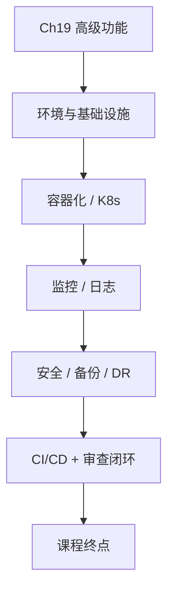

# 第二十章 部署运维与生产优化

## 1. 学习目标

第五部分与全课程的终点：将智能客服系统从本地推到生产集群。完成本章后，学员将能够：用 Docker 多阶段构建 + Kubernetes 完成容器化部署；建立"应用监控 + 业务监控 + 异常告警"完整可观测性体系；用四步审查法验证生产部署方案的安全性与可恢复性。

### 1.1 学习路径图

### 1.2 交付物清单

可复现的容器化部署（Docker + Kubernetes）；监控/告警/日志聚合体系；安全加固 + 备份 + 灾备方案；CI/CD 流水线 + 金丝雀脚本；`devops-review` Skill 草稿（覆盖 livez/readyz 混淆、不安全 manifest 默认、Secret 明文、回滚路径缺失）。

### 1.3 三层递进策略

| 层级 | 目标         | 工时   | 适合人群             |
| :--- | :----------- | :----- | :------------------- |
| R1   | 基础部署可用 | 2–4 h  | 初学者               |
| R2   | 自动化与监控 | 4–8 h  | 有经验开发者         |
| R3   | 企业级生产   | 8–16 h | 资深 / 运维 / 架构师 |

---

## 2. 前置技能检查

| 维度 | 必备                                     | 进阶（建议）                    |
| :--- | :--------------------------------------- | :------------------------------ |
| 章节 | Ch17 架构、Ch18 核心、Ch19 高级 全部交付 | —                               |
| 工程 | Linux + Docker + Git + 网络/防火墙基础   | Kubernetes、CI/CD、云平台、监控 |

---

## 3. 部署环境准备

### 2.1 生产环境规划

#### 2.1.1 环境分层与架构

| 层     | 组件                                                       |
| :----- | :--------------------------------------------------------- |
| 网络层 | LB（Nginx/HAProxy）+ CDN + WAF + SSL/TLS                   |
| 应用层 | Web（React）+ API Gateway（Kong/APISIX）+ 微服务集群       |
| 数据层 | MongoDB 集群 + Redis 集群 + ES + Kafka/RabbitMQ + MinIO/S3 |
| 监控层 | Prometheus + Grafana + ELK + Jaeger + AlertManager         |
| 安全层 | OAuth2/OIDC + Vault + VPC/SG + 合规监控                    |

**Trae 提示词**：基于上表生成 4 套环境（dev / test / staging / prod）的网络拓扑 + 安全分区 + 多 AZ 高可用方案；输出 ADR 记录关键选型与回滚条件。

#### 2.1.2 基础设施配置

**Trae 提示词**：生成基础设施配置脚本与文档：

| 维度   | 关键项                                                             |
| :----- | :----------------------------------------------------------------- |
| 服务器 | CPU/内存/存储规划、OS 加固（CIS）、内核参数、日志/审计             |
| 数据库 | MongoDB 副本集 + 分片；Redis Sentinel/Cluster；ES 多节点；备份恢复 |
| 网络   | VPC + 子网 + 安全组 + LB + DNS                                     |
| 存储   | PV/PVC（CSI）、对象存储、备份卷、IO 性能基线                       |

**铁律**：生产 ≠ 开发；任何变更必须在 staging 镜像验证后再推 prod。

---

## 4. 容器化部署

### 3.1 Docker 基础部署

#### 3.1.1 单机容器化（三轮递进）

| 轮次 | Trae 提示词要点                                                                                | 关键交付                             |
| :--- | :--------------------------------------------------------------------------------------------- | :----------------------------------- |
| R1   | 各服务 Dockerfile + docker-compose.yml + .env + 数据卷 + 一键启动 + 基础健康检查               | 一键起前后端 + DB + Nginx 反代       |
| R2   | 多阶段构建 + 资源限制 + healthcheck + 优雅停机 + 日志轮转 + DB 自动备份 + Prometheus + Grafana | 镜像减肥 ≥ 50%；监控仪表板可见       |
| R3   | 多实例 + LB + 主从 + Redis 集群 + 防火墙 + SSL/TLS + 密钥管理 + RBAC + CI/CD + 自动扩缩        | 集群高可用，CI/CD 一条龙，零信任安全 |

**铁律**：① 镜像必须多阶段构建 + 非 root 用户 + 最小化基础镜像；② Secret 走环境变量或 Vault，禁止入镜像层；③ 镜像 tag 必须是 git sha，不许 latest 上生产。

#### 3.1.2 镜像管理与版本控制

**Trae 提示词**：搭建 Harbor（或 Docker Registry）私有仓库 + 用户/项目隔离；命名规范 `registry/<env>/<service>:<gitsha>-<semver>`；语义化版本（major.minor.patch）；Git 提交触发构建（GitHub Actions / GitLab CI）；构建产物自动 Trivy 扫描 + 大小检查 + SBOM 生成；高危漏洞阻断推送。

### 3.2 Kubernetes 集群部署

#### 3.2.1 基础集群搭建

**Trae 提示词**：1 Master + 2 Worker，kubeadm 初始化 + Calico/Cilium CNI + Local PV / NFS；为前端 / API Gateway / 各微服务 / DB 生成 Deployment + Service + ConfigMap + Secret + HPA + PDB；Ingress（Nginx Ingress / Traefik）+ TLS（cert-manager + Let's Encrypt）；RollingUpdate + Liveness/Readiness/Startup 三探针。

**审查要点**：

| 检查点        | 标准                                                                          |
| :------------ | :---------------------------------------------------------------------------- |
| 探针          | livez（进程存活）≠ readyz（依赖就绪），不可混淆                               |
| 安全上下文    | `runAsNonRoot: true` + `readOnlyRootFilesystem: true` + capabilities drop ALL |
| 资源          | 必填 requests + limits，避免噪声邻居                                          |
| NetworkPolicy | 默认 deny-all，按需放行                                                       |
| Secret        | 不硬编码，走 Sealed Secrets / External Secrets                                |
| 回滚          | `kubectl rollout undo` 30s 内可达                                             |

---

## 5. 监控与日志管理

### 4.1 系统监控

#### 4.1.1 监控与告警

**Trae 提示词**：Prometheus + Grafana + AlertManager 一体化部署；指标分三类：

| 指标层 | 关键指标                                           |
| :----- | :------------------------------------------------- |
| 系统   | CPU / 内存 / 磁盘 / 网络 / FD                      |
| 应用   | HTTP P50/P95/P99 / 错误率 / DB 连接池 / 缓存命中率 |
| 业务   | 在线用户 / 对话数 / 知识检索 QPS / SLA 达成率      |

告警规则按 SLO + Burn Rate 设计（参考 Ch12 §5.4）；通知渠道 = 邮件 / 短信 / 钉钉 / 飞书 / PagerDuty。

**铁律**：① 告警必须可执行（含处置 runbook 链接）；② 静默策略避免告警风暴；③ 月度复盘误报率 ≤ 5%。

#### 4.1.2 性能监控与优化

**Trae 提示词**：APM（OpenTelemetry / SkyWalking）+ 分布式链路追踪（Jaeger）+ 慢查询分析；瓶颈识别按 USE（Utilization/Saturation/Errors）+ RED（Rate/Error/Duration）方法；优化方案与效果必须给出 P50/P95 前后对比。

### 4.2 日志管理

#### 4.2.1 日志收集与分析

**Trae 提示词**：

| 阶段     | 工具与策略                                                             |
| :------- | :--------------------------------------------------------------------- |
| 采集     | Filebeat / Fluent Bit DaemonSet；JSON 结构化；统一字段（traceId 贯通） |
| 传输处理 | Logstash 解析 + 富化；按服务/级别路由                                  |
| 存储     | ES 集群；按日索引 + ILM（hot/warm/cold/delete）；保留 90 天            |
| 分析     | Kibana 仪表板 + Saved Search；告警与监控联动                           |
| 安全     | RBAC + 敏感字段脱敏（手机/邮箱/卡号）+ 审计日志独立保留 1 年           |

**铁律**：日志中禁止打印密码 / 完整 Token / 完整身份证号。

---

## 6. 安全与备份

### 5.1 系统安全

#### 5.1.1 基础安全防护

| 层级 | 关键配置                                                             |
| :--- | :------------------------------------------------------------------- |
| 网络 | 防火墙端口最小化 + IP 白名单 + DDoS（Cloudflare/WAF）+ HTTPS（HSTS） |
| 应用 | JWT（短 Access + Redis 黑名单 Refresh）+ MFA + RBAC + API Rate Limit |
| 数据 | DB 字段级加密 + TLS 传输 + 脱敏 + KMS 密钥轮换                       |
| 审计 | 所有写操作落审计日志（不可篡改 / 异地备份）                          |

**Trae 提示词**：按上表生成 nftables / Cloud SG / Nginx + Vault + KMS 配置；输出威胁建模（STRIDE）报告。

#### 5.1.2 安全监控与响应

**Trae 提示词**：Falco（容器运行时威胁检测）+ Wazuh（HIDS）+ ZAP/Trivy（漏扫）；事件分级（P0/P1/P2/P3）+ 自动响应（封禁 IP / 隔离 Pod / 触发备份）+ 周期性渗透测试 + 合规检查（GDPR / 等保 2.0）。

**铁律**：高危漏洞 24h 内修复或缓解；零日事件直接走 P0 应急流程。

### 5.2 数据备份与恢复

#### 5.2.1 备份策略

| 数据类型           | 全量     | 增量                 | 保留   | 加密 / 异地 |
| :----------------- | :------- | :------------------- | :----- | :---------- |
| MongoDB / PG       | 周       | 日                   | 90 天  | ✅ / ✅     |
| Redis              | —        | 日（RDB/AOF）        | 7 天   | ✅ / ✅     |
| 用户文件 / KB      | 周       | 实时（对象存储版本） | 365 天 | ✅ / ✅     |
| K8s manifest / IaC | Git 主线 | —                    | 永久   | —           |

**Trae 提示词**：基于 Velero（K8s）+ pgBackRest / mongodump + restic 实现自动化；备份完成后自动校验 checksum；月度演练 → 报告产出 RTO / RPO 实测值。

**铁律**：备份不演练等于没备份；演练结果不达 SLO 必须改方案。

#### 5.2.2 灾难恢复

**目标 SLO**：RTO ≤ 2h，RPO ≤ 1h，可用性 ≥ 99.9%。

**Trae 提示词**：恢复优先级 = 关键服务（用户/对话）→ 次要服务（KB/分析）→ 历史数据；恢复脚本：DB 还原 → 配置/Secret 注入 → 服务拉起 → 健康检查 → DNS 切流 → 流量回放验证；每季度一次全链路演练 + 写入故障复盘库。

---

## 7. 实践练习

### 6.1 部署实战

| 练习       | 步骤                                                   | 验收                                     |
| :--------- | :----------------------------------------------------- | :--------------------------------------- |
| 单机容器化 | 准备 Docker → docker-compose 编排 → 启动 → 验证        | 一键起 + 前后端可访问 + DB 持久化        |
| 监控搭建   | 部署 Prom+Grafana → 集成 exporters → 仪表板 → 告警规则 | 指标完整、仪表板可读、告警可达           |
| 日志管理   | 部署 ELK → Filebeat 接入 → 索引 → Saved Search         | 全链路日志可检索、字段统一、保留策略生效 |

### 6.2 运维场景演练

| 演练     | 场景         | 关键步骤                                           | 学习目标                |
| :------- | :----------- | :------------------------------------------------- | :---------------------- |
| 故障处理 | DB 连接故障  | 发现 → 定位 → 应急 → 恢复 → 复盘                   | 故障排查与应急流程      |
| 系统扩容 | 流量突增     | 监控分析 → 扩容方案 → HPA / 手动扩 → 调优          | 扩容方法 + 容量规划     |
| 备份恢复 | 模拟数据丢失 | 确认 → 定位备份 → 恢复 → 完整性验证 → 报告 RTO/RPO | 数据恢复流程 + 备份验证 |

---

## 8. 小结

| 能力维度 | 本章交付                                                | 课程毕业判据                         |
| :------- | :------------------------------------------------------ | :----------------------------------- |
| 容器化   | Docker 多阶段 + 私有仓库 + Trivy 扫描                   | 镜像 0 高危，tag 全部 git sha        |
| 编排     | K8s Deployment + Service + Ingress + 三探针 + HPA + PDB | livez≠readyz；rollout undo 30s 可达  |
| 监控     | Prom + Grafana + AlertManager + APM + Tracing           | SLO + Burn Rate 告警；误报率 ≤ 5%    |
| 日志     | ELK + 结构化 + ILM + 脱敏                               | traceId 全链路可追溯，敏感字段不泄露 |
| 安全     | 网络 + 应用 + 数据 + 审计 + IDS/IPS                     | 高危漏洞 24h 闭环，渗透测试通过      |
| 备份/DR  | Velero + pgBackRest + 季度演练                          | RTO ≤ 2h，RPO ≤ 1h，演练报告归档     |
| Skill    | `devops-review` 草稿                                    | grep 命中本章铁律即报警              |

**5 条运维铁律**：① Secret 不进镜像；② K8s 默认 `runAsNonRoot + readOnlyRootFilesystem`；③ livez 与 readyz 必须区分；④ 备份必须演练，否则视为不存在；⑤ 任何 prod 变更必经 staging 镜像验证 + 回滚路径明确。

---

## 9. 学习效果评估

### 8.1 技能清单

| 层级 | 必/建议/可选 | 关键能力                                                               |
| :--- | :----------- | :--------------------------------------------------------------------- |
| 基础 | 必须         | Docker 容器化 + Compose 编排 + K8s 基础集群 + 基础监控/日志 + 备份恢复 |
| 进阶 | 建议         | 高可用架构 + CI/CD + 性能监控 + 安全监控 + 故障处理 + 容量规划         |
| 专家 | 可选         | 企业级运维体系 + 多/混合云 + AIOps + 合规审计 + 团队赋能               |

### 8.2 项目验收标准

| 维度 | 标准                                           |
| :--- | :--------------------------------------------- |
| 部署 | 一键 + 自动扩容 + 高可用；标准化 + 自动化      |
| 监控 | 覆盖完整、误报率 ≤ 5%、日志可检索、性能可优化  |
| 安全 | 网络 ACL + 访问控制 + 数据加密/脱敏 + 审计完整 |
| 备份 | 策略全面、自动执行、季度演练、RTO/RPO 达标     |

### 8.3 延伸阅读

| 类别      | 链接                                                                                                                              |
| :-------- | :-------------------------------------------------------------------------------------------------------------------------------- |
| 容器/编排 | [Docker](https://docs.docker.com/) · [Kubernetes](https://kubernetes.io/docs/)                                                    |
| 监控/日志 | [Prometheus](https://prometheus.io/docs/) · [ELK](https://www.elastic.co/guide/)                                                  |
| 实践范式  | [Google SRE](https://sre.google/books/) · [12-Factor](https://12factor.net/) · [DevOps Handbook](https://www.devopshandbook.com/) |
| 生态      | [CNCF Landscape](https://landscape.cncf.io/) · [K8s 安全](https://kubernetes.io/docs/concepts/security/)                          |

---

## 10. 附录：Vibe Coding 循环参考

部署运维环节 AI 生成的配置一旦发布就很难回滚，**描述意图 → AI 生成 → 审查迭代 → 交付** 闭环必须在 PR 合入前走完，不能「在生产迭代」。

| 本章模块               | 对应 Vibe Coding 循环实录                                                                                                                                                                   |
| :--------------------- | :------------------------------------------------------------------------------------------------------------------------------------------------------------------------------------------ |
| §3 容器化与 Kubernetes | [Ch15 §5.7 livez/readyz 混淆修正](../第四部分-团队协作与最佳实践/第十五章-云平台部署与DevOps实践.md) + [§7.4 扫描修正表](../第四部分-团队协作与最佳实践/第十五章-云平台部署与DevOps实践.md) |
| §4 监控 / 日志 / 告警  | [Ch12 §5.4 Sidecar 超时雪崩](../第三部分-高级应用场景/第十二章-微服务架构与服务治理.md)（SLO + Burn Rate 复用）                                                                             |
| §5 安全与备份          | [Ch16 §5.7 缓存击穿修正](../第四部分-团队协作与最佳实践/第十六章-安全最佳实践与性能优化.md) + [§7.4 扫描修正表](../第四部分-团队协作与最佳实践/第十六章-安全最佳实践与性能优化.md)          |
| CI/CD / PR 闸门        | [Ch13 §5.7 假绿测试修正](../第四部分-团队协作与最佳实践/第十三章-代码质量管理与自动化测试.md) + [Ch14 §5.6 PR 模板空填](../第四部分-团队协作与最佳实践/第十四章-项目管理与团队协作.md)      |
| 3 轮未收敛             | 触发 [Ch2 §4.10](../第一部分-Trae基础入门/第二章-基础交互模式.md)：从 Builder 退为 Chat；按 Helm chart / NetworkPolicy / Secret 拆包提示                                                    |
| 修正提示词             | 严格按 [Ch2 §4.9](../第一部分-Trae基础入门/第二章-基础交互模式.md)：保留 X / 修 Y / 不要动 Z / 验证信号。运维调整额外必填「回滚路径」。                                                     |

> **运维铁律**：AI 生成的任何 K8s manifest 都必须先过 [Ch15 §7.4](../第四部分-团队协作与最佳实践/第十五章-云平台部署与DevOps实践.md) 与 [Ch16 §7.4](../第四部分-团队协作与最佳实践/第十六章-安全最佳实践与性能优化.md) 扫描表；grep 任一命中均不准合入 main。
