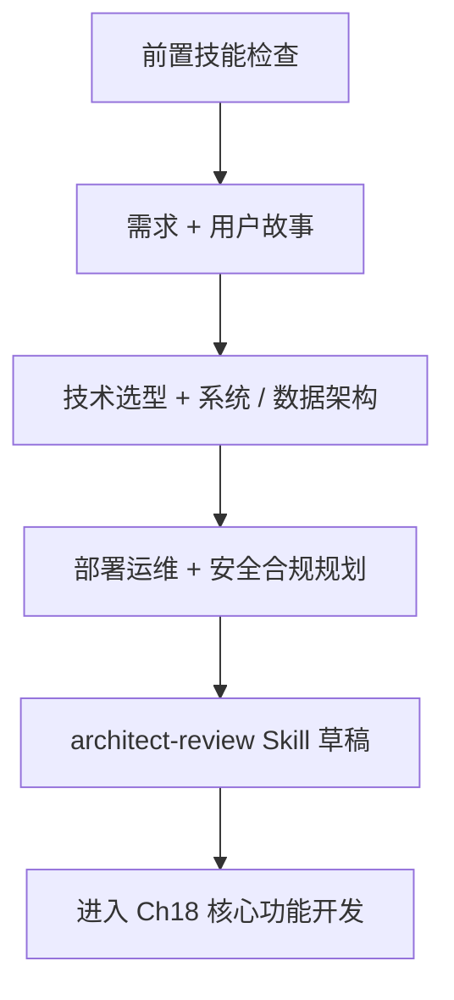
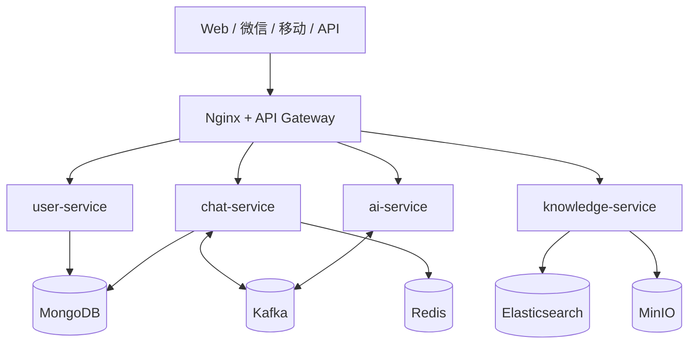

# 第十七章 项目规划与系统架构设计

## 1. 学习目标

本章是第五部分综合项目的起点——将前四部分技能汇总到一个端到端的智能客服系统。完成本章后，学员将能够：用 Trae 完成需求分析→用户故事→技术选型→架构与数据设计的完整规划；制定容器化、监控与安全合规的整体策略；以四步审查法验证 AI 生成的架构方案在合理性、可运维性、安全性三个维度的成立。

### 1.1 学习路径图



### 1.2 预期学习成果

本章交付物：①需求文档（用户故事 + 验收标准）；②技术选型 ADR；③系统架构与数据存储设计；④部署/监控/安全合规规划；⑤`architect-review` Skill 草稿（含架构合理性 grep 模式）。

---

## 2. 前置技能检查

| 维度          | 必须掌握                          | 自检信号                      | 不足时回看                    |
| :------------ | :-------------------------------- | :---------------------------- | :---------------------------- |
| Trae 使用     | Builder/Chat/Cue 切换、提示词撰写 | 能写出含约束 + 验证信号的提示 | 第一部分 Ch1–Ch2              |
| 自然语言编程  | 需求→代码、AI 输出验证、重构      | 能识别 AI 生成代码的常见缺陷  | 第二部分 Ch5–Ch8              |
| Web/数据库    | HTTP、REST、SQL/NoSQL 基础        | 能独立设计单服务的库表结构    | 第二部分 Ch6/Ch7              |
| 微服务/云原生 | 单体 vs 微服务、容器、服务通信    | 能说清服务边界与一致性策略    | 第三部分 Ch12 + 第四部分 Ch15 |
| 项目管理      | 用户故事格式、SDLC、DevOps        | 能写出 INVEST 合格的故事卡    | 第四部分 Ch14                 |

> 上表任一行自检不过，先回看再继续；架构阶段返工成本最高。

---

## 3. 理论基础：需求分析与用户故事

### 3.1 客户咨询场景与多渠道接入

#### 3.1.1 场景维度矩阵

| 维度     | 取值                              | 设计影响                     |
| :------- | :-------------------------------- | :--------------------------- |
| 咨询类型 | 产品使用 / 账户 / 订单 / 售后     | 决定意图分类与知识库分区     |
| 时间分布 | 工作日/周末、白天/夜晚            | 决定 AI 与人工排班的切换策略 |
| 渠道     | Web 嵌入、微信公众号、API、移动端 | 决定统一消息格式与会话归并   |
| 复杂度   | FAQ / 业务问题 / 技术故障         | 决定 AI→人工的转接阈值       |
| 期望响应 | 即时 / 24h 内                     | 决定 SLO 与告警阈值          |

#### 3.1.2 多渠道接入提示词

```text
为以下渠道生成统一接入方案：Web 嵌入聊天、微信公众号、对外 REST + WebSocket、移动端。
要求：1) 统一消息协议（type/channel/userId/payload/ts）；
     2) 跨渠道身份归并（unionId / 邮箱 / 手机号）；
     3) 渠道特性差异表（消息长度、富媒体、推送、模板）；
     4) 每渠道列出 3 项必做与 2 项不做。
```

### 3.2 用户角色与用户故事

#### 3.2.1 角色矩阵

| 角色            | 核心场景                         | 主要痛点               | 关键诉求             |
| :-------------- | :------------------------------- | :--------------------- | :------------------- |
| 客户 Customer   | 多渠道咨询、查询订单、跟踪问题   | 等待长、答非所问       | 即时、准确、可回看   |
| 客服 Agent      | 多会话切换、知识库查询、工单处理 | 重复问题多、工具切换   | 智能辅助、一屏搞定   |
| 主管 Supervisor | 排班、质检、数据分析             | 缺实时数据、质量难量化 | 实时看板、可量化指标 |

#### 3.2.2 用户故事生成提示词

```text
按 INVEST 原则为上表 3 类角色各生成 P0/P1/P2 各 2 条用户故事，每条含：
- 标准格式：作为 X，我希望 Y，以便 Z
- 验收标准（Given/When/Then 至少 3 条）
- 技术实现要点（依赖服务、关键接口）
- 测试场景（含 1 条异常路径）
输出为 Markdown 表格，按优先级排序。
```

**审查要点**：每条故事必含至少 1 条异常路径验收；P0 故事不得依赖 P1/P2；跨角色故事需注明触发与可观测信号。

---

## 4. 项目创建与初始化

### 4.1 使用 Trae 创建智能客服系统项目

#### 4.1.1 项目初始化

**目标**：一次提示生成完整的全栈项目骨架。

**Trae 提示词**：

```text
创建项目 intelligent-customer-service：
- 技术栈：React + TypeScript + Node.js + Spring Boot + MongoDB + Redis
- 结构：前后端分离 + 微服务 + Docker；含 docs/、infrastructure/、scripts/
- 服务：customer-portal、agent-workbench（前端）/ user、chat、ai、knowledge（后端）
- 输出：完整目录、根 docker-compose.yml、各服务 Dockerfile、统一 lint/format/CI 模板
```

**预期输出（骨架要点）**：

```bash
intelligent-customer-service/
├── docker-compose.yml         # 一键起 MongoDB / Redis / ES / 各微服务
├── docs/                      # architecture.md / api-spec.md / deployment.md
├── frontend/{customer-portal, agent-workbench}/   # Vite + TS
├── backend/{user, chat, ai, knowledge}-service/   # 各含 Dockerfile
├── infrastructure/{nginx, kubernetes, monitoring}/
└── scripts/{build,deploy,test}.sh
```

#### 4.1.2 项目配置完善

**Trae 提示词（一并产出三类配置）**：

```text
为该项目补全：
1. README.md：项目介绍 / 技术栈 / 快速开始 / 开发环境 / API 文档链接 / 贡献指南
2. 工程规范：Prettier + ESLint + Conventional Commits + Husky + Jest 配置
3. Docker 开发环境：热重载、DB 初始化脚本、健康检查、统一 .env.example
```

**审查要点**：`.env.example` 是否含全部必填项；CI 是否阻断未通过 lint/test 的合入；docker-compose 是否声明 `healthcheck` 与 `depends_on.condition: service_healthy`。

---

## 5. 技术选型与架构设计

### 5.1 技术选型决策

#### 5.1.1 选型约束与对比

**约束**：团队 5–8 人（熟 Java/React）；周期 6+2 月；1k 并发，P95<2s；优先开源。

**Trae 提示词（一次产出对比与 ADR）**：

```text
就以下三组技术做对比并输出 ADR（含决策、备选、权衡、回滚条件）：
- 前端：React vs Vue vs Angular
- 后端：Spring Boot vs Node.js vs Django
- 存储：MySQL vs PostgreSQL；MongoDB vs CouchDB；Redis vs Memcached；ES vs Solr
评估维度：团队熟悉度、性能、生态、运维成本、长期演进风险。
```

#### 5.1.2 最终技术栈（推荐基线）

| 层        | 选择                                                | 关键原因                   |
| :-------- | :-------------------------------------------------- | :------------------------- |
| 前端      | React 18 + TS + Antd Pro 5.x + Redux Toolkit + Vite | 团队熟悉、生态完整、构建快 |
| 实时通信  | Socket.io-client / WebSocket + STOMP                | 双端成熟、断线重连完善     |
| 后端      | Spring Boot 3.x + Spring Cloud Gateway + JWT        | 团队熟、企业级中间件齐全   |
| 主存      | MongoDB 6.x                                         | 会话/消息文档结构灵活      |
| 缓存/搜索 | Redis 7.x / Elasticsearch 8.x                       | 命中率与全文检索           |
| 异步      | Kafka                                               | 跨服务事件解耦             |
| 文件      | MinIO（兼容 S3）                                    | 自托管 + 云迁移平滑        |
| 基础设施  | Docker / K8s / Nginx / Prometheus + Grafana         | 与第四部分 Ch15 一致       |

### 5.2 系统架构设计

#### 5.2.1 整体分层



**架构原则**：微服务松耦合、事件驱动、水平扩展、熔断降级。前后端 HTTP/HTTPS + WebSocket；服务间 HTTP/gRPC + Kafka 事件总线。

#### 5.2.2 微服务拆分

| 服务              | 职责                 | 私有数据           | 对外接口                  |
| :---------------- | :------------------- | :----------------- | :------------------------ |
| user-service      | 认证、权限、用户信息 | 用户/角色/权限表   | `/auth/*`、`/users/*`     |
| chat-service      | 消息、会话、实时通信 | 会话/消息表        | `/messages/*`、WS `/chat` |
| ai-service        | 智能回复、意图、情感 | 模型配置、训练数据 | `/infer`、`/intent`       |
| knowledge-service | 知识管理、搜索、推荐 | 知识条目、标签     | `/kb/search`、`/kb/admin` |

> **铁律**：服务之间不共享数据库；跨服务一致性走事件最终一致；同步只用于读，不用于写。

### 5.3 数据架构设计

#### 5.3.1 核心实体与关系

| 实体         | 关键字段                                 | 主要关系                   |
| :----------- | :--------------------------------------- | :------------------------- |
| User         | id、role、status、lastActiveAt           | 1—n Conversation；n—n Role |
| Conversation | id、participants、channel、priority、tag | 1—n Message                |
| Message      | id、type、sender、receiver、status、ts   | n—1 Conversation           |
| Knowledge    | id、title、body、tags、score、updatedAt  | n—n Category               |

**约束**：主键/外键/唯一/非空 + 字段长度与格式校验；消息 `ts` 必须为服务端时间戳（防客户端篡改）。

#### 5.3.2 分层存储与缓存

| 层     | 选型          | 内容                                   | 策略                             |
| :----- | :------------ | :------------------------------------- | :------------------------------- |
| 热数据 | Redis         | 在线用户、活跃会话、最近消息、实时统计 | Cache-Aside + TTL/LRU + 启动预热 |
| 主存   | MongoDB       | 用户、完整对话历史、知识库、配置       | 读写分离、按 userId 分片         |
| 检索   | Elasticsearch | 知识库与对话全文                       | 增量同步、定时重建索引           |
| 文件   | MinIO         | 头像、附件、知识图、备份               | 桶级 lifecycle + 异地复制        |

**一致性**：写主→发事件→更新缓存与索引；最终一致性窗口需 SLO 化（P95<2s）。备份：每日全量 + 每小时增量，30 天保留。

---

## 6. 部署策略与运维规划

### 6.1 容器化与 Kubernetes

#### 6.1.1 容器化设计要点

| 组件             | 基础镜像                                        | 关键配置                    | 健康检查            |
| :--------------- | :---------------------------------------------- | :-------------------------- | :------------------ |
| 前端             | `nginx:alpine`                                  | 静态资源 + 环境变量注入     | `/healthz`          |
| 后端             | `eclipse-temurin:17-jre`（或 `node:18-alpine`） | 多阶段构建、非 root 用户    | `/livez`、`/readyz` |
| MongoDB/Redis/ES | 官方镜像                                        | Volume 持久化、统一备份策略 | 各官方探针          |

**网络与配置**：Bridge + 服务发现；ConfigMap/Secret 分离；统一结构化 JSON 日志。

#### 6.1.2 Kubernetes 部署提示词

```text
为本项目生成 K8s manifest，至少包含：
- 命名空间：dev / staging / production
- 工作负载：无状态 Deployment / 有状态 StatefulSet / 日志监控 DaemonSet / 定时 CronJob
- 暴露：内 Service + 外 Ingress（含 TLS）+ EndpointSlice
- 资源：requests/limits、PVC 配额、NetworkPolicy
- 弹性：HPA（CPU/QPS）+ VPA 建议 + Cluster Autoscaler
- 配置：ConfigMap/Secret + 热更新；Secret 必走 KMS/Sealed-Secrets，禁止明文
要求：每份 manifest 自带 livez/readyz、`securityContext.runAsNonRoot=true`、`readOnlyRootFilesystem=true`。
```

> 输出必须先过 [Ch15 §7.4 危险模式扫描](../第四部分-团队协作与最佳实践/第十五章-云平台部署与DevOps实践.md)，再合入 main。

### 6.2 CI/CD 与发布

| 阶段     | 必跑项                                                        | 失败动作                    |
| :------- | :------------------------------------------------------------ | :-------------------------- |
| 静态检查 | ESLint + Prettier + tsc + SonarQube + 依赖漏扫                | 直接 fail，不进下一步       |
| 测试     | Jest 单测（覆盖率门禁）+ 接口测试 + Playwright E2E + 性能基准 | 任一未达门禁 fail           |
| 构建     | Vite 前端 + Java/TS 后端 + Docker 多阶段镜像推送              | 构建失败回滚到上一镜像      |
| 部署     | dev 自动 / staging PR 合并触发 / prod 人工审批 + 金丝雀       | 健康检查不过自动回滚        |
| 验证     | livez/readyz、烟雾用例、关键 SLO 监控                         | 触发 burn-rate 告警自动回滚 |

**版本与回滚**：分支模型 `main / develop / feature/* / hotfix/*`；语义化版本 + Git Tag + 自动 CHANGELOG；回滚必须包含「镜像版本 + 数据库迁移 + 配置」三件套。

### 6.3 监控与日志

| 监控层   | 关键指标                                         | 告警阈值（参考）              |
| :------- | :----------------------------------------------- | :---------------------------- |
| 基础设施 | CPU/内存/磁盘/网络、容器与 K8s 健康              | 节点不可用、磁盘 >85%         |
| 应用     | P95 RT、QPS、错误率、连接池、缓存命中、Kafka lag | RT P95>2s、错误率>1%、lag>10k |
| 业务     | 在线用户、会话数、AI 解决率、CSAT                | 解决率周环比下跌 >5%          |

**工具栈**：Prometheus + Node Exporter / ELK / Jaeger / Grafana / AlertManager（钉钉 + 邮件）。  
**日志**：统一结构化 JSON、级别 DEBUG/INFO/WARN/ERROR、按大小+时间轮转、按级别分级保留。  
**故障处理 4 步**：发现（监控/反馈/巡检）→ 定位（日志/链路/资源/依赖）→ 处理（止损/根因/验证）→ 复盘（改进项进 Backlog）。

---

## 7. 安全策略设计

### 7.1 身份认证与授权

| 维度      | 方案                                           | 配置要点                                                                  |
| :-------- | :--------------------------------------------- | :------------------------------------------------------------------------ |
| 认证      | 密码 + MFA（TOTP/SMS）+ 风险自适应             | 失败计数锁定、地理/设备指纹检测                                           |
| SSO       | OIDC + JWT；可选 SAML 2.0                      | Access 30 min / Refresh 7d，支持吊销                                      |
| 会话      | Session ID 周期更新、并发会话上限              | 异常登录强制下线 + 通知                                                   |
| 授权      | RBAC 主导 + ABAC 细粒度                        | 角色：超管/组织管理员/主管/客服/客户；属性：部门/级别/数据敏感度/时间地点 |
| API 安全  | API Key + OAuth2 + mTLS + 签名                 | 限流（令牌桶）、熔断、入参校验、出参脱敏                                  |
| 传输/存储 | TLS 1.3 + ECDHE/PFS；TDE + 字段级 AES；HSM/KMS | 证书自动轮换；密钥定期轮换并审计                                          |

### 7.2 数据隐私与合规

| 主题     | 关键要求                          | 落地动作                         |
| :------- | :-------------------------------- | :------------------------------- |
| 数据分类 | 基础/敏感/行为/生物 四类          | 字段级别打标 + 自动扫描脏数据    |
| 标签     | 敏感级别、用途、保留期、地域      | 元数据库统一管控、跨境数据不出域 |
| 用户权利 | 知情/访问/更正/删除/限制处理/可携 | 自助导出 + 软/硬删除 + 删除证明  |
| 合规审计 | ROPA、PIA、72 小时泄漏通报        | 处理活动登记、年度 PIA、应急演练 |

**Trae 提示词**：

```text
基于上表为本系统生成：①数据分类与标记字段映射；②用户权利接口列表（路径/输入/输出）；
③数据泄漏 72h 应急 SOP；④隐私政策模板（含 GDPR/CCPA 必填项）。
```

---

## 8. 小结

| 能力维度 | 本章交付                              | 进入 Ch18 的判据            |
| :------- | :------------------------------------ | :-------------------------- |
| 需求     | 用户故事 + 验收标准 + 异常路径        | P0 故事 100% 可测           |
| 选型     | 决策表 + ADR                          | 含「备选 + 回滚条件」       |
| 架构     | 系统分层图 + 服务拆分表 + 数据/存储表 | 满足 SLO（P95<2s、1k 并发） |
| 运维     | 容器化 + CI/CD + 监控/日志规划        | 关键告警阈值已写入 ADR      |
| 安全     | 认证/授权 + 隐私合规矩阵              | 通过 Ch15/Ch16 §7.4 扫描    |
| Skill    | `architect-review` 草稿               | grep 命中本章铁律即报警     |

**核心铁律**：① 服务间不共享 DB；② 写走事件、读可同步；③ Secret 不进镜像；④ K8s 默认 `runAsNonRoot + readOnlyRootFilesystem`；⑤ 任何决策无 ADR 即不可合入。

---

## 9. 附录：Vibe Coding 循环参考

项目规划与架构设计阶段仍需严格遵守 Vibe Coding 循环：**描述意图 → AI 生成 → 审查迭代 → 交付**。架构阶段是修改代价最高的阶段，"3 轮未收敛" 需立刻重启。

| 环节                | 应用 Vibe Coding 决策                                                                                                                    |
| :------------------ | :--------------------------------------------------------------------------------------------------------------------------------------- |
| 需求分析 / 架构探究 | 选 [Builder + /plan](../第一部分-Trae基础入门/第一章-Trae简介与环境配置.md) §5.4 三种交互模式决策树输出架构草图 + ADR；不走 Builder Auto |
| 架构修正            | 按 [Ch2 §4.9 修正语法](../第一部分-Trae基础入门/第二章-基础交互模式.md)写「保留 X / 修 Y / 不要动 Z / 验证信号」                         |
| 3 轮架构未收敛      | 触发 [§4.10 重启](../第一部分-Trae基础入门/第二章-基础交互模式.md)的「拆事例 / 拆服务 / 换架构风格」；架构决策成本高，需人手写 ADR 锁定  |
| AI 输出验证         | ADR 必须含「启动代价 / 与 Ch12 SLO 兑现 / 回滚路径」三项可测信号才能进入 Ch18 实现阶段                                                   |

> 完整循环术语与表格范本可参考 [Ch1 §5.4](../第一部分-Trae基础入门/第一章-Trae简介与环境配置.md) 与 [Ch2 §4.9 / §4.10](../第一部分-Trae基础入门/第二章-基础交互模式.md)。
