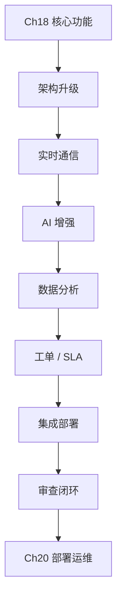

# 第十九章 高级功能与AI增强

## 1. 学习目标

在 Ch18 的核心功能之上，叠加 **实时通信、AI 增强、数据分析、工单/质检** 四大高级能力。完成本章后，学员将能够：用 WebSocket + 消息队列实现高并发实时推送；集成情感分析与智能推荐；构建实时数据分析与 SLA 工单系统；并对所有 AI 生成的高级特性做闭环审查。

### 1.1 学习路径图



### 1.2 交付物清单

可运行的实时通信系统（WebSocket 长连接 + 消息队列）；AI 增强（情感分析 + 智能推荐）；实时数据分析与工单/SLA 系统；`advanced-feature-review` Skill 草稿（覆盖 WebSocket 连接泄漏、AI 推理超时、SLA 超时检测）。

### 1.3 三层递进策略

| 层级 | 目标        | 模块工时 | 适合人群      |
| :--- | :---------- | :------- | :------------ |
| R1   | 核心可用    | 2–4 h    | 初学者 / 原型 |
| R2   | 性能与体验  | 4–8 h    | 有经验开发者  |
| R3   | 生产/企业级 | 8–16 h   | 资深 / 架构师 |

---

## 2. 前置技能检查

| 维度   | 必备                                        | 进阶（建议）                          |
| :----- | :------------------------------------------ | :------------------------------------ |
| Ch18   | 用户/RBAC、对话引擎、知识库、多渠道接入     | —                                     |
| 技术栈 | Node.js + TS、React、PostgreSQL/MySQL、REST | WebSocket、Redis/RabbitMQ、Docker、ML |

---

## 3. 高级功能基础准备

### 2.1 项目架构升级

#### 2.1.1 微服务拆分

在 Ch17 拆分基础上，再增 6 个高级服务：

| 服务                     | 职责                       | 技术                      |
| :----------------------- | :------------------------- | :------------------------ |
| `realtime-service`       | WebSocket 长连接、Presence | Socket.IO + Redis Pub/Sub |
| `ai-enhanced-service`    | NLP 推理、情感、推荐       | FastAPI + Transformers    |
| `analytics-service`      | 指标聚合、报表             | Node.js + ClickHouse/PG   |
| `ticket-service`         | 工单流转、状态机           | Node.js + PG              |
| `quality-service`        | 对话质检、抽样             | Python + 规则引擎         |
| `recommendation-service` | 知识/回复推荐              | Python + FAISS            |

**Trae 提示词**：基于 Ch17 拓扑增补上述 6 服务；接入 API Gateway（Kong/APISIX）+ 服务发现（Consul）+ 负载均衡 + 熔断（opossum/resilience4j）；数据存储分层：PG（事务）/ Redis（缓存与队列）/ ES（搜索）/ Kafka（事件）/ ClickHouse（OLAP）。

#### 2.1.2 开发环境增强

**Trae 提示词（增强 docker-compose.dev.yml）**：补充 Redis（Pub/Sub）+ Kafka（可选 RabbitMQ）+ Prometheus + Grafana + ELK + Jaeger + Jupyter + MLflow + ClickHouse + InfluxDB（时序）+ 数据备份 cron。

**铁律**：所有中间件容器开 `restart: unless-stopped` + healthcheck；密钥走 `.env`，不进镜像。

---

## 4. 实时通信系统

### 3.1 WebSocket 实时通信

#### 3.1.1 实时聊天功能（三轮递进）

| 轮次 | Trae 提示词要点                                                                             | 关键交付                                |
| :--- | :------------------------------------------------------------------------------------------ | :-------------------------------------- |
| R1   | Socket.IO + Express + SQLite：连接管理、文本消息、`messages` / `user_status` 表             | 双向消息收发、多人在线                  |
| R2   | 迁移 PostgreSQL（索引 + 连接池）+ Redis 缓存 + 房间管理 + 多媒体消息 + 已读/输入中/离线消息 | 房间 CRUD、图/文件、Typing 提示         |
| R3   | JWT + 端到端加密 + 集群（Redis adapter）+ 负载均衡 + 健康检查 + Prometheus + 自动恢复       | 水平扩展，连接 ≥ 100k，P95 推送 < 200ms |

**核心数据模型（R1）**：

```sql
CREATE TABLE messages (
  id INTEGER PRIMARY KEY, sender_id TEXT NOT NULL, receiver_id TEXT,
  content TEXT NOT NULL, message_type TEXT DEFAULT 'text',
  created_at DATETIME DEFAULT CURRENT_TIMESTAMP
);
CREATE TABLE user_status (
  user_id TEXT PRIMARY KEY, is_online BOOLEAN DEFAULT FALSE,
  last_seen DATETIME, socket_id TEXT
);
```

**铁律**：① 连接关闭 / 心跳超时必须清理 Redis Presence；② 集群模式必须用 socket.io-redis adapter；③ 消息持久化与推送必须解耦（队列）。

#### 3.1.2 客服工作台界面

**Trae 提示词**：React 18 + TS + Ant Design + Socket.IO Client；三栏布局（左：在线客户队列；中：对话窗口；右：客户画像 + 标签 + 历史工单）；状态用 Zustand；快捷键 + 无障碍 + 响应式。

**审查要点**：超大会话列表用虚拟滚动；切换会话不丢失草稿；断网自动排队回放。

### 3.2 消息队列与异步处理

#### 3.2.1 Redis 消息队列

**Trae 提示词**：基于 Redis Pub/Sub + List 实现轻量队列；任务类型 = {消息持久化, 推送, 统计, 图片压缩, 文件清理}；BullMQ 封装重试 + 延迟 + 优先级；Worker 进程独立伸缩；Prometheus 暴露 `queue_depth` / `job_duration`。

**铁律**：① 队列消费幂等（依赖 jobId 去重）；② 失败任务进死信队列，禁止丢弃；③ 队列 backlog 超阈值告警 + 自动扩 Worker。

---

## 5. AI 增强功能

### 4.1 智能情感分析

#### 4.1.1 情感识别

**Trae 提示词**：封装情感分析 API（百度 AI / 腾讯云 / 自建 BERT 三选一）；输出 `sentiment ∈ {pos, neg, neu}` + `intensity ∈ [0,1]`；客服界面实时显示情感条 + 客户连续 negative 触发"建议降火"提示；按 `hash(text)` 做 Redis 缓存（TTL 1h）+ 限流（令牌桶 100/s）。

**审查要点**：API 失败必须降级为本地词典模型，不可抛 5xx；多语言场景按 `lang` 路由不同模型。

#### 4.1.2 智能推荐

**Trae 提示词**：基于 Sentence-BERT 向量化 + FAISS：① 快捷回复推荐（命中率 ≥ 70%）；② 知识库推荐（按客户当前问题 Top 5）；③ 协同过滤补强（客服历史采纳行为）；记录采纳/拒绝事件，进入推荐反馈闭环。

**铁律**：① 推荐响应 P95 < 300ms；② 推荐结果不得越过租户/权限边界；③ 支持 A/B 实验对比。

---

## 6. 数据分析与工单管理

### 5.1 实时数据分析

#### 5.1.1 数据统计与可视化

**Trae 提示词**：

| 指标分类 | 指标                                               |
| :------- | :------------------------------------------------- |
| 服务统计 | 日对话量、平均响应时间、首响时间、问题解决率       |
| 客服绩效 | 个人服务量、客户满意度（CSAT）、在线时长、转人工率 |
| 业务洞察 | 热点问题 Top N、知识库命中率、工单分布             |

实现：定时任务（cron / Bull repeatable）按 5 min / 1 h / 1 d 三档预聚合 → 写 ClickHouse；前端用 ECharts/AntV 渲染日/周/月报；支持 CSV / Excel 导出。

#### 5.1.2 用户行为分析

**Trae 提示词**：埋点 SDK（pageview / click / message / route）→ Kafka → ClickHouse；构建用户画像（基础属性 + 偏好 + 活跃度）；漏斗分析（访问→提问→解决）；流失点识别。

**审查要点**：埋点字段对齐数据字典；隐私字段（手机号/邮箱）必须脱敏后入仓。

### 5.2 工单管理系统

#### 5.2.1 基础工单功能

**Trae 提示词**：状态机 = `open → assigned → in_progress → resolved → closed`（可逆 reopened）；分配策略 = 手动 / 轮询 / 技能路由 / 负载最少；操作历史全量记录。

**核心模型**：

```sql
CREATE TABLE tickets (
  id SERIAL PRIMARY KEY, title VARCHAR(255) NOT NULL, description TEXT,
  status VARCHAR(50) DEFAULT 'open', priority VARCHAR(20) DEFAULT 'medium',
  assignee_id INTEGER, creator_id INTEGER NOT NULL,
  created_at TIMESTAMP DEFAULT CURRENT_TIMESTAMP,
  updated_at TIMESTAMP DEFAULT CURRENT_TIMESTAMP
);
CREATE TABLE ticket_logs (
  id SERIAL PRIMARY KEY, ticket_id INTEGER REFERENCES tickets(id),
  action VARCHAR(100) NOT NULL, old_value TEXT, new_value TEXT,
  operator_id INTEGER, created_at TIMESTAMP DEFAULT CURRENT_TIMESTAMP
);
```

**铁律**：状态变更必须事务化写 `ticket_logs`；越权修改通过 RBAC 在路由层拦截。

#### 5.2.2 SLA 监控

**Trae 提示词**：

| SLA 维度   | 指标                  | 默认阈值（可按租户覆盖） |
| :--------- | :-------------------- | :----------------------- |
| 响应时间   | 首次响应 P95          | < 60 s                   |
| 解决时间   | P0/P1/P2 工单解决 P95 | 4h / 24h / 72h           |
| 服务可用性 | 月度可用性            | ≥ 99.9%                  |

实现：每分钟扫描 in-flight 工单 → 计算剩余预算 → 80% 阈值预警 + 100% 违规告警（钉钉/飞书/邮件）；月报输出达成率与 Top 违规原因。

---

## 7. 系统集成与部署

### 6.1 容器化部署

**Trae 提示词**：每个服务一份 Dockerfile（多阶段构建 + 非 root 用户 + 最小镜像）；docker-compose.yml 编排服务依赖、网络、卷；部署脚本：开发/测试/生产三套 `.env`；健康检查 + 日志收集 + 基础指标。

**铁律**：① Secret 走环境变量或 Vault，不进镜像层；② 镜像必须打 git sha tag；③ 部署前运行 `npm audit` + Trivy 扫描。

### 6.2 性能优化与监控

| 层级   | 优化项                                                             |
| :----- | :----------------------------------------------------------------- |
| 数据库 | 慢查询索引 + 连接池 + 读写分离                                     |
| 缓存   | Redis 多层（热点 + 应用 + 浏览器）+ 缓存预热 + 失效策略            |
| 前端   | 代码分割 + 懒加载 + 资源压缩 + CDN + Service Worker                |
| 监控   | APM（OpenTelemetry / SkyWalking）+ Prometheus + Grafana + 告警规则 |

**审查要点**：每项优化必须给出优化前/后量化对比（P50 / P95 / 资源占用）。

---

## 8. 实践练习

### 7.1 基础练习

#### 7.1.1 功能扩展（任选 2–3）

| 方向     | 选项                                           |
| :------- | :--------------------------------------------- |
| 实时通信 | 语音消息、消息撤回、端到端加密                 |
| AI 增强  | 多维情感分析、对话质量自动评分、智能机器人接管 |
| 数据分析 | CSAT 预测、业务趋势预测、客户流失预警          |

#### 7.1.2 性能优化

数据库：慢查询治理 + 索引策略 + 读写分离；缓存：多层架构 + 预热 + 失效策略；前端：组件懒加载 + 打包优化 + PWA。**交付**：优化前后对比数据 + 决策记录 + 监控基线。

### 7.2 进阶练习

#### 7.2.1 微服务改造

业务边界分析 + 拆分方案 + 服务契约 + 注册发现 + 服务间通信 + 负载均衡 + 熔断降级 + 分布式追踪。

#### 7.2.2 智能运维

APM + 业务指标监控 + 日志聚合；智能告警（聚合 + 降噪 + 多渠道）；自动化部署 + 自动扩缩容 + 故障自愈。

---

## 9. 小结

| 能力维度 | 本章交付                             | 进入 Ch20 的判据                   |
| :------- | :----------------------------------- | :--------------------------------- |
| 实时通信 | WebSocket 集群 + Presence + 队列异步 | P95 推送 < 200ms，10k 并发连接稳定 |
| AI 增强  | 情感分析 + 智能推荐（向量检索）      | 推荐 P95 < 300ms，命中率 ≥ 70%     |
| 数据分析 | 实时统计 + 行为画像 + 漏斗           | 关键指标日报/周报可导出            |
| 工单/SLA | 状态机工单 + SLA 监控告警            | 违规告警可达，月报达成率可查       |
| 部署     | 容器化 + 多环境 + 监控/告警          | Trivy + npm audit 0 高危           |
| Skill    | `advanced-feature-review` 草稿       | grep 命中本章铁律即报警            |

**5 条铁律**：① WebSocket 关闭/心跳超时必清 Presence、集群必走 Redis adapter；② 队列消费必须幂等 + 死信兜底；③ AI 服务必须降级路径与限流；④ 多租户隔离贯穿数据/缓存/索引/推荐；⑤ 任何"性能优化"必带量化对比，否则不可合入。

---

## 10. 附录：Vibe Coding 循环参考

本章 4 大高级能力模块都是 "AI 首版锁定" 重灾区，必须以 **描述意图 → AI 生成 → 审查迭代 → 交付** 为主线，不能跳过迭代。

| 本章模块                         | 对应 Vibe Coding 循环实录                                                                                   |
| :------------------------------- | :---------------------------------------------------------------------------------------------------------- |
| §3 实时通信（WebSocket / Kafka） | [Ch10 §5.7 WebSocket 重连风暴修正](../第三部分-高级应用场景/第十章-实时通信与消息系统.md)                   |
| §4 AI 增强（推理服务 / 多模态）  | [Ch9 §5.5 推理服务首请超时修正](../第三部分-高级应用场景/第九章-AI模型集成与智能应用开发.md)                |
| §5 数据分析与工单                | [Ch11 §5.4 图表过度绘制修正](../第三部分-高级应用场景/第十一章-数据分析与智能可视化.md)                     |
| §6 系统集成与微服务拆分          | [Ch12 §5.4 Sidecar 超时雪崩修正](../第三部分-高级应用场景/第十二章-微服务架构与服务治理.md)                 |
| 3 轮未收敛                       | 触发 [Ch2 §4.10](../第一部分-Trae基础入门/第二章-基础交互模式.md)：拆模块 / 从 Builder 退为 Chat / 手写骨架 |
| 修正提示词                       | 严格按 [Ch2 §4.9](../第一部分-Trae基础入门/第二章-基础交互模式.md)：保留 X / 修 Y / 不要动 Z / 验证信号     |

> 高级功能越复杂，越需要在每轮迭代结束处以 [Ch16 §9 企业级护栏](../第四部分-团队协作与最佳实践/第十六章-安全最佳实践与性能优化.md) 验证。
