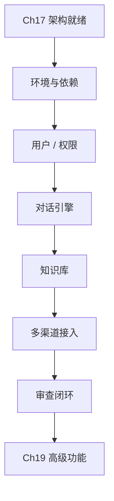

# 第十八章 核心业务功能开发

## 1. 学习目标

承接第十七章的架构设计，将其落地为可运行的核心功能：用户与权限、智能对话引擎、知识库系统、多渠道接入。完成本章后，学员将能够：用 Trae 实现 JWT + RBAC 认证；构建含意图识别、实体提取、上下文管理的对话引擎；搭建文档解析 + 向量检索的知识库；以及对核心代码完成「Vibe Coding 闭环 + 安全/性能审查」。

### 1.1 学习路径图



### 1.2 交付物清单

一个可运行的用户管理系统（注册/登录/RBAC/多租户）；一个智能对话引擎（意图识别 + 实体提取 + 上下文）；一个知识库系统（文档解析 + 向量检索）；一份 `core-feature-review` Skill 草稿（用户系统安全 + 对话响应质量校验规则）。

### 1.3 前置技能检查

| 维度 | 必备技能                             | 不达标处理               |
| :--- | :----------------------------------- | :----------------------- |
| 架构 | Ch17 ADR / 微服务拆分 / 数据存储设计 | 回看 Ch17 §5             |
| Trae | 自然语言编程 + 修正语法 + 模式选择   | 回看 Ch1 §5.4 / Ch2 §4.9 |
| 前端 | React 18 + TypeScript + Ant Design   | 回看 Ch5 §5.5            |
| 后端 | Node.js + Express + MongoDB + JWT    | 回看 Ch6 / Ch7 / Ch8     |
| 工程 | Git + 单测 + 错误处理 + 日志         | 回看 Ch4                 |

---

## 2. 开发环境准备

### 2.1 基础设施与依赖

**Trae 提示词（一次产出 4 件套）**：

```text
为智能客服系统生成开发环境与依赖：
1) docker-compose.dev.yml：MongoDB / Redis / Nginx，含初始化脚本与健康检查
2) .env.example：DB / Redis / JWT / 第三方密钥占位（不可硬编码）
3) 前端 package.json：React 18 + TS + Ant Design 5 + Vite
4) 后端 package.json：Express + Mongoose + ioredis + jsonwebtoken + bcrypt
5) AI 服务 requirements.txt：FastAPI + Transformers + sentence-transformers
6) 工程：ESLint / Prettier / Jest / Husky pre-commit
```

**审查要点**：Secret 不进镜像；前后端 Node 版本与 `engines` 对齐；Redis/Mongo 容器开 `restart: unless-stopped`。

## 3. 用户管理与权限系统

### 3.1 用户认证服务开发

#### 3.1.1 JWT 认证与 Token 管理

| 轮次 | Trae 提示词要点                                                             | 关键交付                                         |
| :--- | :-------------------------------------------------------------------------- | :----------------------------------------------- |
| R1   | 注册/登录 API + bcrypt 密码 + JWT 中间件 + 用户 Schema                      | `/auth/register` / `/auth/login` / `verifyToken` |
| R2   | 双 Token（Access 短 + Refresh 长 + Redis 黑名单） + 设备指纹 + 异常登录告警 | `/auth/refresh` / 设备表 / 登录审计日志          |
| R3   | MFA：TOTP（otplib）+ 短信验证码 + 备用恢复码 + 前端 MFA 设置页              | `/auth/mfa/*` 流程 + 二维码生成                  |

**铁律**：密码必须 bcrypt（cost ≥ 10）；JWT 必须设 `exp + iss + aud`；Refresh Token 撤销走 Redis 黑名单，不查 DB。

#### 3.1.2 RBAC 权限控制

| 轮次 | Trae 提示词要点                                                                        | 关键交付                               |
| :--- | :------------------------------------------------------------------------------------- | :------------------------------------- |
| R1   | 角色：SuperAdmin/OrgAdmin/Manager/Agent/Customer；资源：用户/对话/KB/工单/分析；表结构 | `roles` / `permissions` / `role_perms` |
| R2   | `@Permission('chat:read')` 装饰器 + Express 中间件 + Redis 权限缓存（TTL 5min）        | `requirePermission(expr)` 中间件       |
| R3   | React 权限管理页：角色 CRUD + 权限树 + 用户授权 + 变更审批流                           | `/admin/roles` / `/admin/permissions`  |

**铁律**：权限检查必须在路由层强制；前端权限控件仅做 UI 隐藏，不能作为安全边界。

### 3.2 用户管理前端

#### 3.2.1 控制台

**Trae 提示词**：用 React 18 + TS + Ant Design 5 实现用户列表（搜索/过滤/分页）、详情（信息编辑 + 权限分配）、组织架构树、响应式布局；状态管理用 Zustand；API 通过 axios 拦截器统一注入 Token + 401 自动刷新。

## 4. 智能对话引擎

### 4.1 自然语言处理服务

#### 4.1.1 意图识别与实体提取

| 轮次 | Trae 提示词要点                                                                         | 关键交付                     |
| :--- | :-------------------------------------------------------------------------------------- | :--------------------------- |
| R1   | FastAPI + Transformers：文本预处理 + 意图分类（产品/订单/售后/技术）+ POST `/nlp/parse` | `intent` + `confidence` 返回 |
| R2   | 实体类型（产品/订单号/时间/金额）+ 实体标准化 + 情感分析 + 批量接口                     | `/nlp/parse/batch`           |
| R3   | INT8 量化 + Redis 缓存（key=hash(text)）+ 异步队列 + Prometheus 指标                    | P95 < 200ms，QPS ≥ 100       |

#### 4.1.2 对话上下文管理

**Trae 提示词**：实现 `ConversationContext`：会话级状态（当前意图栈 + slot filling）+ 用户级长期记忆（最近 10 轮）+ 指代消解（用户最近提到的实体）+ Redis 存储（TTL 30min，话题切换自动重置）。

**审查要点**：上下文不得跨租户/跨用户串台；冷启动 1 次内完成。

### 4.2 智能回复生成

#### 4.2.1 规则引擎

| 轮次 | Trae 提示词要点                                         | 关键交付                          |
| :--- | :------------------------------------------------------ | :-------------------------------- |
| R1   | 规则类型：精确/模糊/正则；优先级；评估器；命中即短路    | `RuleEngine.evaluate(input, ctx)` |
| R2   | 模板变量 `{{user.name}}` / 条件渲染 / Markdown 渲染     | `TemplateRenderer`                |
| R3   | React 可视化规则编辑器 + 在线测试 + 版本管理 + 灰度发布 | `/admin/rules`                    |

#### 4.2.2 LLM 集成

| 轮次 | Trae 提示词要点                                                                | 关键交付                 |
| :--- | :----------------------------------------------------------------------------- | :----------------------- |
| R1   | 适配层：OpenAI / 通义 / 文心；统一 `chat(messages, opts)`；超时 + 指数退避重试 | `LLMAdapter` 抽象类      |
| R2   | Prompt 模板系统 + 动态变量 + A/B 实验框架                                      | `PromptManager`          |
| R3   | 内容安全（敏感词 + 模型审核）+ 回复质量评分 + 成本监控 + 触发降级到规则引擎    | `SafetyGuard` + 成本看板 |

**铁律**：LLM 输出必须经内容安全过滤；按租户/用户做成本上限；规则引擎是降级兜底。

## 5. 知识库管理系统

### 5.1 知识库构建与维护

#### 5.1.1 知识条目管理

| 轮次 | Trae 提示词要点                                            | 关键交付                           |
| :--- | :--------------------------------------------------------- | :--------------------------------- |
| R1   | 数据模型 + 多级分类 + 标签 + CRUD API + 迁移脚本           | `articles` / `categories` / `tags` |
| R2   | Markdown 富文本 + 模板 + 文件上传（MinIO）                 | `<KnowledgeEditor/>`               |
| R3   | 版本控制（diff/rollback）+ 草稿/审核/发布工作流 + 变更日志 | `/kb/versions` API                 |

#### 5.1.2 智能搜索与推荐

| 轮次 | Trae 提示词要点                                                    | 关键交付                  |
| :--- | :----------------------------------------------------------------- | :------------------------ |
| R1   | Elasticsearch：索引设计 + BM25 + 异步同步（CDC）                   | `/search` API             |
| R2   | Sentence-BERT 向量化 + ES dense_vector + 综合评分 = α·BM25 + β·cos | 语义召回 Recall@10 ≥ 0.85 |
| R3   | 协同过滤 + 内容推荐 + React 搜索界面 + 搜索分析埋点                | `<KnowledgeSearch/>`      |

**铁律**：知识库写入触发增量索引，禁止全量重建在线执行；多租户索引隔离。

## 6. 多渠道接入系统

### 6.1 Web 聊天窗口

#### 6.1.1 实时聊天组件

| 轮次 | Trae 提示词要点                                          | 关键交付           |
| :--- | :------------------------------------------------------- | :----------------- |
| R1   | React 18 + TS：聊天窗口 + 消息（文本/图/文件）+ 状态管理 | `<ChatRoom/>`      |
| R2   | Socket.io 客户端 + 心跳重连 + 文件上传 + 消息确认（ACK） | `useSocket()` Hook |
| R3   | 虚拟滚动 + 离线消息 + Typing 指示 + 表情/快捷回复        | 滚动 P95 ≥ 60fps   |

#### 6.1.2 聊天窗口嵌入

**Trae 提示词**：将 `<ChatRoom/>` 打包为可嵌入 SDK：iframe + Web Component 双模式；Shadow DOM 样式隔离；postMessage 跨域；提供 `init({tenantId, theme, locale})` 配置入口；支持主题/语言/响应式。

### 6.2 移动端适配

#### 6.2.1 H5 与小程序

| 端     | Trae 提示词要点                                                     |
| :----- | :------------------------------------------------------------------ |
| H5     | React + Vant + PWA：触摸交互 + 键盘适配 + Service Worker 离线缓存   |
| 原生   | 语音录制（Web Audio API）+ 拍照上传 + 地理位置 + Web Push           |
| 小程序 | 微信原生：聊天页 + Auth + 消息同步；抽象适配层兼容支付宝/百度小程序 |

**铁律**：所有端共用同一 WebSocket / REST 接口契约；端差异收敛在适配层。

### 6.3 API 接口系统

| 接口形态   | Trae 提示词要点                                                      |
| :--------- | :------------------------------------------------------------------- |
| 微信公众号 | 验签 + 消息接收 + 用户同步 + 事件分发                                |
| 企业微信   | 内部员工客服 + 外部客户 + 消息路由（按部门/客户群）                  |
| RESTful    | OpenAPI 3.0 + JWT/API Key + Swagger UI + 自动生成 TS / Python SDK    |
| GraphQL    | Schema + DataLoader 批合 N+1 + Subscription（WebSocket）+ 字段级缓存 |

## 7. 系统集成测试

| 层级 | 工具                                                  | 关键校验                               |
| :--- | :---------------------------------------------------- | :------------------------------------- |
| 单元 | Jest + RTL（前端）/ Supertest + mongodb-memory-server | 覆盖率 ≥ 80%；Hook / 业务逻辑 / 中间件 |
| E2E  | Playwright                                            | 注册→登录→对话→检索 主流程；多浏览器   |
| 性能 | k6 / Artillery                                        | 1k 并发 P95 < 2s；消息吞吐 ≥ 500 msg/s |
| 安全 | OWASP ZAP + npm audit                                 | 0 高危；JWT/CSRF/XSS/SQLi 全过         |

---

## 8. 验证 AI 生成的核心功能代码

| 维度     | 检查项                                                        |
| :------- | :------------------------------------------------------------ |
| 正确性   | 注册→登录→对话→知识检索 完整链路通过 E2E                      |
| 安全性   | 密码 bcrypt；所有非公开 API 命中权限中间件；Secret 走环境变量 |
| 性能     | 知识检索 P95 < 500ms；对话端到端 P95 < 2s                     |
| 可维护性 | 模块接口契约清晰；统一错误码 + 结构化日志（traceId 贯通）     |
| 多租户   | 数据查询条件含 `tenantId`；Redis key/ES index 按租户隔离      |

---

## 9. 小结

| 能力维度 | 本章交付                                     | 进入 Ch19 的判据             |
| :------- | :------------------------------------------- | :--------------------------- |
| 用户     | JWT + MFA + RBAC + 管理控制台                | 安全测试 0 高危              |
| 对话     | NLP 服务 + 上下文 + 规则引擎 + LLM 适配      | P95 < 2s，降级链路可演练     |
| 知识库   | CRUD + 版本 + ES + 向量 + 推荐               | Recall@10 ≥ 0.85             |
| 渠道     | Web / H5 / 小程序 / 公众号 / 企微 / Open API | 同一契约，端差异收敛在适配层 |
| 测试     | 单元 / E2E / 性能 / 安全 全跑通              | 覆盖率 ≥ 80%                 |
| Skill    | `core-feature-review` 草稿                   | grep 命中本章铁律即报警      |

**5 条铁律**：① 密码必 bcrypt、JWT 必带 `exp/iss/aud`；② 权限校验在路由层强制；③ LLM 输出经安全过滤 + 成本上限；④ 多租户隔离贯穿数据/缓存/索引；⑤ 端差异收敛在适配层，业务契约唯一。

---

## 10. 附录：Vibe Coding 循环参考

本章 6 个核心模块在 AI 辅助下开发，每模块都需走完 **描述意图 → AI 生成 → 审查迭代 → 交付** 闭环；出现失控时查阅对应 Ch5–Ch8 的循环实录表。

| 本章模块                                     | 对应 Vibe Coding 循环实录                                                                                                                                                   |
| :------------------------------------------- | :-------------------------------------------------------------------------------------------------------------------------------------------------------------------------- |
| §3 用户管理 / §6 多渠道接入（React + TS）    | [Ch5 §5.5 现代前端循环实录](../第二部分-常见编程场景实战/第五章-现代前端开发实战.md)                                                                                        |
| §4 智能对话引擎 / §5 知识库（Express + API） | [Ch6 §5.6 后端 API 循环实录](../第二部分-常见编程场景实战/第六章-高性能后端API开发.md) + [Ch7 §5.6 数据库循环实录](../第二部分-常见编程场景实战/第七章-数据库设计与优化.md) |
| §3 认证中间件 / RBAC                         | [Ch8 §5.6 认证与权限循环实录](../第二部分-常见编程场景实战/第八章-安全认证与权限管理.md)                                                                                    |
| 3 轮未收敛                                   | 触发 [Ch2 §4.10 重启策略](../第一部分-Trae基础入门/第二章-基础交互模式.md)：拆模块 / 换为 Chat / 手写骨架                                                                   |
| 修正提示词                                   | 严格按 [Ch2 §4.9 语法](../第一部分-Trae基础入门/第二章-基础交互模式.md)：保留 X / 修 Y / 不要动 Z / 验证信号                                                                |

> 本章交付的所有代码需通过对应章节的 §7.4 危险模式扫描 + 修正提示词表的校验。
