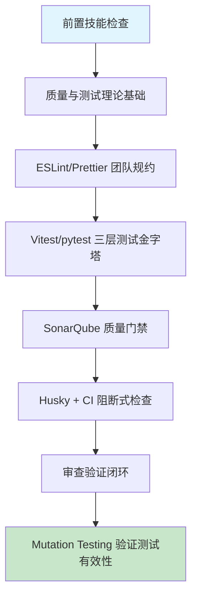

# 第十三章 代码质量管理与自动化测试

## 1. 学习目标

本章将前三部分的个人开发技能扩展到团队协作场景：从"我写代码、AI 帮我"升级到"团队写代码、AI 帮所有人保持质量一致"。重点解决 AI 辅助开发中最危险的反模式——**假绿测试与高覆盖率虚假繁荣**：AI 生成的测试看似 80% 行覆盖却完全无法捕捉已知 bug。本章把代码审查、静态分析与自动化测试组装成一条可被 PR 强制阻断的质量门禁。

### 1.1 学习路径图



### 1.2 预期学习成果

本章结束时应形成 5 项可复用交付物：① ESLint 9 flat-config + Prettier 3 团队规约（覆盖 TS/Python/Go 三语言）；② Vitest 三层测试套件（unit / integration / e2e）实际运行通过且 mutation score ≥ 60；③ SonarQube 10 质量门禁配置（覆盖率/复杂度/重复率/安全）；④ `quality-review` Skill 含 5 条 grep 危险模式；⑤ 一份对 AI 生成测试的"假绿审查报告"（含手动注入 bug 验证记录）。

---

## 2. 前置技能检查

| 维度                 | 必备能力                                       | 自检方法                                                     |
| :------------------- | :--------------------------------------------- | :----------------------------------------------------------- |
| **前三部分全部技能** | Trae 操作、提示词工程、四步审查、多语言项目    | 能独立完成功能从提示词到审查的全流程                         |
| **Git & PR**         | feature branch / PR / Code Review / merge 策略 | 能解释 squash vs rebase vs merge 的差异与适用场景            |
| **测试基础**         | 单元/集成/E2E 三层差异、mock vs stub vs spy    | 能手写一个 Jest/Vitest/pytest 单元测试并跑通                 |
| **静态分析**         | 用过 ESLint/Prettier 或 Pylint/Black           | 能看懂 `no-unused-vars` / `react-hooks/exhaustive-deps` 报错 |

> 任一项不满足，建议先回到对应章节复习。

---

## 3. 理论基础：质量管理的策略与陷阱

### 3.1 质量管理体系全景与定位

| 层次       | 工具示例                            | 作用                       | AI 风险                        |
| :--------- | :---------------------------------- | :------------------------- | :----------------------------- |
| **格式层** | Prettier 3 / Black 24 / gofmt       | 风格统一，零争议           | 几乎无风险                     |
| **静态层** | ESLint 9 / Pylint 3 / golangci-lint | 抓常见 bug、风格规则       | 规则集冲突、AI 关掉规则        |
| **类型层** | TS strict / mypy --strict           | 编译期捕获错误             | AI 用 `any` / `# type: ignore` |
| **测试层** | Vitest / Jest / pytest / Playwright | 行为正确性                 | **假绿测试、覆盖率虚高**       |
| **质量层** | SonarQube 10 / CodeClimate          | 复杂度、重复率、漏洞、债务 | 阈值过松形同虚设               |
| **变异层** | Stryker / mutmut                    | 验证测试**真的能抓 bug**   | AI 不会主动建议这一层          |

> 关键认知：**没有第六层（mutation testing），前五层都可能被 AI 生成的"假绿"测试欺骗**。

### 3.2 AI 生成测试的六类高频缺陷

| 类别             | 典型表现                                                       | 根因                                         | 审查优先级 | 修正提示词模板（按 [Ch2 §4.9](../第一部分-Trae基础入门/第二章-基础交互模式.md)）                                                           |
| :--------------- | :------------------------------------------------------------- | :------------------------------------------- | :--------- | :----------------------------------------------------------------------------------------------------------------------------------------- |
| **假阳性测试**   | 测试通过但被测试函数实际有 bug；只断言 `toBeDefined()`         | AI 倾向于先让测试"绿"，而非验证业务规则      | **P0**     | 保留测试名与 arrange，弱断言 `toBeTruthy` → 精确 `toEqual`（覆盖具体字段）。不要动 mock。验证：mutation score > 80%                        |
| **假阴性测试**   | 测试因环境/时间/网络失败，但代码本身正确                       | 未隔离时区/随机数/外部依赖；缺少 fake timer  | **P0**     | 保留测试逻辑，外部依赖全部 mock + `vi.useFakeTimers()` + 固定 random seed。不要动 expect。验证：100 次连跑 0 flake                         |
| **边界遗漏**     | 空数组/null/极大值/Unicode/并发竞态无覆盖                      | AI 默认覆盖 happy path                       | **P0**     | 保留 happy path 用例，新增 `it.each` 枚举 空/null/MAX_SAFE_INTEGER/Unicode/并发。不要动被测函数。验证：分支覆盖 ≥ 85%                      |
| **覆盖率虚高**   | 行覆盖 90% 但分支覆盖 50%；纯 import/getter 拉高覆盖           | 只看 line%，未看 branch% / mutation score    | P1         | 保留行覆盖配置，CI 门禁加 `branches≥ 85%` + `mutationScore ≥ 60%`。不要动测试代码。验证：覆盖报告含行/分支/函数/变异四维度                 |
| **mock 污染**    | mock 残留跨用例、mock 路径错误、mock 实现与真实接口漂移        | AI 不写 `vi.restoreAllMocks()` / `afterEach` | P1         | 保留 mock 实现，`afterEach` 加 `vi.restoreAllMocks()` + 类型对齐 `vi.MockedFunction`。不要动 mock 返回值。验证：打乱测试文件顺序后结果不变 |
| **规则过严过松** | ESLint 配置全部 `"error"` 或全部 `"off"`；自定义规则与实际冲突 | AI 套官方推荐配置但不调团队习惯              | P1         | 保留 ESLint preset，改 error/warn/off 三档分级 + 补团队 override。不要动 plugin 列表。验证：`eslint .` 通过率 ≥ 95%（0 业务错误）          |

> 验证测试有效性最快的方法：**手动注入一个已知 bug，确认至少有一个测试失败**。如果全绿，测试就是装饰品。

### 3.3 传统手写测试 vs AI 辅助测试

| 维度       | 传统手写                | AI 辅助（Trae）                            |
| :--------- | :---------------------- | :----------------------------------------- |
| 测试骨架   | 手敲 describe/it/expect | 一句话生成完整骨架                         |
| 边界覆盖   | 经验驱动，易遗漏        | 提示词不到位时只覆盖 happy path            |
| Mock 设置  | 仔细考虑隔离边界        | 喜欢 mock 一切，包括不该 mock 的纯函数     |
| 断言强度   | 习惯精确断言            | 倾向 `toBeDefined` / `toBeTruthy` 等弱断言 |
| 测试可读性 | 偶尔写得太"工程化"      | AI 写得很"像"测试，但语义可能错配          |

> 结论：**AI 让写测试的成本接近 0，让审查测试的成本翻倍**。本章 §7 的四步法 + §3.2 六类缺陷 + mutation testing 是这一审查的具体抓手。

---

## 4. 技术栈与项目架构

### 4.1 技术栈与最低版本

| 层        | 选型                           | 最低版本     | 选型说明                                     |
| :-------- | :----------------------------- | :----------- | :------------------------------------------- |
| 格式化    | Prettier                       | **3.3+**     | 支持 TS 5、CSS nesting；与 ESLint 9 不冲突   |
| Lint (TS) | ESLint                         | **9.0+**     | flat config 默认；旧 `.eslintrc` 已弃用      |
| Lint (Py) | Ruff                           | **0.5+**     | 比 Pylint 快 100×，覆盖 800+ 规则            |
| 类型检查  | TypeScript / mypy              | 5.5 / 1.10   | TS 5.5 推断更强；mypy strict 默认开启        |
| 单元测试  | Vitest / Jest / pytest         | 1.6 / 29 / 8 | Vitest 与 Vite/Vue/React 18 原生兼容         |
| E2E 测试  | Playwright                     | **1.45+**    | 1.45 起 trace viewer / API mocking 稳定      |
| 覆盖率    | Vitest --coverage / pytest-cov | v8 / 5       | Vitest 用 V8 引擎更准；忽略 import-only 文件 |
| 变异测试  | StrykerJS / mutmut             | 8 / 2.5      | 必备：验证测试是否真能抓 bug                 |
| 质量平台  | SonarQube / SonarCloud         | **10.0+**    | 10 起 hotspot 与 quality gate API 稳定       |
| Git 钩子  | Husky + lint-staged            | 9 / 15       | Husky 9 极简、零依赖                         |
| CI        | GitHub Actions / GitLab CI     | —            | 复用第十二章模板                             |

> 升级提示：ESLint 9 强制 flat config；旧 `.eslintrc.json` 必须迁到 `eslint.config.js`，AI 经常仍输出旧格式。

### 4.2 项目骨架（CodeQuality-Pro）

```text
codequality-pro/
├── eslint.config.js            # ESLint 9 flat config（TS + React）
├── .prettierrc.json            # Prettier 3 配置
├── tsconfig.json               # strict + noUncheckedIndexedAccess
├── vitest.config.ts            # threads + coverage + reporters
├── stryker.conf.json           # 变异测试配置
├── sonar-project.properties    # SonarQube 项目元数据
├── .husky/
│   └── pre-commit              # lint-staged + tsc --noEmit
├── .github/workflows/
│   └── quality-gate.yml        # CI: lint → typecheck → test → sonar
├── src/
│   ├── modules/                # 按业务模块组织（复用 Ch12 service 结构）
│   └── shared/                 # 公共工具（必须 ≥ 90% mutation score）
└── tests/
    ├── unit/                   # *.spec.ts；< 50 ms/case
    ├── integration/            # 含 testcontainers PG/Redis
    └── e2e/                    # Playwright；含 trace.zip 上传
```

### 4.3 测试金字塔（团队建议比例）

| 层级            | 比例      | 工具                        | 单测时长 | 跨章节复用                 |
| :-------------- | :-------- | :-------------------------- | :------- | :------------------------- |
| **单元（70%）** | 200 ms 内 | Vitest / pytest             | < 50 ms  | Ch6 业务逻辑、Ch7 ORM 校验 |
| **集成（20%）** | 5 s 内    | Vitest + testcontainers     | < 1 s    | Ch7 PostgreSQL、Ch10 Kafka |
| **E2E（10%）**  | 30 s 内   | Playwright + Docker Compose | < 10 s   | Ch5 前端、Ch12 微服务串联  |

---

## 5. 主框架实战：从规约到强制门禁

### 5.1 ESLint 9 + Prettier 团队规约

#### 5.1.1 提示词

```text
请生成一份 ESLint 9 flat-config，支持 TypeScript 5.5 + React 18 项目，要求：
1. 启用 typescript-eslint strictTypeChecked + stylisticTypeChecked；
2. 集成 eslint-plugin-react-hooks（exhaustive-deps 设为 error）；
3. 集成 eslint-config-prettier 关闭风格冲突规则；
4. 测试目录放宽 no-non-null-assertion；
5. 禁用：no-explicit-any（error）、no-floating-promises（error）、prefer-nullish-coalescing（error）；
6. 输出 eslint.config.js + 配套 .prettierrc.json。
```

#### 5.1.2 审查后的关键配置（节选）

```javascript
// eslint.config.js
import tseslint from "typescript-eslint";
import reactHooks from "eslint-plugin-react-hooks";
import prettier from "eslint-config-prettier";

export default tseslint.config(
  ...tseslint.configs.strictTypeChecked, // ✅ 类型相关 lint
  ...tseslint.configs.stylisticTypeChecked,
  {
    plugins: { "react-hooks": reactHooks },
    languageOptions: {
      parserOptions: { project: "./tsconfig.json" }, // ✅ 类型感知 lint 必需
    },
    rules: {
      "@typescript-eslint/no-explicit-any": "error", // ✅ 禁 any
      "@typescript-eslint/no-floating-promises": "error", // ✅ 禁丢弃 Promise
      "@typescript-eslint/prefer-nullish-coalescing": "error",
      "react-hooks/exhaustive-deps": "error", // ✅ 升级为 error
      // ⚠️ AI 经常生成的反模式：把 no-unused-vars 设为 warn 而非 error
    },
  },
  {
    files: ["**/*.spec.ts", "**/*.test.ts"],
    rules: { "@typescript-eslint/no-non-null-assertion": "off" },
  }, // ✅ 测试中放宽
  prettier, // ✅ 必须放最后
);
```

> 关键：使用 `parserOptions.project` 才能启用类型感知规则；AI 默认配置经常省略它，导致 `no-floating-promises` 等规则失效。

### 5.2 Vitest 单元测试与"反假绿"模式

#### 5.2.1 提示词

```text
为以下函数生成 Vitest 单元测试套件，要求：
- 使用 describe/it/expect；afterEach 调用 vi.restoreAllMocks；
- 至少覆盖 4 类边界：空输入、null/undefined、极大值、Unicode；
- 每个 expect 必须使用强断言（toBe / toEqual / toMatchObject），禁止 toBeDefined / toBeTruthy；
- 不允许使用真实的 Date.now / Math.random，统一用 vi.useFakeTimers / vi.spyOn；
- 输出测试覆盖率应优先保证 branch coverage ≥ 90%。

被测函数：
export function applyDiscount(price: number, code: string | null): number { /* ... */ }
```

#### 5.2.2 审查后的关键测试代码

```typescript
import { describe, it, expect, beforeEach, afterEach, vi } from "vitest";
import { applyDiscount } from "./discount";

describe("applyDiscount", () => {
  beforeEach(() => vi.useFakeTimers().setSystemTime(new Date("2026-01-01"))); // ✅ 时间隔离
  afterEach(() => {
    vi.useRealTimers();
    vi.restoreAllMocks();
  }); // ✅ 跨用例隔离

  it("空 code 时返回原价", () => {
    expect(applyDiscount(100, null)).toBe(100); // ✅ 强断言 toBe
    expect(applyDiscount(100, "")).toBe(100);
  });

  it("VIP10 折扣返回 90", () => {
    expect(applyDiscount(100, "VIP10")).toBe(90); // ✅ 业务规则断言
  });

  it.each([
    [0, "VIP10", 0], // 边界：0 元
    [0.01, "VIP10", 0.009], // 边界：浮点
    [Number.MAX_SAFE_INTEGER, "VIP10", Number.MAX_SAFE_INTEGER * 0.9], // 边界：极大值
    [100, "🎉COUPON", 100], // 边界：Unicode 无效码
  ])("边界 price=%s code=%s → %s", (p, c, r) => {
    expect(applyDiscount(p, c)).toBeCloseTo(r, 5); // ✅ 浮点用 toBeCloseTo
  });

  it("过期 code 时不打折", () => {
    vi.setSystemTime(new Date("2027-01-01")); // ✅ 用 fake timer 改时间
    expect(applyDiscount(100, "NEWYEAR2026")).toBe(100);
  });

  // ⚠️ AI 经常遗漏：并发幂等性测试（同一 code 用两次只能打一次折）
});
```

> 反假绿三原则：**强断言 `toBe`/`toEqual`，禁 `toBeDefined`**；**fake timer 隔离时间**；**`it.each` 表驱动覆盖边界**。

### 5.3 Playwright E2E：可信选择器与 trace

```typescript
// tests/e2e/checkout.spec.ts
import { test, expect } from "@playwright/test";

test("checkout flow", async ({ page }) => {
  await page.goto("/cart");
  await page.getByRole("button", { name: "去结算" }).click(); // ✅ ARIA 选择器
  // ⚠️ 反例：page.locator("button.btn-primary.checkout-btn") — class 易随 CSS 重构失效
  await expect(page.getByTestId("order-total")).toHaveText(/¥\d+/); // ✅ data-testid + 正则
  await page.getByLabel("信用卡号").fill("4242424242424242"); // ✅ 表单用 label
  await page.getByRole("button", { name: "提交订单" }).click();
  await expect(page).toHaveURL(/\/orders\/\w+\/success/); // ✅ URL 模式断言
});
```

> Playwright 配置必开 `trace: "retain-on-failure"`、`video: "retain-on-failure"`；CI 失败时上传 `trace.zip`，本地用 `npx playwright show-trace` 即可时间旅行。

### 5.4 Mutation Testing：验证测试的"杀伤力"

```jsonc
// stryker.conf.json
{
  "testRunner": "vitest",
  "coverageAnalysis": "perTest",
  "thresholds": { "high": 80, "low": 60, "break": 60 }, // ✅ < 60 直接失败
  "mutate": ["src/**/*.ts", "!src/**/*.spec.ts"],
  "ignoreStatic": true,
  "incremental": true, // ✅ 仅变异 diff，CI 友好
}
```

> 解读：把 `+` 改成 `-`、把 `>` 改成 `>=`，如果测试还是绿的，说明断言不到位。**Mutation score 比覆盖率诚实得多**。

### 5.5 SonarQube 质量门禁

```properties
# sonar-project.properties
sonar.projectKey=codequality-pro
sonar.sources=src
sonar.tests=tests
sonar.javascript.lcov.reportPaths=coverage/lcov.info
sonar.coverage.exclusions=**/*.spec.ts,**/*.test.ts,**/index.ts
sonar.cpd.exclusions=**/*.dto.ts                  # ✅ DTO 必然重复，免疫
# Quality Gate 阈值（在 Sonar UI 设置，CI 远程读取）
# - Coverage on New Code        ≥ 80%
# - Duplicated Lines on New Code ≤ 3%
# - Maintainability Rating       = A
# - Reliability Rating           = A
# - Security Rating              = A
# - Security Hotspots Reviewed   = 100%
```

> "**on New Code**" 是 Sonar 10 的核心理念：**只对新增代码强制门禁**，避免历史债务阻塞所有 PR。

### 5.6 Husky + lint-staged 本地强制

```jsonc
// package.json
{
  "scripts": { "prepare": "husky" },
  "lint-staged": {
    "*.{ts,tsx}": ["eslint --fix --max-warnings 0", "prettier --write"],
    "*.{md,yml,json}": ["prettier --write"],
  },
}
```

```bash
# .husky/pre-commit
#!/usr/bin/env sh
npx lint-staged
npx tsc --noEmit                                  # ✅ 类型门禁，不参与 lint-staged
# ⚠️ 不要在 pre-commit 跑全量测试，PR push 时再跑（本地 < 5 s 原则）
```

---

### 5.7 Vibe Coding 循环实录：假绿测试修正

> **修正语法**：「修正提示词」按 [Ch2 §4.9 修正提示词语法](../第一部分-Trae基础入门/第二章-基础交互模式.md) 模板；3 轮未收敛触发 §4.10。模式选择查 [Ch1 §5.4](../第一部分-Trae基础入门/第一章-Trae简介与环境配置.md)。

| 轮次 | AI 输出摘要                        | 发现的缺陷                          | 修正提示词（按 §4.9）                                                                                                                                                                                         | 验证信号                     |
| :--- | :--------------------------------- | :---------------------------------- | :------------------------------------------------------------------------------------------------------------------------------------------------------------------------------------------------------------ | :--------------------------- |
| R1   | `expect(result).toBeTruthy()` 全绿 | `[]` 与 `{}` 均 truthy → bug 不暴露 | 保留测试名与 arrange 段不变，修复断言：换为 `toEqual([{ id: 1, ... }])` 精确比较。原因：模糊断言无法区分空集与正确集。不要动 mock 与输入参数。验证：把实现改为 `return []` 测试必须红                         | 空数组实现下测试失败         |
| R2   | `setTimeout` 走真实时钟            | 等 1s 后断言 → 测试慢 + flaky       | 保留断言不变，修复时序：`vi.useFakeTimers()` + `vi.advanceTimersByTime(1000)`，并在 `afterEach` `vi.useRealTimers()`。原因：真实时钟在 CI 上不可控。不要动 expect。验证：单测耗时 < 50ms 且 100 次连跑 0 失败 | 单测 < 50ms + 100 次 0 flake |
| R3   | 只覆盖 happy path                  | 空输入、null、最大值漏测            | 保留 happy path 用例，新增 `it.each` 枚举 4 个边界（`[]` / `null` / `MAX_SAFE_INTEGER` / 中文字符）。原因：边界缺陷在生产高发。不要动 happy path。验证：行覆盖率 80% → 95%，分支覆盖 60% → 85%                | 分支覆盖 ≥ 85%               |

> **收敛信号**：精确断言 + 假时钟 + 边界枚举三层达标。如未收敛触发 §4.10 信号 1（3 轮不收敛在「mock 总是返回相同值」），按「缩范围」重启——只先修一个文件的一个 describe，验收后再批量。

---

## 6. 进阶速查表

### 6.1 进阶场景索引

| 场景             | 关键技术                       | AI 高频缺陷                  | 建议提示词关键词                           |
| :--------------- | :----------------------------- | :--------------------------- | :----------------------------------------- |
| **遗留代码补测** | Approval Testing / Snapshot    | snapshot 误更新成 bug 状态   | "先 record golden output，后改实现"        |
| **API 契约测试** | Pact 4 / Schemathesis          | 只测 happy path，schema 漂移 | "consumer-driven + provider state machine" |
| **性能回归测试** | k6 / Artillery / Lighthouse CI | 阈值硬编码、无趋势对比       | "p95 baseline + 5% 阈值 + trend 报告"      |
| **安全测试**     | OWASP ZAP / Semgrep / Trivy    | 只扫依赖不扫代码、忽略 IaC   | "SAST + DAST + IaC scan 三层"              |
| **快照测试**     | Vitest snapshot / image diff   | snapshot 文件膨胀、误更新    | "inline snapshot + 强制 review snapshot"   |
| **属性测试**     | fast-check / Hypothesis        | 状态机模型不全               | "shrinking + 不变式 + 至少 100 case"       |

### 6.2 测试性能基线

| 指标                 | 目标值  | 测量方法                                      |
| :------------------- | :------ | :-------------------------------------------- |
| 单元测试套件         | < 30 s  | `vitest run --reporter=verbose`               |
| 集成测试套件         | < 3 min | `vitest run --pool=threads --testTimeout=10s` |
| E2E 单 spec          | < 30 s  | Playwright `--workers=4 --retries=2`          |
| 增量 mutation 测试   | < 5 min | Stryker `--incremental`                       |
| Sonar 扫描           | < 2 min | sonar-scanner 在 CI 中并行                    |
| 整体 CI quality gate | < 8 min | 总目标：PR 审查闭环时间 < 10 min              |

### 6.3 配置 Cheatsheet

```bash
# 一键触发完整本地质量检查
pnpm exec eslint . --max-warnings 0 \
  && pnpm exec tsc --noEmit \
  && pnpm exec vitest run --coverage \
  && pnpm exec stryker run --incremental \
  && pnpm exec sonar-scanner

# AI 生成测试后的 5 分钟验证
git stash                                          # 1. 暂存 AI 改动
sed -i 's/return true/return false/' src/auth.ts   # 2. 注入已知 bug
pnpm test                                          # 3. 跑测试，必须有失败！
git checkout src/auth.ts && git stash pop          # 4. 还原
# 若步骤 3 全绿，说明测试是装饰品，需要补强断言或边界
```

---

## 7. 审查闭环：把质量管理变成可强制门禁

### 7.1 四步审查法（质量与测试专用）

| 步骤         | 关键检查项                                                                                                                |
| :----------- | :------------------------------------------------------------------------------------------------------------------------ |
| **正确性**   | 强断言 `toBe`/`toEqual`？mock 是否在 `afterEach` 还原？时间/随机数是否 fake？是否覆盖空/null/极大值/Unicode 四类边界？    |
| **安全性**   | 测试中是否硬编码生产 token / DB 连接？snapshot 中是否泄漏 PII？SonarQube hotspot 是否全部 review？依赖是否过 OWASP 检查？ |
| **性能**     | 单测 < 50 ms？测试是否并行（threads/workers）？是否避免循环内 `await`？mutation 增量模式是否开启？                        |
| **可维护性** | 单 describe 用例 ≤ 10 个？测试名是否描述行为而非函数？是否有 ESLint flat config 注释？SonarQube exclusions 是否文档化？   |

### 7.2 三类边界场景测试（AI 最容易遗漏）

```typescript
// ⚠️ AI 默认只覆盖 happy path；以下三类必须人工补充

// 类别 1：异常路径
it("DB 不可达时返回 502 而非 500", async () => {
  vi.spyOn(db, "query").mockRejectedValue(new Error("ECONNREFUSED"));
  const res = await request(app).get("/api/orders");
  expect(res.status).toBe(502); // ✅ 区分上游与自身错误
});

// 类别 2：并发竞态
it("同一 idempotency_key 并发只创建一次订单", async () => {
  const reqs = Array.from({ length: 10 }, () =>
    request(app).post("/api/orders").set("Idempotency-Key", "k1").send(payload),
  );
  const results = await Promise.all(reqs);
  const created = results.filter((r) => r.status === 201).length;
  expect(created).toBe(1); // ✅ 验证幂等
});

// 类别 3：时区与 DST
it("UTC 与 Asia/Shanghai 边界日期一致", () => {
  vi.setSystemTime(new Date("2026-03-29T01:30:00Z")); // ✅ 欧洲 DST 切换日
  expect(formatLocalDate("2026-03-29", "Europe/Berlin")).toBe("2026-03-29");
});
```

### 7.3 危险模式 grep 规则（沉淀进 `quality-review` Skill）

```bash
# 1. 弱断言（最常见的假绿信号）
grep -rEn "toBeDefined\(\)|toBeTruthy\(\)|toBeFalsy\(\)|not\.toThrow\(\)" tests/

# 2. mock 残留（跨用例污染）
grep -rEn "vi\.fn\(|jest\.fn\(" tests/ | grep -v "afterEach\|restoreAllMocks"

# 3. ESLint 规则被 AI 关掉
grep -rEn "eslint-disable|@ts-ignore|# type: ignore|# noqa" src/

# 4. ESLint 规则降级为 warn（应为 error）
grep -rEn '"(no-explicit-any|no-floating-promises|exhaustive-deps)":\s*"warn"' .

# 5. snapshot 滥用（行数 > 50 的 snapshot 几乎必有问题）
find tests -name "*.snap" -exec wc -l {} \; | awk '$1 > 50 {print}'
```

### 7.4 扫到问题后用什么提示词改？

上面 5 条 grep 只识别「质量危信号」；下一步必须按统一语法把意图写回 AI（参照 [Ch2 §4.9](../第一部分-Trae基础入门/第二章-基础交互模式.md)）。

| #   | 命中后修正提示词模板                                                                                                                                                                                         |
| :-- | :----------------------------------------------------------------------------------------------------------------------------------------------------------------------------------------------------------- |
| 1   | 保留测试用例名与 fixture，断言改 `toEqual({...})` 或 `toMatchObject(...)` 揭露实际返值。不要动 fixture 数据。验证：grep 返 0；反向验证（改业务为错误返值）能 fail。                                          |
| 2   | 保留 mock 实例命名，补 `afterEach(() => vi.restoreAllMocks())` / `jest.restoreAllMocks()`。不要动业务调用。验证：跨用例 mock 调用计数从 0 起；CI 里 `--shuffle` 仍全绿。                                     |
| 3   | 保留代码语义，删除 `eslint-disable` / `@ts-ignore` / `# noqa` 注释；拆函数或增加类型注解解决根因。不要动外部 API。验证：grep 返 0；`eslint --max-warnings 0` 通过。                                          |
| 4   | 保留 rule 命名，`warn` → `error`；修所有历史命中，不能修的加 `// eslint-disable-next-line <rule> -- TODO #ENG-xxx` 与追踪 issue。不要动 plugin 加载顺序。验证：本地 `lint --max-warnings 0` 报错指向真问题。 |
| 5   | 保留覆盖目标，> 50 行 snapshot 拆为 `expect(...).toMatchObject({key1, key2})` 单字段断言。不要动测试名。验证：单测 fail 时 diff < 20 行；`*.snap` 文件 < 50 行。                                             |

> 3 轮未收敛触发 [§4.10](../第一部分-Trae基础入门/第二章-基础交互模式.md) 的「换模式 / 缩范围 / 拆步骤」。

---

## 8. 三档实践

### 8.1 基础实践（必做）

为第六章 `task-management-api` 项目配置 ESLint 9 flat config + Prettier 3 + Vitest，达成：① 所有规则 `error` 级别且 0 violation；② branch coverage ≥ 85%；③ 跑通 §6.3 的"5 分钟假绿验证"流程。

### 8.2 进阶实践（推荐）

接入 StrykerJS + SonarQube 10：① mutation score ≥ 70；② Sonar quality gate "Coverage on New Code ≥ 80%" 强制；③ 在 GitHub Actions 中将 quality-gate 设为 PR merge 阻断条件；④ 输出"AI 生成测试 vs 手写测试"的 mutation score 对比报告。

### 8.3 开放实践（挑战）

为第十二章微服务平台（multi-service repo）设计跨服务质量门禁：① 用 Pact 4 实施 consumer-driven 契约测试，order-service 是 consumer、inventory-service 是 provider；② 用 fast-check 对核心计费函数做属性测试（不变式：折扣后金额 ≤ 原价）；③ 用 Semgrep 自定义规则禁止 SQL 字符串拼接、明文 secret；④ 把所有规则沉淀为团队 `.qoder/skills/quality-review/SKILL.md`。

---

## 9. 小结

### 9.1 章节交付物清单

| 编号   | 交付物                                             | 复用去向                      |
| :----- | :------------------------------------------------- | :---------------------------- |
| D-13-1 | ESLint 9 flat config + Prettier 3 团队规约         | Ch14 PR 模板的 lint pre-check |
| D-13-2 | Vitest 三层测试套件 + 反假绿模式                   | Ch15 CI 流水线的 test job     |
| D-13-3 | StrykerJS + SonarQube 10 质量门禁配置              | Ch15 deploy gate 前置条件     |
| D-13-4 | Husky 9 + lint-staged 15 本地强制                  | 全章 PR 流程入口              |
| D-13-5 | `quality-review` Skill（5 条 grep + 假绿验证流程） | Ch14-Ch16 团队审查规约        |

### 9.2 质量管理能力自评 Rubric

| 维度     | 入门（1-2）          | 熟练（3-4）                                | 精通（5）                                           |
| :------- | :------------------- | :----------------------------------------- | :-------------------------------------------------- |
| 静态分析 | 能跑 ESLint          | 能定制 flat config + 启用类型感知规则      | 能为团队设计含自定义规则的多语言统一规约            |
| 单元测试 | 会写 happy path      | 能写 4 类边界 + 强断言 + fake timer        | 能用 mutation testing 验证测试的"杀伤力"            |
| 集成/E2E | Playwright 跑通 demo | 能用 ARIA + testid 写稳定脚本 + trace 调试 | 能设计跨服务集成测试 + 契约测试                     |
| 质量门禁 | 跑过 SonarQube       | 能配置 Quality Gate on New Code            | 能设计 Sonar + Stryker + Pact 三层门禁，CI 强制阻断 |
| 审查能力 | 会跑 §7.3 grep       | 能识别六类缺陷 + 假绿验证                  | 能输出可复用 Skill + 团队规约 + 培训材料            |

### 9.3 跨章节衔接

- ⬅️ Ch10/Ch11/Ch12：被测代码来自前三部分实战项目，所有质量规则在它们之上验证；
- ➡️ Ch14：本章 Husky + lint-staged 配置成为 Ch14 PR 模板的强制前置；§7.3 grep 规则被 Ch14 引用为 PR review checklist；
- ➡️ Ch15：本章 quality-gate.yml 的 test/sonar 两个 job 直接被 Ch15 CD 流水线作为 deploy gate；
- ➡️ Ch16：本章 mutation testing + Sonar hotspot 是 Ch16 安全审查的输入。

---

## 10. 延伸阅读

### 10.1 经典必读（建立质量直觉）

- 《重构：改善既有代码的设计》（Martin Fowler，第 2 版）— 重构与测试的共生关系
- 《代码整洁之道》（Robert C. Martin）— 命名、函数与边界
- 《修改代码的艺术》（Michael Feathers）— 遗留代码补测的"接缝"思想
- 《xUnit Test Patterns》（Gerard Meszaros）— 67 种测试模式与反模式
- 《Software Engineering at Google》— Ch11/Ch12 大规模测试的工程化经验

### 10.2 工程化与官方规范

- ESLint 9 flat config 迁移指南：<https://eslint.org/docs/latest/use/configure/migration-guide>
- Vitest 文档：<https://vitest.dev/>（关注 in-source testing 与 fake timer）
- Playwright Best Practices：<https://playwright.dev/docs/best-practices>
- StrykerJS 文档：<https://stryker-mutator.io/docs/stryker-js/introduction/>
- SonarQube 10 Quality Gate：<https://docs.sonarsource.com/sonarqube/latest/user-guide/quality-gates/>
- Pact Specification v4：<https://github.com/pact-foundation/pact-specification>

### 10.3 前沿研究与实践报告

- Google Testing Blog — 持续更新的工程化测试实践
- Martin Fowler — _Mocks Aren't Stubs_ / _Test Pyramid_ / _Eradicating Non-Determinism in Tests_
- DORA _Accelerate State of DevOps Report_（最新版）— 高效团队的质量与部署指标
- Microsoft Research — _An Empirical Study on Mutation Testing of Deep Learning Systems_
- _Property-Based Testing with PropEr, Erlang, and Elixir_（Fred Hebert）— 属性测试方法论

---

> **完成判定**：能在 10 分钟内为一个新模块配置好 ESLint flat config + Vitest + Stryker，且通过"5 分钟假绿验证"流程，即视为掌握本章 P0 能力。下一章我们将把这些质量门禁组装进团队的 PR 协作流程。
