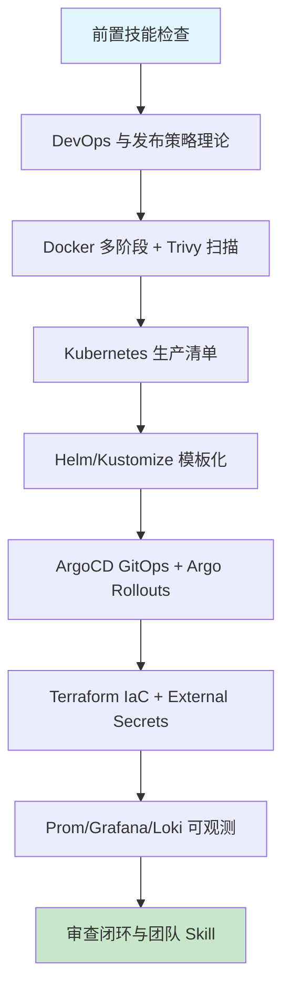

# 第十五章 云平台部署与 DevOps 实践

## 1. 学习目标

本章把第十三-十四章的"质量门禁 + 协作流程"延伸到生产部署：从"PR 合并"到"流量打到新版本"全自动闭环。重点解决 AI 生成 K8s/IaC 配置的三大反模式——**资源限制缺失导致节点 OOM、探针配置错误导致流量打到未就绪 Pod、Secrets 明文写在 ConfigMap 中**——并把它们沉淀为强制门禁。本章不重复第十二章的微服务治理（Istio/mTLS/SLO），而专注于**容器构建 → 镜像安全 → K8s 编排 → GitOps 发布 → IaC 与可观测**这条 DevOps 主链路。

### 1.1 学习路径图



### 1.2 预期学习成果

本章结束时应形成 6 项交付物：① 多阶段 Dockerfile（生产镜像 < 200 MB，distroless 基础）；② 一套生产可上线的 K8s 清单（含 limits / probes / runAsNonRoot / NetworkPolicy / PDB / HPA）；③ Helm chart 或 Kustomize overlay（dev/staging/prod 三套环境）；④ ArgoCD application 配置（自动同步 + Argo Rollouts 蓝绿/金丝雀）；⑤ Terraform 模块管理 EKS/GKE 集群与 IAM；⑥ `devops-review` Skill 含六类缺陷 + 8 条危险模式 grep。

---

## 2. 前置技能检查

| 维度             | 必备能力                                                  | 自检方法                                                 |
| :--------------- | :-------------------------------------------------------- | :------------------------------------------------------- |
| **Docker**       | 多阶段构建、Buildx、网络与卷                              | `docker build` 出 < 200 MB 镜像并能 `docker run` 起来    |
| **Kubernetes**   | Pod / Deployment / Service / Ingress / ConfigMap / Secret | 能在 kind/minikube 上部署一个含 ingress 的 demo 应用     |
| **Linux & 网络** | shell、文件权限、TLS、负载均衡                            | 能解释 `curl https://example.com` 的 TLS 握手与 SNI 流程 |
| **Ch13/Ch14**    | CI 流水线 + Branch Protection + Conventional Commits      | 本地能跑通 Ch14 §5.3 的四 job CI                         |
| **云平台账号**   | AWS/GCP/Aliyun 任一，含基础 IAM 权限                      | 能用 CLI 创建 VPC + EKS/GKE 集群（kind 也可代替）        |

> 任一项不满足，建议先回到对应章节复习。本章对基础设施知识要求最高。

---

## 3. 理论基础：发布策略与陷阱

### 3.1 发布策略对比

| 策略               | 适用场景                 | 切换粒度             | 资源占用  | 回滚速度 | AI 高频缺陷                            |
| :----------------- | :----------------------- | :------------------- | :-------- | :------- | :------------------------------------- |
| **Recreate**       | 内部工具、可停服         | 全量                 | 1×        | 中       | 无 PDB 导致全部一起死                  |
| **Rolling Update** | Web 服务通用默认         | maxSurge/Unavailable | 1.25×     | 中       | maxUnavailable 设为 100%、无 readiness |
| **Blue/Green**     | 数据库迁移、强一致性场景 | 全量切换             | 2×        | 秒级     | 流量未切回旧环境就被清理               |
| **Canary**         | 新功能灰度、用户量大     | 1% → 100%            | 1.05-1.5× | 秒级     | 缺指标驱动、靠人工 ramp-up             |
| **A/B (Header)**   | 业务实验、按用户切流     | 任意百分比           | 1.05-1.5× | 秒级     | 流量染色 header 无审计                 |

> 决策口诀：**"无状态 Web 用 Canary（Argo Rollouts），有状态/Schema 改动用 Blue/Green，业务实验用 A/B header 切流"**。

### 3.2 AI 生成 K8s/IaC 配置的六类高频缺陷

| 类别                       | 典型表现                                                                                | 根因                                       | 审查优先级 | 修正提示词模板（按 [Ch2 §4.9](../第一部分-Trae基础入门/第二章-基础交互模式.md)）                                                                           |
| :------------------------- | :-------------------------------------------------------------------------------------- | :----------------------------------------- | :--------- | :--------------------------------------------------------------------------------------------------------------------------------------------------------- |
| **资源限制缺失**           | `resources.limits` 不设或仅设 cpu 不设 memory；request = limit 导致 QoS=Guaranteed 浪费 | AI 套官方 quickstart 不写 limits           | **P0**     | 保留 Deployment 名，补 `resources.requests/limits` （cpu+memory） + QoS=Burstable。不要动镜像。验证：`kubectl describe pod` 显示 limits                    |
| **探针配置错误**           | livez/readyz 用同一端点；initialDelay 太短；探针超时 1 s 导致频繁重启                   | AI 不区分进程存活与依赖就绪                | **P0**     | 保留容器端口，拆 `/livez` 与 `/readyz` + `initialDelaySeconds` 含启动 buffer + `timeoutSeconds=5`。不要动 image。验证：DB 抖动 pod 不重启                  |
| **root 与权限失守**        | `runAsNonRoot=false`、`allowPrivilegeEscalation=true`、`capabilities` 未 drop ALL       | AI 套 ubuntu 镜像默认 root                 | **P0**     | 保留镜像 base，`securityContext: runAsNonRoot:true` + `readOnlyRootFilesystem` + `capabilities.drop: [ALL]`。不要动 args。验证：`kubectl exec id` 返 uid≠0 |
| **Secrets 明文与漂移**     | DB 密码写在 ConfigMap；Secret 明文 commit 进 git；无外部 secret manager                 | AI 不会主动用 ESO / Sealed Secrets / Vault | **P0**     | 保留引用键名，迁 `ExternalSecrets` + `Vault` 或 AWS SecretsManager。不要动 env 变量名。验证：`git grep -E "password\|token"` 返 0 明文                     |
| **镜像 tag 不可重现**      | `image: app:latest`；构建时间戳 tag；Helm values 不锁 digest                            | AI 默认套 latest，违反 GitOps 不可变原则   | P1         | 保留 image repo，tag 改 sha256 digest 锁定 + Helm values 同步锁定。不要动 chart 结构。验证：CI 构建镜像 hash 与运行时 hash 一致                            |
| **滚动更新与中断保护缺失** | 无 `PodDisruptionBudget`；`maxUnavailable=25%` 但只有 2 副本；preStop 缺 sleep          | AI 套默认值忽略副本数与 graceful shutdown  | P1         | 保留 replicas，加 `PodDisruptionBudget: minAvailable:70%` + `preStop: sleep 15s` + `maxUnavailable:1`。不要动 update strategy。验证：drain 节点时 SLO 不破 |

### 3.3 传统部署 vs AI 辅助 DevOps

| 维度       | 传统手工                   | AI 辅助（Trae）                                 |
| :--------- | :------------------------- | :---------------------------------------------- |
| Dockerfile | 抄基础模板，懂 layer cache | 一句话生成多阶段，但常忘 healthcheck/non-root   |
| K8s YAML   | 凭经验逐字段填             | 完整骨架但 limits/probes/securityContext 默认错 |
| Helm Chart | 抄已有 chart               | 模板齐全，但 values.yaml 缺 schema、values 过松 |
| Terraform  | 模块边界清晰               | 喜欢把所有资源放一个 main.tf，无 state 隔离     |
| 监控告警   | 抄 Prometheus rules 模板   | 规则齐全但 SLO/Burn rate 通常缺失（见 Ch12）    |

> 结论：**AI 让基础设施 YAML 接近 0 成本，但让"生产可用性"审查成本翻倍**。本章 §7 + §3.2 六类缺陷是审查抓手。

---

## 4. 技术栈与项目架构

### 4.1 技术栈与最低版本

| 层           | 选型                                | 最低版本                | 选型说明                                                |
| :----------- | :---------------------------------- | :---------------------- | :------------------------------------------------------ |
| 容器引擎     | Docker / containerd                 | 26 / 1.7                | Docker 26 默认 BuildKit；containerd 1.7 支持 sandbox v2 |
| 镜像构建     | Docker Buildx                       | 0.14+                   | 多平台、缓存导入导出、SBOM/attestation                  |
| 镜像扫描     | Trivy / Grype                       | **0.55+**               | Trivy 含 misconfig + secret + license 扫描              |
| 基础镜像     | distroless / chainguard             | latest                  | distroless 减少攻击面 ≥ 90%                             |
| 编排         | Kubernetes                          | **1.30+**               | 1.30 GA：Sidecar Containers、ValidatingAdmissionPolicy  |
| 模板         | Helm / Kustomize                    | 3.14 / 5.4              | Helm 3.14 OCI-only；Kustomize 5.4 支持 components       |
| GitOps       | Argo CD                             | **2.10+**               | 2.10 起 ApplicationSet + Sync Waves 稳定                |
| 渐进发布     | Argo Rollouts                       | 1.7+                    | 支持 metric-driven canary                               |
| IaC          | Terraform / OpenTofu                | 1.9 / 1.7               | OpenTofu 是 1.5 后的开源分叉                            |
| 配置管理     | Ansible                             | 10+                     | 用于裸金属与 OS 层；K8s 优先 Helm/Kustomize             |
| 密钥         | External Secrets Operator + Vault   | 0.10 / 1.15             | 替代 Sealed Secrets，支持轮转                           |
| Ingress      | Ingress-NGINX / Gateway API         | 1.10 / v1               | Gateway API v1 GA，K8s 1.30 推荐                        |
| 证书         | cert-manager                        | 1.15+                   | ACME / Let's Encrypt / 内部 CA 全支持                   |
| 自动扩缩     | HPA + KEDA                          | 1.30 / 2.15             | KEDA 支持事件驱动（Kafka/RabbitMQ/SQS）                 |
| 可观测       | Prometheus + Grafana + Loki + Tempo | 2.50 / 10.4 / 3.0 / 2.4 | 完整 LGTM 栈                                            |
| Runtime 安全 | Falco / Tetragon                    | 0.38 / 1.0              | eBPF 检测异常容器行为                                   |
| 策略         | Kyverno / OPA Gatekeeper            | 1.12 / 3.16             | Kyverno YAML 原生，更易上手                             |

### 4.2 仓库与环境结构（GitOps 友好）

```text
infra-repo/
├── clusters/
│   ├── prod/                   # 集群级配置（一个 cluster 一个目录）
│   │   ├── argocd/
│   │   └── kustomization.yaml
│   └── staging/
├── platform/                   # 平台级公共组件
│   ├── ingress-nginx/          # Helm chart 引用
│   ├── cert-manager/
│   ├── external-secrets/
│   └── kube-prometheus-stack/
├── apps/                       # 业务应用（一个 app 一个目录）
│   └── task-api/
│       ├── base/               # Kustomize base
│       ├── overlays/
│       │   ├── dev/
│       │   ├── staging/
│       │   └── prod/
│       └── argocd-app.yaml     # Argo CD ApplicationSet 入口
└── terraform/
    ├── modules/                # 复用的 vpc / eks / iam 模块
    └── envs/
        ├── prod/               # 一环境一 backend、一 state
        └── staging/
```

> 强约定：**业务代码与基础设施代码 separate repo**（apps repo + infra repo），通过 Argo CD ApplicationSet 关联，避免应用 commit 触发 infra 漂移。

---

## 5. 主框架实战：从 Dockerfile 到 GitOps

### 5.1 多阶段 Dockerfile（Node.js 示例）

```dockerfile
# syntax=docker/dockerfile:1.7
ARG NODE_VERSION=20.15.0

# ---- 1) deps：仅装依赖，最大化缓存 ----
FROM node:${NODE_VERSION}-bookworm-slim AS deps
WORKDIR /app
COPY package.json pnpm-lock.yaml ./
RUN --mount=type=cache,target=/pnpm-store \
    corepack enable && pnpm config set store-dir /pnpm-store \
    && pnpm install --frozen-lockfile --prod=false        # ✅ frozen-lockfile

# ---- 2) build：编译 TS、打包前端 ----
FROM deps AS build
COPY . .
RUN pnpm build && pnpm prune --prod                       # ✅ 仅保留运行时依赖

# ---- 3) runtime：distroless，无 shell，无 root ----
FROM gcr.io/distroless/nodejs20-debian12:nonroot          # ✅ distroless + nonroot
WORKDIR /app
COPY --from=build --chown=nonroot:nonroot /app/dist ./dist
COPY --from=build --chown=nonroot:nonroot /app/node_modules ./node_modules
COPY --from=build --chown=nonroot:nonroot /app/package.json ./
USER nonroot                                               # ✅ 显式声明
EXPOSE 3000
# ⚠️ 反例：CMD ["npm","start"]   distroless 没有 npm
CMD ["dist/server.js"]
HEALTHCHECK --interval=30s --timeout=3s --start-period=10s --retries=3 \
    CMD ["dist/healthcheck.js"]                           # ✅ 自带 healthcheck，便于 docker
```

```bash
# 配套构建命令（CI 中执行）
docker buildx build \
  --platform linux/amd64,linux/arm64 \
  --provenance=true --sbom=true \
  --tag ghcr.io/org/app:${GIT_SHA} \
  --tag ghcr.io/org/app:$(git describe --tags --always) \
  --cache-to type=gha,mode=max \
  --cache-from type=gha \
  --push .

trivy image --severity HIGH,CRITICAL --exit-code 1 ghcr.io/org/app:${GIT_SHA}  # ✅ 阻断式扫描
```

> 关键：① `distroless:nonroot` + `USER nonroot` 双保险；② `--provenance` + `--sbom` 让镜像可追溯；③ Trivy `--exit-code 1` 让 HIGH/CRITICAL 漏洞直接阻断 CI。

### 5.2 生产可上线的 K8s 清单（核心三件套）

```yaml
# apps/task-api/base/deployment.yaml
apiVersion: apps/v1
kind: Deployment
metadata:
  name: task-api
spec:
  replicas: 3
  strategy:
    type: RollingUpdate
    rollingUpdate: { maxUnavailable: 0, maxSurge: 1 } # ✅ 0 停机
  selector: { matchLabels: { app: task-api } }
  template:
    metadata:
      labels: { app: task-api, version: v1 }
      annotations: { prometheus.io/scrape: "true", prometheus.io/port: "9090" }
    spec:
      serviceAccountName: task-api # ✅ 专属 SA，禁默认 SA
      automountServiceAccountToken: false # ✅ 不需要时关闭
      securityContext:
        runAsNonRoot: true # ✅ Pod 级
        runAsUser: 65532
        fsGroup: 65532
        seccompProfile: { type: RuntimeDefault } # ✅ seccomp
      topologySpreadConstraints: # ✅ 跨 zone 打散
        - maxSkew: 1
          topologyKey: topology.kubernetes.io/zone
          whenUnsatisfiable: ScheduleAnyway
          labelSelector: { matchLabels: { app: task-api } }
      containers:
        - name: app
          image: ghcr.io/org/task-api@sha256:... # ✅ 锁 digest，不用 tag
          imagePullPolicy: IfNotPresent
          ports:
            [
              { name: http, containerPort: 3000 },
              { name: metrics, containerPort: 9090 },
            ]
          envFrom: [{ secretRef: { name: task-api-secrets } }]
          resources: # ✅ requests = limits（除 cpu）
            requests: { cpu: "100m", memory: "256Mi", ephemeral-storage: "1Gi" }
            limits: { memory: "256Mi", ephemeral-storage: "2Gi" }
          livenessProbe: # ✅ 进程存活
            httpGet: { path: /livez, port: http }
            initialDelaySeconds: 10
            periodSeconds: 20
            timeoutSeconds: 3
            failureThreshold: 3
          readinessProbe: # ✅ 依赖就绪（与 livez 区分）
            httpGet: { path: /readyz, port: http }
            initialDelaySeconds: 5
            periodSeconds: 5
            timeoutSeconds: 2
            failureThreshold: 2
          startupProbe: # ✅ 慢启动场景必备
            httpGet: { path: /livez, port: http }
            failureThreshold: 30
            periodSeconds: 10
          lifecycle:
            preStop:
              exec: { command: ["/bin/sleep", "15"] } # ✅ 给 Service 摘除时间
          securityContext: # ✅ container 级再加固
            allowPrivilegeEscalation: false
            readOnlyRootFilesystem: true
            capabilities: { drop: ["ALL"] }
          volumeMounts:
            - { name: tmp, mountPath: /tmp } # ✅ readOnlyRootFilesystem 必备
      volumes:
        - { name: tmp, emptyDir: {} }
      terminationGracePeriodSeconds: 60 # ✅ ≥ preStop sleep + 处理时间
---
# pdb.yaml — 防止滚动更新时全部一起死
apiVersion: policy/v1
kind: PodDisruptionBudget
metadata: { name: task-api }
spec:
  minAvailable: 2 # ✅ 3 副本至少留 2
  selector: { matchLabels: { app: task-api } }
---
# hpa.yaml
apiVersion: autoscaling/v2
kind: HorizontalPodAutoscaler
metadata: { name: task-api }
spec:
  scaleTargetRef: { apiVersion: apps/v1, kind: Deployment, name: task-api }
  minReplicas: 3
  maxReplicas: 30
  metrics:
    - type: Resource
      resource:
        { name: cpu, target: { type: Utilization, averageUtilization: 60 } }
  behavior:
    scaleDown: # ✅ 防止抖动
      stabilizationWindowSeconds: 300
      policies: [{ type: Percent, value: 10, periodSeconds: 60 }]
---
# networkpolicy.yaml — 默认拒绝
apiVersion: networking.k8s.io/v1
kind: NetworkPolicy
metadata: { name: task-api-ingress }
spec:
  podSelector: { matchLabels: { app: task-api } }
  policyTypes: [Ingress, Egress]
  ingress:
    - from:
        [
          {
            namespaceSelector:
              { matchLabels: { kubernetes.io/metadata.name: ingress-nginx } },
          },
        ]
      ports: [{ port: http }]
  egress: # ✅ 显式声明可访问目标
    - to:
        [
          {
            namespaceSelector:
              { matchLabels: { kubernetes.io/metadata.name: kube-system } },
          },
        ]
      ports: [{ port: 53, protocol: UDP }] # DNS
    - to: [{ podSelector: { matchLabels: { app: postgres } } }]
      ports: [{ port: 5432 }]
```

> 关键决策：① **memory limits = requests** 但 **cpu limits 留空**（避免 throttling）；② **livez/readyz 必须分离**——livez 仅检进程，readyz 检依赖；③ **PDB 是 K8s 1.21+ 默认行为前提**，必须显式设置。

### 5.3 Helm + Kustomize 三环境管理

```yaml
# apps/task-api/overlays/prod/kustomization.yaml
apiVersion: kustomize.config.k8s.io/v1beta1
kind: Kustomization
namespace: prod
resources: [../../base]
patches:
  - target: { kind: Deployment, name: task-api }
    patch: |-
      - op: replace
        path: /spec/replicas
        value: 6                                          # ✅ prod 跑 6 副本
      - op: replace
        path: /spec/template/spec/containers/0/resources/requests/cpu
        value: "500m"
images:
  - name: ghcr.io/org/task-api
    newTag: v1.4.2@sha256:abc... # ✅ Argo Image Updater 会改这一行
configMapGenerator:
  - name: task-api-config
    behavior: merge
    literals: [LOG_LEVEL=info, RATE_LIMIT=1000]
```

> 选型建议：**应用业务用 Kustomize**（轻量、纯 YAML、Argo CD 原生），**平台组件用 Helm**（社区 chart 多）。混用而不内嵌。

### 5.4 Argo CD GitOps + Argo Rollouts 渐进发布

```yaml
# apps/task-api/argocd-app.yaml
apiVersion: argoproj.io/v1alpha1
kind: Application
metadata: { name: task-api-prod, namespace: argocd }
spec:
  project: default
  source:
    repoURL: https://github.com/org/infra
    targetRevision: main
    path: apps/task-api/overlays/prod
  destination: { server: https://kubernetes.default.svc, namespace: prod }
  syncPolicy:
    automated: { prune: true, selfHeal: true } # ✅ 自动 self-heal 防漂移
    syncOptions: [ServerSideApply=true, CreateNamespace=true]
    retry: { limit: 3, backoff: { duration: 30s, factor: 2, maxDuration: 5m } }
---
# rollout.yaml — 用 Argo Rollouts 替代原生 Deployment
apiVersion: argoproj.io/v1alpha1
kind: Rollout
metadata: { name: task-api }
spec:
  replicas: 6
  strategy:
    canary:
      canaryService: task-api-canary
      stableService: task-api-stable
      trafficRouting: { nginx: { stableIngress: task-api } }
      steps:
        - setWeight: 5 # ✅ 5% → 观察
        - pause: { duration: 5m }
        - analysis: # ✅ 指标驱动，非定时
            templates: [{ templateName: success-rate-and-latency }]
            args: [{ name: service-name, value: task-api-canary }]
        - setWeight: 25
        - pause: { duration: 10m }
        - setWeight: 50
        - pause: { duration: 10m }
        - setWeight: 100
---
# AnalysisTemplate — 失败自动回滚
apiVersion: argoproj.io/v1alpha1
kind: AnalysisTemplate
metadata: { name: success-rate-and-latency }
spec:
  args: [{ name: service-name }]
  metrics:
    - name: success-rate
      successCondition: result[0] >= 0.99 # ✅ 99% 成功率
      failureLimit: 1
      provider:
        prometheus:
          address: http://prometheus.monitoring:9090
          query: |
            sum(rate(http_requests_total{service="{{args.service-name}}",code!~"5.."}[2m]))
            / sum(rate(http_requests_total{service="{{args.service-name}}"}[2m]))
    - name: p95-latency
      successCondition: result[0] <= 0.300 # ✅ p95 ≤ 300 ms
      failureLimit: 1
      provider:
        prometheus:
          address: http://prometheus.monitoring:9090
          query: |
            histogram_quantile(0.95, sum(rate(http_request_duration_seconds_bucket{service="{{args.service-name}}"}[2m])) by (le))
```

> 强约定：**指标驱动 ramp-up，禁止定时无脑加权重**。pause 仅用于初次观察，分析失败立即回滚。

### 5.5 Terraform IaC（EKS 集群示例）

```hcl
# terraform/envs/prod/main.tf
terraform {
  required_version = ">= 1.9"
  backend "s3" {                                         # ✅ remote state，不本地
    bucket         = "org-tfstate-prod"
    key            = "eks/prod/terraform.tfstate"
    region         = "us-west-2"
    dynamodb_table = "tfstate-lock"                      # ✅ state 锁
    encrypt        = true
  }
  required_providers { aws = { version = "~> 5.60" } }
}

module "vpc" {
  source  = "terraform-aws-modules/vpc/aws"
  version = "5.13.0"                                     # ✅ 锁版本
  name    = "prod-vpc"
  cidr    = "10.0.0.0/16"
  azs             = ["us-west-2a", "us-west-2b", "us-west-2c"]
  private_subnets = ["10.0.1.0/24", "10.0.2.0/24", "10.0.3.0/24"]
  public_subnets  = ["10.0.101.0/24", "10.0.102.0/24", "10.0.103.0/24"]
  enable_nat_gateway = true
  single_nat_gateway = false                             # ✅ 生产多 AZ NAT
  tags = { Env = "prod", IaC = "terraform" }
}

module "eks" {
  source  = "terraform-aws-modules/eks/aws"
  version = "20.24.0"
  cluster_name    = "prod"
  cluster_version = "1.30"                               # ✅ 锁 K8s 版本
  vpc_id     = module.vpc.vpc_id
  subnet_ids = module.vpc.private_subnets
  cluster_endpoint_public_access  = false                # ✅ 仅私网
  cluster_endpoint_private_access = true
  enable_cluster_creator_admin_permissions = false       # ✅ 不让创建者拿 cluster-admin
  eks_managed_node_groups = {
    default = {
      ami_type       = "BOTTLEROCKET_x86_64"             # ✅ 安全加固 OS
      instance_types = ["m6i.xlarge"]
      min_size = 3; max_size = 20; desired_size = 6
      taints = []
    }
  }
  cluster_addons = {                                     # ✅ 内建 addon
    coredns    = { most_recent = true }
    kube-proxy = { most_recent = true }
    vpc-cni    = { most_recent = true }
  }
}
```

> 关键：① S3 backend + DynamoDB 锁（防并发 apply）；② provider 与模块版本必须锁；③ `enable_cluster_creator_admin_permissions=false` 防止 root 用户绑死 cluster-admin。

### 5.6 External Secrets + Vault（替代 Sealed Secrets）

```yaml
# secret-store.yaml（一次性配置）
apiVersion: external-secrets.io/v1beta1
kind: ClusterSecretStore
metadata: { name: vault-backend }
spec:
  provider:
    vault:
      server: "https://vault.org.internal"
      path: "kv"
      version: "v2"
      auth:
        kubernetes:
          mountPath: "kubernetes"
          role: "external-secrets" # ✅ 走 Kubernetes auth
---
# external-secret.yaml（每个应用一份）
apiVersion: external-secrets.io/v1beta1
kind: ExternalSecret
metadata: { name: task-api-secrets, namespace: prod }
spec:
  refreshInterval: 1h # ✅ 自动轮转
  secretStoreRef: { kind: ClusterSecretStore, name: vault-backend }
  target: { name: task-api-secrets, creationPolicy: Owner }
  data:
    - {
        secretKey: DB_PASSWORD,
        remoteRef: { key: prod/task-api, property: db_password },
      }
    - {
        secretKey: JWT_SIGNING_KEY,
        remoteRef: { key: prod/task-api, property: jwt_key },
      }
```

> 强约定：**git 仓库永不出现明文 secret**；ExternalSecret 是唯一与 git 关联的 secret 资源，真正的值在 Vault。

---

### 5.7 Vibe Coding 循环实录：livez/readyz 混淆修正

> **修正语法**：「修正提示词」按 [Ch2 §4.9 修正提示词语法](../第一部分-Trae基础入门/第二章-基础交互模式.md) 模板；3 轮未收敛触发 §4.10。模式选择查 [Ch1 §5.4](../第一部分-Trae基础入门/第一章-Trae简介与环境配置.md)。

| 轮次 | AI 输出摘要                                                          | 发现的缺陷                       | 修正提示词（按 §4.9）                                                                                                                                                                                                   | 验证信号             |
| :--- | :------------------------------------------------------------------- | :------------------------------- | :---------------------------------------------------------------------------------------------------------------------------------------------------------------------------------------------------------------------- | :------------------- |
| R1   | `livenessProbe` 与 `readinessProbe` 同指 `/health`（含 DB 连通检查） | DB 抖动 → 进程被反复 kill → 雪崩 | 保留容器与端口配置不变，修复探针端点：拆 `/livez`（仅返回 200，验证进程存活） + `/readyz`（含依赖检查）。原因：liveness 失败应重启，readiness 失败应摘流量。不要动镜像与 args。验证：DB 短暂抖动时 pod 不重启但被摘流量 | DB 抖动 → pod 不重启 |
| R2   | JVM 冷启 30s，readiness 阈值 10s                                     | 滚动升级时新 pod 反复被 kill     | 保留 livez/readyz 拆分，新增 `startupProbe: { failureThreshold: 30, periodSeconds: 5 }` 给 readyz。原因：startupProbe 期内禁用 liveness。不要动 readyz periodSeconds。验证：冷启 150s 内 pod 不被重启                   | 冷启不重启           |
| R3   | 滚动升级时所有 pod 同时 NotReady                                     | 流量瞬时 503 突增                | 保留三探针配置，新增 `PodDisruptionBudget: { minAvailable: 70% }`。原因：滚动期必须保留可服务副本。不要动 replicas 数。验证：`kubectl drain` 一个节点时 SLO 不破（错误率 < 0.1%）                                       | drain 时 SLO 不破    |

> **收敛信号**：探针拆分 + startup 缓冲 + PDB 三层达标。如未收敛触发 §4.10 信号 3（结构性缺陷：应用本身无优雅关闭），按「换模式」重启——切 Chat 先讨论 SIGTERM handler，再回 Builder 写 K8s 清单。

---

## 6. 进阶速查表

### 6.1 进阶场景索引

| 场景               | 关键技术                                | AI 高频缺陷              | 建议提示词关键词                             |
| :----------------- | :-------------------------------------- | :----------------------- | :------------------------------------------- |
| **多集群管理**     | Argo CD ApplicationSet + Cluster API    | 集群凭证泄漏             | "ApplicationSet generators + cluster secret" |
| **事件驱动伸缩**   | KEDA + Kafka/SQS                        | scale-to-zero 时漏消息   | "KEDA ScaledObject + cooldown + minReplicas" |
| **多租户隔离**     | Namespace + Hierarchical NS + Quota     | quota 过松、网络策略缺失 | "ResourceQuota + LimitRange + NetworkPolicy" |
| **批处理/AI 训练** | Kueue / Volcano / Job + Gang scheduling | OOM 中途失败无重试       | "Indexed Job + suspend + checkpoint"         |
| **混沌工程**       | Chaos Mesh / LitmusChaos                | 不限定爆炸半径           | "namespace selector + duration + dry-run"    |
| **成本优化**       | Karpenter + Spot + KEDA                 | Spot 中断未处理          | "interruption queue + PDB + topology spread" |

### 6.2 部署性能基线

| 指标                     | 目标值   | 测量方法                                    |
| :----------------------- | :------- | :------------------------------------------ |
| 镜像大小（Node.js）      | < 200 MB | `docker image ls`                           |
| 镜像构建时间（缓存命中） | < 60 s   | `docker buildx build --progress=plain` 计时 |
| Pod 冷启动 → ready       | < 30 s   | kubectl get events 查 Ready 时间            |
| 滚动更新单 Pod 切换      | < 30 s   | preStop sleep 15 + readiness 5 + 启动 ≤ 10  |
| Argo CD 同步时延         | < 1 min  | App sync wave from git push                 |
| Prometheus rule 评估     | < 30 s   | scrape interval + evaluation latency        |

### 6.3 配置 Cheatsheet

```bash
# 一键 K8s 配置审计（CI 中跑）
kubectl kustomize apps/task-api/overlays/prod | kube-score score -        # ✅ 静态分析
kubectl kustomize apps/task-api/overlays/prod | kubeconform -strict       # ✅ schema 校验
kubectl kustomize apps/task-api/overlays/prod | trivy config -            # ✅ misconfig 扫描
checkov -d terraform/envs/prod                                            # ✅ Terraform 安全扫描

# 镜像 SBOM + 签名 + 验证
syft ghcr.io/org/app:${SHA} -o cyclonedx-json > sbom.json
cosign sign --key cosign.key ghcr.io/org/app:${SHA}                       # ✅ 镜像签名
cosign verify --key cosign.pub ghcr.io/org/app:${SHA}                     # ✅ 部署前验证
```

---

## 7. 审查闭环：把 DevOps 配置变成可强制门禁

### 7.1 四步审查法（DevOps 配置专用）

| 步骤         | 关键检查项                                                                                                                                |
| :----------- | :---------------------------------------------------------------------------------------------------------------------------------------- |
| **正确性**   | livez/readyz 是否分离？preStop sleep 是否 ≥ Service 摘除时间？PDB 是否设置？HPA 是否覆盖 maxReplicas？rolling 时是否能保持 N-1 副本可用？ |
| **安全性**   | runAsNonRoot=true？capabilities drop ALL？readOnlyRootFilesystem=true？NetworkPolicy 默认拒绝？Secrets 是否走 ESO/Vault？                 |
| **性能**     | request/limits 是否合理（无 cpu limits 防 throttling）？镜像 < 200 MB？distroless？scrape interval ≥ 15 s 防 cardinality 爆炸？           |
| **可维护性** | 镜像锁 digest 而非 tag？Helm/Kustomize 是否分环境？Argo CD self-heal 是否启用？Terraform state 是否 remote + 锁？                         |

### 7.2 三类生产事故场景测试（AI 最容易遗漏）

```bash
# 1) 节点丢失：删除一个 node，验证 Pod 在 60 s 内迁移完成且不超过 PDB 限制
kubectl drain node/<n> --ignore-daemonsets --delete-emptydir-data
kubectl get pods -l app=task-api -w   # ✅ 不应低于 minAvailable

# 2) 配置漂移：手动改 prod 中 Deployment replicas，验证 Argo CD 自动 self-heal 还原
kubectl scale deploy/task-api -n prod --replicas=99
sleep 60
kubectl get deploy task-api -n prod   # ✅ 应被 Argo CD 改回 6

# 3) 镜像不可达：把 Image 改成不存在的 tag，验证滚动更新自动停止 + 回滚
kubectl set image deploy/task-api app=ghcr.io/org/app:nonexistent -n prod
kubectl rollout status deploy/task-api -n prod --timeout=2m  # ✅ 必须失败
kubectl rollout undo deploy/task-api -n prod                  # ✅ 一键回滚
```

### 7.3 危险模式 grep 规则（沉淀进 `devops-review` Skill）

```bash
# 1. 镜像 tag 用 latest / 浮动 tag
grep -rEn 'image:\s*[^@]+:(latest|main|master|develop)\b' apps/ platform/

# 2. 资源 limits 缺失
yq '.. | select(has("containers")) | .containers[] | select(.resources.limits == null)' apps/**/*.yaml

# 3. probes 缺失或 livez/readyz 共用同一 path
yq '.. | select(has("livenessProbe")) | select(.livenessProbe.httpGet.path == .readinessProbe.httpGet.path)' apps/**/*.yaml

# 4. runAsNonRoot 未设
grep -rL "runAsNonRoot:\s*true" apps/

# 5. Secrets 明文写在 ConfigMap
grep -rEn 'kind:\s*ConfigMap' apps/ | xargs grep -lEi 'password|secret|token|api[_-]?key'

# 6. PDB 缺失
test -z "$(find apps -name '*.yaml' -exec grep -l 'PodDisruptionBudget' {} \;)" && echo "MISSING PDB!"

# 7. NetworkPolicy 缺失
grep -rL "kind:\s*NetworkPolicy" apps/

# 8. Terraform 资源未 tag（成本归因失败）
grep -rEn 'resource\s+"aws_' terraform/ | xargs grep -L 'tags\s*='
```

### 7.4 扫到问题后用什么提示词改？

上面 8 条扫描只识别「DevOps 危信号」；下一步必须按统一语法把意图写回 AI（参照 [Ch2 §4.9](../第一部分-Trae基础入门/第二章-基础交互模式.md)）。

| #   | 命中后修正提示词模板                                                                                                                                                                                                     |
| :-- | :----------------------------------------------------------------------------------------------------------------------------------------------------------------------------------------------------------------------- |
| 1   | 保留 deployment 名，tag 改 `:v1.2.3` 或 `@sha256:...` digest + `imagePullPolicy: IfNotPresent`。不要动 replicas。验证：grep 返 0；Argo CD diff 无漂移。                                                                  |
| 2   | 保留 requests，补 `resources.limits`（CPU = requests×2、Memory = requests）+ `LimitRange`。不要动 selector。验证：`kubectl describe` 显示 limits；OOMKilled 事件 0。                                                     |
| 3   | 保留 livez 路径，readyz 改独立路径（依赖 DB/Redis）+ 补 `startupProbe: { initialDelaySeconds:0, periodSeconds:10, failureThreshold:30 }`。不要动端口。验证：滑动更新期间 0 5xx；`kubectl describe pod` 显示三探针独立。  |
| 4   | 保留 image，`securityContext` 加 `runAsNonRoot: true` + `runAsUser: 1000` + `readOnlyRootFilesystem: true` + `capabilities.drop: [ALL]`。不要动 volume mounts。验证：`kubectl exec -- id` 显示非 0；kube-bench 红项 -1。 |
| 5   | 保留 key 名称，迁 `kind: Secret` + ESO/Vault；`envFrom: secretRef:`。不要动 env name。验证：grep 返 0；Secret 可轮换（kubectl rollout restart 不需改 manifest）。                                                        |
| 6   | 保留 deployment 名，加 `PodDisruptionBudget: { minAvailable: 1 }`；HA 服务设 `minAvailable: replicas-1`。不要动 replicas。验证：`kubectl drain` 节点时 ≥ 1 副本可用。                                                    |
| 7   | 保留 namespace，落 default-deny + 按 label 放行。不要动 Service。验证：跨 ns curl 被拒；同 ns 同 label 能通。                                                                                                            |
| 8   | 保留 resource 名，加 `tags = local.common_tags`（含 owner/env/cost-center/repo）；default `provider` 块加 `default_tags`。不要动 ARN。验证：成本看板按 tag 聚合 100% 覆盖。                                              |

> 3 轮未收敛触发 [§4.10](../第一部分-Trae基础入门/第二章-基础交互模式.md) 的「换模式 / 缩范围 / 拆步骤」。

---

## 8. 三档实践

### 8.1 基础实践（必做）

为第十三章的 `task-api` 项目交付：① 多阶段 distroless Dockerfile，最终镜像 < 200 MB；② kind 本地集群部署 Deployment + Service + Ingress + ConfigMap + Secret，含 limits / probes / runAsNonRoot；③ 用 `kube-score` + `kubeconform` + `trivy config` 三个工具审计，输出"修复前 / 修复后"对比报告。

### 8.2 进阶实践（推荐）

接入完整 GitOps 链路：① Helm/Kustomize 三环境（dev/staging/prod）；② Argo CD 部署 + ApplicationSet；③ Argo Rollouts 金丝雀（5% → 25% → 100%）+ AnalysisTemplate 指标驱动；④ External Secrets Operator + Vault 接入；⑤ Prometheus + Grafana + Loki + Alertmanager（复用 Ch12 SLO + Burn Rate 配置）；⑥ 跑通 §7.2 三类生产事故场景演练。

### 8.3 开放实践（挑战）

为第十二章微服务平台搭建多集群 GitOps：① Terraform 模块化部署 EKS（prod / staging）+ VPC + IAM；② Argo CD Hub-and-Spoke 架构（一个管理集群推送到 N 个工作集群）；③ Karpenter + Spot 实现成本下降 ≥ 50%；④ Kyverno 策略强制 §7.3 八条规则在 admission 阶段拦截；⑤ 跑一次 Chaos Mesh 节点丢失实验并写故障报告；⑥ 把所有规约沉淀为 `.qoder/skills/devops-review/SKILL.md`。

---

## 9. 小结

### 9.1 章节交付物清单

| 编号   | 交付物                                                   | 复用去向              |
| :----- | :------------------------------------------------------- | :-------------------- |
| D-15-1 | 多阶段 distroless Dockerfile + Trivy 扫描门禁            | Ch16 镜像安全审查     |
| D-15-2 | 生产可上线 K8s 清单（含 PDB/HPA/NetworkPolicy）          | Ch16 性能优化基础     |
| D-15-3 | Helm/Kustomize 三环境模板                                | Ch16 资源调优实验环境 |
| D-15-4 | Argo CD + Argo Rollouts GitOps 流水线                    | Ch16 性能回归门禁     |
| D-15-5 | Terraform 模块（VPC + EKS + IAM + Backend）              | 跨章节基础设施基线    |
| D-15-6 | `devops-review` Skill（六类缺陷 + 8 条 grep + 演练剧本） | Ch16 安全审查规约     |

### 9.2 DevOps 能力自评 Rubric

| 维度       | 入门（1-2）           | 熟练（3-4）                                      | 精通（5）                                              |
| :--------- | :-------------------- | :----------------------------------------------- | :----------------------------------------------------- |
| Docker     | 能写单阶段 Dockerfile | 多阶段 + distroless + 镜像 < 200 MB + Trivy 扫描 | 能设计跨平台 + SBOM + cosign 签名 + 镜像供应链         |
| Kubernetes | 能部署 demo           | 能写带 limits/probes/securityContext 的生产清单  | 能设计 PDB/HPA/NetworkPolicy/Kyverno 策略一体化的平台  |
| GitOps     | 知道 Argo CD 概念     | 能配置 Argo CD + ApplicationSet 自动同步         | 能用 Argo Rollouts + AnalysisTemplate 指标驱动金丝雀   |
| IaC        | 能跑通 Terraform demo | 能拆分 module + remote state + 锁版本            | 能设计多环境 + provider + state 隔离 + drift detection |
| 可观测     | 会看 Grafana          | 能配 Prometheus rule + Alertmanager + Loki LogQL | 能设计 SLO + Burn Rate + 跨服务追踪关联                |
| 审查能力   | 会跑 §7.3 grep        | 能识别六类缺陷 + 跑三类故障演练                  | 能输出可复用 Skill + 团队规约 + Kyverno admission 规则 |

### 9.3 跨章节衔接

- ⬅️ Ch12：本章 K8s 清单与 GitOps 是 Ch12 微服务治理（Istio/SLO）的运行底座；本章不重复 Istio 配置；
- ⬅️ Ch13/Ch14：本章 CI 中的 lint/test/build job 直接复用 Ch13/Ch14 配置，CD 链路在其后追加；
- ➡️ Ch16：本章 §7.3 危险模式 grep 与三类故障演练是 Ch16 安全审查的输入；本章 Prometheus 指标是 Ch16 性能优化的观测基础；
- ⬅️ Ch5-Ch11：所有业务应用的容器化与发布都走本章流水线。

---

## 10. 延伸阅读

### 10.1 经典必读（建立 DevOps 直觉）

- 《Kubernetes in Action》（第 2 版，Marko Lukša）— K8s 原理与最佳实践
- 《Site Reliability Engineering》（Google）+《SRE Workbook》— SLO / 错误预算 / on-call
- 《The DevOps Handbook》（Gene Kim 等）— 三步工作法与文化
- 《Infrastructure as Code》（第 2 版，Kief Morris）— IaC 演进与权衡
- 《Cloud Native Patterns》（Cornelia Davis）— 云原生设计模式

### 10.2 工程化与官方规范

- Kubernetes 1.30 官方文档：<https://kubernetes.io/docs/>（重点 Pod Security Standards / Gateway API / Sidecar Containers）
- Argo CD：<https://argo-cd.readthedocs.io/>；Argo Rollouts：<https://argoproj.github.io/argo-rollouts/>
- Terraform Best Practices：<https://www.terraform.io/cloud-docs/recommended-practices>
- CIS Kubernetes Benchmark v1.9：集群安全加固清单
- OWASP Kubernetes Top 10：<https://owasp.org/www-project-kubernetes-top-ten/>
- SLSA Supply Chain Levels v1.0：<https://slsa.dev/>

### 10.3 前沿研究与实践报告

- DORA _State of DevOps Report_（最新版）— DF/LT/CFR/MTTR 跨企业基线
- _Accelerate State of Continuous Delivery_（CD Foundation）
- CNCF _Annual Survey_（最新版）— 工具采纳与趋势
- _Securing the Software Supply Chain_（NIST SP 800-218）
- _The Twelve-Factor App_（Heroku）— 云原生应用奠基方法论

---

> **完成判定**：能在 30 分钟内为新应用产出 ① 多阶段 Dockerfile（< 200 MB）；② 含 6 项审查通过的 K8s 生产清单；③ Argo CD application + 金丝雀 rollout；④ §7.3 八条 grep 全部通过。下一章我们将在此基础上深入安全与性能优化。
