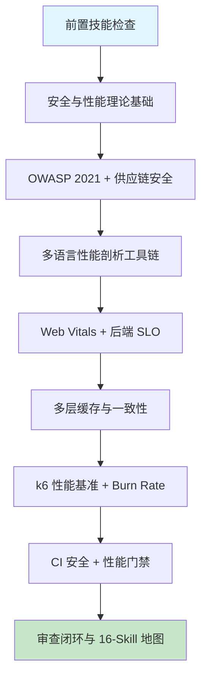

# 第十六章 安全最佳实践与性能优化

## 1. 学习目标

本章是第四部分与全书的收官——把代码质量（Ch13）、协作流程（Ch14）、DevOps 平台（Ch15）的能力汇总到**安全与性能**两条横切关注线上。重点解决 AI 辅助开发的两大终极反模式——**为了"写得快"绕开安全防线**（关 CSP / 关 rate limit / 用过期依赖）和**为了"跑得快"做未经测量的过早优化**（盲目加缓存、盲目并发、不解释的位运算）。本章把所有规则沉淀为 PR 强制门禁与可执行 runbook，并在 §9.3 给出全书 16-Skill 串联地图。

### 1.1 学习路径图



### 1.2 预期学习成果

本章结束时应形成 7 项交付物：① OWASP 2021 全栈防御清单（Web/API/容器/IaC 四层）；② 多语言性能剖析报告（前端 Lighthouse + 后端火焰图，含优化前后对比）；③ 多层缓存设计文档（含 5 类失效场景与一致性策略）；④ k6 性能基准 + 回归门禁；⑤ CI 安全扫描流水线（SAST + SCA + Container + IaC + Secret 五合一）；⑥ Prometheus SLO + Burn Rate 告警；⑦ `secperf-review` Skill + 全书 16-Skill 地图（§9.3）。

## 2. 前置技能检查

| 维度                 | 必备能力                                    | 自检方法                                            |
| :------------------- | :------------------------------------------ | :-------------------------------------------------- |
| **前 15 章全部技能** | 从 Trae 提示词到 GitOps 部署的完整链路      | 能独立完成功能从 PR → CI → 灰度 → 生产 SLO 的全流程 |
| **浏览器 DevTools**  | Performance / Network / Memory / Lighthouse | 能读懂 LCP / INP / CLS 三项 Web Vitals 报告         |
| **OWASP 基础**       | OWASP Top 10 (2021) + API Top 10 (2023)     | 能解释 BOLA / SSRF / Insecure Design 三类的根因     |
| **并发基础**         | 异步、线程池、连接池、锁与无锁              | 能解释 N+1 查询、惊群、缓存击穿/雪崩/穿透三件套     |
| **可观测**           | Metrics / Logs / Traces 三支柱              | 能用 PromQL 写出 p95 延迟与错误率                   |

> 任一项不满足，建议先回到对应章节复习。本章对综合能力要求最高。

---

## 3. 理论基础：安全与性能的策略与陷阱

### 3.1 安全防御纵深（5 层）

| 层级         | 关注点                                      | 工具                               | AI 风险                           |
| :----------- | :------------------------------------------ | :--------------------------------- | :-------------------------------- |
| **代码层**   | 输入校验、输出编码、Auth/AuthZ、加密        | Semgrep / CodeQL / ESLint security | AI 默认套示例代码，跳过校验       |
| **依赖层**   | 第三方包漏洞、license、typosquat            | Snyk / Dependabot / OSV-Scanner    | AI 装新包不查漏洞、不锁版本       |
| **容器层**   | 基础镜像 CVE、misconfig、SBOM、签名         | Trivy / Grype / cosign / syft      | AI 用 latest tag、不扫漏洞        |
| **平台层**   | K8s misconfig、RBAC、NetworkPolicy、Secrets | Kyverno / OPA / kube-bench         | AI 默认权限过宽（沿用 Ch15 §3.2） |
| **运行时层** | 异常 syscall、容器逃逸、流量异常            | Falco / Tetragon / WAF             | AI 几乎不主动建议这一层           |

> 对应 OWASP **2021 Top 10**：A01 失效访问 / A02 加密失败 / A03 注入 / A04 不安全设计 / A05 安全配置错误 / A06 易受攻击与过时组件 / A07 鉴别与认证失败 / A08 软件与数据完整性失败 / A09 日志与监控失败 / A10 SSRF。

### 3.2 AI 生成安全/性能代码的六类高频缺陷

| 类别                     | 典型表现                                                                          | 根因                                            | 审查优先级 | 修正提示词模板（按 [Ch2 §4.9](../第一部分-Trae基础入门/第二章-基础交互模式.md)）                                                            |
| :----------------------- | :-------------------------------------------------------------------------------- | :---------------------------------------------- | :--------- | :------------------------------------------------------------------------------------------------------------------------------------------ |
| **过早优化与未测量假设** | 未做火焰图就加缓存；用位运算"优化"可读代码；并发数硬编码                          | AI 倾向"显得高级"，缺乏测量基线                 | **P0**     | 保留功能正确，先建基线（火焰图 / p95）再优化一处。不要动业务输出。验证：优化后 p95 下降 ≥ 10% 且功能回归 0                                  |
| **缓存失效三件套**       | 缓存穿透（查不到的 key 反复打 DB）/ 击穿（单 key 失效瞬间打爆）/ 雪崩（同时失效） | AI 默认只设 TTL，不设 negative cache / 过期抖动 | **P0**     | 保留 cache key 命名，加 `singleflight` + TTL ±20% jitter + negative cache TTL=60s。不要动读路径。验证：DB 同 key QPS=1；过期分布跨度 > 4min |
| **安全防线被"绕过优化"** | 为减小响应体关闭 CSP；为减少跳转去掉 rate limit；为快返回跳过校验                 | AI 把功能跑通优先于安全                         | **P0**     | 保留性能优化思路，恢复 CSP/rate-limit/校验 后单独优化热路径。不要动优化后的热路径。验证：OWASP ZAP 扫描 0 高危                              |
| **内存与并发资源泄漏**   | 集合无界增长、连接池无上限、goroutine 泄漏、闭包持引用                            | AI 不写 cleanup/timeout；缺 graceful shutdown   | **P0**     | 保留池/集合语义，加 maxSize + `context.WithTimeout` + `defer cleanup` + graceful shutdown。不要动业务逻辑。验证：1h 压测 RSS 稳定           |
| **供应链与 secret 失守** | 装新包不查 CVE；secret 提交进 git；CI artifact 未签名                             | AI 把示例 token 当字面量；不主动用 SBOM/cosign  | **P0**     | 保留依赖版本，加 SBOM（cyclonedx） + cosign 签名 + secret 扫描（truffleHog）。不要动构建产物。验证：CI scan 0 高危 + 镜像含签名             |
| **监控告警与基线缺失**   | 仅有 metric 无 SLO；告警阈值硬编码而非 Burn Rate；性能优化无前后对比              | AI 写 rule 但不写 SLO；优化后不复测             | P1         | 保留 metric，加 SLO 定义 + Multi-Burn-Rate Alert + 优化前后对比报告。不要动 metric 名。验证：alert.yaml 含 SLO；复测报告含基线对比          |

### 3.3 性能优化的三条铁律

| 铁律                 | 内涵                                  | AI 高频违反                   |
| :------------------- | :------------------------------------ | :---------------------------- |
| **测量在前**         | 没有 baseline 的优化都是装饰          | AI 上来就加缓存/重写算法      |
| **优化最热路径**     | 80% 收益来自 20% 代码（火焰图最宽栈） | AI 平均使力，不分热度         |
| **不为优化牺牲安全** | 加快 1% 不值得引入注入/鉴权漏洞       | AI 关 CSP / rate-limit 换性能 |

> 工程铁律：**先建 SLO + 基线，再做优化；优化后必须复测；复测必须包含安全回归**。

---

## 4. 技术栈与项目架构

### 4.1 安全工具栈

| 类别             | 选型                                | 最低版本      | 选型说明                             |
| :--------------- | :---------------------------------- | :------------ | :----------------------------------- |
| SAST（代码扫描） | Semgrep / CodeQL                    | 1.80 / latest | Semgrep 规则可写、CodeQL GitHub 原生 |
| SCA（依赖扫描）  | Snyk / OSV-Scanner / Dependabot     | latest        | OSV-Scanner 开源、覆盖最全           |
| 容器扫描         | Trivy                               | **0.55+**     | misconfig + secret + SBOM 三合一     |
| IaC 扫描         | Checkov / KICS / tfsec              | 3.2 / latest  | Checkov 覆盖 Terraform/K8s/Helm      |
| Secret 扫描      | gitleaks / trufflehog v3            | 8.18 / 3.79   | trufflehog 含可信度评分              |
| DAST             | OWASP ZAP                           | 2.15+         | 自动化 + 手动模式                    |
| 镜像签名         | cosign / sigstore                   | 2.4+          | keyless OIDC 模式生产可用            |
| Web 安全 Headers | Helmet (Node) / secure_headers (Py) | 7 / 6         | CSP / HSTS / X-Frame-Options 一站式  |
| WAF              | ModSecurity / AWS WAF / Cloudflare  | latest        | OWASP CRS 4.x 规则集                 |
| Runtime          | Falco / Tetragon                    | 0.38 / 1.0    | eBPF 检测                            |

### 4.2 性能工具栈

| 语言       | 工具                            | 最低版本          | 选型说明                                         |
| :--------- | :------------------------------ | :---------------- | :----------------------------------------------- |
| 前端       | Lighthouse / WebPageTest        | **12.x** / latest | Lighthouse 12 用 INP 替代 FID                    |
| 浏览器     | Chrome DevTools Performance     | latest            | Web Vitals 实时面板                              |
| Node.js    | clinic.js / 0x / node --inspect | 13 / 5            | clinic.js Doctor 自动诊断 5 大问题               |
| Python     | py-spy / cProfile / scalene     | 0.4 / 1.5         | py-spy 不改代码、scalene 同时分析 CPU/Memory/GPU |
| Java       | async-profiler / VisualVM       | 3.0 / 2.1.10      | async-profiler 是火焰图首选                      |
| Go         | pprof / go tool trace           | go 1.22+          | pprof + go tool trace 双件                       |
| 通用 APM   | OpenTelemetry + Tempo + Grafana | 1.0 / 2.4         | 复用 Ch12/Ch15 LGTM 栈                           |
| 负载测试   | k6                              | **0.52+**         | k6 0.52 含 browser API、Web Vitals 测试          |
| HTTP 压测  | wrk / hey / autocannon          | latest            | 单机简单基线                                     |
| Web Vitals | web-vitals.js                   | 4+                | LCP / INP / CLS 真实用户监控（RUM）              |

### 4.3 课程项目矩阵（贯穿前 15 章）

| 项目                    | 来源章节  | 本章关注点                                     |
| :---------------------- | :-------- | :--------------------------------------------- |
| `task-management-api`   | Ch6/13/15 | API 鉴权 + N+1 查询 + 缓存层 + k6 基线         |
| `realtime-chat`         | Ch10      | WebSocket DoS 防御 + 连接池泄漏 + 消息延迟剖析 |
| `analytics-dashboard`   | Ch11      | NL2SQL 注入 + 大查询超时 + Streamlit 缓存策略  |
| `microservice-platform` | Ch12/15   | 跨服务认证 + Service Mesh mTLS + SLO/Burn Rate |

---

## 5. 主框架实战：从安全防线到性能门禁

### 5.1 OWASP 2021 全栈防御代码模板

#### 5.1.1 Node.js Express 安全 Headers（Helmet 7）

```typescript
import express from "express";
import helmet from "helmet";
import rateLimit from "express-rate-limit";
import { csrfSync } from "csrf-sync";

const app = express();

// ✅ A05 安全配置 + A02 加密：一行加 11 个安全 headers
app.use(
  helmet({
    contentSecurityPolicy: {
      // ✅ CSP nonce 模式
      directives: {
        defaultSrc: ["'self'"],
        scriptSrc: [
          "'self'",
          (req, res) => `'nonce-${(res as any).locals.cspNonce}'`,
        ],
        styleSrc: ["'self'", "'unsafe-inline'"], // styles 短期允许 inline
        imgSrc: ["'self'", "data:", "https://cdn.example.com"],
        connectSrc: ["'self'", "https://api.example.com"],
        frameAncestors: ["'none'"], // ✅ 防 clickjack
        objectSrc: ["'none'"],
        upgradeInsecureRequests: [],
      },
    },
    strictTransportSecurity: {
      maxAge: 63072000,
      includeSubDomains: true,
      preload: true,
    },
    crossOriginOpenerPolicy: { policy: "same-origin" },
    referrerPolicy: { policy: "strict-origin-when-cross-origin" },
  }),
);

// ✅ A07 鉴别失败：分级速率限制
const authLimiter = rateLimit({
  windowMs: 15 * 60 * 1000,
  max: 10, // 登录 15 分钟 10 次
  standardHeaders: true,
  legacyHeaders: false,
  keyGenerator: (req) => `${req.ip}:${req.body?.username}`, // ✅ IP + 账号双维度
});
app.use("/auth/login", authLimiter);
const apiLimiter = rateLimit({ windowMs: 60_000, max: 100 });
app.use("/api/", apiLimiter);

// ✅ A01 失效访问：CSRF 防御（cookie + header 双 token）
const { csrfSynchronisedProtection } = csrfSync({
  getTokenFromRequest: (req) => req.headers["x-csrf-token"] as string,
});
app.use(csrfSynchronisedProtection);

// ⚠️ AI 经常生成的反例：
// app.use(helmet({ contentSecurityPolicy: false }))         // ❌ 关掉 CSP 换"省事"
// app.disable("x-powered-by") 后没设 helmet                  // ❌ 只擦了一项
```

#### 5.1.2 输入校验 + ORM 参数化（A03 注入防御）

```typescript
import { z } from "zod";
import { Prisma } from "@prisma/client";

// ✅ Zod schema 在边界做白名单校验
const ListOrdersQuery = z.object({
  status: z.enum(["pending", "paid", "shipped"]).optional(),
  limit: z.coerce.number().int().min(1).max(100).default(20), // ✅ 限制 max
  cursor: z.string().uuid().optional(), // ✅ uuid 强类型
});

app.get("/api/orders", async (req, res) => {
  const q = ListOrdersQuery.parse(req.query); // ✅ 失败抛异常
  const userId = req.user!.sub; // ✅ 从 JWT 取，绝不从 query

  const orders = await prisma.order.findMany({
    // ✅ Prisma 参数化，无注入
    where: { userId, ...(q.status ? { status: q.status } : {}) },
    take: q.limit,
    ...(q.cursor && { cursor: { id: q.cursor }, skip: 1 }),
    orderBy: { createdAt: "desc" },
  });
  res.json({ data: orders });

  // ⚠️ AI 反例：raw query 拼字符串
  // await prisma.$queryRawUnsafe(`SELECT * FROM orders WHERE user='${userId}'`);
});
```

> A04 不安全设计的核心：**信任边界永远从 JWT/Session 取身份，不从 query/body**；分页/排序字段必须白名单。

### 5.2 多层缓存与一致性

```typescript
// L1: 进程内 LRU + L2: Redis + L3: PG（源）
import LRU from "lru-cache";
import { redis } from "./redis";

const l1 = new LRU<string, Order>({
  max: 1000,
  ttl: 30_000,
  // ✅ 抖动 ±20%，防 L1 同时失效雪崩到 L2
  ttlAutopurge: true,
});

const NEGATIVE = Symbol("not-found");

async function getOrder(id: string): Promise<Order | null> {
  const key = `order:${id}`;
  // 1) L1
  const v1 = l1.get(key);
  if (v1) return v1 === NEGATIVE ? null : v1;

  // 2) L2 Redis（singleflight 防击穿）
  const cached = await redis.get(key);
  if (cached === "__NULL__") {
    l1.set(key, NEGATIVE as any);
    return null;
  } // ✅ 负缓存防穿透
  if (cached) {
    const o = JSON.parse(cached);
    l1.set(key, o);
    return o;
  }

  // 3) singleflight：同 key 并发只查一次 DB（防击穿）
  return await singleflight(key, async () => {
    const o = await prisma.order.findUnique({ where: { id } });
    if (o) {
      const ttl = 300 + Math.floor(Math.random() * 60); // ✅ TTL 抖动防雪崩
      await redis.set(key, JSON.stringify(o), "EX", ttl);
      l1.set(key, o);
      return o;
    } else {
      await redis.set(key, "__NULL__", "EX", 60); // ✅ 负缓存 60s
      l1.set(key, NEGATIVE as any);
      return null;
    }
  });
}

// ✅ 写一致性：先写 DB → 再删缓存（Cache-Aside），异步重试
async function updateOrder(id: string, patch: Partial<Order>) {
  const o = await prisma.order.update({ where: { id }, data: patch });
  await redis.del(`order:${id}`).catch(async () => {
    await deleteRetryQueue.add({ key: `order:${id}` }); // ✅ 删失败入重试
  });
  l1.delete(`order:${id}`); // L1 同步失效
  return o;
}
```

> 关键：**TTL 抖动防雪崩 + 负缓存防穿透 + singleflight 防击穿**——三件套缺一不可。读写顺序选 Cache-Aside（先写 DB 后删缓存），并保证删除失败的重试。

### 5.3 性能剖析：从 Web Vitals 到火焰图

#### 5.3.1 前端：Lighthouse 12 + Web Vitals RUM

```typescript
// 真实用户监控（RUM）——补足 Lighthouse 实验室的不足
import { onLCP, onINP, onCLS, onFCP, onTTFB } from "web-vitals/attribution";

function send(metric: { name: string; value: number; attribution: any }) {
  navigator.sendBeacon(
    "/rum",
    JSON.stringify({
      // ✅ unload 安全
      n: metric.name,
      v: metric.value,
      el: metric.attribution.element, // ✅ 哪个 DOM 拖慢
      url: location.pathname,
    }),
  );
}
onLCP(send);
onINP(send);
onCLS(send);
onFCP(send);
onTTFB(send);
```

| 指标 | 优秀     | 较差     | 含义                     |
| :--- | :------- | :------- | :----------------------- |
| LCP  | ≤ 2.5 s  | > 4.0 s  | 最大内容渲染（首屏）     |
| INP  | ≤ 200 ms | > 500 ms | 交互到下一帧（替代 FID） |
| CLS  | ≤ 0.1    | > 0.25   | 累积布局偏移             |
| TTFB | ≤ 800 ms | > 1.8 s  | 服务器首字节             |

#### 5.3.2 后端：火焰图驱动的瓶颈定位

```bash
# Node.js（clinic.js 自动生成 4 类报告）
clinic doctor    -- node dist/server.js   # CPU / EventLoop / Memory / Handles 综合诊断
clinic flame     -- node dist/server.js   # CPU 火焰图（找最宽栈）
clinic bubbleprof -- node dist/server.js  # 异步操作可视化

# Python
py-spy record -o flame.svg --pid $(pgrep -f gunicorn) --duration 60
scalene --cli --profile-interval 30 my_app.py    # CPU + Memory + GPU 三合一

# Java
java -agentpath:async-profiler/lib/libasyncProfiler.so=start,event=cpu,file=flame.html \
     -jar app.jar

# Go（最简洁）
go tool pprof -http=:8080 http://prod-svc:6060/debug/pprof/profile?seconds=30
go tool trace trace.out                          # 调度器行为
```

> 核心心法：**最宽栈 = 最热路径**。优化它收益最大；不要去优化窄栈，那是装饰。

### 5.4 k6 性能基准 + 回归门禁

```javascript
// k6/baseline.js
import http from "k6/http";
import { check, sleep } from "k6";
import { Trend } from "k6/metrics";

const latency = new Trend("api_latency");

export const options = {
  scenarios: {
    smoke: { executor: "constant-vus", vus: 5, duration: "1m" },
    ramp: {
      executor: "ramping-vus",
      startVUs: 0,
      stages: [
        { duration: "2m", target: 100 }, // ramp up
        { duration: "5m", target: 100 }, // sustain
        { duration: "2m", target: 0 },
      ],
    },
    soak: { executor: "constant-vus", vus: 50, duration: "30m" }, // 长时稳定性
  },
  thresholds: {
    // ✅ CI 阻断条件
    "http_req_duration{status:200}": ["p(95)<300", "p(99)<800"],
    http_req_failed: ["rate<0.01"],
    checks: ["rate>0.99"],
  },
};

export default function () {
  const res = http.get(`${__ENV.BASE_URL}/api/orders?limit=20`, {
    headers: { Authorization: `Bearer ${__ENV.JWT}` },
  });
  check(res, {
    "status 200": (r) => r.status === 200,
    "latency<300": (r) => r.timings.duration < 300,
  });
  latency.add(res.timings.duration);
  sleep(1);
}
```

> 集成到 CI：在 staging deploy 之后跑 smoke；在 release 前跑 ramp + soak。任一阈值失败 → PR 阻断。

### 5.5 SLO + Burn Rate 告警（多窗口多倍率）

```yaml
# prometheus-rules.yaml
groups:
  - name: slo-task-api
    rules:
      # SLO: 30 天 99.9% 成功率
      - record: slo:availability_target
        expr: 0.999

      - record: slo:error_budget_burn_rate1h
        expr: |
          (1 - (
            sum(rate(http_requests_total{job="task-api",code!~"5.."}[1h]))
            / sum(rate(http_requests_total{job="task-api"}[1h]))
          )) / (1 - 0.999)

      - record: slo:error_budget_burn_rate6h
        expr: |
          (1 - (
            sum(rate(http_requests_total{job="task-api",code!~"5.."}[6h]))
            / sum(rate(http_requests_total{job="task-api"}[6h]))
          )) / (1 - 0.999)

      # ✅ 多窗口多倍率：1h 14.4× 触发即"2 天烧光预算"
      - alert: HighErrorBudgetBurn_FastBurn
        expr: slo:error_budget_burn_rate1h > 14.4 and slo:error_budget_burn_rate6h > 6
        for: 2m
        labels: { severity: page }
        annotations:
          {
            summary: "task-api SLO fast burn",
            runbook_url: "https://wiki/runbooks/task-api-burn",
          }

      - alert: HighErrorBudgetBurn_SlowBurn
        expr: slo:error_budget_burn_rate6h > 1 and slo:error_budget_burn_rate1h > 1
        for: 1h
        labels: { severity: ticket }
        annotations: { summary: "task-api SLO slow burn" }
```

> Google SRE Workbook 推荐：**fast (1h, 14.4×) + slow (6h, 6×) 双窗口 AND**——既能抓快速烧穿、又能避免短暂抖动误报。

### 5.6 CI 安全 + 性能五合一门禁

```yaml
# .github/workflows/security-perf-gate.yml
name: Security & Performance Gate
on: [pull_request]
permissions: { contents: read, security-events: write, pull-requests: write }

jobs:
  sast:
    runs-on: ubuntu-22.04
    steps:
      - uses: actions/checkout@v4
      - uses: returntocorp/semgrep-action@v1
        with: { config: "p/owasp-top-ten p/javascript p/typescript p/python" }

  sca:
    runs-on: ubuntu-22.04
    steps:
      - uses: actions/checkout@v4
      - uses: google/osv-scanner-action@v1
        with: { scan-args: "--lockfile=pnpm-lock.yaml --recursive ./" }

  container:
    runs-on: ubuntu-22.04
    steps:
      - uses: actions/checkout@v4
      - run: docker buildx build -t app:${{ github.sha }} --load .
      - uses: aquasecurity/trivy-action@master
        with:
          {
            image-ref: "app:${{ github.sha }}",
            severity: "HIGH,CRITICAL",
            exit-code: "1",
          }
      - run: cosign sign --yes app:${{ github.sha }} # ✅ keyless 签名

  iac:
    runs-on: ubuntu-22.04
    steps:
      - uses: actions/checkout@v4
      - uses: bridgecrewio/checkov-action@master
        with: { directory: ".", framework: "terraform,kubernetes,helm" }

  secrets:
    runs-on: ubuntu-22.04
    steps:
      - uses: actions/checkout@v4
        with: { fetch-depth: 0 }
      - uses: trufflesecurity/trufflehog@main
        with: { extra_args: "--only-verified" } # ✅ 仅高可信度命中

  perf-regression:
    runs-on: ubuntu-22.04
    needs: [sast, sca, container, iac, secrets]
    steps:
      - uses: actions/checkout@v4
      - run: docker compose up -d # 起 staging 副本
      - uses: grafana/k6-action@v0.3
        with: { filename: k6/baseline.js, flags: "--out json=k6.json" }
      - run: node scripts/compare-baseline.js k6.json baseline-main.json # ✅ p95 退化 > 10% 阻断
```

---

### 5.7 Vibe Coding 循环实录：缓存击穿修正

> **修正语法**：「修正提示词」按 [Ch2 §4.9 修正提示词语法](../第一部分-Trae基础入门/第二章-基础交互模式.md) 模板；3 轮未收敛触发 §4.10。模式选择查 [Ch1 §5.4](../第一部分-Trae基础入门/第一章-Trae简介与环境配置.md)。

| 轮次 | AI 输出摘要                       | 发现的缺陷                             | 修正提示词（按 §4.9）                                                                                                                                                                            | 验证信号               |
| :--- | :-------------------------------- | :------------------------------------- | :----------------------------------------------------------------------------------------------------------------------------------------------------------------------------------------------- | :--------------------- |
| R1   | 高并发同 key 缓存失效瞬间全部回源 | DB 同 key QPS 瞬时数千 → 主库 CPU 100% | 保留缓存读路径不变，修复回源合并：在 cache miss 路径包 `singleflight.Do(key, loader)`。原因：同 key 并发回源必须合并为 1。不要改 cache key 命名规则。验证：压测 1000 并发同 key 时 DB 命中数 = 1 | DB 同 key QPS = 1      |
| R2   | 全部 key TTL 固定 600s            | 批量预热 → 600s 后同时刻雪崩           | 保留 singleflight，修复 TTL 抖动：TTL 改为 `600 + random.randint(-120, 120)`（±20% jitter）。原因：固定 TTL 等于同步过期。不要动 singleflight。验证：1 万 key 过期时间分布跨度 > 4 分钟          | 过期分布 > 4 分钟      |
| R3   | 不存在的 key 反复查 DB            | 恶意扫描攻击放大到主库                 | 保留前两层，新增空值缓存：DB 返回 nil 时写入 `__NEGATIVE__` sentinel，TTL 60s。原因：必须吸收穿透流量。不要动正常值 TTL。验证：扫描 1000 不存在 key 时 DB QPS < 20                               | 不存在 key DB QPS < 20 |

> **收敛信号**：合并回源 + TTL 抖动 + 空值缓存三层达标（击穿 / 雪崩 / 穿透三类齐治）。如未收敛触发 §4.10 信号 2（改 A 坏 B：sentinel 误命中真实空业务语义），按「拆步骤」重启——把空值用独立 namespace key 隔离。

---

## 6. 进阶速查表

### 6.1 进阶场景索引

| 场景             | 关键技术                               | AI 高频缺陷              | 建议提示词关键词                        |
| :--------------- | :------------------------------------- | :----------------------- | :-------------------------------------- |
| **零信任架构**   | mTLS + SPIFFE / OIDC / OPA             | 服务间默认信任           | "PeerAuthentication STRICT + SPIFFE ID" |
| **API 网关防御** | Kong / Envoy + JWT + WAF               | 鉴权放在业务而非网关     | "JWT validation + plugin chain + WAF"   |
| **DDoS 缓解**    | Cloudflare / AWS Shield / CDN          | 仅靠应用层 rate limit    | "CDN + WAF + 多层 rate limit"           |
| **加密最佳实践** | KMS / HSM / Argon2id / TLS 1.3         | 用 MD5/SHA1 / 密钥硬编码 | "KMS + envelope encryption + HSM"       |
| **大对象优化**   | streaming + range + http/3             | 一次性加载到内存         | "streaming + chunked + memory profile"  |
| **数据库慢查询** | EXPLAIN + index + partition + 读写分离 | 加缓存绕过慢查           | "EXPLAIN ANALYZE + 索引覆盖 + 读副本"   |
| **GC 调优**      | G1/ZGC（Java）/ V8 / Go GC             | 默认参数高负载抖动       | "GC log + heap dump + ZGC/G1"           |
| **容器逃逸防御** | seccomp + AppArmor + Pod Security      | 默认 cap、特权容器       | "drop ALL + seccomp + read-only fs"     |

### 6.2 性能与安全基线

| 指标                               | 目标值   | 测量方法                           |
| :--------------------------------- | :------- | :--------------------------------- |
| Web LCP                            | ≤ 2.5 s  | Lighthouse 12 + RUM（75 分位用户） |
| Web INP                            | ≤ 200 ms | RUM 实测                           |
| API p95（读）                      | < 300 ms | k6 / Prom histogram                |
| API p99                            | < 800 ms | k6                                 |
| 缓存命中率                         | > 85%    | Redis info / 自定义 metric         |
| 镜像 CVE（HIGH/CRITICAL）          | 0        | Trivy 扫描                         |
| Semgrep p/owasp-top-ten violations | 0        | Semgrep CI                         |
| Secret 泄漏                        | 0        | trufflehog --only-verified         |
| SLO 30 天可用性                    | ≥ 99.9%  | Prometheus + SLO recording         |
| 错误预算 fast burn                 | 不触发   | Burn Rate alert 1h × 14.4          |

### 6.3 运维 Cheatsheet

```bash
# 一次性生产体检（每周跑）
trivy image --severity HIGH,CRITICAL ghcr.io/org/app:prod
osv-scanner --lockfile=pnpm-lock.yaml --recursive .
gitleaks detect --redact -v
checkov -d terraform/envs/prod
nuclei -u https://app.example.com -t cves/ -severity high,critical

# 定位线上慢请求（带 traceID 串起来）
curl -H "Traceparent: 00-$(uuid)..." https://app/api/slow      # 注入 traceID
# Grafana → Tempo: 找到 traceID
# Grafana → Loki: 用 traceID 找日志
# Grafana → Prom: 看同时段指标

# 紧急流量保护（按优先级）
1) Cloudflare/WAF 黑 IP / 限速
2) k8s NetworkPolicy 加 deny rule
3) 应用 rateLimit max 临时调小
4) HPA maxReplicas 上调
```

---

## 7. 审查闭环：把安全与性能变成可强制门禁

### 7.1 四步审查法（安全与性能专用）

| 步骤         | 关键检查项                                                                                                                     |
| :----------- | :----------------------------------------------------------------------------------------------------------------------------- |
| **正确性**   | 输入是否经 schema 校验？JWT 校验是否含 iss/aud/exp？缓存 TTL 是否抖动？singleflight 防击穿？SLO/Burn Rate 是否覆盖核心 API？   |
| **安全性**   | OWASP 2021 全 10 项是否有对应防御？helmet/CSP/CSRF/rate-limit 是否完整？依赖是否过 SCA？镜像是否过 Trivy？是否签名（cosign）？ |
| **性能**     | 是否有 baseline + 火焰图？最宽栈是否优化？缓存命中率 > 85%？数据库是否有慢日志监控？是否有 k6 回归门禁？                       |
| **可维护性** | secret 是否走 ESO/Vault？告警是否有 runbook 链接？性能优化是否记录前后对比？是否有 SBOM + 依赖图？所有规则是否沉淀为 Skill？   |

### 7.2 三类红队攻防场景测试（AI 最容易遗漏）

```bash
# 1) BOLA（A01）：换 user_id 看能否拿到别人的资源
TOKEN_ALICE=$(login alice)
TOKEN_BOB=$(login bob)
ALICE_ORDER=$(create_order $TOKEN_ALICE)
curl -H "Authorization: Bearer $TOKEN_BOB" /api/orders/$ALICE_ORDER  # ✅ 必须 403

# 2) SSRF（A10）：让服务端去访问元数据服务
curl -X POST /api/preview -d '{"url":"http://169.254.169.254/latest/meta-data/"}'  # ✅ 必须拒绝

# 3) 缓存击穿压测：同一个不存在的 key 同时打 1000 次
hey -n 10000 -c 1000 -H "Authorization: Bearer $TOKEN" /api/orders/nonexistent
# ✅ DB QPS 不应被穿透；Redis 应有负缓存命中
```

### 7.3 危险模式 grep 规则（沉淀进 `secperf-review` Skill）

```bash
# ============ 安全 ============
# 1. helmet/CSP 被关闭
grep -rEn 'contentSecurityPolicy:\s*false|helmet\(\s*\{\s*contentSecurityPolicy:\s*false' src/

# 2. 弱加密算法
grep -rEn '\b(md5|sha1|des|rc4)\b|crypto\.createHash\(["'\'']md5' src/

# 3. SQL/Shell 字符串拼接
grep -rEn '\$\{[^}]+\}\s*(--|;)|exec\(["'\''].*\$\{|\.query\(`[^`]*\$\{' src/

# 4. JWT 未校验 iss/aud
grep -rEn 'jwt\.verify\([^,]+,[^,]+\)\s*[;,)]' src/   # 没有 options 的就是问题

# 5. secret 形态
grep -rEnE '(api[_-]?key|secret|password|token)\s*[:=]\s*["'\''][A-Za-z0-9+/=]{16,}["'\'']' src/

# ============ 性能 ============
# 6. 缓存无 TTL 抖动
grep -rEn 'redis\.set[a-zA-Z]*\([^)]*EX[\s,]*[0-9]+\s*\)' src/ | grep -v Math.random

# 7. 循环内 await（串行陷阱）
grep -rEn 'for\s*\([^)]*\)\s*\{[^}]*\bawait\b' src/

# 8. 缺 timeout 的 fetch / axios
grep -rEn 'fetch\([^,]+\)|axios\.[a-z]+\([^,]+\)' src/ | grep -v 'AbortSignal\|timeout'
```

### 7.4 扫到问题后用什么提示词改？

上面 8 条扫描只识别「安全/性能危信号」；下一步必须按统一语法把意图写回 AI（参照 [Ch2 §4.9](../第一部分-Trae基础入门/第二章-基础交互模式.md)）。

| #   | 命中后修正提示词模板                                                                                                                                                                                     |
| :-- | :------------------------------------------------------------------------------------------------------------------------------------------------------------------------------------------------------- |
| 1   | 保留中间件链顺序，启用 `helmet({ contentSecurityPolicy: { directives: { defaultSrc:["'self'"], ... } } })`。不要动业务 router。验证：响应头含 `Content-Security-Policy`；Mozilla Observatory 评分 ≥ B+。 |
| 2   | 保留 hash 用途，`md5/sha1` → `sha256`（数据完整性）或 `bcrypt/argon2`（密码）。不要动调用点。验证：grep 返 0；提供存量 hash 迁移脚本。                                                                   |
| 3   | 保留参数语义，改用占位符（`?` / `$1`）+ ORM 安全 API；shell 改 `execFile([args])` 避免拼接。不要动业务条件。验证：注入 payload 入库为字面量，shell 不执行额外命令。                                      |
| 4   | 保留 verify 调用位置，options 加 `{ algorithms:['RS256'], issuer, audience }`。不要动 token 结构。验证：错误 iss/aud 返 401 + `code='ISS_MISMATCH'`。                                                    |
| 5   | 保留调用点，secret 迁 `process.env` + `.env.example` + KMS；启动检查缺失就 throw。不要动算法。验证：grep 返 0；重启后新 secret 生效。                                                                    |
| 6   | 保留 cache key 命名，TTL 改 `base + Math.floor(Math.random()*base*0.2)`（±20% jitter）+ singleflight + negative cache TTL=60s。不要动读路径。验证：DB 同 key QPS = 1；过期分布跨度 > 4min。              |
| 7   | 保留任务列表，串行改并发 `await Promise.allSettled(items.map(fn))` 或 `p-limit(N)` 控制并发。不要动错误处理语义。验证：N=100 场景耗时下降 ≥ 5×。                                                         |
| 8   | 保留 URL 与 body，axios 加 `{ timeout: 3000 }` 或 fetch `AbortSignal.timeout(3000)` + 3 次退避重试。不要动重试语义中的幂等性。验证：模拟挂起服务 3.5s 内返错而非 hang。                                  |

> 3 轮未收敛触发 [§4.10](../第一部分-Trae基础入门/第二章-基础交互模式.md) 的「换模式 / 缩范围 / 拆步骤」。

---

## 8. 三档实践

### 8.1 基础实践（必做）

为第六章 `task-management-api` 补齐安全与性能：① OWASP 2021 全栈防御（helmet + CSP nonce + CSRF + rate limit 分级 + Zod 校验）；② Lighthouse 12 跑分 ≥ 90 + 后端 k6 baseline；③ Redis 多层缓存（含 TTL 抖动 / 负缓存 / singleflight）；④ CI 五合一安全门禁（SAST + SCA + Container + IaC + Secret）。

### 8.2 进阶实践（推荐）

为第十章实时聊天 + 第十一章分析仪表板做深度优化：① WebSocket 连接泄漏诊断（clinic.js + heap snapshot）+ 修复；② DuckDB 大查询超时与背压；③ Streamlit `st.cache_data` vs `st.cache_resource` 选型并量化收益；④ SLO + Burn Rate（fast 1h 14.4× / slow 6h 6×）告警 + runbook；⑤ k6 回归门禁集成到 CD（p95 退化 > 10% 阻断）；⑥ 真实用户监控 RUM 上线，输出"Lighthouse vs RUM"对比报告。

### 8.3 开放实践（挑战 / 全书集大成）

为第十二章微服务平台 + 第十五章 GitOps 体系做安全与性能终局加固：① 落地零信任（mTLS STRICT + SPIFFE + OPA Authz）；② 跨服务追踪（OTel + Tempo）+ 一次端到端故障演练；③ 红队攻防演练（BOLA / SSRF / 缓存击穿三类）；④ 依赖供应链 SLSA Level 3（cosign keyless + SBOM + provenance）；⑤ Kyverno admission 强制 §7.3 八条规则；⑥ 把全书 Skill 整理为 `.qoder/skills/secperf-review/SKILL.md` + 全书 16-Skill 串联地图（见 §9.3）。

---

## 9. 小结

### 9.1 章节交付物清单

| 编号   | 交付物                                                | 复用去向                      |
| :----- | :---------------------------------------------------- | :---------------------------- |
| D-16-1 | OWASP 2021 全栈防御代码模板（helmet/CSRF/rate limit） | 全书所有 API 项目复用         |
| D-16-2 | 多层缓存 + TTL 抖动 + 负缓存 + singleflight           | Ch6/Ch10/Ch11/Ch12 缓存层基线 |
| D-16-3 | 多语言性能剖析 runbook（前端 RUM + 后端火焰图）       | 全书性能分析方法论            |
| D-16-4 | k6 性能基准 + 回归门禁                                | Ch15 CD 链路必备节点          |
| D-16-5 | CI 五合一安全门禁（SAST/SCA/Container/IaC/Secret）    | Ch14/Ch15 PR 流程必备         |
| D-16-6 | SLO + Burn Rate 告警 + runbook                        | Ch12/Ch15 可观测能力终态      |
| D-16-7 | `secperf-review` Skill + 全书 16-Skill 地图           | 团队 PR 审查规约总入口        |

### 9.2 安全与性能能力自评 Rubric

| 维度     | 入门（1-2）     | 熟练（3-4）                                    | 精通（5）                                        |
| :------- | :-------------- | :--------------------------------------------- | :----------------------------------------------- |
| 安全编码 | 知道 OWASP 名词 | 能独立加 helmet + CSRF + rate limit + Zod 校验 | 能落地零信任 + SLSA Level 3 + 红队攻防演练       |
| 性能剖析 | 跑过 Lighthouse | 能用火焰图找最宽栈 + 量化优化收益              | 能从 RUM → APM → 火焰图全链路定位 + 设计性能门禁 |
| 缓存设计 | 加过 Redis      | 能设 TTL 抖动 + 负缓存 + singleflight          | 能设计多层 + 一致性策略 + 可解释失效模式         |
| 监控告警 | 看 Grafana      | 能写 PromQL + Alertmanager rules               | 能设计 SLO + 多窗口多倍率 Burn Rate + runbook    |
| 审查能力 | 跑 §7.3 grep    | 识别六类缺陷 + 跑红队三类演练                  | 输出可复用 Skill + 团队规约 + Kyverno admission  |

### 9.3 全书 16-Skill 串联地图（capstone）

> **贯穿这 16 个 Skill 的主骨**是 Vibe Coding 闭环：**描述意图 → AI 生成 → 审查迭代 → 交付**。每个 Skill 只是「审查迭代」环节的专领域拦截器：Chx §3.2 的缺陷表与第 5 列修正提示词告诉 Skill 抓什么与怎么跟 AI 谈；Chx §5.x 循环实录表告诉 Skill 一轮快、三轮慢、何时重启；Chx §7.x 危险模式扫描 + 修正提示词表告诉 Skill 以哪些 grep 作 PR 闸门。离开闭环主骨，Skill 就只是一堆禁用项，而非工程方法论。

| Skill                 | 章节    | PR 触发条件                           | 关键检查                                                                                                                                             | Vibe Coding 调用点             |
| :-------------------- | :------ | :------------------------------------ | :--------------------------------------------------------------------------------------------------------------------------------------------------- | :----------------------------- |
| `prompt-template-set` | Ch1-3   | 任意 Trae 提示词改动                  | 提示词是否含上下文 + 约束 + 输出格式                                                                                                                 | 「描述意图」环节               |
| `frontend-review`     | Ch5     | `apps/web/**`                         | 可访问性 + Web Vitals + 状态管理                                                                                                                     | 「审查迭代」+ Ch5 §7.4 修正表  |
| `api-review`          | Ch6     | `services/*/api/**`                   | OpenAPI + Zod + RESTful + 鉴权                                                                                                                       | 「审查迭代」+ Ch6 §7.3 修正表  |
| `sql-review`          | Ch7     | `**/*.sql`、ORM 查询                  | EXPLAIN + 索引 + N+1 + 参数化                                                                                                                        | 「审查迭代」+ Ch7 §7.3 修正表  |
| `security-review`     | Ch8     | `auth/`、`middleware/`                | JWT iss/aud/exp + RBAC + CSRF                                                                                                                        | 「审查迭代」+ Ch8 §7.4 修正表  |
| `inference-review`    | Ch9     | `**/llm/**`、`**/prompts/**`          | 越狱防御 + token 控制 + 缓存                                                                                                                         | 「审查迭代」+ Ch9 §7.4 修正表  |
| `realtime-review`     | Ch10    | `**/ws/**`、`**/socket/**`            | 心跳 + 背压 + 断线重连 + 防 DoS                                                                                                                      | 「审查迭代」+ Ch10 §7.4 修正表 |
| `analysis-review`     | Ch11    | `**/notebooks/**`、`**/dashboards/**` | dtype + 时区 + 单位 + p-hacking                                                                                                                      | 「审查迭代」+ Ch11 §7.4 修正表 |
| `microservice-review` | Ch12    | `services/*`、Helm chart              | DDD 边界 + Outbox + Saga + Istio                                                                                                                     | 「审查迭代」+ Ch12 §7.4 修正表 |
| `quality-review`      | Ch13    | `tests/`、`eslint.config.js`          | 强断言 + mutation score + 假绿验证                                                                                                                   | 「审查迭代」+ Ch13 §7.4 修正表 |
| `pr-review`           | Ch14    | `.github/`、Branch Protection         | Conventional Commits + CODEOWNERS + 高风险检查                                                                                                       | 「交付」+ Ch14 §7.4 修正表     |
| `devops-review`       | Ch15    | `**/*.yaml`、`Dockerfile`、`*.tf`     | limits + probes + nonRoot + PDB + 镜像 digest                                                                                                        | 「交付」+ Ch15 §7.4 修正表     |
| `secperf-review`      | Ch16    | 全仓库（最后一道闸）                  | OWASP + 缓存三件套 + SLO + Burn Rate + 五合一扫描                                                                                                    | 「交付」+ Ch16 §7.4 修正表     |
| `vibe-loop-set`       | Ch1+Ch2 | 任意 Skill 出现 3 轮未收敛            | [Ch1 §5.4 三模式决策树](../第一部分-Trae基础入门/第一章-Trae简介与环境配置.md) + [Ch2 §4.9 / §4.10](../第一部分-Trae基础入门/第二章-基础交互模式.md) | 贯穿所有环节的闭环骨架         |

> 实施建议：在 `.qoder/skills/` 下为每个 Skill 写一个 `SKILL.md`，含触发器、检查项、自动化命令；用 GitHub label-based dispatch 在 PR 上挂上对应 Skill。额外为 `vibe-loop-set` 写一个 meta-Skill：定义「3 轮仓库重复修改」的检测与提醒脚本，以避免 AI 陷入越修越乱。

### 9.4 跨章节衔接与全书结尾

- ⬅️ Ch13/Ch14/Ch15：本章是这三章的总检查口——质量门禁 → 协作门禁 → DevOps 门禁 → 安全/性能门禁；
- ⬅️ Ch5-Ch12：本章为前面所有项目补齐安全与性能能力；
- 🏁 全书完结：从 Ch1 的"AI 编程世界观"到 Ch16 的"全书 Skill 地图"，目标是把 AI 协作沉淀为团队 systematized 的工程方法论而非个人灵感。

---

## 10. 延伸阅读

### 10.1 经典必读（建立终极直觉）

- 《Site Reliability Engineering》+《SRE Workbook》（Google）— SLO / 错误预算 / Burn Rate 的圣经
- 《Designing Data-Intensive Applications》（Martin Kleppmann）— 大型系统的可靠性、性能、扩展性
- 《Web Application Hacker's Handbook》（第 2 版）— Web 安全攻防
- 《The Tangled Web》（Michal Zalewski）— 浏览器与 Web 安全的细节
- 《Systems Performance》（第 2 版，Brendan Gregg）— 性能分析方法论与火焰图作者作品
- 《BPF Performance Tools》（Brendan Gregg）— eBPF 时代的性能工具集

### 10.2 工程化与官方规范

- OWASP Top 10 (2021)：<https://owasp.org/www-project-top-ten/>
- OWASP API Security Top 10 (2023)：<https://owasp.org/API-Security/>
- OWASP ASVS v4：应用安全验证标准
- Web Vitals：<https://web.dev/vitals/>（含 INP 替代 FID 公告）
- SLSA Supply Chain Levels v1.0：<https://slsa.dev/>
- NIST SP 800-218 Secure Software Development Framework
- CIS Benchmarks（Kubernetes / Docker / 各 OS / 各 DB）

### 10.3 前沿研究与实践报告

- Google _SRE Workbook_ — 多窗口多倍率告警源头
- _Verizon Data Breach Investigations Report_（DBIR，每年最新版）— 真实漏洞利用统计
- Sonatype _State of the Software Supply Chain_ — 依赖漏洞趋势
- Cloud Native Computing Foundation _State of Cloud Native Security_
- Brendan Gregg's Blog：<https://www.brendangregg.com/>（性能与火焰图前沿）
- Chrome DevTools Tips：<https://developer.chrome.com/docs/devtools/>（Web Vitals + INP 调优）

---

> **完成判定**：能在 30 分钟内为新项目搭好 ① OWASP 防御四件套；② 多层缓存三件套；③ k6 baseline + Burn Rate；④ CI 五合一扫描；并通过 §7.2 三类红队场景演练。当你能让"AI 写得既快又安全又高效"——并且这是被门禁强制保障而非靠人盯——这门课就完成了它的使命。
