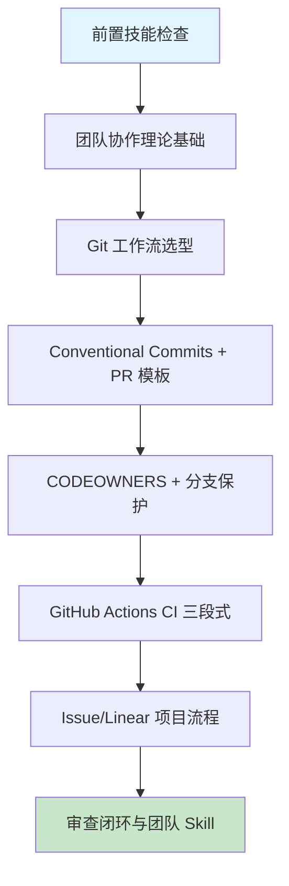

# 第十四章 项目管理与团队协作

## 1. 学习目标

本章把第十三章的"质量门禁"嵌入到团队协作的"交通规则"中：Git 不再只是 `commit/push`，而是 3-50 人团队的写作流程；PR 不再只是合并请求，而是知识、上下文与责任的载体。本章重点解决 AI 辅助开发在团队中的三大反模式——**AI 生成的提交信息空洞、PR 描述只描述代码不解释决策、CI/CD 配置默认权限过宽**——并把它们沉淀为 Skill。

### 1.1 学习路径图



### 1.2 预期学习成果

本章结束时应形成 5 项交付物：① 与团队规模匹配的 Git 工作流文档（GitHub Flow / Git Flow / Trunk-Based 三选一含决策依据）；② Conventional Commits + commitlint + PR 模板 + CODEOWNERS 完整规约；③ 一条可运行的 GitHub Actions CI 流水线（lint / typecheck / test / build 四个 job 并行）；④ Linear/Jira 与 PR 双向关联的自动化流程；⑤ `pr-review` Skill 含 Conventional Commits + PR 模板 + 5 条危险模式 grep。

---

## 2. 前置技能检查

| 维度          | 必备能力                                      | 自检方法                                     |
| :------------ | :-------------------------------------------- | :------------------------------------------- |
| **Git 基础**  | clone / branch / merge / rebase / cherry-pick | 能独立完成一次合并冲突的解决                 |
| **Ch13 技能** | ESLint/Vitest/Stryker/Sonar 五层质量栈        | 本地能跑通 §6.3 5 分钟假绿验证               |
| **协作概念**  | PR / Code Review / CI / Conventional Commits  | 能解释 PR → Review → Squash Merge 的标准流程 |
| **平台账号**  | GitHub 或 GitLab，含 Settings 编辑权限        | 能为 main 分支配置 Branch Protection 规则    |

> 任一项不满足，建议先回到对应章节复习。

---

## 3. 理论基础：协作流程的策略与陷阱

### 3.1 三种主流 Git 工作流对比

| 工作流          | 团队规模 | 发布节奏      | 主分支模型                      | 适用场景                            | AI 高频缺陷                         |
| :-------------- | :------- | :------------ | :------------------------------ | :---------------------------------- | :---------------------------------- |
| **GitHub Flow** | 2-15 人  | 持续部署      | `main` + 短命 feature           | SaaS、Web 应用、单一生产环境        | feature 命名无规范、PR 无模板       |
| **Git Flow**    | 15-50 人 | 双周/月度发版 | `main`+`develop`+release/hotfix | 客户端 App、多版本并存、需要 hotfix | hotfix 漏并 develop、release 漏 tag |
| **Trunk-Based** | 50+ 人   | 每日多次部署  | `main` + feature flag           | 大规模团队、微服务（衔接 Ch12）     | 缺 feature flag 策略、提交粒度过大  |

> 决策口诀：**"团队 ≤ 15 选 GitHub Flow；客户端版本并存选 Git Flow；微服务大规模选 Trunk-Based"**。

### 3.2 AI 生成协作配置的六类高频缺陷

| 类别                   | 典型表现                                                              | 根因                                 | 审查优先级 | 修正提示词模板（按 [Ch2 §4.9](../第一部分-Trae基础入门/第二章-基础交互模式.md)）                                                               |
| :--------------------- | :-------------------------------------------------------------------- | :----------------------------------- | :--------- | :--------------------------------------------------------------------------------------------------------------------------------------------- |
| **密钥与权限失守**     | YAML 中明文 token；`permissions: write-all`；fork PR 也能拿到 secrets | AI 套官方 quickstart 不调权限        | **P0**     | 保留 workflow 名，secrets 迁 OIDC + `permissions: read-only` 明示声明 + fork PR 限制。不要动 jobs。验证：扫描 0 明文 token                     |
| **CI 触发条件过宽**    | `on: push` 在 feature 分支上也触发部署；任意 tag 都触发 release       | AI 默认用最简模式                    | **P0**     | 保留 jobs 不变，触发器细化 `paths:` + `branches: [main]` + `tags: ['v*.*.*']`。不要动 steps。验证：feature 分支不触发 deploy job               |
| **分支保护形同虚设**   | 未启用 "Require PR review"；admin 可绕过；signed commit 未要求        | AI 不会主动写 Branch Protection 配置 | **P0**     | 保留 main 分支，启用 `Require PR review:1` + `Required status checks` + `Require signed commits`。不要动其他分支。验证：直推 main 被拒         |
| **构建环境假设**       | 假设 Ubuntu 22.04 自带某工具版本；Node/Python 版本未锁                | AI 直接套 `runs-on: ubuntu-latest`   | P1         | 保留 runs-on，锁 `ubuntu-22.04` + `setup-node@v4 with: { node-version: '20.11.0' }` + actions 锁 sha。不要动 steps。验证：CI 30 次跑结果一致   |
| **缓存策略缺失或失效** | 每次全量 `npm install`；缓存 key 未含 lockfile hash 导致永远 miss     | AI 套示例不调 actions/cache key      | P1         | 保留 `actions/cache` 调用，key 含 `hashFiles('package-lock.json')` + `restore-keys` 兑底。不要动 path。验证：相同 lockfile 命中率 > 95%        |
| **提交信息与 PR 空洞** | "fix bug"、"update code"；PR 只列文件不解释决策                       | AI 不知道业务上下文，只能描述代码    | P1         | 保留 commit hook，commitlint 强制 Conventional + PR 模板四段（Why/What/How/Test）。不要动 hook 路径。验证：CI 校验 `type(scope): subject` 通过 |

### 3.3 传统手写协作流程 vs AI 辅助

| 维度     | 传统手写               | AI 辅助（Trae）                                   |
| :------- | :--------------------- | :------------------------------------------------ |
| 提交信息 | 凭习惯，团队风格不统一 | 一句话生成 Conventional Commits，但 type 经常误用 |
| PR 描述  | 工程师手写、易省略     | 自动生成"做了什么"，但不会写"为什么/取舍/风险"    |
| CI 配置  | 抄团队模板             | 立刻能跑，但权限/触发器/缓存默认值差              |
| 分支保护 | 凭经验设置             | AI 几乎不会主动建议                               |
| 审查反馈 | 个人风格差异大         | AI 反馈语气友好，但易在风格层打转，错过架构问题   |

> 结论：**AI 让协作配置的"骨架"成本接近 0，让协作配置的"安全与规约"审查成本翻倍**。本章 §7 + §3.2 六类缺陷是审查抓手。

---

## 4. 技术栈与项目架构

### 4.1 技术栈与最低版本

| 层                | 选型                             | 最低版本  | 选型说明                                            |
| :---------------- | :------------------------------- | :-------- | :-------------------------------------------------- |
| 代码托管          | GitHub / GitLab                  | —         | 含 CODEOWNERS、Branch Protection、Required Status   |
| 提交规范          | Conventional Commits             | **1.0.0** | 配套 commitlint 9 / @commitlint/config-conventional |
| 钩子              | Husky + lint-staged              | 9 / 15    | 沿用 Ch13 配置                                      |
| 信息生成          | commitizen / czg                 | 4 / 1.9   | 中文交互更友好                                      |
| CI                | GitHub Actions                   | —         | 最低使用 actions/checkout@v4 + setup-node@v4        |
| Reusable Workflow | github actions reusable workflow | —         | DRY 化多 repo CI                                    |
| 项目管理          | Linear / Jira Cloud              | —         | Linear 现代、Jira 企业；都支持 PR ↔ Issue 双向关联  |
| Issue 自动化      | GitHub Issues + Projects         | v2        | Projects v2 支持自定义字段与自动化                  |
| 度量              | DORA Metrics                     | —         | 4 项指标：DF/LT/CFR/MTTR                            |
| AI 协作           | Conventional Comments            | 1.0       | 标准化代码审查评论标签                              |

### 4.2 团队规模 → 工作流匹配（推荐）

| 团队规模 | 工作流              | 必备配置                                                              |
| :------- | :------------------ | :-------------------------------------------------------------------- |
| 2-3 人   | GitHub Flow（最简） | PR 模板、Squash Merge、Conventional Commits                           |
| 4-15 人  | GitHub Flow（增强） | + CODEOWNERS、Branch Protection（1 reviewer）、Required Status Checks |
| 16-50 人 | Git Flow            | + release/hotfix 分支自动化、changelog 生成、2 reviewers + 1 owner    |
| 50+ 人   | Trunk-Based         | + Feature Flag 平台（LaunchDarkly/Unleash）、merge queue、5 分钟 CI   |

### 4.3 PR 协作生命周期

```mermaid
graph LR
    A[Issue/Linear 任务] --> B[feat/* 分支]
    B --> C[本地 Husky pre-commit]
    C --> D[push 触发 CI]
    D --> E[PR 模板自动注入]
    E --> F[CODEOWNERS 分配审查]
    F --> G[CI 全绿 + Approve]
    G --> H[Squash Merge to main]
    H --> I[Auto-deploy (Ch15)]
```

---

## 5. 主框架实战：从工作流到自动化协作

### 5.1 GitHub Flow + Conventional Commits（推荐 4-15 人团队）

#### 5.1.1 Conventional Commits 规约

```text
<type>(<scope>): <subject>            # 必填，subject ≤ 72 字符

<body>                                # 选填，解释"为什么"，不是"做了什么"

<footer>                              # 选填，BREAKING CHANGE: / Closes #123
```

| type     | 用途                         | 触发 changelog | 触发 release 类型 |
| :------- | :--------------------------- | :------------- | :---------------- |
| feat     | 新功能                       | ✅             | minor             |
| fix      | 缺陷修复                     | ✅             | patch             |
| perf     | 性能优化                     | ✅             | patch             |
| refactor | 不改变行为的重构             | ❌             | —                 |
| docs     | 文档                         | ❌             | —                 |
| test     | 测试                         | ❌             | —                 |
| chore    | 构建/工具/CI                 | ❌             | —                 |
| BREAKING | footer 中 `BREAKING CHANGE:` | ✅             | major             |

> 示例：`feat(auth): support OIDC login` 比 `feat: 添加登录` 信息量高 5 倍——明确 scope 是 auth、能力是 OIDC。

#### 5.1.2 commitlint + commitizen 配置

```javascript
// commitlint.config.js
export default {
  extends: ["@commitlint/config-conventional"],
  rules: {
    "type-enum": [
      2,
      "always",
      [
        "feat",
        "fix",
        "perf",
        "refactor",
        "docs",
        "test",
        "chore",
        "ci",
        "build",
        "revert",
      ],
    ],
    "scope-empty": [2, "never"], // ✅ 强制 scope（团队较大时）
    "subject-case": [2, "never", ["upper-case", "pascal-case"]],
    "subject-max-length": [2, "always", 72],
    "body-max-line-length": [1, "always", 100],
    "footer-max-line-length": [1, "always", 100],
  },
};
```

```bash
# .husky/commit-msg
#!/usr/bin/env sh
npx --no-install commitlint --edit "$1"                    # ✅ 强制规约
```

> AI 高频缺陷：`scope-empty` 默认是 warn (1)，团队 ≥ 4 人时**必须升为 error (2)**，否则 changelog 几乎不可读。

### 5.2 PR 模板 + CODEOWNERS + Branch Protection

#### 5.2.1 PR 模板（`.github/pull_request_template.md`）

```markdown
## 🎯 背景与动机

<!-- 为什么做这件事？解决什么问题？关联哪个 Issue？-->

Closes #

## 🔧 变更摘要

## <!-- 用 3-5 个 bullet 描述本 PR 的核心修改 -->

-

## 🧪 验证方式

<!-- 如何证明这个改动是对的？-->

- [ ] 单元测试已新增/更新（覆盖 §3.2 六类缺陷边界）
- [ ] 集成/E2E 测试已通过
- [ ] Stryker mutation score ≥ 60（核心模块 ≥ 80）
- [ ] 手动验证步骤：

## ⚠️ 风险与回滚

<!-- 哪些场景可能出问题？如何回滚？是否需要 feature flag？-->

- 影响范围：
- 回滚策略：

## 📸 截图/录屏（UI 改动必填）

## 🔗 相关链接

- Linear / Jira：
- 设计稿：
- Runbook 更新：
```

> 关键：模板必须问"**为什么**"和"**风险/回滚**"，AI 默认只回答"做了什么"——这正是 PR 模板存在的意义。

#### 5.2.2 CODEOWNERS（精到模块级）

```text
# .github/CODEOWNERS
# 优先级从下往上递增；最后匹配的规则胜出

*                       @org/eng-team               # ✅ 默认所有变更需要团队审查
/src/billing/           @org/billing-team @alice    # ✅ 计费模块需要专人
/src/auth/              @org/security-team
/.github/workflows/     @org/devops-team            # ✅ CI/CD 改动需要 DevOps 审查
/infra/                 @org/sre-team
/docs/                  @org/eng-team
```

#### 5.2.3 Branch Protection（main 分支）

| 配置项                                     | 推荐值               | 理由                                    |
| :----------------------------------------- | :------------------- | :-------------------------------------- |
| Require a pull request before merging      | ✅                   | 禁止直接 push                           |
| Require approvals                          | **2**（≥ 16 人团队） | 至少 1 人来自 CODEOWNERS                |
| Dismiss stale approvals on new commits     | ✅                   | force-push 后必须重新审查               |
| Require status checks to pass              | ✅                   | lint/typecheck/test/build 全部 required |
| Require branches to be up to date          | ✅                   | 强制 rebase/merge main 后再合           |
| Require signed commits                     | ✅                   | 防止 commit 作者伪造                    |
| Require linear history                     | ✅                   | 配合 Squash Merge，git log 清晰         |
| Include administrators                     | ✅                   | **关键**：admin 也不能绕过              |
| Restrict who can push to matching branches | empty                | 禁止任何人直接 push main                |

> AI 高频缺陷：默认配置仅启用前两项；剩下 5 项必须人工开启，否则保护形同虚设。

### 5.3 GitHub Actions CI 三段式（PR 触发）

```yaml
# .github/workflows/ci.yml
name: CI
on:
  pull_request: # ✅ 仅 PR 触发，feature push 不触发
    branches: [main]
  workflow_dispatch:

permissions: # ✅ 最小权限，关键！
  contents: read
  pull-requests: write # 仅评论 PR 时需要

concurrency: # ✅ 同 PR 新 push 自动取消旧任务
  group: ci-${{ github.ref }}
  cancel-in-progress: true

jobs:
  lint:
    runs-on: ubuntu-22.04 # ✅ 锁定版本，避免 latest 漂移
    steps:
      - uses: actions/checkout@v4
      - uses: actions/setup-node@v4
        with: { node-version-file: ".nvmrc", cache: "pnpm" } # ✅ 锁定 Node + 缓存
      - uses: pnpm/action-setup@v4
      - run: pnpm install --frozen-lockfile # ✅ CI 必用 frozen-lockfile
      - run: pnpm exec eslint . --max-warnings 0
      - run: pnpm exec prettier --check .

  typecheck:
    runs-on: ubuntu-22.04
    steps:
      - uses: actions/checkout@v4
      - uses: actions/setup-node@v4
        with: { node-version-file: ".nvmrc", cache: "pnpm" }
      - uses: pnpm/action-setup@v4
      - run: pnpm install --frozen-lockfile
      - run: pnpm exec tsc --noEmit

  test:
    runs-on: ubuntu-22.04
    steps:
      - uses: actions/checkout@v4
      - uses: actions/setup-node@v4
        with: { node-version-file: ".nvmrc", cache: "pnpm" }
      - uses: pnpm/action-setup@v4
      - run: pnpm install --frozen-lockfile
      - run: pnpm exec vitest run --coverage --reporter=junit
      - uses: actions/upload-artifact@v4 # ✅ 失败可追溯
        if: always()
        with: { name: coverage, path: coverage/ }

  build:
    runs-on: ubuntu-22.04
    needs: [lint, typecheck, test] # ✅ 串行避免无效构建
    steps:
      - uses: actions/checkout@v4
      - uses: actions/setup-node@v4
        with: { node-version-file: ".nvmrc", cache: "pnpm" }
      - uses: pnpm/action-setup@v4
      - run: pnpm install --frozen-lockfile
      - run: pnpm build
```

> 关键：`permissions: read` 默认 + `concurrency: cancel-in-progress` + `frozen-lockfile`，三件事可减少 80% 的 CI 资源浪费与误用。

### 5.4 PR ↔ Issue 自动关联

```yaml
# .github/workflows/link-pr.yml
name: Link PR to Linear
on:
  pull_request:
    types: [opened, edited, ready_for_review]

jobs:
  link:
    runs-on: ubuntu-22.04
    permissions: { pull-requests: write }
    steps:
      - name: Validate Linear ID in branch name
        run: |
          if [[ ! "${{ github.head_ref }}" =~ ^(feat|fix|chore)/ENG-[0-9]+- ]]; then
            echo "::error::Branch name must match: feat/ENG-123-description"
            exit 1
          fi
      # ⚠️ AI 经常遗漏：在 PR 描述中自动提取 ENG-123 → 评论回 Linear，便于双向追溯
```

> 强约定：分支名带 `ENG-123` → 自动解析 → Linear 状态从 In Progress 流转到 In Review。

### 5.5 团队度量：DORA 4 指标

| 指标                  | 含义                 | 目标（精英团队） | 数据来源                    |
| :-------------------- | :------------------- | :--------------- | :-------------------------- |
| Deployment Frequency  | 部署频率             | 多次/天          | GitHub Actions deploy job   |
| Lead Time for Changes | 提交 → 生产时长      | < 1 天           | PR merged_at - first_commit |
| Change Failure Rate   | 部署失败率（含回滚） | 0-15%            | 标签 `bug:from-deploy`      |
| Mean Time to Restore  | 故障恢复时间         | < 1 小时         | incident close - open       |

> 把 DORA 指标做成团队 dashboard（复用 Ch11 Streamlit 框架），是衡量"协作流程是否健康"的最客观尺度。

---

### 5.6 Vibe Coding 循环实录：PR 模板空填修正

> **修正语法**：「修正提示词」按 [Ch2 §4.9 修正提示词语法](../第一部分-Trae基础入门/第二章-基础交互模式.md) 模板；3 轮未收敛触发 §4.10。模式选择查 [Ch1 §5.4](../第一部分-Trae基础入门/第一章-Trae简介与环境配置.md)。

| 轮次 | AI 输出摘要                           | 发现的缺陷                                | 修正提示词（按 §4.9）                                                                                                                                                                                                                                           | 验证信号                        |
| :--- | :------------------------------------ | :---------------------------------------- | :-------------------------------------------------------------------------------------------------------------------------------------------------------------------------------------------------------------------------------------------------------------- | :------------------------------ | ----------- |
| R1   | PR 模板只有单一 `## Description` 字段 | 提交者填「fix bug」一行 → reviewer 无背景 | 保留 `.github/pull_request_template.md` 文件路径，修复结构：按 Conventional Comments 拆为 `## Why` / `## What` / `## How` / `## Test` 四段，每段加一行占位 placeholder。原因：单一字段无法约束信息密度。不要改文件名。验证：新建 PR 时四段 placeholder 全部出现 | 四段 placeholder 出现           |
| R2   | 模板缺 Issue 关联字段                 | merge 后无法回溯需求源头                  | 保留四段结构，新增 `## Linked Issue` 段，强制写 `Closes #<num>` 或 `Refs #<num>`。原因：无 Issue 链接 → DORA 指标失真。不要动 Why/What/How/Test。验证：CI 用 regex `Closes #\d+                                                                                 | Refs #\d+` 校验失败时阻塞 merge | CI 校验生效 |
| R3   | 破坏性变更未声明                      | 下游服务发版后接口报 404                  | 保留 Issue 关联，新增 `## Breaking Changes` 必填段（无则写 `None`），并在 PR labeler 上自动加 `breaking` 标签。原因：API 兼容性是发布门禁。不要动其他段。验证：含 `Breaking Changes` 非 None 时 reviewer 自动包含架构组                                         | breaking PR 自动 @架构组        |

> **收敛信号**：四段 + Issue 链 + Breaking 显式三件齐备。如未收敛触发 §4.10 信号 2（改 A 坏 B：模板太长导致 contributor 抗拒），按「换模式」重启——用 Chat 先做 5 人小范围调研，再调整字段数。

---

## 6. 进阶速查表

### 6.1 进阶场景索引

| 场景                   | 关键技术                                 | AI 高频缺陷                       | 建议提示词关键词                              |
| :--------------------- | :--------------------------------------- | :-------------------------------- | :-------------------------------------------- |
| **大型 Monorepo**      | pnpm workspace / Turborepo / Nx          | 全量构建无增量                    | "task graph + remote cache + affected"        |
| **客户端多版本并存**   | Git Flow + release/\* + tag              | hotfix 漏并 develop               | "release/x.y + cherry-pick checklist"         |
| **大规模 Trunk-Based** | merge queue + feature flag               | 缺 flag 的不可逆变更              | "all-flags-default-off + LaunchDarkly"        |
| **跨时区异步审查**     | Conventional Comments + 自动 CC reviewer | reviewer 太多导致互相等待         | "max 2 reviewers + auto-rotation"             |
| **AI 辅助 PR 总结**    | GitHub PR Summary API + LLM              | 直接转贴 diff 而非语义总结        | "改动语义 + 风险点 + 测试覆盖"                |
| **changelog 自动化**   | release-please / semantic-release        | 多个 fix/feat 在一次 release 漏写 | "Conventional Commits + monorepo path filter" |

### 6.2 协作流程性能基线

| 指标                | 目标值     | 测量方法                                     |
| :------------------ | :--------- | :------------------------------------------- |
| PR 平均 review 时长 | < 4 小时   | GitHub API: created_at → first_review_at     |
| PR 平均合并时长     | < 1 工作日 | created_at → merged_at（剔除等待外部依赖）   |
| CI 整体时长         | < 10 分钟  | GitHub Actions duration                      |
| commit → 生产       | < 1 天     | DORA Lead Time for Changes                   |
| 分支寿命            | < 3 天     | branch created_at → merged_at（GitHub Flow） |
| PR 平均改动行数     | < 400 行   | Bigger PR 应在 PR 模板中预先拆分             |

### 6.3 配置 Cheatsheet

```bash
# 一次性团队 onboarding 脚本
gh repo edit --enable-issues --enable-projects \
  --enable-wiki=false --delete-branch-on-merge

gh api repos/:owner/:repo/branches/main/protection \
  --method PUT --input branch-protection.json     # ✅ 见 §5.2.3

gh secret set NPM_TOKEN --body "$NPM_TOKEN"       # ✅ 通过 CLI 注入，不落盘
gh secret set --env production DEPLOY_KEY < key   # ✅ 环境维度 secret

# 团队拉取最新规约（每月跑一次）
git fetch origin && git rebase origin/main \
  && pnpm install --frozen-lockfile \
  && pnpm exec husky                              # 重新激活 git hooks
```

---

## 7. 审查闭环：把协作流程变成可强制约束

### 7.1 四步审查法（协作配置专用）

| 步骤         | 关键检查项                                                                                                                                  |
| :----------- | :------------------------------------------------------------------------------------------------------------------------------------------ |
| **正确性**   | Branch Protection 是否含 7 项配置全开？CODEOWNERS 是否含通配兜底 + 模块精到？PR 模板是否含"为什么/风险/回滚"？commitlint scope 是否 error？ |
| **安全性**   | CI `permissions:` 是否 read 兜底？fork PR 是否能拿 secrets？admin 是否被强制走 PR？依赖 actions 是否 pin commit hash 而非 @main？           |
| **性能**     | CI 是否启用 concurrency cancel-in-progress？actions/cache key 是否含 lockfile hash？是否 frozen-lockfile？job 是否合理并行？                |
| **可维护性** | 是否使用 reusable workflow 而非重复 YAML？是否有 CHANGELOG？分支命名是否带 issue id？PR 平均行数是否 < 400？                                |

### 7.2 高风险 PR 必备检查（AI 最容易遗漏）

```text
✅ 涉及数据库 schema → migration 是否双向（up + down）？是否兼容旧版本读？
✅ 涉及 API 字段删除 → 是否经过 deprecation period（≥ 1 个 release）？
✅ 涉及鉴权/权限 → 是否有 security-team 审批？是否有审计日志？
✅ 涉及 feature flag → 默认是否 off？是否有 rollback runbook？
✅ 涉及 CI/CD → 是否在 staging 验证过？是否影响其他 repo？
```

### 7.3 危险模式 grep 规则（沉淀进 `pr-review` Skill）

```bash
# 1. CI 权限过宽（最危险）
grep -rEn "permissions:\s*write-all|permissions:\s*\{[^}]*write" .github/workflows/

# 2. CI secret 误用（在 fork PR 上下文中暴露）
grep -rEn "pull_request_target" .github/workflows/                  # 这是高危事件

# 3. 第三方 actions 未 pin commit hash
grep -rEn "uses:\s+[^/]+/[^@]+@(main|master|v?\d+)$" .github/workflows/

# 4. 提交信息中残留临时占位
git log --since="1 week" --pretty=%s | grep -iE "wip|tmp|fixme|todo|asdf|test commit"

# 5. PR 描述空洞
gh pr list --state merged --limit 50 --json number,title,body \
  | jq '.[] | select(.body | length < 100) | .number'                # 描述 < 100 字符的 PR
```

### 7.4 扫到问题后用什么提示词改？

上面 5 条 grep 只识别「危险协作模式」；下一步必须按统一语法把意图写回 AI（参照 [Ch2 §4.9](../第一部分-Trae基础入门/第二章-基础交互模式.md)）。

| #   | 命中后修正提示词模板                                                                                                                                                                         |
| :-- | :------------------------------------------------------------------------------------------------------------------------------------------------------------------------------------------- | --------- | ---------------- |
| 1   | 保留 workflow 触发条件，`permissions:` 顶层改为 `contents: read`，按 job 显式加 `pull-requests: write` / `issues: write`。不要动 trigger。验证：grep 返 0；GITHUB_TOKEN 权限面板为 Read 主。 |
| 2   | 保留 trigger 列表，`pull_request_target` 改 `pull_request`；必须使用 target 时禁止 `actions/checkout` 拉取 PR ref。不要动 secret 引用。验证：fork PR 跑不到 secret 步骤。                    |
| 3   | 保留 action 名，`@v3` → `@<commit-sha>` 全 SHA pin + 同行注释版本。不要动输入参数。验证：Dependabot 周更检测人工审查 alerts。                                                                |
| 4   | 保留分支名，`git rebase -i HEAD~N` squash + 改用 Conventional Commits（feat/fix/chore）；加 commitlint。不要动代码改动。验证：`git log %s` 不含 wip/tmp；commitlint CI 绿。                  |
| 5   | 保留 commits，PR 模板填 Why/What/How/Test + `Closes #` + Breaking Changes。不要动代码。验证：`gh pr view --json body                                                                         | jq '.body | length'` ≥ 200。 |

> 3 轮未收敛触发 [§4.10](../第一部分-Trae基础入门/第二章-基础交互模式.md) 的「换模式 / 缩范围 / 拆步骤」。

---

## 8. 三档实践

### 8.1 基础实践（必做）

为第十三章的 `codequality-pro` 仓库配置：① Conventional Commits + commitlint + Husky；② PR 模板含"为什么/风险/回滚"三必填；③ Branch Protection 7 项全开；④ GitHub Actions CI 四 job 并行（lint / typecheck / test / build）；⑤ 输出本周 5 个 PR 的 review 时长 + CI 时长统计。

### 8.2 进阶实践（推荐）

将 Linear/Jira 与 GitHub 双向集成：① 分支名校验 `^(feat|fix|chore)/ENG-\d+-`；② PR opened 自动评论回 Linear、PR merged 自动 close issue；③ 实现 release-please 自动化 changelog；④ 用 GitHub Actions reusable workflow 把 §5.3 的 CI 抽成 `.github/workflows/_node-ci.yml`，被 3 个仓库复用；⑤ 用 Streamlit（复用 Ch11 框架）做 DORA 4 指标 dashboard。

### 8.3 开放实践（挑战）

为第十二章微服务平台（multi-repo / monorepo）设计大规模团队协作方案：① 选 Trunk-Based + merge queue + LaunchDarkly feature flag；② 用 Turborepo / Nx 实现增量构建（仅构建受影响的服务）；③ 设计跨服务的 PR 审查流程（service A 的 API 改动如何要求 service B 的 owner 审查）；④ 用 GitHub PR Summary + LLM 自动生成 PR 中文摘要并标注风险点；⑤ 把所有规约沉淀为 `.qoder/skills/pr-review/SKILL.md`。

---

## 9. 小结

### 9.1 章节交付物清单

| 编号   | 交付物                                                | 复用去向                  |
| :----- | :---------------------------------------------------- | :------------------------ |
| D-14-1 | Git 工作流文档（含决策依据 + 分支命名规范）           | 全章团队 onboarding       |
| D-14-2 | Conventional Commits + commitlint + PR 模板           | Ch15 release-please 输入  |
| D-14-3 | CODEOWNERS + Branch Protection 7 项全开配置           | Ch15 deploy gate 前置     |
| D-14-4 | GitHub Actions CI 四 job 并行流水线（reusable）       | Ch15 直接复用为 build job |
| D-14-5 | `pr-review` Skill（PR 模板 + 5 条 grep + 高风险清单） | Ch15-Ch16 团队审查规约    |

### 9.2 团队协作能力自评 Rubric

| 维度       | 入门（1-2）               | 熟练（3-4）                                     | 精通（5）                                              |
| :--------- | :------------------------ | :---------------------------------------------- | :----------------------------------------------------- |
| Git 工作流 | 能用 GitHub Flow 提 PR    | 能根据团队规模选 Flow 类型 + 解释取舍           | 能为多 repo 团队设计 Trunk-Based + feature flag 体系   |
| 提交规范   | 知道 Conventional Commits | 能配置 commitlint + commitizen 强制规约         | 能基于规约自动生成 changelog + semver release          |
| PR 流程    | 能写 PR 描述              | 能用 PR 模板 + CODEOWNERS + Branch Protection   | 能设计跨服务审查 + 高风险变更 runbook                  |
| CI/CD      | 能跑通 quickstart         | 能设计四 job 并行 + 锁版本 + 缓存 + concurrency | 能用 reusable workflow + 跨 repo 度量 DORA + cost 优化 |
| 度量       | 看 GitHub Insights        | 能算 PR 时长 + CI 时长                          | 能搭 DORA dashboard + 设定团队改进目标                 |

### 9.3 跨章节衔接

- ⬅️ Ch13：本章 CI 流水线的 lint/typecheck/test/build 直接复用 Ch13 的 ESLint/Vitest/Stryker 规则；
- ➡️ Ch15：本章 CI 仅到 build 为止，Ch15 在 build 之后追加 docker / deploy / smoke-test job，并以本章 Branch Protection 为前提；
- ➡️ Ch16：本章 §7.3 危险模式 grep（CI 权限）成为 Ch16 安全审查的输入；
- ⬅️ Ch12：微服务多 repo 的协作模式（CODEOWNERS 模块化、跨 repo PR）落到本章实践 §8.3。

---

## 10. 延伸阅读

### 10.1 经典必读（建立协作直觉）

- 《Pro Git》（Scott Chacon，第 2 版）— Git 内部模型与工作流
- 《Accelerate: Building and Scaling High Performing Technology Organizations》（Forsgren / Humble / Kim）— DORA 4 指标的源头
- 《Team Topologies》（Skelton & Pais）— 4 种团队类型 × 3 种交互模式
- 《The Phoenix Project》/《The Unicorn Project》（Gene Kim）— DevOps 文化叙事
- 《Trunk Based Development》(<https://trunkbaseddevelopment.com/>)— 大规模团队工作流权威指南

### 10.2 工程化与官方规范

- Conventional Commits 1.0：<https://www.conventionalcommits.org/>
- GitHub Branch Protection：<https://docs.github.com/en/repositories/configuring-branches-and-merges-in-your-repository>
- GitHub Actions Hardening：<https://docs.github.com/en/actions/security-guides/security-hardening-for-github-actions>
- Conventional Comments：<https://conventionalcomments.org/>
- DORA Quick Check：<https://dora.dev/quickcheck/>
- release-please / semantic-release 文档

### 10.3 前沿研究与实践报告

- DORA _State of DevOps Report_（每年最新版）— 高效团队特征
- _Software Engineering at Google_（O'Reilly）— Ch9 代码审查 / Ch10 文档化
- _Continuous Delivery_（Jez Humble & David Farley）— CI/CD 工程化奠基
- _The DevOps Handbook_（Gene Kim 等）— 三步工作法（流动 / 反馈 / 持续学习）
- GitLab _DevSecOps Report_ — 跨企业开发流程基线对比

---

> **完成判定**：能在 30 分钟内为新仓库配齐 ① Conventional Commits + commitlint + Husky；② PR 模板 + CODEOWNERS + Branch Protection 7 项；③ GitHub Actions 四 job CI；④ 一份"为什么/风险/回滚"三段式的高质量 PR 描述。下一章我们将把这套协作流程对接到云上发布。
