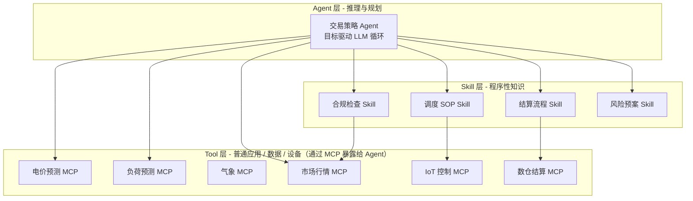

# AI Native 应用架构：从一笔真实电力交易看起

电网交易正从依赖人工经验的"计划电"，转向 15 分钟一档、多主体博弈的"市场电"。本文不从概念入手，而是从浙石油充电网络一个真实交易日开始，沿"业务能力 → 认知性质 → 技术分层 → 工程清单"的链条，反推出一套 AI Native 架构的形状与边界。

## 目录

- [1. 背景：一笔交易里藏着的复杂性](#1-背景一笔交易里藏着的复杂性)
- [2. 问题：为什么现有手段做不到？](#2-问题为什么现有手段做不到)
- [3. 方案推导：从业务能力到分层架构](#3-方案推导从业务能力到分层架构)
- [4. 五个角色的具体落地](#4-五个角色的具体落地)
- [5. 权衡与反模式](#5-权衡与反模式)
- [6. 回到场景：架构如何让那笔交易自然发生](#6-回到场景架构如何让那笔交易自然发生)
- [7. 总结：AI Native 应用与应用架构的定义](#7-总结ai-native-应用与应用架构的定义)

---

## 1. 背景：一笔交易里藏着的复杂性

要理解 AI Native 架构的必要性，先看清楚一笔现代电力交易里到底发生了什么。本节用一个真实场景作为锚点，避免架构讨论漂浮在概念层面。

### 1.1 场景切片：浙石油充电网络的某个早晨

浙江电力现货市场自 2025 年起连续结算运行。省内某头部充电运营商在国庆假期前夜，需要决定次日 96 个 15 分钟时段的购售电计划与充电定价。该运营商充电网络已覆盖杭州、宁波、温州三地，累计建成充电网点超 2000 座，在营充电终端超 2.6 万个，单日充电量峰值突破 269 万千瓦时。

外部条件涉及两类：一是当日气象预报，假期浙江午后有局地 7–9 级雷雨大风，节前数日则受副热带高压主导，晴热高温、辐照充足；二是市场规则，浙江电力现货市场出清价格上限为 1200 元/兆瓦时（1.2 元/kWh），下限为 -200 元/兆瓦时（-0.2 元/kWh），售电公司须在该区间内申报次日至少 48 点量价曲线，新能源场站需提交 D 日 96 点（每 15 分钟）短期功率预测曲线，迟报或漏报将默认采用常设报价。日前市场申报统一截止于 D-1。

负电价并非假设，而是已被多次记录的市场状态。2025 年 1 月 19–20 日春节期间，浙江工商业负荷较节前下降约 30%，同期全省新能源装机 5682 万千瓦（其中光伏 4727 万千瓦），日前现货连续两日触及 -200 元/兆瓦时下限并全天负电价；山东 2023 年“五一”假期现货连续 22 小时负电价，最低 -85 元/兆瓦时（-0.085 元/kWh）；四川 2025 年 9 月 20 日全天负电价，区间 -50 至 -35 元/兆瓦时（-0.05 至 -0.035 元/kWh）。已公开的统计显示，负电价集中出现在午间光伏大发时段。

这意味着次日决策需在已知规则区间（-0.2 ~ 1.2 元/kWh）和不确定的实际出清价格之间，给出 96 档量价曲线，并把负电价、极端天气作为可能而非必然的状态纳入策略空间。

### 1.2 这笔交易要做对的十二件事

这笔交易可拆为五阶段十二个可执行动作，阶段间存在数据上下游依赖、各自的误差容忍与时延预算不同：

| 阶段 | 具体动作                                                           | 数据 / 模型                    | 关键输出                         | 质量 / 时延预算              |
| :--- | :----------------------------------------------------------------- | :----------------------------- | :------------------------------- | :--------------------------- |
| 感知 | (1) 拉 NWP 与 SCADA 出力、(2) 抓 tick 行情、(3) 汇总检修与历史负荷 | NWP、SCADA、tick 行情          | 多源时序（15 min 对齐）          | 刷新 ≤ 分钟级                |
| 预测 | (4) 96 段电价曲线、(5) 96 段负荷曲线                               | Informer / N-BEATS / TimeGPT   | P10 / P50 / P90 三分位点曲线     | 目标 MAPE < 8%；推理 < 1 s   |
| 决策 | (6) 求解 VaR 约束下购售电组合、(7) 生成桩侧价表                    | LLM Agent + 凸优化求解器       | 96 档申报报价 + 桩侧价表         | 单轮 ≤ 15 min                |
| 执行 | (8) 下发桩侧调度指令、(9) D-1 电网申报、(10) 推送车主侧动态价格    | IoT 协议 + 现货 API + 充电 App | 设备指令 + 报文 + 价格发布       | 秒级下发；22:00 前申报完成   |
| 复盘 | (11) 偏差电量对账与归因、(12) 模型 / 策略更新                      | 数仓 + 报告模板 + 重训练管道   | 偏差电量 + 改进项 + 新版本候选体 | T+1 出报告；周级决定是否切版 |

### 1.3 从单笔交易看市场结构的三大变化

把这笔交易放到市场视角，能看到三个不可逆变化——它们共同决定了传统架构为什么难以为继：

| 变化   | 旧基准                     | 新基准                                          | 对架构的硬约束                                   |
| :----- | :------------------------- | :---------------------------------------------- | :----------------------------------------------- |
| 频次   | D-1 一次报价               | 15 min × 96 档 + 日内多次调整                   | 高频闭环、状态可恢复、跨阶段重试幂等不丢数据     |
| 主体   | 发电 + 售电两类            | 发电、售电、储能、虚拟电厂、负荷聚合商等 ≥ 5 类 | 独立意志 / 私有信息 / 差异目标函数需显式建模     |
| 决策面 | 调度 / 交易 / 运营三套系统 | 调度 / 交易 / 运营基于同一上下文协同决策        | 跨域数据、预测、策略与审计证据需可在同一层被引用 |

---

## 2. 问题：为什么现有手段做不到？

§1.2 把一笔交易拆为 5 阶段 12 个动作，§1.3 给出三条硬约束（高频闭环不丢数、独立意志显式建模、同上下文协同）。本节将三种现有手段逐一套进这两组要求，看它们在哪个具体动作或约束上跳闸。

### 2.1 人工盯盘的物理上限

把§1.2 的 12 个动作交给一名交易员，会依次撞上三堵可量化的硬墙：

| 物理上限 | §1 中对应的要求                                            | 量化基准                                                            |
| :------- | :--------------------------------------------------------- | :------------------------------------------------------------------ |
| 认知带宽 | 12 动作 × 96 档 × ≥ 5 类对手并行，且需读懂 P10 / P50 / P90 | 单人有效跟踪 ≤ 8–16 档，难以同时盯住三分位与多主体动作              |
| 反应链路 | 单轮 ≤ 15 min + 22:00 申报截止 + 负电价窗口 ~30 min        | 人工感知-决策-下单 5–10 min，叠加多源数据切换后裕度趋零             |
| 经验沉淀 | §1.2 第 (12) 步需可灰度 / 可回滚的策略演进                 | 盘感绑定个体，资深交易员离职 ≈ 2–3 年经验蒸发，且无可复现的回测依据 |

### 2.2 传统软件架构的失效边界

把人换成“BI + RPA + 业务系统”的传统组合，逐项对齐§1 的要求后，可以看到三处硬伤：

| 维度 | §1 中对应的能力要求                                 | 传统架构表现                               | 失效原因 / 典型形态                                         |
| :--- | :-------------------------------------------------- | :----------------------------------------- | :---------------------------------------------------------- |
| 预测 | 96 × 3 分位点曲线、推理 < 1 s、目标 MAPE < 8%       | 数据科学家用 Excel / Notebook 周级手工迭代 | 只出单点预测、不出分位不出不确定性，跟不上市场结构变化      |
| 决策 | VaR 约束 + ≥ 5 类主体博弈 + 单轮 ≤ 15 min           | Drools / Camunda 数百条硬编码规则          | 规则爆炸、无博弈建模、无在线学习，新异市场状态下默认退出    |
| 协同 | 调度 / 交易 / 运营同上下文 + 跨阶段重试幂等不丢数据 | RPA + ETL 夜间批跑、跨系统人工对账         | 决策-执行分钟至小时级延迟，不满足 15 min 闭环与幂等不丢数据 |

### 2.3 单一 LLM 应用为什么也不够

直接套一个对话式 LLM 应用，同样被§1 里三个具体要求卡住：

| 短板                | §1 中无法满足的要求                                             | 量化 / 表现                                                             |
| :------------------ | :-------------------------------------------------------------- | :---------------------------------------------------------------------- |
| 时序预测非 LLM 强项 | 96 × 3 P10 / P50 / P90 + 目标 MAPE < 8% + 推理 < 1 s            | 与 Informer / N-BEATS 在 MAPE / RMSE 上差距常 ≥ 30%，且分位点估计不稳定 |
| 物理控制不安全      | §1.2 第 (8)–(10) 步的桩侧调度 / D-1 申报 / 动态定价需强类型报文 | 充放电走自然语言路径，单条幻觉指令即可触发电网告警与设备损伤            |
| 长任务无状态        | 12 动作跨阶段不丢数据 + T+1 复盘 + 周级版本切版                 | 上下文窗口 ≤ 200K token，跨日不可对齐，无法承载状态可恢复与审计证据     |

升级为当下常见的 RAG-based chatbot 或插件式 LLM 应用，仅覆盖“问答检索”与“单次工具调用”两面：既不能对 ≥ 5 类主体的独立意志做显式博弈建模，也提供不了调度 / 交易 / 运营所需的同上下文协同与跨阶段幂等执行，本质上仍是“以人为决策中心”的辅助工具。

推论：要同时退守 12 个动作的可验证性与三条架构硬约束，需要的是把 LLM 的“泛化推理”与传统系统的“确定性执行”组合起来的范式——这正是 AI Native 架构要解决的问题。

---

## 3. 方案推导：从业务能力到分层架构

§2 证伪了三种现有手段。本节用五步推导，构造一套同时退守§1.2 的 12 个动作与§1.3 三条硬约束的架构。每一步只引入一个新概念，让上一步成为下一步的“已知”。

### 3.1 第一步：把闭环压缩为能力原子

把§1.2 的 12 个动作压缩为 5 个能力原子，输入 / 输出 / 预算一律对齐§1.2 表中的实际取值：

| 能力原子 | 输入                                  | 输出（对齐§1.2）                 | 质量 / 时延预算            |
| :------- | :------------------------------------ | :------------------------------- | :------------------------- |
| 预测     | 历史负荷 + 气象 + 检修                | 96 × 3 P10 / P50 / P90 曲线      | MAPE < 8%；推理 < 1 s      |
| 策略     | 曲线 + 库存 + VaR 参数 + ≥ 5 主体行为 | 96 档申报报价 + 桩侧价表         | 单轮 ≤ 15 min              |
| 执行     | 报价 + 设备状态                       | 设备指令 + 报文 + 价格发布       | 秒级下发；22:00 前申报完成 |
| 结算     | 实际曲线 + 计划                       | 偏差电量 + 改进项 + 新版本候选体 | T+1 出报告；周级是否切版   |
| 博弈     | 各主体公开信息                        | 对手报价分布                     | 离线训练 + 在线推理        |

### 3.2 第二步：识别每个能力的认知性质

能力背后的认知性质决定其技术栈，也决定它退守§2 中哪一类失效：

| 能力 | 认知性质         | 是否需 LLM       | 主流技术栈                     | 退守§2 哪类失效                       |
| :--- | :--------------- | :--------------- | :----------------------------- | :------------------------------------ |
| 预测 | 数值计算（时序） | 否               | Informer / N-BEATS / TimeGPT   | §2.3 时序预测非 LLM 强项              |
| 策略 | 不确定下多步推理 | 是               | LLM + ReAct + 凸优化求解器     | §2.1 认知带宽 + §2.2 规则爆炸         |
| 执行 | 确定性流程编排   | 否               | 状态机 + IoT 协议 + 幂等中间件 | §2.3 物理控制不安全                   |
| 结算 | 模板化工作流     | 部分（报告生成） | DAG 编排 + 报告模板 + 数仓     | §2.2 夜间批跑 / 人工对账的协同延迟    |
| 博弈 | 独立意志相互建模 | 是               | MARL / 自博弈 / LLM Agent      | §2.3 单 LLM 不能对 ≥ 5 类主体显式建模 |

由此得到一个反直觉结论：**业务上是一个“智能体”，不代表技术上必须是 Agent**。

### 3.3 第三步：用智能体语言重述业务角色

为让业务方可读，把五个能力包装为五个**业务角色**（行业内亦称“业务智能体”）——仅为业务建模语言，不指代技术上的 LLM Agent；每个角色挂接一组可考核 KPI，与§1.2 的质量 / 时延预算逐项对齐：

| 业务角色                  | 业务职能                          | 业务价值                   | 关键 KPI（对齐§1.2 预算）                   |
| :------------------------ | :-------------------------------- | :------------------------- | :------------------------------------------ |
| **电价 / 负荷预测智能体** | 交付 96 × 3 三分位点曲线          | 锁定成本、提供概率分布输入 | MAPE < 8%；推理 < 1 s                       |
| **交易策略智能体**        | VaR 约束下生成 96 档申报 + 桩侧价 | 多主体博弈中提升收益       | 日均 P&L、命中率、VaR 越限率；单轮 ≤ 15 min |
| **调节调度智能体**        | 翻译为设备指令 + 报文 + 价格发布  | 打通决策-执行最后一公里    | 指令成功率 > 99.9%；22:00 前申报完成        |
| **交易结算智能体**        | 偏差归因 + 生成新版本候选体       | 形成数据飞轮               | 偏差电量 < 3%；T+1 出报告；周级决定是否切版 |
| **市场主体仿真智能体**    | 模拟 ≥ 5 类主体博弈               | 反向优化报价策略           | 仿真-实盘 KL / Wasserstein 距离下降         |

### 3.4 第四步：把业务角色映射到技术分层

按§3.2 的认知性质，把业务角色落到三个技术层；每一层负责退守§1.3 的一条硬约束，同时显式标注反例以避免落地走偏。

> **术语澄清**：第三层的本质是“普通应用 / 数据服务 / 设备控制”等**确定性 Tool**——它本身不需要 LLM；MCP（Model Context Protocol）是 Agent 调用这些 Tool 的统一协议，MCP Server 是包裹 Tool 暴露给 Agent 的那一层薄胶皮。下文为简洁起见把“X 服务的 MCP Server”简写为“X MCP”，但承载业务能力的始终是底层的普通应用。

| 技术层                  | 解决什么                                                 | 输出形式                                                 | 退守§1.3 哪条硬约束               | 典型反例                               |
| :---------------------- | :------------------------------------------------------- | :------------------------------------------------------- | :-------------------------------- | :------------------------------------- |
| **Agent 层**            | 不确定下的目标驱动决策                                   | LLM 循环 + 工具调用 + 记忆                               | 独立意志显式建模（§1.3 主体轴）   | 把每个函数都包成 Agent                 |
| **Skill 层**            | 程序性知识、SOP 编排                                     | 提示词 + 状态机 + 工作流                                 | 调度 / 交易 / 运营同上下文协同    | Skill 提示词里跑潮流计算               |
| **Tool 层（MCP 暴露）** | 确定性能力实现：预测模型 / 数据服务 / IoT 控制等普通应用 | 普通函数 / 应用 + MCP Server（强类型工具 + 鉴权 / 幂等） | 高频闭环 + 跨阶段重试幂等不丢数据 | MCP Server 沦为裸 RPC 转发，无认证限流 |

判断准则一句话：

> 能用 `f(x) → y` 刻画且要求可验证 → 普通 Tool（以 MCP Server 暴露给 Agent）；只需编排的固定流程 → Skill；要在不确定下决定下一步做什么 → Agent。

### 3.5 第五步：把闭环串起来

按上述映射，§1.1 那笔交易对应的完整架构如下：

收敛关系一句话：**12 动作 → 5 能力原子 → 5 业务角色 → 1 真 Agent + 4 Skill + 6 个 Tool（MCP 暴露）**。Agent 数量从 5 收敛到 1，可明显压低延迟、Token 成本与幻觉面；可验证、可审计的部分被压回 Tool / Skill。下一节逐个解释“为什么这么落”。

---

## 4. 五个角色的具体落地

承接§3.5 架构图与§3.4 层映射，本节对五个业务角色逐一回答两问：本质是什么？为什么落到 Agent / Skill / Tool（MCP 暴露）中的那一层？每节末尾把结论扣回§3.3 该角色的可考核 KPI 与§1.2 的质量 / 时延预算。

### 4.1 电价 / 负荷预测：作为 Tool 通过 MCP 暴露

预测的本质是数值计算、不是语言推理。把预测模型作为普通服务部署、再以 MCP Server 包装暴露给 Agent，是最自然的选择：

- **业务契约清晰**：输入历史负荷 + 气象 + 检修计划，输出 96 × 3 (P10 / P50 / P90) 时段曲线，目标 MAPE < 8%、推理 < 1 s（与§1.2 / §3.3 预算逐项对齐）。
- **可验证性强**：MAPE / RMSE / Pinball Loss 必须可回测，LLM 引入的随机性会破坏稳定性。
- **算法本质非语言**：Informer、N-BEATS、TimeGPT 等时序模型虽多基于 Transformer，但训练目标与评估指标是确定性的，不依赖通用语言生成。
- **落地形态**：暴露 `forecast_price(zone, horizon, scenario)` 这类强类型工具；训练节奏“周级全量 + 日级增量”与§1.2 第 (12) 步“周级是否切版”同节拍，以 MLflow / DVC 锁定数据-模型版本对。
- **LLM 辅助的边界**：预测主路径走 MCP；异常诊断、非结构化数据（设备日志、检修记录、政策文件）的特征提取、模型失效时的回退策略，由上层 Agent 协同完成，避免完全隔离导致的鲁棒性不足。

### 4.2 交易策略：唯一一个真正的 Agent

策略是五个角色里唯一需要 LLM 推理循环的，目标是兑现§3.3 的“日均 P&L、命中率、VaR 越限率；单轮 ≤ 15 min”。原因有三：

- **目标可表达但路径不可枚举**：例如“VaR < 5% 下最大化日内 P&L”，路径依赖市场状态、库存与对手行为。
- **需多轮工具调用**：查预测 → 查库存 → 模拟场景 → 评估风险 → 下单 → 观察反馈 → 重规划，单回合工具调用常达 8–20 次。
- **需经验沉淀**：通过记忆模块把“昨天负电价时这类策略亏损 X 元”沉淀为下次先验。
- **落地形态**：ReAct / Plan-Execute Agent，挂载预测 MCP、行情 MCP、调度 Skill；强制设置 max-steps、token / 成本预算与终止条件，避免无限重规划超出 15 min 硬时限。
- **记忆模块分层**：短期工作记忆（当日上下文、未结订单）落向量库 + 滑动窗口；长期经验库（历史复盘、策略-收益对）落结构化案例库 + 知识图谱。两者通过检索接口供 Agent 调用，避免提示词膨胀，记忆条目需带 TTL 与置信度。
- **求解器协同**：凸优化求解器须预编译模型、支持热启动；多时段经济调度场景数膨胀时，必要时降级为启发式或滚动时域近似，以兜住 ≤ 15 min 的硬时限。
- **异常解处理**：求解器返回 `INFEASIBLE` 或解显著偏离历史分布时，Agent 触发松弛约束（按优先级依次放宽 SOC、爬坡率、VaR 阈值）的次级规划路径，仍不可行则挂起并转 HITL；若临近 22:00 申报截止，触发下文的兜底申报路径，避免无申报。
- **截止前的兜底申报**：若临近 22:00 D-1 申报截止仍未得到可行解，触发 HITL 的同时回退到常设报价或前一交易日已备案的策略，确保有有效申报落地，避免因无申报而落入市场默认规则的惩罚分支。

### 4.3 调节调度：Skill + MCP 守住物理边界

调度承担“把策略翻译成设备动作”的环节，对应§3.3 KPI“指令成功率 > 99.9%；22:00 前申报完成”，安全压倒一切：

- **强实时与强安全**：充放电是物理动作，错误指令可能损坏电池、触发电网告警甚至 1 类电力事件。
- **SOP 已明确**：峰谷套利、调频、备用容量、需求响应均有既定流程，不需要 LLM 临场创造。
- **落地形态**：Skill 用提示词 + 状态机编排步骤；MCP 提供 `dispatch_battery(id, kW, duration)` 等带鉴权、幂等、限流、可回滚的工具；LLM 只在异常处置（设备失联、电网拉闸、价格剧变）时介入。
- **底层安全约束**：IoT MCP 内部封装节点电压、线路潮流、爬坡率、SOC 上下限等经济调度安全约束模型，对每条指令做实时可行性校验；Skill 只编排业务、物理可行性由 MCP 守住——这是“幻觉即事故”场景下的最后一道闸门。

### 4.4 交易结算：Skill + MCP 完成数据回流

结算是数据飞轮的入口，对应§3.3 KPI“偏差电量 < 3%；T+1 出报告；周级决定是否切版”：

- **流程模板化**：账单生成、偏差电量计算、应收应付对账、补偿费用核算几乎完全程序化。
- **LLM 价值点窄**：仅在生成自然语言复盘报告、解释异常波动、撰写监管报送说明时发挥作用。
- **落地形态**：Skill 编排 DAG 工作流，MCP 提供数仓查询、规则引擎、报表渲染、对账冲销等能力，关键步骤双签确认。
- **数据飞轮的隐式代价**：偏差数据回写 ≠ 自动重训练。需显式设定模型更新频率、触发阈值（如连续 N 日 MAPE 超限）、回滚机制；新版本须先 shadow mode 与 champion-challenger 双跑，过分位再切流，避免概念漂移导致策略静默退化。

### 4.5 多市场主体仿真：何时启用真正的多 Agent

火电 / 新能源 / 储能等市场主体的建模才是“多 Agent 强化学习”的真正用武之地。多 Agent 是为了表达**独立意志**，而不是为了**能力解耦**：

| 多 Agent 触发条件                              | 是否成立 | 原因                                       | §1 / §3 锚点                           |
| :--------------------------------------------- | :------- | :----------------------------------------- | :------------------------------------- |
| 市场主体博弈仿真                               | ✅       | 各方目标独立、信息私有                     | §1.3 主体轴 ≥ 5 类 + §3.2 博弈行       |
| 租户隔离（每客户一个交易员 Agent）             | ✅       | 数据隔离、独立学习                         | §5.4 版本管理与灰度（按租户灰度）      |
| 组织映射（不同部门各自的 Agent）               | ✅       | 康威定律                                   | §5.4 组织拓扑适配                      |
| 流水线分解（预测 → 策略 → 执行各做一个 Agent） | ❌       | 这是函数调用链，应该用 Agent + Skill + MCP | §3.4 层映射；§5.2 反模式“Agent 化一切” |

---

## 5. 权衡与反模式

§3-§4 把五个角色划进了 Agent / Skill / Tool（MCP 暴露）三层，但任何架构都有代价。本节把这套选择背后的权衡显式化，并列出落地中最常见的反模式——每一条都标注"违反了§3 / §4 的哪一处约定"，便于评审时按图索骥。

### 5.1 三种落地路线的代价矩阵

本文§3-§4 的实际选择是 **A + B 混合**：策略角色走 A（唯一的真 Agent），其余四角色走 B（Skill 编排 + Tool 经 MCP 暴露）；C 仅作为退路保留。

| 方案                                 | 优点                   | 代价                             | 适用场景           | §3 / §4 中的对应位置            |
| :----------------------------------- | :--------------------- | :------------------------------- | :----------------- | :------------------------------ |
| **A. 独立 Agent**                    | 灵活、可独立演进       | 成本高、延迟大、有幻觉风险       | 多步推理与目标博弈 | §4.2 交易策略；§4.5 多主体仿真  |
| **B. Skill + Tool（MCP）+ 统一底座** | 成本低、可审计、可复用 | 平台投入大、Skill 编写有学习曲线 | 大部分企业级场景   | §4.1 预测、§4.3 调度、§4.4 结算 |
| **C. 纯工作流（无 LLM）**            | 确定性、合规友好       | 不能处理新颖情况                 | 强监管、强实时场景 | §5.4 HITL 触发后的兜底分支      |

### 5.2 五个常见反模式

| 反模式                     | 典型症状               | 代价                                        | 违反§3 / §4 哪一条                           |
| :------------------------- | :--------------------- | :------------------------------------------ | :------------------------------------------- |
| Agent 化一切               | 每个函数都封 LLM Agent | 延迟放大 10–100 倍，Token 失控              | §3.2 认知性质判定；§3.5 收敛"1 真 Agent"     |
| LLM 直接控物理设备         | 充放电指令走提示词     | 安全事故、监管违规                          | §4.3 物理可行性由 Tool 层守住                |
| Skill 承载物理计算         | SOP 提示词里算潮流     | 应该用代码或独立 Tool（以 MCP Server 暴露） | §3.4 Skill 层 ≠ 数值计算层                   |
| MCP Server 沦为裸 RPC 转发 | 无认证、幂等、限流     | 金融与电网不可接受                          | §1.3 高频闭环幂等；§3.4 Tool 层强类型 + 鉴权 |
| Agent 缺终止条件           | 无限重规划循环         | 成本爆炸、错过交易窗口                      | §3.3 单轮 ≤ 15 min；§4.2 max-steps + 预算    |

### 5.3 三问决策启发法

面对架构图中的任何一个"智能体"，按"成本由低到高"依次问三个问题，落到§3.4 三层中的相应一层（这里的"成本"指架构付出的工程代价与复杂度——Token / 延迟 / 运维难度，而非能力强弱，所以"代价递增"的三问与"能力递增"的三层是互逆对齐的）：

1. **能否用非 LLM 系统（普通应用 / 函数 / 服务）以可验证正确性完成？** → 是 ⇒ 实现为普通 Tool，通过 MCP Server 暴露给 Agent（§3.4 Tool 层）
2. **是否是固定流程，只需要被编排？** → 是 ⇒ Skill（§3.4 Skill 层）
3. **是否需要在新颖情况下决定下一步做什么？** → 是 ⇒ Agent（§3.4 Agent 层；本文中仅§4.2 策略与§4.5 仿真满足）

### 5.4 落地工程清单

仅有架构图还不足以让一套 AI Native 系统在电网交易场景安全运行。下面七项工程实践需与架构同步落地——每项都对应§1 中的某条预算或硬约束，任一项缺失都会让前面的技术选型在生产环境中失效：

| 工程项               | 解决什么问题                                     | 落地形态                                                                                                                             | 对齐§1 的哪条预算 / 硬约束                                         |
| :------------------- | :----------------------------------------------- | :----------------------------------------------------------------------------------------------------------------------------------- | :----------------------------------------------------------------- |
| **人在回路（HITL）** | 极端市场状态下避免 Agent 单边决策                | 触发器（VaR 越限、滚动窗口内首现负电价、单笔超额度等）由风控可配置规则引擎驱动，命中即挂起 Agent 转人工复核；临近 22:00 触发兜底申报 | §1.2 第 (8) 步 22:00 申报截止；§1.3 高频闭环不丢数                 |
| **版本管理与灰度**   | Agent / Skill / Tool（MCP）迭代不冲击线上        | 策略 Agent 像量化系统一样支持回测 + shadow mode + 按租户或容量灰度发布                                                               | §1.2 第 (12) 步周级是否切版                                        |
| **决策追溯链**       | 满足监管对负电价套利等行为的解释要求             | Agent 每一步推理、工具调用、参数取值入溯源库，结算 Skill 输出可审计的"为什么这么交易"链条                                            | §1.2 第 (11) 步 T+1 出报告；§1.3 同上下文协同                      |
| **MCP 安全中间层**   | MCP 协议自身在认证授权上仍在演进                 | MCP Gateway 上叠加 OAuth2 / mTLS、调用配额、敏感操作二次确认，金融与电网不可省略                                                     | §1.3 高频闭环 + 跨阶段重试幂等不丢数据                             |
| **对手建模 gap**     | 多 Agent 仿真分布与在线市场分布有差距            | 离线博弈用于策略预训练，在线推理切换到基于公开市场数据的鲁棒路径，持续监测分布漂移；漂移超阈则降级到规则基保守策略并冻结仿真侧推荐   | §1.3 主体轴 ≥ 5 类、独立意志显式建模                               |
| **成本可观测性**     | Token / 求解器 / Tool 调用（走 MCP）的经济性失控 | 每决策回合设 Token 与算力预算上限，建仪表盘按 Agent / Skill / Tool 维度归集成本，超限自动熔断或降档至更小模型                        | §5.2 "Agent 化一切 / 缺终止条件"的经济性约束；与单轮 ≤ 15 min 联动 |
| **组织拓扑适配**     | 调度 / 交易 / 运营三方组织墙                     | 平台工程团队拥有 Skill + Tool / MCP；领域专家组贡献策略 Agent 提示词与回测；风险合规岗守 HITL 与追溯                                 | §1.3 调度 / 交易 / 运营基于同一上下文协同决策                      |

上述工程项之间存在交叉（如决策追溯链与版本管理共享同一份事件流），落地时建议共享一个治理平面——典型形态是 ML Platform（模型 / 数据版本、回测、灰度）+ Audit Log 总线（推理 / 调用 / 配额 / 成本统一留痕），避免多套并行的元数据与审计系统。

一句话总结：**架构决定上限，工程决定下限**。上面七项分别守住§1.3 三条硬约束（高频闭环不丢数、独立意志显式建模、同上下文协同）与§1.2 关键预算节点（22:00 申报截止、推理 < 1 s、单轮 ≤ 15 min、T+1 报告、周级切版），任一项崩坏都足以让一套漂亮的分层架构在生产环境里被证伪。

---

## 6. 回到场景：架构如何让那笔交易自然发生

讨论了一圈架构，最终要回到第 1 节那个早晨——验证这套架构能不能让那笔交易自然地发生。

### 6.1 用新架构重放浙石油案例

回到 §1.1 的早晨，新架构把§1.2 的 5 阶段 12 动作收敛为四步可观测流水，每步都对应明确的层与产物（产物列与§1.2 / §3.1 逐项对齐）：

| 步骤                          | 触发层                      | 关键调用                                   | 产物（对齐§1.2 / §3.1）          |
| :---------------------------- | :-------------------------- | :----------------------------------------- | :------------------------------- |
| 感知 + 预测（§1.2 第 1–5 步） | Agent → Tool（MCP）         | `forecast_price` + `forecast_load`         | 96 × 3 P10 / P50 / P90 曲线      |
| 策略生成（§1.2 第 6–7 步）    | Agent（§4.2 唯一真 Agent）  | 检索负电价历史 + 凸优化求解器 + ReAct 循环 | 96 档申报报价 + 桩侧价表         |
| 协同执行（§1.2 第 8–10 步）   | Agent → Skill → Tool（MCP） | 调度 Skill + IoT MCP + 报价网关 MCP        | 设备指令 + 申报报文 + 价格发布   |
| 复盘进化（§1.2 第 11–12 步）  | Skill → Tool（MCP） → Agent | 结算 Skill + 数仓 MCP + Agent 记忆写回     | 偏差电量 + 改进项 + 新版本候选体 |

### 6.2 量化收益与未确定性

行业已有参考数据，需接驳到本文§1.2 的具体预算项才能作为验收点：

| 维度        | 案例                   | 量化结果                                       | 映射到§1.2 哪条预算                                                 |
| :---------- | :--------------------- | :--------------------------------------------- | :------------------------------------------------------------------ |
| 7×24 自动化 | 朗新九功电力交易智能体 | 日前电价预测准确率 > 90%，风险预警准确率 > 85% | 预测预算 MAPE < 8%；HITL 触发准确率                                 |
| 降本增效    | 国网“光明电力”大模型   | 人工客服工作量 -85%，数据分析工作量 -80%       | §3.3 单轮 ≤ 15 min（辅助决策加速）；§1.2 T+1 报告生成（自动化报告） |

同时仍存在三类未确定性，它们分别在§6.1 四步流水的不同环节裸露出来，每一项都应在§5 工程清单中找到控制手柄：

| 未确定性          | 在§6.1 哪一步裸露       | 具体表征                                                                                            | 控制手柄（对应§5.4）                                  |
| :---------------- | :---------------------- | :-------------------------------------------------------------------------------------------------- | :---------------------------------------------------- |
| 极端状态鲁棒性    | 策略生成（第 6–7 步）   | 全年首现负电价 / 极端天气区间下 Agent 的决策偏离                                                    | HITL 可配规则引擎 + 版本管理与灰度的 shadow mode 双跑 |
| 仿真-实盘分布差距 | 策略生成（第 6–7 步）   | 多 Agent 仿真与真实市场的 KL / Wasserstein 距离（衡量两个概率分布差异的标准度量，值越小越贴近真实） | 对手建模 gap：漂移超阈降级到规则基保守策略            |
| 监管合规演进      | 复盘进化（第 11–12 步） | LLM 参与电力交易的解释性 / 留痕 / 人工兜底要求                                                      | 决策追溯链 + HITL 二次确认                            |

### 6.3 下一步可探索的场景

沿§3.3 五个业务角色 / §3.4 Agent / Skill / Tool（MCP）三层架构可继续外推，每个新场景都应先过§5.3 三问启发法鉴定“是否需要新 Agent”：

| 场景         | 复用层                             | 新增点                                        | §5.3 三问鉴定结果                    |
| :----------- | :--------------------------------- | :-------------------------------------------- | :----------------------------------- |
| 虚拟电厂     | 调度 Skill + IoT Tool（MCP）       | 对外报价面临多主体博弈 ⇒ §4.2 策略 Agent 复用 | 仅聚合报价增一个 Skill；不新增 Agent |
| 绿电交易     | §4.2 策略 Agent                    | 在 Agent 目标函数嵌入碳排放约束与绿证溢价     | 仅扩展现有 Agent；不新增 Agent       |
| 跨省跨区交易 | §4.5 仿真 Agent + 行情 Tool（MCP） | 多电网耦合 + 联络线约束建模                   | §4.5 仿真 Agent 复用；不新增 Agent   |

回到起点：电网交易是一个适合拆成 AI Native 架构的场景——但能不能落地，取决于能否说清这三件事：**哪些角色真正需要 Agent、哪些应当退到 Skill 与 Tool（以 MCP 暴露）、以及§5.4 七项工程是否同步就位**。这是架构师落地时最值得停下来想三遍的事。

---

## 7. 总结：AI Native 应用与应用架构的定义

前六章完成了一个完整的“场景 → 问题 → 方案 → 落地 → 验证”闭环。本章将这套方法论压回到两个可工程化、可独立引用的定义，便于在评审与选型中快速对齐认知——无需每次都从电力交易案例讲起，也避免“AI Native”被当作口号使用。

### 7.1 AI Native 应用的定义

> **AI Native 应用**：业务闭环中至少有一个能力的本质是“在新颖情况下决定下一步做什么”，必须由 LLM 推理循环承载（§5.3 第三问为真）；其余能力按认知性质（§3.2）退守到 Skill 与普通 Tool，以“代价由低到高、能力由低到高”互逆对齐（§5.3：问得越早，架构代价越小，但能力也越基础）的三层结构组织。

定义分两层：架构设计层需同时成立两个架构必要条件（合取后为架构充要）；生产落地层额外需满足一个生产必要条件。反例一提即错：

| 层次           | 条件                                 | 反例                                                           | 本文锚点                                   |
| :------------- | :----------------------------------- | :------------------------------------------------------------- | :----------------------------------------- |
| **架构必要 ①** | 至少一个能力过§5.3 第三问为真        | 将确定性分支逻辑伪装为 LLM 推理（如用 LLM 执行简单的条件选择） | §3.2 认知性质判定；§4.2 策略为唯一真 Agent |
| **架构必要 ②** | 非 Agent 能力退守 Skill / Tool       | Agent 化一切                                                   | §5.2 第一行反模式；§3.5 收敛“1 真 Agent”   |
| **生产必要**   | §5.4 七项工程 + 共享治理平面同步落地 | 只搭架构不建治理平面                                           | §5.4 ML Platform + Audit Log 总线          |

### 7.2 AI Native 应用架构的定义

> **AI Native 应用架构**：以“认知性质决定技术分层”为唯一裁断准则，把业务闭环映射到 Agent / Skill / Tool（经 MCP 暴露）三层，并在共享治理平面（ML Platform + Audit Log 总线）上同步落地七项工程实践，使每一次推理、调用、决策都可被预算、可被审计、可被回滚。

五要件同时成立，架构才能被称为 AI Native：

| 要件     | 形式                                                       | 必须满足                                              | 本文锚点           |
| :------- | :--------------------------------------------------------- | :---------------------------------------------------- | :----------------- |
| 分层准则 | 认知性质 → 三层映射                                        | Agent ⇐ 新颖决策；Skill ⇐ SOP 编排；Tool ⇐ 确定性能力 | §3.2 / §3.4        |
| 协议契约 | 强类型工具协议承载 Agent → Tool 调用（当前最佳实践为 MCP） | 鉴权 / 幂等 / 限流 不可缺失                           | §3.4 术语澄清      |
| 闭环预算 | 每个能力原子带质量 / 时延预算                              | 质量指标（如 MAPE） / 推理时间 / 单轮预算均可量化     | §1.2 / §3.1 / §3.3 |
| 工程治理 | §5.4 七项 + 共享治理平面                                   | HITL / 版本 / 追溯 / 安全 / 漂移 / 成本 / 组织        | §5.4               |
| 边界纪律 | §5.3 三问启发法 + §5.2 五反模式                            | 新增能力先过三问、不踩五反模式                        | §5.2 / §5.3        |

### 7.3 一句话

以上两个定义可以浓缩为一句话：

**AI Native ≠ 处处用 LLM**：它是把“新颖决策”交给 Agent、“程序性知识”交给 Skill、“确定性能力”交给 Tool（经强类型协议如 MCP 暴露），并以治理平面统一预算、审计与回滚的分层的架构方法论。
