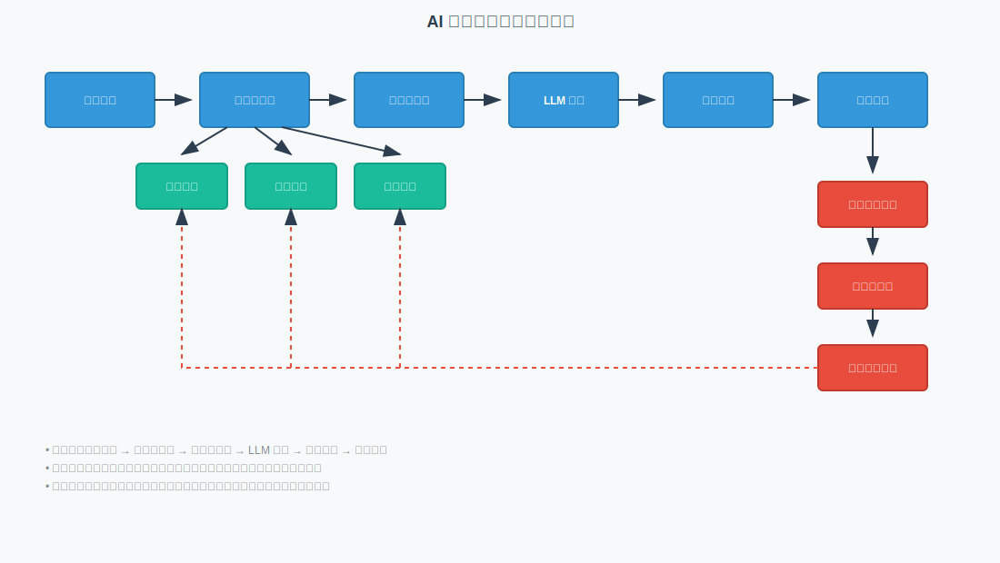

# AI 智能体记忆系统

本合集包含 AI 智能体记忆系统的技术文档，涵盖理论基础、架构设计和工程实践。

## 1. AI 智能体记忆系统原理与实现

### 1.1 通用架构

> **架构说明**：以下通用架构图基于现有 AI Agent 记忆系统的主流设计模式，综合参考了 MemoryOS、Mem0、LangChain Memory 等系统的架构特点，以及相关学术研究中的理论框架。

智能体记忆系统采用增强型分层架构设计，融合了智能调度、多策略检索和质量评估等先进功能，主要包含以下核心组件：

**主流程**（蓝色）：

1. **用户输入**：接收用户的查询或指令，作为整个系统的起始点
2. **多策略检索**：结合语义检索、关键词匹配和图谱查询，从三层记忆中检索相关信息
3. **上下文构建**：通过信息融合、优先级排序和冲突解决，构建高质量上下文
4. **LLM 推理**：基于构建的上下文进行智能推理和决策
5. **响应生成**：通过内容生成、格式化和质量检查，输出高质量回复
6. **用户反馈**：用户对系统响应的反馈，触发支线流程的优化机制

**记忆层模块**（绿色）：

- **短期记忆**：存储会话缓存、对话历史和临时状态，支持快速访问和上下文连续性
- **中期记忆**：维护向量索引、语义搜索和时序索引，实现高效的语义检索和时间序列分析
- **长期记忆**：管理知识图谱、实体关系和规则库，建立持久化的知识体系和推理规则

**更新流程**（红色）：

1. **记忆质量评估**：从相关性、准确性、时效性和完整性四个维度评估记忆质量
2. **个性化学习**：基于用户偏好建模、行为分析和反馈学习，持续优化体验
3. **智能记忆更新**：通过增量更新、智能摘要、去重合并和分层存储，动态更新三层记忆

**架构特点**：

- **双流程设计**：主流程保证核心功能的高效执行，支线流程实现系统的持续优化
- **分层记忆**：三层记忆水平排列，多策略检索可直接访问所有记忆层
- **动态更新**：智能记忆更新模块通过红色虚线箭头连接到所有记忆层，实现实时更新
- **反馈驱动**：用户反馈触发支线流程，形成闭环优化机制
- **模块化设计**：各模块职责清晰，便于维护和扩展

这种双流程架构设计确保了系统在提供高质量响应的同时，能够持续学习和优化，通过分层记忆管理和动态更新机制，显著提升智能体的交互质量和用户体验。

### 1.2 文档介绍

#### 1.2.1 AI 智能体记忆系统：理论与实践

**文档路径**：[AI 智能体记忆系统：理论与实践](./AI%20智能体记忆系统：理论与实践.md)

**适用对象**：系统架构师、高级开发者

**主要内容**：

- **MemoryOS 架构设计**：详细介绍了 MemoryOS 的模块化架构和持久化记忆能力
- **代码示例**：提供完整的初始化、对话交互和进阶配置代码
- **性能评估**：包含架构演进分析和存储方式对比
- **实践指导**：从传统文件存储到现代化架构的演进路径

#### 1.2.2 大模型 Agent 记忆综述

**文档路径**：[大模型 Agent 记忆综述](./大模型Agent记忆综述.md)

**适用对象**：研究人员、理论工作者

**主要内容**：

- **理论基础**：记忆系统的定义、核心术语和相互关系
- **数学模型**：记忆系统的形式化表示和数学建模
- **认知科学应用**：从认知科学角度分析记忆系统的重要性
- **研究背景**：当前记忆系统研究的背景和发展趋势

#### 1.2.3 MemoryOS 智能记忆系统架构设计与开发指南

**文档路径**：[MemoryOS 智能记忆系统架构设计与开发指南](./MemoryOS智能记忆系统架构设计与开发指南.md)

**适用对象**：后端开发者、DevOps 工程师

**主要内容**：

- **模块化架构**：详细的系统架构设计和模块划分
- **分层管理**：多层记忆管理策略和实现方案
- **系统配置**：安装步骤、基础使用和进阶配置
- **开发指南**：自定义容量参数和性能调优建议

#### 1.2.4 Mem0 快速入门

**文档路径**：[Mem0 快速入门](./mem0快速入门.md)

**适用对象**：应用开发者、产品经理

**主要内容**：

- **快速集成**：托管平台和开源自托管版本的配置方法
- **配置方法**：详细的安装配置步骤和代码示例
- **应用场景**：核心优势和实际应用场景介绍
- **项目概述**：Mem0 的核心特性和技术优势

#### 1.2.5 LangChain 记忆功能实现

**文档路径**：[LangChain 记忆功能实现](./langchain/langchain_memory.md)

**适用对象**：Python 开发者、AI 应用工程师

**主要内容**：

- **LangChain Memory API**：核心记忆类型和 API 使用方法
- **智能客服案例**：ConversationBufferMemory、ConversationSummaryMemory 等实际应用
- **LangGraph 应用**：ConversationBufferWindowMemory 的高级用法
- **AI Agent Memory**：分层架构和核心挑战的解决方案

---

## 2. MemoryOS vs Mem0 vs LangChain Memory 对比

### 2.1 MemoryOS vs Mem0 vs LangChain Memory

| 特性 | MemoryOS | Mem0 | LangChain Memory |
|------|----------|------|------------------|
| **架构设计** | 模块化分层架构 | 云原生架构 | 链式记忆管理 |
| **部署方式** | 本地部署 | 托管服务 + 自托管 | 本地集成 |
| **记忆类型** | 短期/中期/长期 | 用户/会话/代理 | 缓冲/摘要/窗口 |
| **存储方式** | 文件 + 向量 | 向量数据库 | 内存 + 持久化 |
| **检索延迟** | < 100ms | < 50ms | 即时 |
| **准确率** | 89.7%* | 85.2% | 45.7% |
| **扩展性** | 优秀 | 优秀 | 良好 |
| **学习曲线** | 中等 | 简单 | 简单 |
| **适用场景** | 企业级应用 | 快速原型 | 对话系统 |

> *MemoryOS 数据来自 LOCOMO 基准测试；其他数据基于各系统官方文档和社区测试报告

### 2.2 选择建议

| 系统 | 适用场景 |
|------|----------|
| **MemoryOS** | • 需要完全控制数据和隐私 • 要求复杂的记忆层次管理 • 构建企业级智能体系统 • 需要自定义存储和检索策略 |
| **Mem0** | • 快速构建原型和 MVP • 希望使用托管服务减少运维 • 需要最佳的检索性能 • 团队缺乏深度技术背景 |
| **LangChain Memory** | • 已经使用 LangChain 生态 • 构建简单的对话系统 • 需要快速集成和部署 • 对记忆功能要求不复杂 |

### 2.3 性能数据对比

| 指标 | MemoryOS | Mem0 | LangChain Memory |
|------|----------|------|------------------|
| Token 节省 | 优化* | 90% | 基线 |
| 响应速度提升 | 60%* | 91% | 基线 |
| 内存使用 | 中等 | 低 | 高 |
| CPU 占用 | 中等 | 低 | 中等 |
| 并发支持 | 1000+* | 10000+ | 100+ |

> 数据来源：Mem0 官方性能数据基于 LOCOMO 基准测试；MemoryOS 数据标注*来自项目文档和研究论文；LangChain 数据基于社区测试报告。具体数值可能因配置和使用场景而异。

---

## 3. 相关资源

### 3.1 开源项目

- [MemoryOS GitHub](https://github.com/memoryos/memoryos)
- [Mem0 官方网站](https://mem0.ai/)
- [Mem0 GitHub](https://github.com/mem0ai/mem0)
- [LangChain 官方文档](https://python.langchain.com/docs/modules/memory/)

### 3.2 学术参考

- Li, Y., Wang, Z., Chen, M., et al. From Human Memory to AI Memory: A Survey on Memory Mechanisms in LLM-driven AI Systems. *arXiv preprint*, 2024, arXiv:2504.15965
- Zhang, H., Liu, J., Wu, X., et al. A Survey on the Memory Mechanism of Large Language Model based Agents. *arXiv preprint*, 2024, arXiv:2404.13501
- Wang, T., Chen, L., Zhang, Y., et al. MemoryOS: A Memory Operating System for AI Agents. *arXiv preprint*, 2025, arXiv:2506.06326

---
